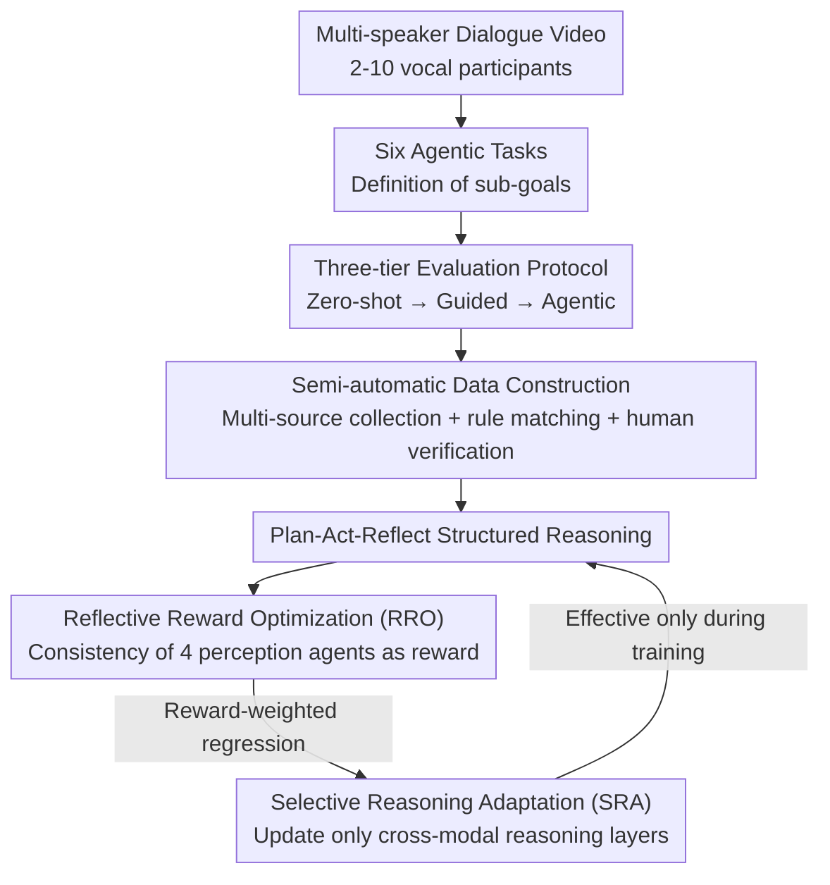

# AMUSE: Audio-Visual Benchmark and Alignment Framework for Agentic Multi-Speaker Understanding

**Conference**: CVPR 2026  
**Paper**: [CVF Open Access](https://openaccess.thecvf.com/content/CVPR2026/html/Chowdhury_AMusE_Audio-Visual_Benchmark_and_Alignment_Framework_for_Agentic_Multi-Speaker_Understanding_CVPR_2026_paper.html)  
**Code**: None (Paper not yet public)  
**Area**: Audio-Visual Multimodal / Benchmark / Agent / Alignment RLHF  
**Keywords**: Multi-speaker understanding, Audio-Visual Benchmark, Agentic evaluation, Reflective reward, Data-efficient alignment

## TL;DR
This paper introduces AMUSE—an audio-visual benchmark for "multi-speaker, dialogue-dense" scenarios (6 agentic tasks × Zero-shot/Guided/Agentic evaluation modes), revealing systematic weaknesses in mainstream MLLMs like GPT-4o and Qwen3-Omni regarding "who is speaking, when, and cross-scene causality." It also proposes the RAFT alignment framework (Reflective Reward + Selective Reasoning Adaptation), which improves the accuracy of open-source models on this benchmark by up to 39.52% (relative) using minimal annotations.

## Background & Motivation
**Background**: Multimodal Large Language Models (MLLMs), represented by GPT-4o and Qwen3-Omni, have made significant progress in image understanding, instruction following, and cross-modal reasoning. They are evolving from "passive perception" into real agents such as "meeting assistants, dialogue companions, and discussion moderators." These roles naturally exist in multi-person, timeline-based interactions.

**Limitations of Prior Work**: Existing evaluations either measure perception and single-turn reasoning (MMBench / MME / MMMU) or focus on language quality without attributing reasoning to specific speakers (M3Exam / Video-ChatGPT). Even long-form dialogue evaluations (MMRC / MMLU-Pro) default to a "single narrator," ignoring speaker switching and shared contexts. Consequently, whether MLLMs can maintain speaker identity, parse cross-turn dependencies, and perform structured reasoning in multi-speaker scenarios has rarely been systematically evaluated.

**Key Challenge**: Current so-called "agency" evaluations are limited to tool-calling, web agent environment control, and pure text modalities. None address how this autonomy transfers to multi-person, audio-visual dialogues. The essence of multi-speaker understanding is inherently agentic—high-level tasks must be decomposed into sub-goals such as grounding, association, prediction, and summarization, which are precisely the missing dimensions in current benchmarks.

**Goal**: (1) Create a benchmark that truly tests multi-speaker agentic reasoning; (2) Provide an alignment method that effectively improves model performance on this benchmark while remaining data and parameter efficient.

**Key Insight**: The authors argue that these tasks are "inherently agentic," so evaluation must explicitly distinguish the degree of autonomy—whether sensory prompts or tool instructions are provided reveals if a model truly understands or relies on "scaffolding." Thus, a three-tier progressive protocol (Zero-shot → Guided → Agentic) was designed.

**Core Idea**: Use a property matrix of "three tiers of autonomy × six categories of multi-speaker tasks" to expose the capabilities of MLLMs in multi-speaker reasoning. Then, utilize RAFT (which uses the model's own perceptual consistency as a reward and updates only cross-modal reasoning layers) to address these deficiencies.

## Method
The AMUSE work consists of two complementary parts: the **Benchmark** (task definition + evaluation protocol + data construction) and the **RAFT Alignment Framework**. The benchmark provides the diagnosis, and RAFT provides the prescription.

### Overall Architecture
The input is a dialogue-dense multi-speaker video (10–50 seconds, containing 2–10 visible speaking participants). AMUSE defines six task categories and uses three tiers of evaluation protocols to measure autonomy by progressively removing scaffolding. RAFT intervenes during training: the model calls perception tools (face detection, speaker localization, ASR) to extract multimodal cues and produces structured answers within a "Plan-Act-Reflect" loop. A reward is constructed from the consistency scores of four perception agents, which in turn optimizes only the cross-modal reasoning layers.

### Key Designs

**1. Six Agentic Multi-speaker Tasks: Decomposing "multi-person understanding" into diagnostic dimensions**

To address the failure of existing benchmarks in measuring multi-speaker reasoning, AMUSE designs six tasks covering temporal, causal, and identity reasoning: ① **Audio-Visual Dialogue Summarization (AVDS)**—summarizing dialogues while maintaining speaker roles and attribution; ② **Audio-Visual Speaker Association (AVSA)**—mapping utterances to visible speakers, requiring fine-grained cross-modal disambiguation of phonemes, lip movements, and gaze; ③ **Next Speaker Prediction (NSP)**—predicting the next speaker based on social cues; ④ **Speaker Re-Identification (SRID)**—matching the same speaker across discontinuous segments; ⑤ **Speaker Temporal Grounding (STG)**—localizing active speaker intervals and identities; ⑥ **Cross-Scene Narrative Linking (CSNL)**—inferring causal/temporal relationships between different scenes.

**2. Three-tier Protocols (Zero-shot / Guided / Agentic): Exposing scaffolding dependency via autonomy gradients**

The core design motivation is to distinguish "true understanding" from "prompt-dependency." **Zero-shot** provides only the raw video + question, representing the lower bound of internal understanding. **Guided** provides pre-calculated perceptual cues (face crops, timestamps, ASR) and explicit step-by-step prompts. **Agentic** is the most difficult: all prompts regarding tool availability and intermediate steps are removed; while external modules remain accessible, the model must implicitly discover and call them through its own reasoning.

**3. Semi-automatic Data Construction + Multi-source Collection**

Samples are curated from AVA-ActiveSpeaker, VoxCeleb2, FriendsMMC, AMI Meetings, and web-scraped talk shows/interviews. The final AMUSE dataset contains **2,100 samples**, with an average duration of 38.7 seconds, covering 23+ hours of labeled content and 350+ unique identities. It features the highest speaker density among existing benchmarks (Table 1).

**4. RAFT Alignment Framework: Using perceptual consistency as reward and updating cross-modal layers**

RAFT (Reasoning-Acting-Feedback Training) models the input as a multimodal stream $x=\{x^{(a)},x^{(v)},x^{(t)}\}$ and the output as structured $y=\{p,a,r\}$ (Plan-Act-Reflect). The optimization objective is $\theta' = \arg\max_\theta \mathbb{E}_{(x,y)\sim D}[R(x,y) - \lambda L_{align}(x,y)]$.

It consists of two modules. **Reflective Reward Optimization (RRO)**: Instead of a separate critic, the model's own reflection feedback + teacher guidance scores (grounding accuracy, speaker consistency, coherence) calculate a sequence-level reward $r_i$. The perceptual reward $r_i = f_{perceptual}(\text{Sync},\text{Face},\text{Speech},\text{Diarization})$ aggregates consistency from four perception agents. **Selective Reasoning Adaptation (SRA)**: Due to limited data, adapters are added only to cross-modal reasoning layers to improve interpretability and convergence speed while reducing computational costs.

### Loss & Training
The final training objective $L_{RAFT}=L_{align}+\alpha L_{temp}-\beta J_{RRO}$ consists of three terms: structural alignment (Plan-Act-Reflect coherence), temporal consistency (cross-modal synchronized grounding), and reflective reward (perceptual correctness). The RRO module is only active during training.

## Key Experimental Results

### Main Results
Evaluations cover closed-source (GPT-4o, REKA) and open-source models (Unified-IO2, Qwen3-Omni).

AVDS results (BLEU), showing open-source models benefit significantly from RAFT:

| Model | Zero-shot | Guided | Agentic | Agentic+RAFT |
|------|--------|------|---------|--------------|
| Human (Bound) | 86.04 | – | – | – |
| GPT-4o (Closed) | 43.52 | 49.21 | 44.41 | – |
| Qwen3-Omni | 45.08 | 48.08 | 45.07 | **54.54** |

Accuracy (%) for classification tasks:

| Model | AVSA agentic | AVSA +RAFT | NSP agentic | NSP +RAFT | SRID agentic | SRID +RAFT |
|------|------|------|------|------|------|------|
| Qwen3-Omni | 46.98 | **54.22** | 45.02 | **56.73** | 54.51 | **62.53** |

### Ablation Study

| Configuration | Observation |
|------|---------|
| Full RAFT | Optimal performance |
| w/o Align / Temp / Reflect | Performance drop across all metrics (Fig 6a) |
| w/o Reflection | Largest performance drop, especially for multi-speaker ambiguity |
| SRA + Reflection stages | Progressive improvement demonstrating self-correction (Fig 6b) |

### Key Findings
- **Performance declines monotonically with autonomy**: Accuracy consistently drops from Zero-shot → Guided → Agentic, indicating MLLMs rely on external scaffolding rather than internal temporal modeling.
- **Over-reliance on guided prompts**: GPT-4o and Qwen3 perform well in Guided mode, but attribution and temporal flow degrade sharply without instructions.
- **RAFT Effectiveness**: RAFT provides an average of +6.7 BLEU and +6.8 CIDEr. It allows open-source models to match or exceed closed-source ones, proving "agentic understanding is learnable."

## Highlights & Insights
- **The "Autonomy Gradient" is a brilliant benchmark design**: By comparing three tiers, it quantifies a model's dependence on scaffolding. If a model is strong in Guided but fails in Agentic, it lacks internalized multimodal representation.
- **Perceptual consistency as an endogenous reward**: RRO bypasses the need for massive human preference labels in multi-speaker scenarios by anchoring feedback in the consensus of specialized perception agents.
- **SRA for precision tuning**: Updating only the cross-modal reasoning paths is an excellent example of how to perform precise fine-tuning when data is scarce.

## Limitations & Future Work
- RAFT currently focuses on multi-speaker tasks; future work may extend this to broader embodied environments.
- ⚠️ Some formula notation and equation numbering in the RAFT description are slightly inconsistent in the original text.
- Reliance on GPT-as-Judge and human scores introduces potential subjectivity.
- Data diversity regarding non-English scenes has not been fully explored.

## Related Work & Insights
- **vs Perception Benchmarks (MMBench / MME)**: AMUSE extends evaluation to multi-speaker, cross-turn scenarios with explicit autonomy tiers.
- **vs Multi-speaker Datasets (AVA / VoxConverse)**: AMUSE is unique in simultaneously covering audio-visual components + 6 agentic tasks + three types of reasoning (Table 1).
- **vs Preference Alignment (PPO / DPO)**: RAFT uses softmax reward-weighted regression and perception-consistency rewards, outperforming GRPO in the STG agentic task (Fig 5).

## Rating
- Novelty: ⭐⭐⭐⭐ The combination of "autonomy gradient evaluation + perceptual consistency reward" is a fresh approach to multi-speaker agency.
- Experimental Thoroughness: ⭐⭐⭐⭐ 9 models across multiple tasks and modes; however, some reliance on subjective metrics.
- Writing Quality: ⭐⭐⭐ Tasks are clear, but RAFT formulas and SRA details are somewhat thin, affecting reproducibility.
- Value: ⭐⭐⭐⭐ Provides both a diagnostic platform and a data-efficient alignment recipe for multi-speaker agentic reasoning.

<!-- RELATED:START -->

## Related Papers

- [\[CVPR 2026\] Multi-speaker Attention Alignment for Multimodal Social Interaction](multi-speaker_attention_alignment_for_multimodal_social_interaction.md)
- [\[CVPR 2026\] EgoAVU: Egocentric Audio-Visual Understanding](egoavu_egocentric_audio-visual_understanding.md)
- [\[ICML 2026\] MECAT: A Multi-Experts Constructed Benchmark for Fine-Grained Audio Understanding Tasks](../../ICML2026/audio_speech/mecat_a_multi-experts_constructed_benchmark_for_fine-grained_audio_understanding.md)
- [\[ICLR 2026\] MMSU: A Massive Multi-task Spoken Language Understanding and Reasoning Benchmark](../../ICLR2026/audio_speech/mmsu_a_massive_multi-task_spoken_language_understanding_and_reasoning_benchmark.md)
- [\[ACL 2026\] MSU-Bench: Musical Score Understanding Benchmark](../../ACL2026/audio_speech/musical_score_understanding_benchmark_evaluating_large_language_models39_compreh.md)

<!-- RELATED:END -->
