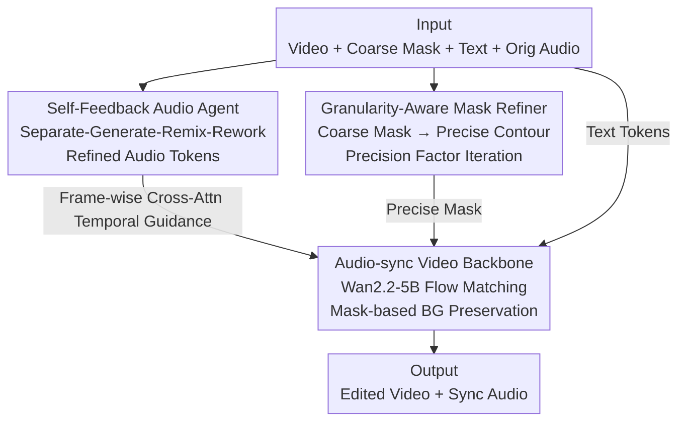

# Audio-sync Video Instance Editing with Granularity-Aware Mask Refiner

**Conference**: CVPR 2026  
**Paper**: [CVF Open Access](https://openaccess.thecvf.com/content/CVPR2026/html/Zheng_Audio-sync_Video_Instance_Editing_with_Granularity-Aware_Mask_Refiner_CVPR_2026_paper.html)  
**Code**: https://hjzheng.net/projects/AVI-Edit/ (Project page; no open-source code)  
**Area**: Video Editing / Diffusion Models / Audio-Visual Synchronization  
**Keywords**: Audio-video synchronized editing, instance-level editing, mask refinement, audio Agent, flow matching  

## TL;DR
AVI-Edit performs "audio-visual synchronized instance-level video editing" on a pre-trained video diffusion backbone. It utilizes a **Granularity-Aware Mask Refiner** to progressively refine rough user-provided masks (even bounding boxes) into precise instance contours, paired with a **Self-Feedback Audio Agent** (a separate-generate-remix-rework pipeline) to produce accompanying audio temporally aligned with the edited visuals. It significantly outperforms existing methods in visual quality, condition following, and audio-visual synchronization.

## Background & Motivation
**Background**: Video editing (modifying a person's appearance, replacing objects, etc.) is a vital tool for content creation. Commercial models like Sora-2 and Veo3 demonstrate that realistic accompanying audio is crucial for "immersion," creating a natural demand for preserving or correcting **audio-visual synchronized relationships** during instance-level video editing.

**Limitations of Prior Work**: Most video editing models (e.g., those using dual-branch encoders or auxiliary conditions) focus solely on visual features, often breaking the original audio-visual synchronization. A few works incorporating audio have flaws: AvED uses cross-modal contrastive learning for synchronization but is limited to **scene-level alignment**; Object-AVEdit allows object-level control, but its "inversion-regeneration" paradigm inherently lacks **temporal controllability** (it cannot specify the exact second an audio event occurs).

**Key Challenge**: Instance-level editing must satisfy three criteria simultaneously: spatially **precise masking** of the target instance (avoiding background contamination), temporal **frame-by-frame alignment** between audio and video, and support for diverse scenarios including vocal and non-vocal sounds. Existing methods struggle because masks are often rough, or audio provides only global semantics without fine-grained temporal cues.

**Goal**: To build a unified framework for "audio-visual synchronized + instance-level + fine-grained spatio-temporal controllable" editing and provide a supporting dataset for this task.

**Key Insight**: The challenge is decomposed into two specialized sub-problems: spatial precision is handled by a refinement module that "improves coarse masks," while temporal audio is managed by an audio Agent that "self-evaluates and reworks," both built upon a synchronized video backbone.

**Core Idea**: Spatial imprecision is addressed via a **Granularity-Aware Mask Refiner**, and temporal audio control is managed through a **Self-Feedback Audio Agent**. Both are integrated into a pre-trained video diffusion backbone (Wan2.2-5B) to achieve audio-visual synchronized instance-level editing.

## Method

### Overall Architecture
The input to AVI-Edit includes an original video, a **coarse instance mask** $m$ (indicating the target instance), a **textual instruction** $y$ (specifying the modification), and the original accompanying audio $a_{orig}$. The output is the edited video with synchronized audio. The system consists of a three-stage pipeline: first, the **Self-Feedback Audio Agent** processes the original audio into refined audio tokens by "retaining background sounds + generating target sounds." Simultaneously, the **Granularity-Aware Mask Refiner (GAMR)** iteratively refines the coarse mask into a precise instance contour. Finally, the **Audio-sync Video Backbone** takes the refined audio, precise mask, and text to perform flow-matching generation in latent space. Background areas outside the mask are preserved using original clean latents to ensure only the target instance is modified.

To support training and evaluation, the authors constructed the **AVISET** dataset (71k training / 1k validation / 1k test, ~197 hours, 720P/24FPS). Each segment is filtered to contain "only one primary sounding instance," with annotations for instance masks and scene-level text. The test set provides "original-edit" instruction pairs.

### Key Designs

**1. Audio-sync Video Backbone: Integrating Frame-wise Audio Channels into a Pre-trained Video DiT**

This component addresses how to make video generation responsive to text, audio, and masks without damaging the background. The authors fine-tune the diffusion Transformer of Wan2.2-5B using a **flow matching** objective. The clean latent $z=E(x)$ and Gaussian noise $\epsilon$ are linearly interpolated into a probability path $\hat z_t = tz + (1-t)\epsilon$ ($t\in[0,1]$, $\hat z_0=\epsilon$, $\hat z_1=z$). The model $v_\theta$ learns to predict the velocity field $v_t = z-\epsilon$, with the loss:

$$\mathcal{L}_{fm}=\mathbb{E}\big[\,\lVert v_\theta(z_t,t,\hat m,y,a,c)-v_t\rVert^2\,\big].$$

To edit only the target and preserve the background, it uses a downsampled mask $\hat m$ to concatenate the noise path with original clean tokens: $z_t = \hat z_t \odot \hat m + z \odot (1-\hat m)$. Inside the mask is the generation area; outside, original video tokens are copied. In each DiT block, besides standard self-attention (long-range context) and multimodal cross-attention (text understanding), the authors **add a frame-wise cross-attention layer**, allowing refined audio tokens $a$ to align with video latents frame-by-frame along the temporal dimension. This is the key mechanism for "frame-level audio-visual synchronization." A unified interface also supports optional controls $c$ like scribble/pose (injected via addition) or reference images (via concatenation). During inference, the ODE $dz_t/dt = v_\theta(\cdot)$ is solved starting from noise $\epsilon$.

**2. Granularity-Aware Mask Refiner (GAMR): Refining Coarse Masks via a Precision Factor**

User-provided masks are often coarse (e.g., a bounding box). Direct editing with these would contaminate the background. GAMR uses a **diffusion Transformer isomorphic to the video backbone** to "predict precise instance masks." The core is a **precision factor** $p\in[0,P]$ that explicitly describes mask granularity: $p=P$ indicates the worst quality (e.g., bounding box), while $p=0$ represents the precise contour $m_{gt}$. This $p$ is linearly encoded and injected via **AdaLN and Gate** in each DiT block, telling the model how coarse the current mask is and how much to refine it.

It features two clever designs: first, it replaces **text tokens with video tokens** in the multimodal cross-attention, allowing the refiner to infer boundaries based on visual semantics rather than text. Second, refined audio tokens are fed via frame-wise cross-attention to align the mask with the timing of sound events. To simulate user imprecision during training, the authors start with $m_{gt}$ and apply Gaussian kernels to create training pairs: $m_p = \mathrm{GaussianBlur}(m_{gt}, k_p, \sigma_p)$, where kernel size $k_p$ and $\sigma_p$ are determined by $p$. It is trained using a mask refinement focal loss:

$$\mathcal{L}_{mask} = -\alpha\,\hat m_{gt}(1-\hat m)^\gamma\log(\hat m) - (1-\alpha)(1-\hat m_{gt})\,\hat m^\gamma\log(1-\hat m),$$

where $\alpha=0.25$ and $\gamma=2.0$. Inference involves **iterative precision-aware refinement**: step 0 takes the coarse user mask $\hat m_0$ and its precision $p$ (e.g., $p=P$ for a bounding box). Each subsequent step takes the previous mask $\hat m_{k-1}$ as input and reduces $p$ according to a pre-defined schedule. The refined $\hat m_k$ at each step is used directly as the mask for the video backbone. This "refining while solving the ODE" approach allows spatial precision to converge during the generation process.

**3. Self-Feedback Audio Agent: A Separate-Generate-Remix-Rework Pipeline**

This component ensures the accompanying audio retains what is necessary, generates new content, and sounds natural. The authors designed a **separate–generate–remix–rework** pipeline that orchestrates existing audio components with a self-evaluation loop. First, a captioner converts the original audio to text $c_{sem}$. Then, a VLM uses the visuals, mask, and instructions to reason an editing plan:

$$(c_{sep}, c_{gen}) = \mathrm{VLM}([x, m_p, c_{sem}, y]),$$

where $c_{sep}$ contains components to be **preserved** (e.g., background applause) and $c_{gen}$ contains components to be **generated** (e.g., a specific male voice). The Agent selects the most suitable models $T^{sep}$ (speech vs. non-speech) and $T^{gen}$ (ElevenLabs TTS/TTM/TTS-sound), producing preserved parts $a^{sep}=T^{sep}(a_{orig},c_{sep})$ and generated parts $a^{gen}=T^{gen}(c_{gen})$, which are remixed into $a$.

The "self-feedback" occurs during the **rework determination**: an MLLM evaluates the perceptual quality $q$ of the remixed audio. If the quality exceeds a threshold $q > \tau$, it is accepted; otherwise, the MLLM generates refinement instructions $(\hat c_{sep}, \hat c_{gen})$ (e.g., "residual female voice audible" or "male voice volume too low") and feeds them back to the models for iterative correction until specific criteria or maximum iterations are met. This ensures audio quality via a closed-loop approach.

### Loss & Training
The framework jointly optimizes the video flow matching loss and the mask refinement loss: $\mathcal{L}=\mathcal{L}_{fm}+\lambda \mathcal{L}_{mask}$ ($\lambda=1.0$). The spatio-temporal VAE is frozen, and only the diffusion Transformer is fine-tuned. The backbone and GAMR are initialized with Wan2.2-5B weights and trained on 8×A800 at 720p for 160k steps using Adam with a learning rate of $2\times10^{-5}$.

## Key Experimental Results

### Main Results
Evaluation covers three categories: visual quality (FVD↓, IS↑), frame consistency (FC, CLIP similarity between adjacent frames), and alignment (Text-Video TC, Audio-Video AC, Lip-sync Sync-C↑/Sync-D↓). Baselines include AvED, Ovi, and a serial pipeline "VACE + Hunyuan-Foley" (VACE-Foley), all fine-tuned on AVISET. For fairness, ground-truth masks are used for the main table.

| Dataset | Method | FVD↓ | IS↑ | FC%↑ | TC%↑ | AC%↑ | Sync-C↑ | Sync-D↓ |
|--------|------|------|-----|------|------|------|---------|---------|
| AVISET | AvED | 364.69 | 1.104 | 95.03 | 23.69 | 23.31 | 1.69 | 11.80 |
| AVISET | Ovi | 407.08 | 1.122 | 96.47 | 25.83 | 26.68 | 4.00 | 9.12 |
| AVISET | VACE-Foley | 391.64 | 1.115 | 96.60 | 25.92 | 26.45 | 1.72 | 10.37 |
| AVISET | **Ours** | **312.89** | **1.127** | **96.65** | **26.16** | **26.93** | **4.12** | 9.19 |
| AvED-Bench | AvED | 413.82 | 1.118 | 94.89 | 24.59 | 20.45 | — | — |
| AvED-Bench | **Ours** | **349.31** | **1.125** | **95.82** | **25.30** | **21.64** | — | — |

Ours leads in most metrics across both datasets, particularly in FVD (visual quality) and AC (audio-video alignment). In Sync-D, Ovi (9.12) is slightly better than ours (9.19), which is within a comparable range. AvED-Bench lacks speech videos, so lip-sync metrics are not applicable.

A user study (25 participants) shows AVI-Edit ranks first in audio-visual synchronization (AVS), text alignment (TA), and overall preference (OP). On AVISET, OP reached 45.20% (vs. Ovi 38.40%, VACE-Foley 14.80%). In audio quality studies, the Agent's output was rated as "Acceptable/Perfect" for Fidelity (AF) 91%+, Background Retention (RP) 85%+, and Text-Audio Consistency (TAC) 88%+.

### Ablation Study
Ablations were conducted on AVISET by randomly degrading masks to test the robustness of mask refinement.

| Configuration | FVD↓ | FC%↑ | AC%↑ | Sync-C↑ | Note |
|------|------|------|------|---------|------|
| **Ours (Full)** | **335.32** | **96.63** | **26.77** | **4.18** | Full framework |
| w/o PF (no precision factor) | 354.43 | 96.49 | 26.50 | 4.12 | Refiner lacks granularity guidance; head regions often misestimated |
| w/o MR (no mask refiner) | 372.44 | 96.32 | 26.38 | 4.07 | Relies solely on coarse user masks; background (e.g., walls) corrupted |
| w/o AA (no audio Agent) | 342.75 | 96.54 | 25.97 | 3.83 | Replaced with generic audio editor; noisier audio, lower sync |

### Key Findings
- **The Mask Refiner (MR) is the most significant contributor**: Removing it increases FVD from 335.32 to 372.44, as the model is forced to use coarse masks, leading to background corruption.
- **The Precision Factor (PF) serves as the "scale" for the refiner**: Removing PF allows the architecture to exist but deprives it of granularity guidance, causing boundary errors (e.g., at the head), proving that explicit modeling of mask coarseness is effective.
- **The Audio Agent (AA) primarily impacts the audio side**: Its removal leads to the most visible drops in AC and Sync-C, validating the rework mechanism's role in audio quality.
- The framework also supports scribble/pose/reference control, instance insertion/deletion, and long video editing.

## Highlights & Insights
- **Explicit Parameterization of "Mask Precision"**: Using a scalar precision factor $p$ to describe granularity and creating training pairs via Gaussian kernels is a natural extension of diffusion "timestep" concepts to mask refinement.
- **Isomorphic Architecture for GAMR**: Reusing the video backbone architecture but replacing text tokens with video tokens allows the module to infer boundaries from visual semantics rather than text, effectively leveraging pre-trained weights.
- **Audio via Orchestrated Agent instead of End-to-End**: By treating TTS/TTM/separation models as tools in a closed-loop system (separate-generate-remix-rework), the framework covers diverse audio scenarios and corrects errors via feedback—a paradigm transferable to any controllable audio generation task.
- **Frame-wise Cross-Attention** acts as the unified injection point for synchronization, serving both the backbone and the mask refiner.

## Limitations & Future Work
- **Single-instance constraint**: Currently, the model processes one instance at a time. Editing multiple instances requires sequential runs.
- **Component Dependency**: The Audio Agent relies heavily on external tools (ElevenLabs, MLLM evaluators). Quality is capped by these "black box" components, and the iterative pipeline may increase inference latency (the paper does not report average rework counts).
- **Scenario Complexity**: AVISET is filtered for "single primary sounding instances." Generalization to complex scenes with multiple speakers or heavy reverb is not fully verified.
- **Lip-Sync**: Sync-D performance is slightly behind Ovi, suggesting room for improvement in fine-grained lip alignment.

## Related Work & Insights
- **vs. AvED**: AvED uses cross-modal contrastive sync at the **scene level**; AVI-Edit achieves **instance-level + frame-wise** control, leading in FVD and AC.
- **vs. Object-AVEdit**: While it offers object control, its inversion paradigm lacks temporal controllability; AVI-Edit uses the Audio Agent for explicit temporal guidance.
- **vs. Ovi (Generator)**: Ovi is a generator; when adapted for zero-shot inpainting, its visual consistency is inferior to AVI-Edit's dedicated editing design.
- **vs. VACE-Foley (Serial)**: Serializing video editing and audio generation leads to a decoupling that often results in synthesized voice failure; AVI-Edit's joint backbone yields better synchronization.

## Rating
- Novelty: ⭐⭐⭐⭐⭐ First framework to unify instance-level editing, frame-wise audio sync, and fine-grained spatio-temporal control. Precision factor and self-feedback Agent are innovative.
- Experimental Thoroughness: ⭐⭐⭐⭐ Quantitative results, user studies, and ablations are comprehensive, though baselines are limited due to the task's novelty.
- Writing Quality: ⭐⭐⭐⭐ Modules are clearly defined with complete formulas; framework diagrams are dense but informative.
- Value: ⭐⭐⭐⭐⭐ Audio-visual synchronized editing is a high-demand area in the generative video era. The AVISET dataset is a valuable contribution.

<!-- RELATED:START -->

## Related Papers

- [\[CVPR 2026\] PAVAS: Physics-Aware Video-to-Audio Synthesis](pavas_physics-aware_video-to-audio_synthesis.md)
- [\[CVPR 2026\] SAVE: Speech-Aware Video Representation Learning for Video-Text Retrieval](save_speech-aware_video_representation_learning_for_video-text_retrieval.md)
- [\[NeurIPS 2025\] Instance-Specific Test-Time Training for Speech Editing in the Wild](../../NeurIPS2025/audio_speech/instance-specific_test-time_training_for_speech_editing_in_the_wild.md)
- [\[NeurIPS 2025\] Node-Based Editing for Multimodal Generation of Text, Audio, Image, and Video](../../NeurIPS2025/audio_speech/node-based_editing_for_multimodal_generation_of_text_audio_image_and_video.md)
- [\[CVPR 2026\] Omni2Sound: Towards Unified Video-Text-to-Audio Generation](omni2sound_towards_unified_video-text-to-audio_generation.md)

<!-- RELATED:END -->
