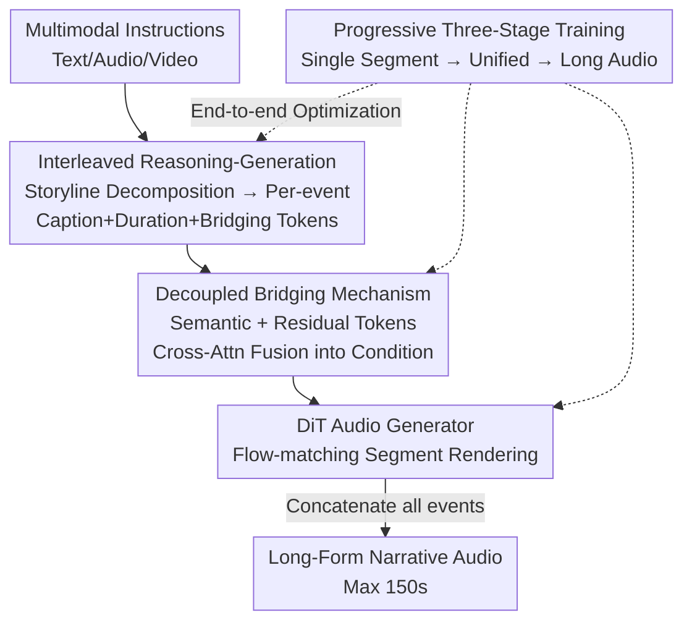

# AudioStory: Generating Long-Form Narrative Audio with Large Language Models

**Conference**: CVPR 2026  
**Paper**: [CVF Open Access](https://openaccess.thecvf.com/content/CVPR2026/html/Guo_AudioStory_Generating_Long-Form_Narrative_Audio_with_Large_Language_Models_CVPR_2026_paper.html)  
**Code**: https://github.com/TencentARC/AudioStory  
**Area**: Audio/Speech Generation  
**Keywords**: Long-Form Narrative Audio, LLM+Diffusion, Bridging Tokens, Interleaved Reasoning-Generation, End-to-End Training  

## TL;DR
AudioStory integrates LLM narrative reasoning with a DiT diffusion audio generator into an end-to-end framework. The LLM first decomposes complex instructions into timestamped sub-events, then generates short audio segments sequentially to form long-form narrative audio. Decoupled bridging via "semantic tokens + residual tokens" ensures intra-segment alignment and cross-segment coherence, enabling stable generation of multi-scene audio stories up to 150 seconds.

## Background & Motivation
**Background**: Text-to-Audio (TTA) models such as TangoFlux, AudioLDM, and Stable Audio have achieved high-fidelity synthesis of short audio clips from single-sentence descriptions using diffusion or flow-matching.

**Limitations of Prior Work**: These models primarily excel at "one sentence → one sound event." They fail when generating long-form narrative audio (e.g., audiobooks, podcasts, dynamic game soundscapes) that requires decomposing complex instructions—like "a thrilling chase in a storm: footsteps splashing, thunder roaring, car skidding, door slamming"—into sequential events with coordinated intensity while maintaining global stylistic unity. Pure TTA models often produce fragmented outputs with style drift.

**Key Challenge**: Long-form narrative audio necessitates two capabilities absent in standard TTA: **temporal coherence** (maintaining consistent themes/effects/emotions over long durations) and **compositional reasoning** (decomposing high-level instructions into logically ordered, precisely timed sub-events). Existing methods lack explicit mechanisms for modeling cross-segment dependencies and aligning audio events with evolving narrative structures.

**Key Insight**: The authors leverage the reasoning and planning capabilities of LLMs to bridge this gap. The LLM acts as a "director" responsible for narrative decomposition and timeline scheduling, while the diffusion model acts as the "performer" responsible for rendering each event into audio. The two are jointly trained end-to-end rather than being zero-shot cascaded.

**Core Idea**: A "divide-and-conquer" approach decomposes long audio into chronologically ordered short segments generated sequentially. A set of decoupled bridging tokens (semantic tokens for high-level semantics, residual tokens for low-level acoustic details and cross-event associations) connects the LLM and DiT, with the entire system trained end-to-end.

## Method

### Overall Architecture
AudioStory takes multimodal instructions (text-only / audio+text / video+text) and outputs long-form narrative audio composed of multiple ordered segments. The system follows a unified "understanding-generation" framework consisting of three steps: ① The LLM processes instructions and performs **interleaved reasoning-generation**, reasoning out the storyline, inferring the number of events, and predicting timestamps/emotions/content for each event, before sequentially outputting captions, durations, and two types of bridging tokens; ② A **decoupled bridging mechanism** fuses semantic and residual tokens into conditioning queries for a TangoFlux-initialized DiT audio generator to render segments; ③ The joint LLM+DiT system undergoes **progressive three-stage end-to-end training**, scaling from single-segment generation to unified long-form audio generation and understanding.

### Key Designs

**1. Interleaved Reasoning-Generation: A Divide-and-Conquer Workflow**

Generating long audio directly from complex instructions is difficult as it requires simultaneous management of multiple events and temporal relations. AudioStory splits this into two interleaved steps. **Storyline Reasoning**: The LLM analyzes the instruction, determines the number of audio events, and provides timestamps, descriptions, and content for each. **Interleaved Generation**: For each event, the LLM sequentially predicts the caption, duration, and bridging queries (semantic + residual tokens), which are fed into the DiT. The training data follows an interleaved template: `[BOT]{event_count}{reasoning_tokens}[EOT]` followed by `[BOG]{caption}{duration}T_semantic T_residual[EOG]` for each segment until `[EOS]`. All text tokens are supervised by next-token prediction, with the loss split into:

$$L_{reason} = L^{\#event}_{text} + L^{content}_{text} + L^{caption}_{text}$$

Ablations show that removing reasoning leads to missing events and poor instruction following, while removing interleaving (no per-segment captions) is catastrophic, with FAD increasing from 3.06 to 16.03.

**2. Decoupled Bridging Mechanism: Bifurcated Control of Semantics and Acoustic Details**

Prior works (e.g., NExT-GPT) use predefined text spaces as bridges, which struggle to capture low-level acoustic details like timbre or rhythm. AudioStory decouples bridging queries into: **semantic tokens** $T_{semantic}$ encoding high-level, text-oriented audio semantics, and **residual tokens** $T_{residual}$ capturing fine-grained acoustic cues and cross-event associations. Semantic tokens are supervised via MSE alignment with Flan-T5 text tokens $T^{gt}_{semantic}$:

$$L_{mse} = \lVert T^{gt}_{semantic} - T_{semantic} \rVert_2^2$$

Residual tokens receive no explicit supervision; instead, they learn to provide complementary information implicitly through the generation loss. The two types are fused via multi-head cross-attention (semantic as query, residual as key/value):

$$H_{bridge} = \text{Cross-Attn}(T_{semantic}, T_{residual}, T_{residual})$$

The DiT generates audio conditional on $H_{bridge}$ via flow-matching: $L_{flow} = \mathbb{E}_{x_1,x_0,t}\lVert u(x_t,t,c) - v_t \rVert_2^2$, where $c = H_{bridge}$ and $t \sim \text{Uniform}[0,1]$. This generation supervision allows residual tokens to learn details missing from the semantic tokens.

**3. Progressive Three-Stage End-to-End Training**

To bridge the feature gap between LLM and DiT, a progressive training strategy is employed. **Stage-I: Single Audio Generation** involves warming up the semantic tokens via MSE followed by whole-stage regression of both tokens and DiT generation. Target: $L^{whole}_{s1} = L_{mse} + \lambda_1 L^{token}_{text} + \lambda_2 L_{flow}$. **Stage-II: Unified Single Audio Generation & Understanding** introduces audio understanding tasks (AudioQA/captioning) while freezing the audio encoder. Target: $L_{s2} = L_{mse} + \lambda_1 L_{text} + \lambda_2 L_{flow}$. **Stage-III: Unified Long Audio Generation & Understanding** integrates interleaved reasoning and high-quality multi-audio data (AS-10k) for narrative SFT and "audio continuation" tasks. Total target: $L_{s3} = L_{mse} + \lambda_1 L_{text} + \lambda_2 L_{flow} + \lambda_3 L_{reason}$ ($\lambda_1{=}1,\lambda_2{=}0.2,\lambda_3{=}0.4$).

### Loss & Training
- **Backbone**: Qwen-2.5-3B-Instruct (LLM), TangoFlux initialization (DiT), Whisper-large-v3 (Audio Encoder for continuation), two-layer GeLU projectors.
- **Trainable Components**: LLM LoRA, projectors, bridging cross-attention fuser, and DiT throughout all stages.
- **Data**: ~1M Audio-QA pairs for understanding; 700k Audio-caption pairs for single segment generation; custom AS-10k for long narrative audio. Stage-II understanding:generation ratio is 2:1.

## Key Experimental Results

### Main Results
Evaluation on AS-10k (using Gemini-2.0-flash as a 0–5 judge alongside FD/FAD metrics):

| Model | Instruct.↑ | CLAP↑ | Reasoning↑ | Consis.↑ | Coher.↑ | FD↓ | FAD↓ | Max Duration↑ |
|-------|------------|-------|-----------|----------|---------|-----|------|---------------|
| AudioLDM2 | 2.8 | 0.296 | - | 4.6 | 4.4 | 3.43 | 4.49 | 10s |
| TangoFlux | 3.2 | 0.317 | - | 4.1 | 4.2 | 2.48 | 3.49 | 30s |
| LLM+TangoFlux | 3.5 | 0.322 | 3.5 | 2.1 | 1.9 | 2.55 | 3.82 | 30s |
| LLM+NExT-GPT | 3.3 | 0.299 | 3.5 | 1.8 | 1.7 | 3.47 | 3.99 | 10s |
| Caps(gt)+TangoFlux (oracle) | 4.0 | 0.348 | - | 2.4 | 2.0 | 1.79 | 3.59 | 30s |
| **AudioStory** | **4.1** | **0.392** | **4.2** | 4.1 | 3.9 | **1.43** | **3.00** | **150s** |

AudioStory leads across all metrics. CLAP scores exceed LLM-assisted TTA by 17.85%, and duration reaches 150s. Note: AudioLDM2's "high" consistency (4.6) is a byproduct of short 10s outputs with poor instruction following; AudioStory maintains comparable consistency while generating significantly longer and more complex narratives.

### Ablation Study

Reasoning Format Ablation (Table 4):

| Config | Consis.↑ | Inst.↑ | FAD↓ | CLAP↑ | Description |
|--------|----------|--------|------|-------|-------------|
| w/o reasoning | 3.1 | 3.1 | 4.13 | 0.34 | Skips analysis; leads to missing events |
| w/o interleaved | 1.6 | 1.2 | 16.03 | 0.14 | No per-segment captions; quality collapses |
| w/ reasoning (Full) | 4.0 | 4.1 | 3.06 | 0.39 | Full interleaved reasoning |

Bridging Feature Ablation (Table 5, values denote single/multi FAD):

| Config | Supervision Feature | Single↓ | Multi↓ | Description |
|--------|----------------------|---------|---------|-------------|
| Semantic token | AudioMAE | 9.55 | 11.39 | Audio features for semantics yield poor results |
| Residual token | AudioMAE | 9.24 | 10.06 | Strong supervision for residuals is detrimental |
| **Ours** | **T5 (Sem) + None (Res)** | **2.29** | **3.12** | Text supervision for Sem, DiT loss for Res is best |

### Key Findings
- **Interleaved per-segment captions are critical**: Removing them causes FAD to jump from 3.06 to 16.03, indicating that bridging tokens require per-segment context.
- **Differentiated supervision for bridging tokens**: Semantic tokens are best supervised by text features (T5), as audio features have lower semantic density. Conversely, residual tokens benefit from weak supervision (implicit DiT loss).
- **Residual tokens contribute significantly to end-to-end training**: Performance drops notably without residual tokens, confirming they capture information distinct from semantic tokens during joint training.

## Highlights & Insights
- **"Director + Performer" Decoupling**: LLM handles high-level planning (events, timestamps, emotions), while the diffusion model handles rendering. This transforms "hard generation" into "plan-then-fill," transferable to long video scoring or multi-shot visual narratives.
- **Semantic/Residual Decoupling as a Reusable Trick**: Strong supervision for high-level semantics via text alignment paired with weak supervision for low-level details via generation loss is an effective asymmetric design.
- **Progressive "Single-to-Multi" Strategy**: Establishing single-segment quality and understanding before scaling to long sequences avoids training instability in long sequence modeling.

## Limitations & Future Work
- The 150s limit is tested, but coherence for true long-form content (30+ minutes) remains unverified.
- Evaluation relies heavily on Gemini as an LLM judge; subjective metrics (consistency/coherence) lack large-scale human verification.
- Data diversity is limited; animation audio is predominantly from *Tom & Jerry*, and natural sounds are from UnAV-100. Generalization to other styles (horror, documentary, multi-character dialogue) requires further study.
- The mechanism by which residual tokens capture details via DiT loss lacks interpretability and remains largely empirical.

## Related Work & Insights
- **vs Pure TTA (TangoFlux / Stable Audio)**: These models lack cross-segment reasoning and are limited to 10–30s; AudioStory uses LLM planning to reach 150s with better instruction following.
- **vs LLM+TTA Cascades (LLM-generated captions fed to TTA)**: Cascades suffer from feature gaps and lack of joint training, resulting in lower consistency (2.1 vs AudioStory's 4.1).
- **vs Any-to-Any MLLMs (NExT-GPT / Spider)**: These focus on simple speech/captions for single segments; AudioStory specializes in compositional reasoning for long-form narratives, significantly outperforming them in long audio FAD (3.00 vs ~4.00).

## Rating
- **Novelty**: ⭐⭐⭐⭐ Combines divide-and-conquer reasoning with decoupled bridging for a new task.
- **Experimental Thoroughness**: ⭐⭐⭐⭐ Comprehensive main results and ablations, though lacks extensive human evaluation.
- **Writing Quality**: ⭐⭐⭐⭐ Clear framework and well-explained training stages.
- **Value**: ⭐⭐⭐⭐ Practical for audiobooks/game soundscapes; the planning-rendering paradigm is highly transferable.

<!-- RELATED:START -->

## Related Papers

- [\[ICML 2025\] Long-Form Speech Generation with Spoken Language Models](../../ICML2025/audio_speech/long-form_speech_generation_with_spoken_language_models.md)
- [\[ACL 2026\] PlanRAG-Audio: Planning and Retrieval Augmented Generation for Long-form Audio Understanding](../../ACL2026/audio_speech/planrag-audio_planning_and_retrieval_augmented_generation_for_long-form_audio_un.md)
- [\[AAAI 2026\] End-to-end Contrastive Language-Speech Pretraining Model For Long-form Spoken Question Answering](../../AAAI2026/audio_speech/end-to-end_contrastive_language-speech_pretraining_model_for_long-form_spoken_qu.md)
- [\[CVPR 2026\] TAPE: Task-Adaptive Prototype Evolution in Audio-Language Models for Fully Few-shot Class-incremental Audio Classification](tape_task-adaptive_prototype_evolution_in_audio-language_models_for_fully_few-sh.md)
- [\[ACL 2026\] Comprehensive Benchmarking of Long-Form Speech Generation in Diverse Scenarios](../../ACL2026/audio_speech/comprehensive_benchmarking_of_long-form_speech_generation_in_diverse_scenarios.md)

<!-- RELATED:END -->
