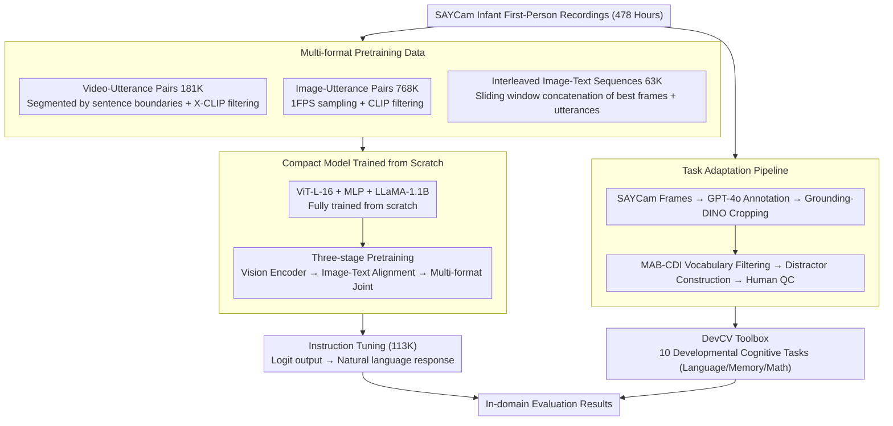

# BabyVLM-V2: Toward Developmentally Grounded Pretraining and Benchmarking of Vision Foundation Models

**Conference**: CVPR 2026  
**arXiv**: [2512.10932](https://arxiv.org/abs/2512.10932)  
**Code**: [https://shawnking98.github.io/BabyVLM-v2/](https://shawnking98.github.io/BabyVLM-v2/)  
**Area**: Audio and Speech  
**Keywords**: Developmental cognition, infant vision, sample-efficient pretraining, NIH Baby Toolbox, DevCV Toolbox

## TL;DR
The BabyVLM-V2 framework is proposed, which constructs three formats of pretraining data (768K image pairs + 181K video pairs + 63K interleaved sequences) from the SAYCam longitudinal corpus from an infant's first-person perspective. It designs the DevCV Toolbox (10 developmental cognitive tasks) based on the NIH Baby Toolbox®. A compact model trained from scratch surpasses GPT-4o on certain mathematical tasks, marking the first systematic exploration of Artificial Developmental Intelligence (ADI).

## Background & Motivation

**Background**: Vision foundation models rely on scaling laws through pretraining on massive datasets. However, young children develop powerful perception and reasoning capabilities from extremely limited visual input (approximately 40,000 waking hours from birth to age 3). This serves as a natural goal for sample-efficient pretraining.

**Limitations of Prior Work**: BabyVLM-V1 (the predecessor) has four major deficiencies: (1) it uses only about 1/3 of the SAYCam recordings (67K image pairs), covering a minimal proportion; (2) it only supports image-text pairs, lacking support for video and multi-turn dialogues; (3) the 4 evaluation tasks were intuitively designed rather than based on standardized psychological tests; (4) the model's open-set performance is near zero, requiring logit post-processing for evaluation.

**Key Challenge**: How to train foundation models with diverse capabilities similar to young children under the constraints of limited infant sensory experiences? How to evaluate them fairly using developmental psychology standards?

**Key Insight**: (1) Maximize the utilization of the SAYCam corpus and construct multi-format data to support diverse downstream tasks; (2) use the NIH Baby Toolbox®—the most authoritative neurodevelopmental assessment tool for children released in February 2025—as the foundation for benchmark design.

**Core Idea**: Engineer standardized developmental psychology assessment methods into computer vision tasks for AI evaluation, establishing the DevCV Toolbox.

## Method

### Overall Architecture
This paper aims to answer one question: if a model is given only the limited visual experience of an infant, how much early childhood cognitive ability can it learn? To this end, the authors convert the SAYCam longitudinal recordings (478 hours) from an infant's first-person perspective into pretraining data as "authentically" as possible, train a compact vision-language model from scratch, and evaluate it using a benchmark adapted from standardized developmental psychology tests. The pipeline is: raw recordings are minimally processed and segmented into three pretraining data formats (image pairs / video pairs / interleaved sequences) → a three-stage pretraining process builds the vision encoder, image-text alignment, and multi-format joint training step-by-step → instruction tuning with 113K samples enables the model to respond in natural language rather than outputting logits → final evaluation on 10 cognitive tasks in the DevCV Toolbox. The evaluation samples themselves are reconstructed from SAYCam frames through a task adaptation process, ensuring that evaluation and training remain within the same visual domain.

### Key Designs

**1. Multi-format Pretraining Data: Supporting Diverse Downstream Capabilities with Limited Infant Recordings**

The fundamental weakness of V1 was using only 1/3 of the recordings and supporting only image-text pairs, restricting downstream tasks to single-image understanding. V2 utilizes nearly all of SAYCam and deliberately creates three complementary formats. Video-utterance pairs (181K) segment video based on speech transcription boundaries using Azure ASR for subtitles, filtering with X-CLIP (image-text similarity $> 0.1$) to retain 138 hours. Image-utterance pairs (768K) are sampled at 1FPS from video pairs and filtered with CLIP (similarity $> 0.2$), yielding a scale 11 times that of V1's 67K. Interleaved image-text sequences (63K) use sliding windows of size 4–8 to concatenate the best frames and utterances from consecutive segments, simulating an infant's "continuous interaction" experience. These formats are not redundant; each feeds different capabilities—video pairs support temporal understanding, image pairs support static perception, and interleaved sequences support multi-turn dialogue, covering different task types in the benchmark. Critically, the pipeline uses minimal "segmentation + filtering" processing without additional annotation or synthesis, preserving developmental authenticity.

**2. DevCV Toolbox: Engineering Clinical Developmental Assessments into Computer Vision Tasks**

The 4 evaluation tasks in V1 were intuitive and lacked psychological grounding. V2 adopts the NIH Baby Toolbox® (released in February 2025)—the most authoritative pediatric neurodevelopmental assessment tool—as a blueprint to build the DevCV Toolbox with 10 tasks. These are categorized into three subdomains: Language (Looking While Listening dual-image choice, Picture Vocabulary four-image comprehension, Localization), Executive Function and Memory (Left/Right orientation, Spatial Details, Visual Delayed Response after occlusion, Memory multi-turn delayed recall), and Mathematics (Who Has More quantity comparison with synthetic and natural versions, Subitizing fast counting, Object Counting). Each task does not simply use cartoon stimuli from the original toolbox; instead, it reconstructs natural scene samples from SAYCam frames. This ensures evaluation and training share the same visual domain, preventing domain shift from depressing performance. The clinical endorsement of the NIH toolbox establishes the credibility of the benchmark.

**3. Task Adaptation Pipeline: Picture Vocabulary as an Example of Adapting Clinical Tests to CV Samples**

Turning psychological tests into AI tasks is difficult because it requires preserving the assessment intent while switching to in-domain realistic images. The original NIH test uses 4 cartoon images on an iPad with voice prompts for children. The DevCV adaptation chain involves: 1FPS sampling of SAYCam frames → GPT-4o and manual annotation of object bounding boxes → Grounding-DINO cropping → filtering via the MAB-CDI infant vocabulary → constructing distractors based on semantic and phonological distributions (ensuring incorrect options are neither too similar nor too plausible) → final human quality control. This semi-automatic process ensures each question follows the original test's difficulty gradient while using visuals actually seen by infants.

**4. Compact Model Trained from Scratch: Pinning Capability Sources to Infant Corpora**

The model uses a standard vision-language architecture: ViT-L-16 (300M) + MLP connector + LLaMA-1.1B. It supports text, single image, multiple images, video, and multi-turn dialogue inputs, with natural language as the unified output. A critical constraint is that all components are trained from scratch without any pretrained weights. Using external pretraining would make it impossible to determine whether performance stems from infant experience or massive external corpora. Consequently, the significance of the results lies in a ~1.4B model that has only seen 478 hours of video matching or exceeding GPT-4o on specific tasks.

### Loss & Training
The pipeline consists of three stages: Stage 1 pretrains the vision encoder, Stage 2 performs image-text alignment, and Stage 3 executes joint training across the three formats. Finally, instruction tuning using DevCV tasks transitions the model from logit outputs to natural language responses.

## Key Experimental Results

### Main Results (DevCV Toolbox In-domain Evaluation)

| Model | Overall | Count | PV (Vocab) | Memory | WhoHasMore | LeftRight |
|-------|---------|-------|------------|--------|------------|-----------|
| Human Performance | 93.0 | 99.1 | 91.8 | 87.3 | 63.6 / 95.5 | 94.5 |
| Gemini-2.5-flash | 72.7 | 71.1 | 91.2 | 84.8 | 42.4 | 34.9 |
| GPT-4o | ~70 | ~65 | ~90 | ~80 | ~40 | ~34 |
| **Ours (BabyVLM-V2)** | Competitive | **Partially exceeds GPT-4o** | Competitive | Competitive | Competitive | Competitive |

### Ablation Study

| Configuration | Key Impact | Description |
|---------------|------------|-------------|
| Image-Text Only (V1) | Baseline | Near zero open-set performance |
| + Video-Utterance (181K) | + Improved video understanding | Benefits DelayedResponse task |
| + Interleaved Sequences (63K) | + Improved multi-turn dialogue | Benefits Memory task |
| + Instruction Tuning (113K) | **Significant overall gain** | Transition from logits to natural language |
| 768K vs 67K Image Pairs | Ours >> Prev. SOTA (V1) | Direct impact of data volume |

### Key Findings
- **Surpassing GPT-4o in Math Tasks**: The ~1.4B model trained from scratch partially exceeds GPT-4o in "Who Has More" and "Counting," demonstrating that infant experience data contains sufficient information for counting and quantity comprehension.
- The human upper bound (93%) for the DevCV Toolbox is significantly higher than all AI models, highlighting a notable gap between AI and child cognition.
- Subitizing and "Looking While Listening" serve as hold-out tasks to test generalization, confirming benefits from multi-format pretraining.
- The three pretraining data formats provide independent and complementary contributions.
- Performance drops on OOD test sets (constructed from Ego4D), validating the necessity of in-domain evaluation.

## Highlights & Insights
- **AI Engineering of Standardized Developmental Assessments**: This is the first translation of the NIH Baby Toolbox® into an AI evaluation benchmark, pioneering a research paradigm for developmental computational vision. Future psychologists could use the DevCV Toolbox to "read the early childhood mind."
- **Challenging the Scaling Law**: Only 478 hours of infant experience can train a model that surpasses GPT-4o in mathematical tasks, showcasing the immense potential of sample-efficient pretraining.
- **Data Format Diversity > Data Quantity**: The leap from V1 (67K) to V2 (768K + video + interleaved) stems not just from increased volume, but from format diversity enabling diverse capabilities.
- **Triple Benefit**: Enables universities to participate in foundation model research, provides experimental tools for cognitive science, and enhances public understanding of AI.

## Limitations & Future Work
- SAYCam only includes 3 infants (6–32 months old); the sample size is small and subject to individual differences. Larger datasets like BabyView should be incorporated.
- Compact models still significantly lag behind large models and humans in complex reasoning—the ADI gap remains large.
- DevCV Toolbox lacks actual child performance data (using only adult upper bounds); collaboration with psychology labs is needed to collect real developmental comparison data.
- Instruction tuning uses DevCV tasks themselves, posing a risk of task leakage.
- Does not include developmental assessments for non-visual language and motor skills.

## Related Work & Insights
- **vs. BabyVLM-V1**: 11x data increase + multi-format support; benchmark expanded from 4 to 10 tasks based on NIH standardized tests; model output evolved from logits to natural language.
- **vs. Vong et al. (CLIP on SAYCam)**: While they focus on word-referent mapping, this work focuses on general perception.
- **vs. DevBench/KIVA**: These target older age groups and do not match the 6–32 month range of SAYCam.
- **Insight**: The developmental cognitive perspective offers new inspiration for AI training strategies—perhaps "learning like an infant" is another path to AGI.

## Rating
- Novelty: ⭐⭐⭐⭐⭐ Unique developmental perspective + first AI adaptation of NIH Baby Toolbox®.
- Experimental Thoroughness: ⭐⭐⭐⭐ Rigorous DevCV design, though lacking real child data comparisons.
- Writing Quality: ⭐⭐⭐⭐⭐ Comprehensive interdisciplinary background.
- Value: ⭐⭐⭐⭐⭐ Profound impact on understanding the relationship between AI and human cognition.

<!-- RELATED:START -->

## Related Papers

- [\[ICCV 2025\] 2.5 Years in Class: A Multimodal Textbook for Vision-Language Pretraining](../../ICCV2025/audio_speech/25_years_in_class_a_multimodal_textbook_for_visionlanguage_p.md)
- [\[CVPR 2026\] EchoFoley: Event-Centric Hierarchical Control for Video Grounded Creative Sound Generation](echofoley_event-centric_hierarchical_control_for_video_grounded_creative_sound_g.md)
- [\[ICLR 2026\] JALMBench: Benchmarking Jailbreak Vulnerabilities in Audio Language Models](../../ICLR2026/audio_speech/jalmbench_benchmarking_jailbreak_vulnerabilities_in_audio_language_models.md)
- [\[ICLR 2026\] YuE: Scaling Open Foundation Models for Long-Form Music Generation](../../ICLR2026/audio_speech/yue_scaling_open_foundation_models_for_long-form_music_generation.md)
- [\[ICML 2026\] Beyond Classification: A Cough Regression Benchmark for Respiratory Acoustic Foundation Models](../../ICML2026/audio_speech/beyond_classification_a_cough_regression_benchmark_for_respiratory_acoustic_foun.md)

<!-- RELATED:END -->
