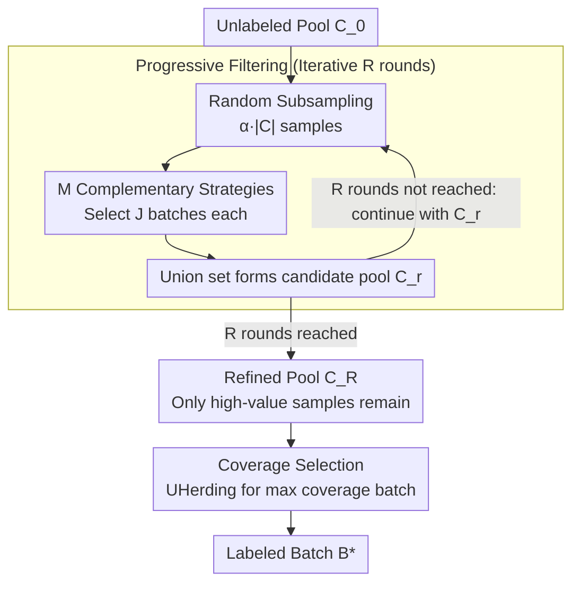

# Cleaning the Pool: Progressive Filtering of Unlabeled Pools in Deep Active Learning

**Conference**: CVPR 2026  
**arXiv**: [2511.22344](https://arxiv.org/abs/2511.22344)  
**Code**: [GitHub](https://github.com/dhuseljic/dal-toolbox)  
**Area**: Audio/Speech (Active Learning)  
**Keywords**: Active learning, ensemble strategies, progressive filtering, foundation models, coverage selection

## TL;DR

The authors propose Refine, an ensemble active learning method that consistently outperforms individual AL strategies and existing ensemble methods. It employs a two-stage strategy: progressive filtering (iterative refinement of the unlabeled pool using multiple strategies) followed by coverage selection (selecting high-value diverse samples from the refined pool) without requiring prior knowledge of the optimal strategy.

## Background & Motivation

**Background**: Adapting pre-trained foundation models (DINOv2, CLIP) to downstream tasks still requires labeled data. Active learning (AL) reduces annotation costs by intelligently selecting samples, but recent benchmarks show no single strategy is universally optimal.

**Limitations of Prior Work**: (a) Different AL strategies capture distinct views of "data value"—uncertainty vs. representativeness—with no strategy consistently dominating; (b) selecting an inappropriate strategy can perform worse than random sampling; (c) existing ensemble methods (TCM, TAILOR, SelectAL) rely on heuristic switching or learned scheduling, leading to unstable performance.

**Key Challenge**: AL is a one-shot problem (no opportunity for trial and error); selection must be made without knowing the optimal strategy beforehand.

**Goal**: Design a learning-free ensemble method that automatically integrates the advantages of multiple complementary strategies.

**Key Insight**: Shift the focus from "which samples to select" to "cleaning the pool first to remove valueless samples."

**Core Idea**: Use multiple strategies for repeated voting and filtering. Samples retained after multiple rounds are deemed valuable by at least one strategy, while samples never selected by any strategy are considered valueless.

## Method

### Overall Architecture

Refine avoids the dilemma of "which AL strategy to use in this round" by decoupling selection into two steps: first, **cleaning the unlabeled pool**, then selecting the batch from the cleaned pool. The first step is progressive filtering, where multiple complementary strategies vote iteratively to eliminate "unwanted" samples, leaving a high-value candidate pool recognized by at least one strategy. The second step is coverage selection; since the pool contains only valuable samples, the final step maximizes diversity within this subset. This process requires no learning or scheduling, and new strategies can be added modularly.

### Key Designs

**1. Progressive Filtering: Using Multiple Strategies to Vote and Exponentially Remove Valueless Samples**

Active learning is a one-shot problem where choosing the wrong strategy can be worse than random, and the optimal strategy is unknown. Progressive filtering bypasses this by allowing $M$ strategies to vote on the pool. In each round, every strategy $s_m$ selects $J=10$ batches from a random subsample ($\alpha=0.4$) of the current pool $\mathcal{C}_{r-1}$. The **union** of all selections across strategies and subsamples forms the next candidate pool:

$$\mathcal{C}_r = \bigcup_{m=1}^M \bigcup_{j=1}^J s_m(\text{SubSample}(\mathcal{C}_{r-1}, \alpha \cdot |\mathcal{C}_{r-1}|), b)$$

The design choices are interconnected. Using the **union instead of intersection** ensures that complementary "values" (uncertainty vs. representativeness) are preserved; an intersection might discard unique discoveries by one strategy, while a union ensures retention if at least one strategy approves. Using **iterative rounds instead of a single concatenation** is key to noise reduction: a truly valueless sample survives $R$ rounds only if it is selected by at least one strategy in every random subsample, a probability that decreases exponentially with the number of rounds. Furthermore, **subsampling $\alpha<1$** allows deterministic strategies (like Margin) to see different subsets each round, generating diversity and reducing memory consumption.

**2. Coverage Selection: Focusing on Diversity within the Cleaned Pool**

The filtered pool $\mathcal{C}_R$ is already a high-value candidate set, so the final step focuses solely on ensuring the selected batch is well-distributed in the feature space. Refine uses UHerding on $\mathcal{C}_R$ to select a batch that maximizes coverage, ensuring each data point is "represented" by a neighbor in the labeled set $\mathcal{L}_t$ or the new batch $\mathcal{B}$:

$$\mathcal{B}^* = \arg\max_{\mathcal{B} \subset \mathcal{C}_R} \mathbb{E}_{\mathbf{x}}\big[\max_{\mathbf{x}' \in (\mathcal{L}_t \cup \mathcal{B})} k(\mathbf{x}, \mathbf{x}')\big]$$

By delegating "value search" to filtering and "diversity preservation" to coverage, the method outperforms ensemble approaches that rely on rigid heuristic switching.

**3. Three Theorems: From Intuition to Guaranteed Filtering Efficiency**

The reliability of progressive filtering is supported by three proven properties. **Value Preservation** (Theorem 1) establishes a lower bound for the probability of a valuable sample being retained in a single round: $P_r(\mathbf{x}) \geq 1 - (1 - \alpha \cdot \max_m p_{m,r}(\mathbf{x}))^J$. As long as any strategy selects it with reasonable probability, $J$ repeated samplings ensure its retention. **Exponential Decay** (Theorem 2) guarantees that an $\epsilon$-valueless sample (selection probability $\leq \epsilon$ by any strategy) has a survival probability $\leq (MJ\alpha\epsilon)^R$ after $R$ rounds, which tends toward zero. Together, these lead to **Value Monotonicity** (Theorem 3): the expected value of the refined pool does not decrease across rounds, $\mathbb{E}[V|\mathcal{C}_R] \geq \dots \geq \mathbb{E}[V|\mathcal{C}_0]$, ensuring filtering never degrades the pool.

> ⚠️ Probability notation and constants (e.g., $p_{m,r}$, $MJ\alpha\epsilon$) are as defined in the original paper.

### Training Settings

- 3 Backbones: DINOv2-ViT-S/14, DINOv3-ViT-S/16, CLIP-ViT-B/16
- Frozen backbone + trained classification head, SGD LR 0.01, 200 epochs/cycle
- 20 AL cycles, 10 independent runs

## Key Experimental Results

### Main Results — Overall Win Rate

| Refine vs | Win Rate (3 backbones × 5 datasets × 10 trials) |
|-----------|-----------------------------------------------|
| BAIT      | 85%                                           |
| UHerding  | 80%                                           |
| SelectAL  | 100%                                          |
| TAILOR    | 100%                                          |
| TCM       | 98%                                           |
| AutoAL    | 97%                                           |

### Ablation Study — Progressive Filtering as Pre-processing

| Strategy | AULC from Raw Pool | AULC from Refined Pool | Gain |
|----------|-------------------|------------------------|------|
| Random   | Baseline          | +3.7%                  | Filtering + Random is effective |
| BAIT     | Worse than Random | **Better than Random** | Filtering rescues failed strategies |
| AlfaMix  | Baseline          | +2.6%                  | Universal benefit |
| UHerding | High              | +0.7%                  | Strong strategies also benefit |

### Effect of Filtering Rounds

| R (Rounds) | CIFAR-10 AULC Gain | Snacks AULC Gain |
|------------|--------------------|------------------|
| 1          | +3.02%             | +6.91%           |
| 3          | +3.72%             | +7.22%           |
| 5          | +3.71%             | +7.79%           |
| 9          | +3.78%             | +8.43%           |

### Key Findings

1. Refine achieves the highest overall win rate against all individual strategies and ensemble methods.
2. Progressive filtering serves as a universal pre-processing step—any AL strategy performs better when applied to the refined pool than to the raw pool.
3. BAIT performs worse than random on the raw pool but better than random after filtering, as filtering removes misleading samples.
4. Filtering with just two strategies (Margin + TypiClust) automatically integrates uncertainty and representativeness.
5. Performance remains stable within the range of $\alpha \in [0.3, 0.9]$.

## Highlights & Insights

- **Progressive filtering as pre-processing** is a practical contribution that can be integrated into any AL strategy at zero cost.
- The theoretical analysis is robust, with three theorems guaranteeing value preservation, noise removal, and monotonic quality improvement.
- The insight "samples never selected by any strategy are likely valueless" is simple yet profound.
- Scalability: New strategies can be added to the ensemble without retraining.

## Limitations & Future Work

- Invoking multiple strategies repeatedly increases computational overhead (though parallelizable).
- Refined pool quality may decrease if the majority of strategies in the ensemble fail (e.g., Dopanim + CLIP cases).
- Strategy weighting has not been explored; currently, strategies are weighted equally, but dynamic weighting based on historical performance could be beneficial.
- Validation was primarily on image classification; detection and segmentation require further testing.

## Related Work & Insights

- Unlike the hard switching in TCM, Refine achieves "soft switching" naturally through progressive filtering.
- The union+iteration design can be generalized to other scenarios requiring the integration of multiple heuristics.
- Provides a practical and theoretically grounded solution for AL in the era of foundation models.

## Rating

- Novelty: ⭐⭐⭐⭐ The progressive filtering concept is elegant and novel, though it represents an ensemble of strategies rather than a fundamentally new paradigm.
- Experimental Thoroughness: ⭐⭐⭐⭐⭐ 6 datasets × 3 backbones × 8 individual strategies + 4 ensemble methods + extensive ablation + theoretical analysis.
- Writing Quality: ⭐⭐⭐⭐⭐ Theoretical and experimental components complement each other perfectly with clear structure.
- Value: ⭐⭐⭐⭐ High practical value as a universal AL pre-processing step.

<!-- RELATED:START -->

## Related Papers

- [\[ICLR 2026\] STAR-Bench: Probing Deep Spatio-Temporal Reasoning as Audio 4D Intelligence](../../ICLR2026/audio_speech/star-bench_probing_deep_spatio-temporal_reasoning_as_audio_4d_intelligence.md)
- [\[ACL 2026\] ControlAudio: Tackling Text-Guided, Timing-Indicated and Intelligible Audio Generation via Progressive Diffusion Modeling](../../ACL2026/audio_speech/controlaudio_tackling_text-guided_timing-indicated_and_intelligible_audio_genera.md)
- [\[CVPR 2026\] Pushing the Frontier of Audiovisual Perception with Large-Scale Multimodal Correspondence Learning](pushing_the_frontier_of_audiovisual_perception_with_large-scale_multimodal_corre.md)
- [\[CVPR 2026\] SAVE: Speech-Aware Video Representation Learning for Video-Text Retrieval](save_speech-aware_video_representation_learning_for_video-text_retrieval.md)
- [\[ACL 2026\] Privacy-preserving Prosody Representation Learning](../../ACL2026/audio_speech/privacy-preserving_prosody_representation_learning.md)

<!-- RELATED:END -->
