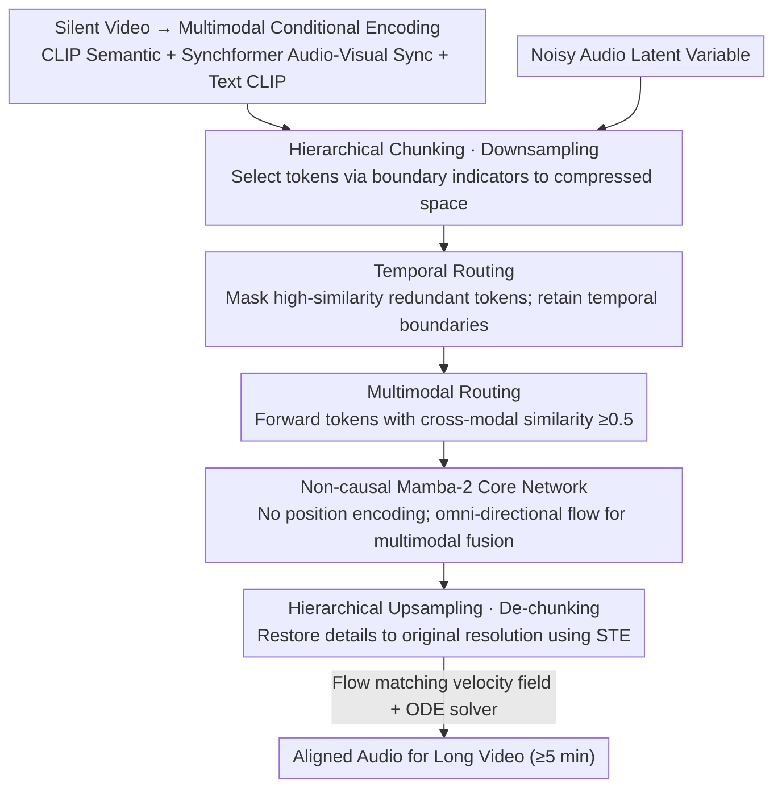

# Echoes Over Time: Unlocking Length Generalization in Video-to-Audio Generation Models

**Conference**: CVPR 2026  
**arXiv**: [2602.20981](https://arxiv.org/abs/2602.20981)  
**Code**: None (Project Page: [https://echoesovertime.github.io](https://echoesovertime.github.io))  
**Area**: Speech/Audio  
**Keywords**: Video-to-Audio, Long-sequence generation, Hierarchical networks, Mamba, Multi-modal alignment

## TL;DR
Ours proposes MMHNet, a multi-modal hierarchical network based on a hierarchical architecture and non-causal Mamba-2. It achieves length generalization capabilities—training on short segments (8s) while generating high-quality aligned audio for long videos (5+ minutes)—significantly outperforming existing methods on UnAV100 and LongVale benchmarks.

## Background & Motivation
Video-to-audio (V2A) generation aims to produce semantically and temporally aligned audio for silent videos, which is crucial for film production and gaming. Existing V2A methods (e.g., MMAudio, Diff-Foley) are primarily optimized for 8-10s short audio generation and fail to generalize effectively to long video scenarios.

**Key Challenge**: (1) Scarcity of long audio-video training data, with public datasets typically capped at 1 minute; (2) Transformer architectures rely on position encodings (e.g., RoPE), leading to sharp performance drops when inference sequence length exceeds training length; (3) Naive segment-wise stitching results in fragmented audio, unnatural transitions, and sound quality degradation.

**Key Insight**: Ours identifies **explicit position encoding** as the root cause—it is effective for fixed lengths but becomes a bottleneck for length generalization. Experiments show that removing position encoding causes MMAudio to generate homogenized sound, while retaining it leads to quality degradation in long sequences (FD_PANN drops by 3-4 points). Therefore, the **Core Idea** is to replace Transformer attention modules with **Mamba-2 (which requires no position encoding)** and employ **hierarchical token routing** for efficient long-sequence processing.

## Method

### Overall Architecture
MMHNet addresses the "length generalization" of V2A: the model is trained only on 8s clips but generates coherent aligned audio for videos exceeding 5 minutes. It modifies the multi-modal DiT architecture of MMAudio, retaining multi-modal blocks (audio+visual+text) and unimodal blocks (audio only). It uses flow matching to model the conditional velocity field in a latent space, solved via an ODE solver. Three key modifications enable length-unconstrained processing: replacing attention with non-causal Mamba-2, utilizing a hierarchical framework with temporal and multi-modal routing to filter redundant tokens, and using hierarchical chunking/upsampling to switch between compressed and original resolutions.

### Key Designs

**1. Non-causal Mamba-2 Core Network: Removing Position Encoding Bottlenecks**

The root of length generalization failure was localized to explicit position encoding. Ours replaces Transformer attention with Mamba-2, completely removing position encoding dependency. While causal Mamba-2 suffers from modulation decay in long sequences due to cumulative products, the non-causal version defines the mask as the inverse of a transformation matrix, avoiding cumulative products and enabling omni-directional information flow. This allows the model to handle arbitrary lengths during inference without architectural changes, where the global hidden state fuses all modalities simultaneously regardless of scanning order.

**2. Temporal Routing Layer: Filtering Redundant Timesteps by Similarity**

Adjacent time segments in audio-visual events are often highly redundant. Temporal routing uses cosine similarity between adjacent tokens to identify change boundaries: high-similarity tokens are masked as redundant, while low-similarity tokens are retained as temporal boundaries or event change points, reducing computational complexity without losing critical events.

**3. MM Routing Layer: Forwarding Cross-modal Relevant Tokens Only**

Weakly relevant tokens can interfere with alignment. MM routing forwards only tokens with a similarity $\ge 0.5$ relative to the reference modality. For instance, it aligns Synchformer sync features with text conditions, concentrating computation on cross-modal relevant positions.

**4. Hierarchical Chunking and Upsampling: Alignment in Compressed Space**

To ensure routing does not break sequence structure, ours uses a downsampler that selects tokens at boundary positions based on indicators. After processing, an upsampler restores the original dimensions, using a Straight-Through Estimator (STE) to allow gradients to flow through discrete selection operations. Early layers focus on multi-modal alignment in compressed space, while later layers restore details in original space.

### Loss & Training
The model is trained using a conditional flow matching objective on the VGGSound dataset using 8s clips. During inference, it generalizes directly to any length. The small model (S) uses $N=5$ multi-modal blocks and $N'=4$ unimodal blocks (157M parameters); the large model (L) uses $N=10$ and $N'=7$ (1.09B parameters).

## Key Experimental Results

### Main Results

| Dataset | Metric | MMHNet-S | MMHNet-L | MMAudio-L | LoVA | HunyuanVideo-Foley |
|--------|------|----------|----------|-----------|------|-------------------|
| UnAV100 | FD_PANNs ↓ | **5.87** | 5.29 | 9.01 | 7.50 | 10.28 |
| UnAV100 | IB-Score ↑ | **36.82** | 36.27 | 30.71 | 24.62 | 32.90 |
| UnAV100 | DeSync ↓ | 0.439 | **0.410** | 0.593 | 1.232 | 0.757 |
| LongVale | FD_PANNs ↓ | 10.10 | **10.03** | 16.12 | 21.81 | 28.00 |
| LongVale | IB-Score ↑ | **30.62** | 30.00 | 21.60 | 17.04 | 18.75 |
| LongVale | DeSync ↓ | **0.438** | 0.465 | 0.678 | 1.233 | 1.082 |

### Ablation Study

| Configuration | FD_PANNs ↓ | IB-Score ↑ | DeSync ↓ | Description |
|------|-----------|-----------|---------|------|
| Transformer (No PE) | 9.00 | 28.41 | 0.638 | Baseline; lacks temporal structure |
| Causal Mamba-2 | 9.18 | 33.32 | 0.497 | Directional constraints |
| **Non-causal Mamba-2** | **5.87** | **36.82** | **0.439** | Omni-directional flow; Best |
| Non-hierarchical (UnAV100) | 6.31 | 35.00 | 0.621 | No token compression |
| **Hierarchical** (UnAV100) | **5.87** | **36.82** | **0.439** | Routing compression helps significantly |

### Key Findings
- Non-causal Mamba-2 significantly outperforms Transformer and Causal Mamba-2 across all metrics, particularly in long-video multi-modal alignment (IB-Score gain > 8).
- Hierarchical token routing brings consistent improvements, especially on LongVale (IB-Score increased from 26.34 to 30.62).
- A token selection threshold of 0.5 is optimal; too high (0.7) leads to catastrophic failure.
- Autoregressive methods (V-AURA) perform worst in length generalization, validating the issue of error accumulation in step-by-step prediction.
- MMHNet maintains performance parity with MMAudio on VGGSound (same train/test length), proving length generalization does not sacrifice short-clip quality.

## Highlights & Insights
- **Train-short, test-long paradigm**: Generates high-quality audio exceeding 5 minutes using only 8s training clips.
- **Non-causal Mamba-2 as PE alternative**: This approach can be migrated to other sequence generation tasks requiring length generalization.
- **Token compression via hierarchical routing**: Filters important tokens via temporal and multi-modal routing, reducing costs while improving alignment.
- **Evaluation Innovation**: Employs multi-segment chunked evaluation for long audio to avoid pre-trained classifier limitations.

## Limitations & Future Work
- Generation quality depends on the quality of pre-trained conditional features (CLIP, Synchformer).
- Only validated in audio-video scenarios; applicability to other long-sequence multimodal tasks remains for exploration.
- Fixed routing thresholds (0.5) could be further optimized with adaptive thresholds.

## Related Work & Insights
- **vs MMAudio**: Directly extends MMAudio by replacing Transformer with Mamba-2 for length generalization.
- **vs LoVA**: LoVA is a Prev. SOTA in LV2A, but quality degrades significantly beyond 1 minute.
- **vs V-AURA**: Autoregressive models theoretically handle arbitrary lengths, but error accumulation results in the poorest practical performance.

## Rating
- Novelty: ⭐⭐⭐⭐ First systematic study of V2A length generalization; novel non-causal Mamba + hierarchical routing.
- Experimental Thoroughness: ⭐⭐⭐⭐⭐ Two long-video benchmarks plus VGGSound with extensive ablation and cross-duration analysis.
- Writing Quality: ⭐⭐⭐⭐ Clear motivation from pilot experiments; detailed architecture descriptions.
- Value: ⭐⭐⭐⭐ Solves practical V2A length generalization bottlenecks; direct application value in film/game sound effects.

<!-- RELATED:START -->

## Related Papers

- [\[CVPR 2026\] FoleyDirector: Fine-Grained Temporal Steering for Video-to-Audio Generation via Structured Scripts](foleydirector_fine-grained_temporal_steering_for_video-to-audio_generation_via_s.md)
- [\[CVPR 2026\] OmniSonic: Towards Universal and Holistic Audio Generation from Video and Text](omnisonic_towards_universal_and_holistic_audio_generation_from_video_and_text.md)
- [\[CVPR 2026\] PAVAS: Physics-Aware Video-to-Audio Synthesis](pavas_physics-aware_video-to-audio_synthesis.md)
- [\[CVPR 2026\] Unlocking Strong Supervision: A Data-Centric Study of General-Purpose Audio Pre-Training Methods](unlocking_strong_supervision_a_data-centric_study_of_general-purpose_audio_pre-t.md)
- [\[CVPR 2026\] EchoFoley: Event-Centric Hierarchical Control for Video Grounded Creative Sound Generation](echofoley_event-centric_hierarchical_control_for_video_grounded_creative_sound_g.md)

<!-- RELATED:END -->
