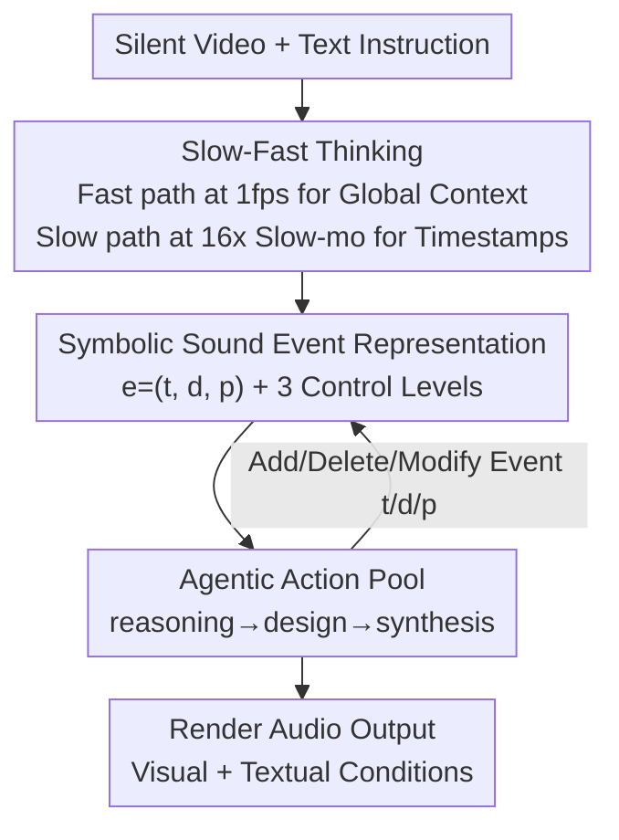

# EchoFoley: Event-Centric Hierarchical Control for Video Grounded Creative Sound Generation

**Conference**: CVPR 2026  
**Paper**: [CVF Open Access](https://openaccess.thecvf.com/content/CVPR2026/html/Li_EchoFoley_Event-Centric_Hierarchical_Control_for_Video_Grounded_Creative_Sound_Generation_CVPR_2026_paper.html)  
**Code**: Project Page https://echofoley.github.io/ (Code not yet public)  
**Area**: Video-to-Audio / Foley Generation / Multimodal  
**Keywords**: video-to-audio, Foley sound effects, event-level control, agentic framework, slow-fast thinking

## TL;DR
Addressing the issues of "visual dominance, inability to understand text instructions, and lack of fine-grained editing" in existing video-to-audio models, this paper proposes the EchoFoley task (using symbolic "sound event" representations + three levels of control granularity) along with a densely annotated benchmark of 6k samples. It designs EchoVidia, a training-free agentic framework (using slow-fast thinking + an action pool), which improves controllability by approximately 40.7% and perceptual quality by 12.5% over the strongest baseline.

## Background & Motivation
**Background**: Video-to-Audio (V2A) and Video+Text-to-Audio (VT2A) have progressed rapidly recently. Models like Diff-Foley, MMAudio, HunyuanVideo-Foley, and ThinkSound can generate temporally aligned sound effects for silent videos, often using text instructions as optional conditions in the form of short labels (e.g., "cat meowing") or single-sentence descriptions.

**Limitations of Prior Work**: The authors identify three critical flaws: (1) **Visual dominance**: Models rely heavily on visual cues and nearly ignore fine-grained textual requirements; when visual and textual instructions conflict, the model always follows the visuals. (2) **Lack of a clear definition for "fine-grained controllable generation"**: Existing instructions only operate at the "category of sound" level, failing to distinguish between multiple events of the same class (e.g., if a cat meows twice in a video, "make the cat meow louder" is ambiguous). (3) **Weak instruction understanding**: Current datasets consist of short category labels, making it impossible to support joint multi-attribute editing (simultaneously changing timbre, order, duration, and volume).

**Key Challenge**: The root cause is the incorrect "unit of control." Existing methods use **video-level or category-level** units, whereas creative-grade sound editing essentially requires operations on individual **sound events** as atoms, specifying "when, what, and how the sound occurs."

**Goal**: To shift control from the video level down to the event level, allowing users to generate, insert, and edit individual sound events with hierarchical control from single events to the entire clip.

**Key Insight**: The authors introduce a **symbolic sound event representation** as an intermediate interface between natural language instructions and audio generation, translating "vague human language" into structured, precisely manipulable event tuples.

**Core Idea**: Redefine the task using "event-centric + hierarchical control" (EchoFoley) and employ a training-free agentic framework (EchoVidia) with slow-fast thinking to first "see" the sound events in the video clearly and then synthesize them according to a symbolic plan.

## Method
The paper follows two main threads: **Task and Data** (EchoFoley task definition + EchoFoley-6k benchmark + evaluation metrics) and **Method** (EchoVidia framework).

### Overall Architecture
EchoVidia is a **training-free agentic framework**. Its core is a VideoLLM-based agent operating on an **action pool** of 12 atomic actions. The generation process is organized into three sequential stages: **reasoning (identifying events, estimating timing, cropping relevant frames) → design (adding/deleting/modifying symbolic event representations t/d/p) → synthesis (synthesizing, adjusting, and mixing audio layers)**. Before the agent workflow, a **slow-fast thinking** strategy is used to perceive sound events clearly (a fast path for global context and a slow path with slow-motion for precise timestamps), compensating for the common "weak event perception and inaccurate timing" in VideoLLMs. Finally, the agent outputs a symbolic event plan, rendered into sound by the audio generation module using both visual and textual conditions.

### Key Designs

**1. Symbolic Sound Event Representation + Hierarchical Control Space**

This establishes the foundation by defining a sound event $e$ as a structured triple $e=(t, d, p)$: where $t=(t_{start}, t_{end})$ spans the video timeline; $d$ is the semantic description `<subject, action, object>`; and $p$ represents controllable audio properties (timbre, pitch, intensity, spatialization). Given video $V$ and instruction $I$, the task is to produce the set of events $C=\{(t,d,p)\mid V,I\}$. 

The control space is organized into **three levels**: **Instance Level** (single event), **Group Level** (related events), and **Video Level** (overall acoustic style). These are orthogonal to three **control types**: Temporal, Timbre, and Volume. 

**2. Slow-Fast Thinking Strategy**

The authors found that VideoLLMs exhibit weak perception of sound events and severe timestamp drift. Inspired by dual-process cognition (System 1 Fast/Intuition vs. System 2 Slow/Analysis), they designed two paths: the **fast path** browses at 1 fps for global structure, while the **slow path** views a "16x slow-motion" version (16 fps downsampled to 1 fps by temporal stretching) to allow the model to perform event localization and attribute inference at a finer temporal resolution. This strategy increased event detection recall from 0.66 to 0.83 and localization IoU from 0.510 to 0.842 on Gemini-2.5 Pro.

**3. Agentic Action Pool + Three-Stage Reasoning**

To achieve fine-grained control without retraining, the VideoLLM agent utilizes a **12-action pool** categorized into: Video Reasoning (identifying events, retrieving temporal cues), Sound Design (add/remove/modify symbolic representations), and Generation (synthesize/adjust/mix audio layers). The agent iteratively refines the symbolic plan through reasoning and editing before the final rendering, bypassing the "text signal drowned by visual signal" issue in end-to-end models.

**4. EchoFoley-6k Benchmark and Event-Level Metrics**

The authors constructed a dataset of ~6,000 video-instruction triplets with ~42,000 densely annotated sound events. They introduced three **automatic metrics**:

$$\text{TempIoU}(e)=\frac{|t\cap\hat t|}{|t\cup\hat t|}, \qquad \text{CLAP}(e)=\text{sim}(A_t, d)$$

**TempCtl** measures temporal controllability via IoU; **TimbCtl** measures timbre controllability using CLAP similarity between the audio segment $A_t$ and description $d$; **VolCtl** measures loudness consistency across three discrete levels (low/medium/high).

## Key Experimental Results

### Main Results
Compared to 8 open-source VT2A models on EchoFoley-6k, EchoVidia leads across controllability and quality dimensions:

| Model | TempCtl | TimbCtl | VolCtl | Instr. Adherence | A–V Coherence | Perc. Quality |
|------|---------|---------|--------|-------------|----------|----------|
| MMAudio-S-44.1kHz | 0.30 | 0.24 | 0.55 | 2.00 | 3.53 | 3.13 |
| HunyuanVideo-Foley-xxl | 0.43 | 0.48 | 0.69 | 2.53 | 4.07 | 3.67 |
| **EchoVidia** | **0.72** | **0.78** | **0.75** | **3.80** | 3.93 | **3.79** |

### Ablation Study
Gains from the Slow-Fast (SF) strategy in event detection (Task 1) and localization (Task 2):

| Config | Recall | F1 | Note |
|------|--------|----|----|
| Gemini-2.5 Pro | 0.66 | 0.59 | Baseline VideoLLM |
| Gemini-2.5 Pro + SF | 0.83 (+0.17) | 0.74 (+0.15) | Best with SF |

### Key Findings
- **Finer granularity increases difficulty**: All models perform best at the video level but struggle significantly at the instance level.
- **Visual dominance bias is prevalent**: Existing models show decent A-V coherence but poor instruction adherence (<2.6/5), favoring visuals when instructions conflict.
- **SF is a cost-effective prompt-level enhancement**: Changing the viewing method significantly improves VideoLLM perception without training.

## Highlights & Insights
- **Formalizing sound as $(t, d, p)$ events**: This symbolic intermediate layer translates vague natural language into precisely editable objects, making complex instructions like "insert a 1-second explosion at 00:07" evaluable.
- **Slow-Fast Thinking for temporal resolution**: Using 16x slow-motion to "cheat" the temporal limits of LLMs is a highly reusable, training-free plug-and-play strategy.
- **Training-free agentic route**: Bypasses the visual-dominance bias of end-to-end models by keeping the reasoning and editing within a symbolic, interpretable space.

## Limitations & Future Work
- EchoVidia is currently an assembled, training-free agent; future work should integrate event-centric formalization into **end-to-end trainable** models.
- The framework relies heavily on high-end VideoLLMs (e.g., Gemini-2.5 Pro) to serve as the agent.
- Data scale is relatively small (937 videos), and the diversity of environmental or ambient sounds is limited.

## Related Work & Insights
- **vs. MMAudio / HunyuanVideo-Foley (End-to-End VT2A)**: These models over-optimize for visual alignment at the expense of text control; EchoVidia achieves significantly higher controllability (TempCtl 0.72 vs. 0.43).
- **vs. ThinkSound / AudioGenie (MLLM V2A)**: While they use MLLMs, they remain at the category/video level of control; this work pushes the boundary to fine-grained event-level manipulation.

## Rating
- Novelty: ⭐⭐⭐⭐⭐ 
- Experimental Thoroughness: ⭐⭐⭐⭐ 
- Writing Quality: ⭐⭐⭐⭐ 
- Value: ⭐⭐⭐⭐⭐ 

<!-- RELATED:START -->

## Related Papers

- [\[CVPR 2026\] Hierarchical Codec Diffusion for Video-to-Speech Generation](hierarchical_codec_diffusion_for_video-to-speech_generation.md)
- [\[CVPR 2026\] FoleyDirector: Fine-Grained Temporal Steering for Video-to-Audio Generation via Structured Scripts](foleydirector_fine-grained_temporal_steering_for_video-to-audio_generation_via_s.md)
- [\[CVPR 2026\] Omni2Sound: Towards Unified Video-Text-to-Audio Generation](omni2sound_towards_unified_video-text-to-audio_generation.md)
- [\[CVPR 2026\] OmniSonic: Towards Universal and Holistic Audio Generation from Video and Text](omnisonic_towards_universal_and_holistic_audio_generation_from_video_and_text.md)
- [\[CVPR 2026\] BabyVLM-V2: Toward Developmentally Grounded Pretraining and Benchmarking of Vision Foundation Models](babyvlm-v2_toward_developmentally_grounded_pretraining_and_benchmarking_of_visio.md)

<!-- RELATED:END -->
