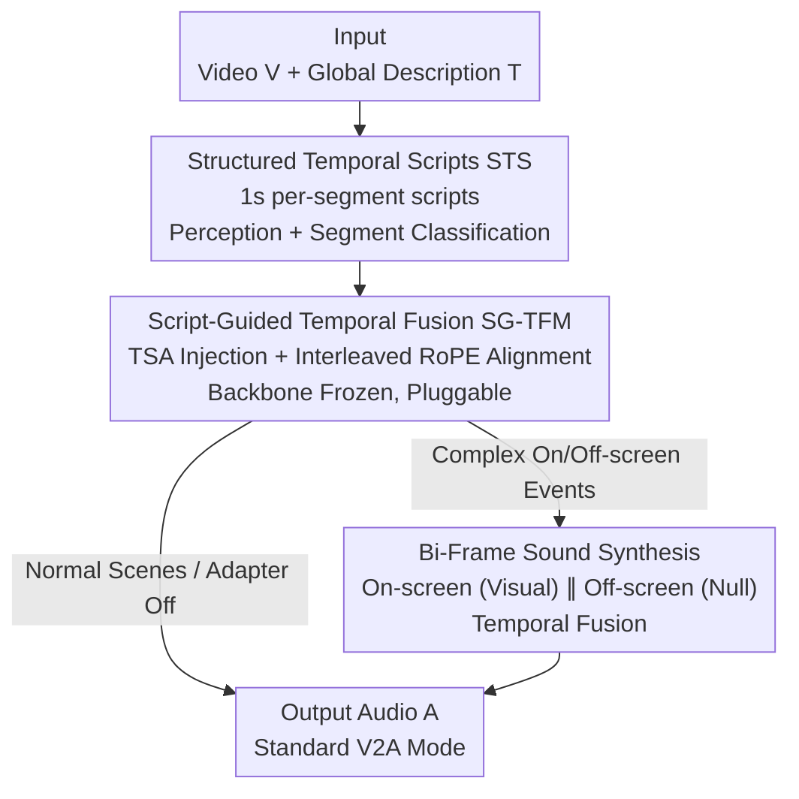

# FoleyDirector: Fine-Grained Temporal Steering for Video-to-Audio Generation via Structured Scripts

**Conference**: CVPR 2026  
**Paper**: [CVF Open Access](https://openaccess.thecvf.com/content/CVPR2026/html/Li_FoleyDirector_Fine-Grained_Temporal_Steering_for_Video-to-Audio_Generation_via_Structured_Scripts_CVPR_2026_paper.html)  
**Code**: To be confirmed  
**Area**: Video-to-Audio / Multimodal Generation  
**Keywords**: Video-to-Audio, Fine-grained temporal control, Structured temporal scripts, DiT adapter, On-screen/Off-screen sound

## TL;DR
FoleyDirector attaches a pluggable adapter to a pre-trained DiT-based V2A generator (MMAudio), utilizing "director's script"-style per-second Structured Temporal Scripts (STS) to supplement visual cues and realize precise temporal control over sound occurrence. By employing dual-stream parallel rendering for on-screen/off-screen sounds, it raises the control F1 score on DirectorBench from 0.2451 to 0.4819 with almost no degradation in original audio quality.

## Background & Motivation
**Background**: Modern Video-to-Audio (V2A) methods generally adopt DiT/flow-matching architectures (MMAudio, HunyuanVideo-Foley, ThinkSound, etc.), jointly modeling video, text, and Synchformer temporal features to generate high-fidelity audio synchronized with the visual frame.

**Limitations of Prior Work**: These models treat captions as **coarse-grained global semantic cues**, which leads to failure in three scenarios: ① Mixed on-screen/off-screen sounds in multi-event scenes, where models fail to capture the semantics and temporal relationships of each event; ② Insufficient visual cues—when sound sources are small, occluded, partially visible, or entirely off-screen—causing the model to lose track of **when** a sound should occur; ③ Lack of control interfaces for users wanting to act as a "Foley Director" (e.g., specifying a car horn at 5-6 seconds with silence elsewhere).

**Key Challenge**: V2A timing is almost entirely driven by visual cues, which are often **incomplete or ambiguous** in real videos. Relying solely on frames prevents the model from supplementing off-screen information or providing users with fine-grained temporal control.

**Goal**: To inject **additional temporal + semantic cues** into DiT-based V2A models without retraining the large backbone or sacrificing audio quality, allowing users to precisely specify "what sound occurs at which second" while maintaining the ability to switch back to standard V2A.

**Key Insight**: Borrowing from the MIGC approach in image generation—which decomposes complex global descriptions into local controls—since it is difficult for users to write precise timestamps or for models to parse complex event descriptions, the global caption is **decomposed into per-second short scripts**. Each script segment handles the semantics within its specific time window, functioning like a "Director's Storyboard."

**Core Idea**: Replace "single global caption" with "per-second structured temporal scripts + pluggable temporal attention adapter + dual-stream on/off-screen synthesis," returning temporal control to the user while freezing the backbone to preserve audio quality.

## Method

### Overall Architecture
FoleyDirector is built upon the pre-trained **MMAudio** generator. The pipeline consists of three steps: **(1) Script Extraction**—segmenting video/audio into 1-second intervals and using an annotation pipeline to generate Structured Temporal Scripts (STS) for each segment (e.g., "Sec 0: chopping, medium volume / Sec 1: speaking, loud..."); **(2) Script Fusion**—utilizing the Script-Guided Temporal Fusion Module (SG-TFM) adapter to inject STS features into the audio stream via Temporal Script Attention (TSA) with Interleaved RoPE for temporal alignment, while keeping the MMAudio backbone frozen; **(3) Dual-stream Rendering**—Bi-Frame Sound Synthesis duplicates audio latents into two parallel paths: one rendered with visual conditions for on-screen sound, and another with empty visual embeddings for off-screen sound, followed by temporal segment fusion. All three modules form a "script → injection → dual-stream" chain, where SG-TFM is pluggable—removing it reverts the model to standard V2A.

### Key Designs

**1. Structured Temporal Scripts (STS): Decomposing global captions into per-second "Director's Scripts"**

To address "coarse global captions" and the difficulty of "writing precise timestamps," the audio is split into **1-second segments**, each paired with a short text script describing events, loudness, and timbre. This reduces "global semantic control" to "segment-level control within short windows," retaining fine-grained timing without requiring manual timestamps. The annotation pipeline involves: ① **Perception and Recognition**, using Qwen-Omni 7B to generate content-aware captions and identify sound types; ② **Segment-level Classification**, modeling "whether a sound event falls within a 1s segment" as a **binary classification** problem, using MLLMs to judge each candidate event per segment and adding descriptions. The authors collected the DirectorSound training set and VGGSound-Director test set using this pipeline, **training only on V2A data without any T2A data**.

**2. Script-Guided Temporal Fusion Module (SG-TFM): Pluggable adapter for script injection**

The fusion of STS faces three challenges: extracting temporal script features (C1), fusing without damaging pre-trained generation (C2), and aligning scripts with audio (C3).

C1 (Features) — Following MMAudio's modality processing, each script segment uses a CLIP text encoder and pooling to obtain a compact "temporal-semantic" representation $\mathbf{F}_{tsr}^i = \mathrm{Pool}\big(\mathrm{CLIP}(\mathcal{T}_{tsr}^i)\big)$. Features are replicated $T$ times (matching video tokens) and concatenated into $\mathbf{F}_{tsr} = [\mathbf{F}_{tsr}^1, \dots, \mathbf{F}_{tsr}^N]$, with empty embeddings for segments without descriptions.

C2 (Fusion) — A key design is the **newly added independent Temporal Script Attention (TSA)**. The backbone's Joint Attention remains unchanged: $\mathbf{F}_a^{(l)}, \mathbf{F}_v^{(l)}, \mathbf{F}_t^{(l)} = \mathrm{JointAttn}(\cdot)$. Within each block, audio features are concatenated with script features for self-attention: $\mathbf{F}_{a'}^{(l)}, \mathbf{F}_{tsr}^{(l)} = \mathrm{TSA}(\mathbf{F}_a^{(l)}, \mathbf{F}_{tsr}^{(l-1)})$. Because it is an **independent attention layer**, dropping SG-TFM allows a seamless switch between standard V2A and script-controlled modes, preserving quality.

C3 (Alignment) — Inspired by HunyuanVideo-Foley, **Interleaved RoPE** is introduced. Script tokens are upsampled to audio resolution, and both are **interleaved** along the time axis: $\mathbf{F}_{int} = \mathrm{Interleave}(\mathbf{F}_a^{(l)}, \mathrm{Up}(\mathbf{F}_{tsr}^{(l-1)}))$. RoPE is applied to the interleaved sequence before de-interleaving. This ensures temporally adjacent audio and script features receive **similar positional indices**, enhancing alignment accuracy compared to simple concatenation.

**3. Bi-Frame Sound Synthesis: Dual-stream parallel for attribute disentanglement**

In scenarios with mixed on-screen/off-screen or counter-factual events, **visual cues often override text**, causing the model to ignore off-screen instructions. The authors observed that models trained only on V2A data **still retain script control capabilities** in T2A tasks. Thus, generation is split: on-screen sounds use full Video+Text+STS conditions $\mathbf{F}_{a,in}^{(l)} = \mathrm{Block}(\mathbf{F}_a^{(l-1)}, \mathbf{F}_v^{(l-1)}, \mathbf{F}_t^{(l-1)}, \mathbf{F}_{tsr}^{(l-1)})$; off-screen sounds replace visual input with a **learnable null visual embedding** $\mathbf{F}_v^{\varnothing}$, relying solely on Text+STS. The two streams are fused chronologically within SG-TFM: $\mathbf{F}_a^{(l)} = \mathrm{Fuse}(\mathbf{F}_{a,in}^{(l)}, \mathbf{F}_{a,out}^{(l)})$. This **decouples and renders** attributes independently, ensuring temporal coherence while significantly enhancing controllability.

### Loss & Training
Based on MMAudio-medium with **full model training**. Learning rate 2e-5, batch 16, cosine scheduler, 1.2M iterations on 8×40GB A800 GPUs (~3 days). During training, STS features are randomly dropped (10% probability) to support Classifier-free Guidance (CFG). Inference uses MMAudio's default 25 steps and CFG scale 4.5.

## Key Experimental Results

### Main Results

DirectorBench (Controllability, P/R/F1 after IoU matching; FD$_{VGG}$ lower is better):

| Method | Counter-factual F1↑ | Temporal F1↑ | Overall F1↑ | FD$_{VGG}$↓ |
|------|-----------|---------|---------|------------|
| MMAudio | 0.1825 | 0.2972 | 0.2378 | 8.55 |
| ThinkSound | 0.1208 | 0.2206 | 0.1707 | 7.17 |
| Video-Foley | 0.1976 | 0.2350 | 0.2163 | 8.03 |
| Hunyuan-Foley | 0.2331 | 0.2572 | 0.2451 | 7.51 |
| **Ours** | **0.5284** | **0.4354** | **0.4819** | **6.19** |

VGGSound-Director (Quality/Alignment, verifying "no quality loss with control"):

| Model | FD$_{VGG}$↓ | KL$_{PANN}$↓ | ISC$_{PANN}$↑ | IB↑ | DeSync↓ |
|------|------------|-------------|--------------|-----|---------|
| GT | 0.00 | 0.00 | 12.73 | 0.33 | 0.625 |
| MMAudio | 1.45 | 1.67 | 14.38 | 0.32 | 0.439 |
| Hunyuan-Foley | 2.39 | 2.03 | 12.74 | 0.31 | 0.543 |
| Ours (w/o STS) | 1.27 | 1.65 | 13.81 | 0.32 | 0.438 |
| **Ours** | **1.17** | **1.42** | **14.84** | **0.33** | **0.432** |

Overall F1 for controllability improved from 0.2451 to 0.4819. Simultaneously, audio quality metrics (FD$_{VGG}$, KL$_{PANN}$) improved, proving that **script control makes audio more realistic**. Performance without STS is on par with MMAudio, confirming seamless reversibility.

### Ablation Study

Component ablation on DirectorBench (Overall P/R/F1):

| ID | Configuration | Precision↑ | Recall↑ | F1↑ |
|----|------|-----------|---------|-----|
| ① | Base | 0.1448 | 0.1963 | 0.1311 |
| ② | + STS | 0.4102 | 0.5432 | 0.4252 |
| ③ | + Interleaved RoPE | 0.4209 | 0.5582 | 0.4389 |
| ④ | + Bi-Frame | 0.4677 | 0.5962 | **0.4819** |

STS Segment Length Trade-offs (Inference on 1s trained model):

| STS Length | Overall F1↑ |
|---------|---------|
| 1s | 0.4819 |
| 0.5s | **0.5197** |
| 2s | 0.4646 |

### Key Findings
- **STS is the primary source of controllability**: Adding STS alone nearly triples F1 (①→②). Interleaved RoPE and Bi-Frame provide further refinements (+0.014, +0.043).
- **Bi-Frame handles difficult scenarios**: In mixed on/off-screen subsets, Bi-Frame improves F1 from 0.4178 to 0.4613, mitigating visual dominance.
- **Segment Length Trade-off**: Shorter segments offer higher F1 (0.5s reaches 0.5197) but increase user workload and annotation error rates; 1s is the optimal balance.
- **Subjective Consistency**: A 30-person user study confirms FoleyDirector outperforms MMAudio and Hunyuan-Foley in quality, controllability, and alignment.

## Highlights & Insights
- **"Pluggable Adapter" paradigm**: Placing control signals in an independent TSA layer freezes the backbone, allowing the model to toggle between standard and script-controlled modes easily while preserving pre-trained quality.
- **Discretizing temporal control**: Transforming precise timestamps into "per-segment presence" (STS + binary classification) is a strategy transferable to video generation or temporal action control tasks.
- **Residual T2A capability**: Leveraging the finding that V2A-trained models retain script control even without visual cues allows the "Bi-Frame" module to decouple and render off-screen sounds independently.
- **Interleaved RoPE**: A lightweight yet effective cross-modal temporal alignment trick ensuring script and audio tokens share similar positional indices.

## Limitations & Future Work
- **Dependency on Annotation Quality**: STS relies on Qwen-Omni/MLLM; errors in segment classification or description propagate to control accuracy.
- **Fixed Segment Length**: The trade-off between controllability and user burden (1s vs 0.5s) remains a manual hyperparameter.
- **Control Precision Room**: While F1 0.4819 is a major lead, absolute "precise trigger" capability in complex multi-event scenes needs further improvement.
- **Off-screen Rendering**: Bi-Frame uses null visual embeddings; if on-screen and off-screen semantics are highly coupled, temporal fusion boundaries may become blurred.

## Related Work & Insights
- **vs MMAudio (Backbone)**: MMAudio uses joint attention for high-quality V2A but lacks temporal control; this work adds an SG-TFM adapter to provide per-second control without quality loss.
- **vs HunyuanVideo-Foley**: Both use large-scale DiT; this work adopts its RoPE alignment idea but transforms "passive sync" into "active steering" via user scripts.
- **vs Video-Foley**: Video-Foley uses RMS signals from video for control; this work uses text scripts to provide cues beyond the visual frame (handling off-screen/counter-factual sounds) with significantly higher F1.
- **vs ThinkSound**: ThinkSound focuses on semantic reasoning; this work focuses on fine-grained timeline control.

## Rating
- Novelty: ⭐⭐⭐⭐⭐ First to achieve per-segment fine-grained control in DiT-based V2A.
- Experimental Thoroughness: ⭐⭐⭐⭐ Benchmarked on DirectorBench/VGGSound-Director with extensive ablations; however, benchmarks are relatively small (100/2.2K samples).
- Writing Quality: ⭐⭐⭐ Clear logic and diagrams, though some minor typos exist in the text.
- Value: ⭐⭐⭐⭐⭐ High potential for foley production by providing a "Director" interface; adapter paradigm is highly reusable.

<!-- RELATED:START -->

<!-- RELATED:END -->

## Related Papers

- [\[ACL 2026\] SegTune: Structured and Fine-Grained Control for Song Generation](../../ACL2026/audio_speech/segtune_structured_and_fine-grained_control_for_song_generation.md)
- [\[CVPR 2026\] Hear What You See: Video-to-Audio Generation with Diffusion Transformer and Semantic-Temporal Alignment-Ranked Direct Preference Optimization](hear_what_you_see_video-to-audio_generation_with_diffusion_transformer_and_seman.md)
- [\[CVPR 2026\] EchoFoley: Event-Centric Hierarchical Control for Video Grounded Creative Sound Generation](echofoley_event-centric_hierarchical_control_for_video_grounded_creative_sound_g.md)
- [\[CVPR 2026\] Omni2Sound: Towards Unified Video-Text-to-Audio Generation](omni2sound_towards_unified_video-text-to-audio_generation.md)
- [\[CVPR 2026\] OmniSonic: Towards Universal and Holistic Audio Generation from Video and Text](omnisonic_towards_universal_and_holistic_audio_generation_from_video_and_text.md)

<!-- RELATED:END -->
