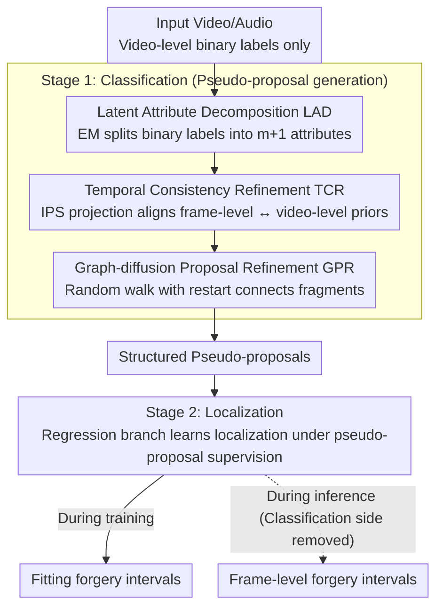

# GEM-TFL: Bridging Weak and Full Supervision for Forgery Localization

**Conference**: CVPR 2026  
**arXiv**: [2603.05095](https://arxiv.org/abs/2603.05095)  
**Code**: None  
**Area**: Speech/Audio  
**Keywords**: Temporal Forgery Localization, Weak Supervision, EM Algorithm, Graph Diffusion, Temporal Consistency

## TL;DR

GEM-TFL is proposed to bridge the gap between weak and full supervision through a two-stage classification-regression framework. It incorporates three modules: EM-based decomposition of binary labels into multi-dimensional latent attributes, training-free Temporal Consistency Refinement, and Graph-diffusion Proposal Refinement, achieving a 4-8% average mAP improvement in weakly supervised temporal forgery localization.

## Background & Motivation

Temporal Forgery Localization (TFL) aims to precisely locate manipulated segments in video/audio. Fully supervised methods require frame-level annotations, which are costly. Weakly supervised TFL (WS-TFL) uses only video-level binary labels for training but faces:

1. Mismatch between training objective (classification) and inference objective (localization).
2. Supervision signals from binary labels are too weak.
3. Top-k aggregation is non-differentiable, leading to gradient blocking.
4. Independent proposal generation results in fragmented regions.

## Method

### Overall Architecture

The **Key Challenge** GEM-TFL addresses is: weak supervision providing only video-level "true/false" binary labels while requiring frame-level forgery interval outputs at inference—training focuses on "classification," but testing focuses on "localization." The approach decomposes the entire pipeline into two stages: the first stage "amplifies" weak labels into reliable pseudo-proposals, and the second stage effectively learns localization capabilities through a regression branch.

The first stage is the classification stage: within a Multi-Instance Learning (MIL) framework, Latent Attribute Decomposition (LAD) first decomposes a single binary label into multi-dimensional forgery attributes to enhance supervision. Then, training-free Temporal Consistency Refinement (TCR) aligns frame-level predictions back to video-level priors using IPS projection. Finally, Graph-diffusion Proposal Refinement (GPR) connects fragmented candidate intervals into structured pseudo-proposals. The second stage is the localization stage: a regression branch learns to directly predict forgery intervals under the supervision of these pseudo-proposals. During inference, the entire classification-side module is removed, and only the regression branch is executed, completely eliminating the misalignment between training and inference objectives.

### Key Designs

**1. Latent Attribute Decomposition (LAD): Decomposing a binary label into multi-dimensional semantics to compensate for weak supervision information**

The most critical pain point of weak supervision is the thin supervision signal—a whole video only indicates "existence of forgery," making it difficult for the model to learn "which type of forgery and what it looks like" from a single bit. The **Key Insight** of LAD is the assumption that "forgery" is not a single category but a mixture of $m$ learnable latent attributes. Thus, the label space is expanded to $(m+1)$ dimensions: class 0 represents real, and $1\dots m$ represent $m$ forgery attributes. Since these attributes are latent variables without annotations, the paper uses EM to estimate them alternately. The E-step calculates the posterior $P(c\mid x,y;\theta^{(t)})$: real samples are strictly assigned to class 0, while forged samples are softly assigned to multiple attributes based on current model confidence. The M-step fixes this soft assignment and minimizes:

$$\mathcal{L}_{bin} + \lambda_1 \mathcal{L}_{nll} + \lambda_2 \mathcal{L}_{ent}$$

to update network parameters and uses EMA for sliding updates of attribute priors. Consequently, the original single-bit supervision is distributed across multi-dimensional attributes, forcing the model to distinguish between different forgery patterns and further "mining" semantics from weak labels.

**2. Temporal Consistency Refinement (TCR): Bypassing non-differentiable top-k aggregation via training-free projection**

In MIL, aggregating frame-level scores into video-level predictions usually relies on top-k, but top-k selection is a discrete operation where gradients cannot backpropagate, leaving frame-level predictions under-learned. TCR does not forcibly modify the aggregation method but formulates "frame-level attribute predictions must maintain consistency with video-level attribute priors" as an optimal transport alignment problem with constraints. It requires the row/column marginal distributions of the frame-level attribute matrix $S_t$ to approximate the video-level prior $q$, solved via Bregman projection based on KL divergence. The solver is Iterative Proportional Scaling (IPS), which alternately projects the current solution onto spaces satisfying "row constraints" and "column constraints" until convergence. Its **Novelty** lies in being a training-free post-processing method: it introduces no new parameters and does not participate in backpropagation, thus avoiding the gradient blocking issues of top-k while pulling frame-level predictions back to a state consistent with global statistics.

**3. Graph-diffusion Proposal Refinement (GPR): Connecting fragments into complete intervals by allowing adjacent proposals to cross-verify**

Independent scoring of each proposal often cuts continuous manipulation into isolated short segments, and prior methods frequently relied on hand-crafted "outer regions" (like OIC score rules) for noise suppression, introducing human bias. GPR constructs an undirected graph $G=(V,E)$ among proposals: nodes are candidate proposals, and edge weights merge temporal proximity (DIoU) and semantic similarity. Thus, proposals close in time and similar in content are linked. Confidence then diffuses across the graph—essentially a Random Walk with Restart:

$$\omega^{(t+1)} = \beta \mathcal{T} \omega^{(t)} + (1-\beta) \omega^{(0)}$$

where $\mathcal{T}$ is the graph transition matrix, $\omega^{(0)}$ is the initial confidence, and $\beta$ controls the ratio of "borrowing information from neighbors" versus "preserving self." This iteration has a closed-form solution:

$$\omega^* = (1-\beta)(I - \beta\mathcal{T})^{-1}\omega^{(0)}$$

which calculates the converged confidence in one step. Effectively, high-confidence proposals "infect" adjacent weak proposals via the graph, while isolated false positives are suppressed due to lack of neighbor support. Fragmented candidates are finally integrated into coherent, reliable pseudo-proposals, replacing hard-coded rules and reducing human priors.

### Loss & Training

The regression branch in the localization stage is supervised by both video-level classification and pseudo-proposals:

$$\mathcal{L} = \mathcal{L}_{bce}(\hat{y},y) + \gamma \cdot \mathcal{L}_{main}(\hat{\mathcal{P}}, \mathcal{P})$$

where $\mathcal{L}_{main}$ is the fitting term for regression predictions $\hat{\mathcal{P}}$ against pseudo-proposals $\mathcal{P}$. The weight $\gamma$ grows linearly from 0.5 to 1.0; since pseudo-proposals are unreliable in early training, the model trusts them less initially and gradually increases the localization supervision weight as the classification side stabilizes.

## Key Experimental Results

### LAV-DF Dataset

| Method | Supervision | Avg. mAP |
|------|------|----------|
| UMMAFormer | Full | 96.8 |
| MFMS | Full | 97.3 |
| MDP | Weak | 60.0 |
| WMMT | Weak | 73.3 |
| **Ours** | Weak | **77.6** |

### AV-Deepfake1M Dataset

| Method | Supervision | Avg. mAP |
|------|------|----------|
| **Ours** vs Prev. SOTAs | Weak | +8% Gain |

### Key Findings

- The two-stage design effectively bridges the training-inference gap.
- EM decomposition strengthens the supervision signal of binary labels.
- The training-free nature of TCR avoids gradient blocking.

## Highlights & Insights

1. EM decomposes binary labels into multi-dimensional attributes—cleverly mining richer semantics from weak supervision.
2. Graph diffusion replaces hard-coded outer region settings like OIC scores, reducing human bias.
3. The training-free nature of TCR—post-processing level refinement does not increase training overhead.

## Limitations & Future Work

1. A gap of approximately 20% mAP remains compared to fully supervised methods.
2. The number of latent attributes $m$ requires manual setting.
3. Hyperparameters such as $\beta$ in graph diffusion require tuning.

## Related Work & Insights

- Compared to PseudoFormer: Added EM attribute decomposition and graph diffusion to improve pseudo-proposal quality.
- The concept of EM latent attribute decomposition can be transferred to other weakly supervised tasks.

## Rating

- Novelty: ⭐⭐⭐⭐ Combination of EM decomposition, graph diffusion, and TCR is innovative.
- Experimental Thoroughness: ⭐⭐⭐⭐ Comprehensive comparison across two datasets.
- Writing Quality: ⭐⭐⭐⭐ Framework diagrams are clear.
- Value: ⭐⭐⭐⭐ Addressing the weak/full supervision gap is a significant direction.

<!-- RELATED:START -->

## Related Papers

- [\[AAAI 2026\] DeformTrace: A Deformable State Space Model with Relay Tokens for Temporal Forgery Localization](../../AAAI2026/audio_speech/deformtrace_a_deformable_state_space_model_with_relay_tokens_for_temporal_forger.md)
- [\[CVPR 2026\] Unlocking Strong Supervision: A Data-Centric Study of General-Purpose Audio Pre-Training Methods](unlocking_strong_supervision_a_data-centric_study_of_general-purpose_audio_pre-t.md)
- [\[CVPR 2026\] How Far Can We Go With Synthetic Data for Audio-Visual Sound Source Localization?](how_far_can_we_go_with_synthetic_data_for_audio-visual_sound_source_localization.md)
- [\[AAAI 2026\] Listening Between the Frames: Bridging Temporal Gaps in Large Audio-Language Models](../../AAAI2026/audio_speech/listening_between_the_frames_bridging_temporal_gaps_in_large_audio-language_mode.md)
- [\[ICML 2026\] MoshiRAG: Asynchronous Knowledge Retrieval for Full-Duplex Speech Language Models](../../ICML2026/audio_speech/moshirag_asynchronous_knowledge_retrieval_for_full-duplex_speech_language_models.md)

<!-- RELATED:END -->
