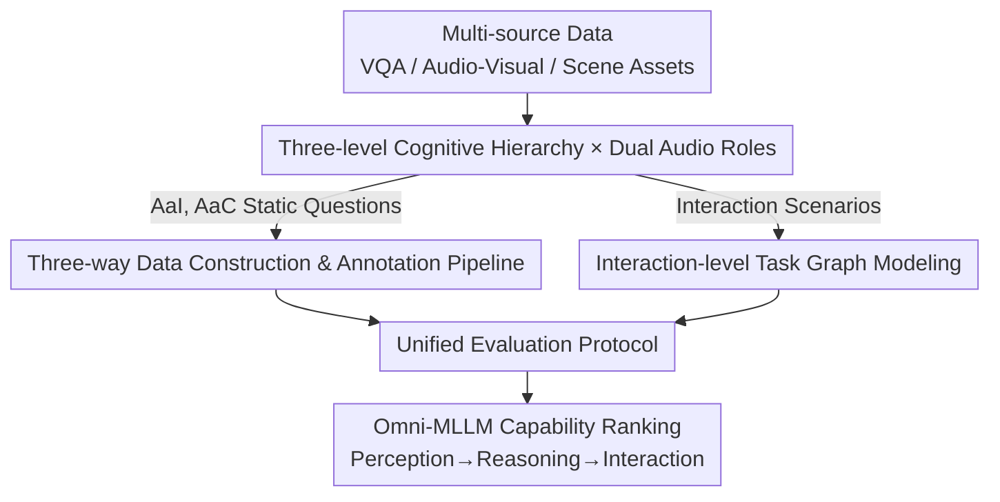

# HAVE-Bench: Hierarchical Audio-Visual Evaluation from Perception to Interaction

**Conference**: CVPR 2026  
**Paper**: [CVF Open Access](https://openaccess.thecvf.com/content/CVPR2026/html/Zhong_HAVE-Bench_Hierarchical_Audio-Visual_Evaluation_from_Perception_to_Interaction_CVPR_2026_paper.html)  
**Code**: Not public (The paper states a unified evaluation toolkit will be released, but no link is provided in the text. ⚠️ Subject to the original text.)  
**Area**: Multimodal VLM / Audio-Visual Benchmark  
**Keywords**: Audio-visual benchmark, cognitive hierarchy, speech instruction, multi-turn interaction, Omni-MLLM  

## TL;DR
HAVE-Bench constructs a 2451-item audio-visual evaluation benchmark using a "Perception-Reasoning-Interaction" three-level cognitive hierarchy paired with "Audio-as-Instruction (AaI)/Audio-as-Context (AaC)" dual roles. It is the first to model multi-turn, memory-dependent interaction tasks as task graphs to evaluate Omni-MLLMs. Results indicate a performance cliff for both open-source and closed-source models at the reasoning and interaction levels, and demonstrate that speech-based visual querying performs significantly worse than text-based querying.

## Background & Motivation
**Background**: MLLMs are expanding from "Vision-Language" to "Vision-Language-Audio" tri-modality (e.g., Qwen2.5-Omni, Gemini2.5-Flash, MiniCPM-o) and are moving toward more realistic settings such as multi-turn dialogue, long-context memory, and interactive multi-step reasoning.

**Limitations of Prior Work**: Existing audio-visual benchmarks have not kept pace with model evolution. AVQA and MUSIC-AVQA are limited to natural environmental sounds or music. Benchmarks like OmniBench, AV-Odyssey, and AVHBench focus only on specific aspects (audio attributes, adversarial robustness, or cross-modal hallucination) and lack support for memory-dependent multi-turn interaction.

**Key Challenge**: The authors categorize the gaps in existing benchmarks into three bottlenecks: (i) **Lack of interaction-level evaluation**: Audio is mostly treated as passive background rather than a driver for visual reasoning or action, and high-value "multi-turn, memory-dependent" capabilities are rarely tested. (ii) **Lack of hierarchical evaluation**: Tasks are fragmented, lacking a structured ladder from low-level perception to high-level reasoning and action, making it impossible to examine a model's ability to integrate multimodal cues under increasing cognitive complexity. (iii) **Insufficient acoustic/contextual complexity**: Most benchmarks use short and simple audio clips, failing to reflect real-world scenarios with mixed sound sources, long-form speech, or overlapping events.

**Goal**: To create a unified benchmark that satisfies three criteria—"hierarchical + interaction-oriented + high-quality acoustics"—covering the complete cognitive continuum from perception to goal-oriented, memory-dependent interaction.

**Key Insight**: The evaluation is expanded along two orthogonal axes: **Cognitive Hierarchy** (Perception/Reasoning/Interaction) and **Audio Role** (Instruction/Context). Furthermore, interaction tasks are represented as **Task Graphs** for the first time, using a fixed LLM judge to determine the success of each state transition.

## Method

### Overall Architecture
HAVE-Bench is essentially a "taxonomy + data pipeline + evaluation protocol." It organizes tasks along two orthogonal axes: (1) Three cognitive levels—Perception (1172 items), Reasoning (1016 items), and Interaction (263 items), totaling 2451 items; (2) Audio roles—Audio-as-Instruction (AaI), where speech itself is the query to be executed on the image, and Audio-as-Context (AaC), where audio serves as background information (environmental sounds, voices, music) that must be fused with vision to answer. The intersection of these axes yields 11 subtasks (e.g., Instructed Recognition, Text-Rich QA, Cross-modal Matching, Math, Discourse, Navigation, Puzzle, Music Reproduction).

Data follows three customized pipelines (AaI / AaC / Interaction) through preprocessing, annotation, and human verification. Interaction tasks are additionally modeled as multi-turn task graphs. Finally, all tasks enter a unified evaluation framework using accuracy, LLM judgment, or path determination to score models across the three levels.

### Key Designs

**1. Three-level Hierarchy × Dual Audio Roles: Building a Structured Ladder**
To address the "fragmented evaluation" issue, the authors define the taxonomy along two orthogonal axes. The **Cognitive Hierarchy** follows increasing difficulty: Perception tasks are single-turn, single-hop with short audio to test fine-grained alignment; Reasoning tasks are single-turn but require multi-hop integration of temporal/causal/knowledge cues with longer, multi-source audio; Interaction tasks extend to multi-turn, goal-oriented scenarios, specifically keeping step-wise visual/auditory difficulty comparable to lower levels to isolate performance to cross-turn planning and memory. The **Audio Role** distinguishes function: In AaI, input is $(I, A_{instr}) \rightarrow y$, where speech is the explicit instruction; in AaC, input is $(I, A_{ctx}, q) \rightarrow y$, where audio is background context. This dual-axis design allows for systematic comparison of the same basic skill across different cognitive complexities and audio roles.

**2. Interaction-level Task Graph Modeling: Converting Multi-turn Interaction into Deterministic State Machines**
This is the most innovative part of the work. Each interaction task is modeled as a multi-turn task graph $G = (V, E)$. A node $v_i$ is a discrete state with an observation $o_i = (I_i, A_i)$. Each edge is a triplet $e_{ij} = (v_i, v_j, c_{ij})$, where $c_{ij}$ is a natural language success criterion describing "when to accept the transition from $v_i$ to $v_j$." Given the current observation $o_i$ and the model's free-text response $\hat{a}_t$, a transition is valid if a fixed LLM judge $J_\theta(c_{ij}, \hat{a}_t, o_i) = 1$. The model starts at $v_{start}$, and the instance is successful only if the judged transitions form a path to $v_{goal}$. Ours instantiates three scenarios: **Audio Navigation** (map to street view, voice for route instructions), **Rule Puzzles** (UI states of Menu→Learn→Solve, voice for rules), and **Music Reproduction** (parameterized states for melody/rhythm/tempo, matching a target audio). This modeling decomposes long-range interaction into observable states with interpretable local criteria.

**3. Three-way Data Construction Pipeline: Ensuring Acoustic Quality and "Bi-modal Dependency"**
Three categories of data utilize customized workflows. **AaI (~1.4k)**: Samples from TextVQA, ChartQA, and Math VQA are converted to spoken instructions. Items exceeding 1 minute or relying on complex code/tables are filtered. GPT-4o rewrites questions into spoken-friendly prompts, which are then downsampled based on logic/clarity scores and synthesized via Azure TTS. 400 items were recorded by professional voice actors and manually verified. **AaC**: Merges AudioSet, Music-AVQA, and others, using MLLMs for alignment. Five keyframes are sampled per video and matched with audio. Low SNR segments are filtered, and a semantic alignment check is performed (9% retention). Cross-modal Matching utilizes full manual annotation with targeted distractors. A core rule for AaC is **Bi-modal Dependency**: every question must require both audio and vision to solve, preventing single-modality "shortcuts."

**4. Unified Evaluation Protocol: Fair and Reproducible Scoring**
To ensure fair comparison across benchmarks, ours uses a unified framework. Multiple-choice questions use an LLM matcher for free-text responses. Open-ended questions (Reasoning, Audio-grounded QA) are compared against reference answers by an LLM judge using customized prompts and in-context examples. Interaction tasks are scored using the task graph judge. The protocol uses VLMEvalKit as a base, ensuring all models use the same prompts and averaging results across three runs.

## Key Experimental Results

### Main Results: Ranking Across All Subtasks
Evaluation covers open-source Omni-LLMs (Ola, VITA-1.5, Megrez-3B, MiniCPM-o, Ming-Lite, Qwen2.5-Omni) and commercial Gemini2.5-Flash. Summary of scores (from Table 1):

| Hierarchy | Gemini2.5-Flash | Qwen2.5-Omni | Ming-Lite-Omni | MiniCPM-o | Ola | VITA-1.5 | Megrez-3B |
|-----------|-----------------|--------------|----------------|-----------|-----|----------|-----------|
| L1 Perception | 68.9 | 68.4 | 61.1 | 57.6 | 62.0 | 54.2 | 51.0 |
| L2 Reasoning | 60.8 | 52.6 | 46.9 | 44.7 | 45.3 | 41.7 | 31.2 |
| L3 Interaction| **30.4** | 18.0 | 11.6 | 13.8 | –* | 7.1  | 3.8  |

\* Ola cannot perform "Multi-turn Graph + Audio" dialogue.

- The strongest closed-source is Gemini2.5-Flash, and the strongest open-source is Qwen2.5-Omni.
- **The gap between open and closed source widens as the hierarchy level increases**: The lead for Gemini over Qwen grows from ~0.5 at L1 to ~8.2 at L2 and ~12.4 at L3.
- All models show a consistent decline from Perception to Interaction; **no model exceeds 40%** at the Interaction level.

### Key Findings
- **Perception Level**: Differences are small; Qwen2.5-Omni even outperforms Gemini in Instructed Recognition. However, open-source models struggle with Audio-grounded VQA (localizing sound sources).
- **Reasoning Level**: The largest gap is in Multi-disciplinary Reasoning (AaI) and Discourse Reasoning (AaC, involving long speech + slides).
- **Interaction Level**: Failures are attributed to cross-turn issues rather than step-wise capability. Models frequently "forget" the target map or reference music in multi-turn sequences. Puzzle tasks reveal planning flaws, where models often skip the "learning" stage.

### Ablation Study: Speech vs. Text Querying (Table 2)
Comparing Speech Instruction (SI) with equivalent Text Instruction (TI) and an ASR+Model baseline:

| Model | Mode | Rec. | Text-Rich | Math | M-Disc. | Avg. |
|-------|------|------|-----------|------|---------|------|
| Gemini2.5-Flash | SI | 78.5 | 89.5 | 46.0 | 71.0 | 71.3 |
| Gemini2.5-Flash | TI | 80.7 | 88.8 | 49.0 | 74.1 | **73.2** |
| Ming-Lite-Omni | SI | 81.3 | 86.0 | 45.4 | 50.0 | 65.7 |
| Ming-Lite-Omni | TI | 86.7 | 88.6 | 49.0 | 61.0 | **71.3** |

- **TI consistently outperforms SI**, with the gap being largest in reasoning tasks (Math, M-Disc.).
- **ASR+TI performs nearly as well as TI**, indicating that the SI deficit is not due to information loss during speech synthesis but because **models fail to transfer text-image reasoning capabilities to joint audio-image reasoning**.

## Highlights & Insights
- **Task Graph Formalization**: Modeling multi-turn interaction as a graph with a fixed LLM judge is a significant contribution. it isolates "cross-turn memory/planning" as a specific failure mode that can be automatically and reproducibly evaluated.
- **"Easy Step, Hard Turn" Comparison**: By keeping step-wise difficulty low, Ours proves that interaction failures stem from memory hurdles rather than single-turn multimodal perception.
- **Bi-modal Dependency Rule**: Ensuring every question requires both modalities is a practical strategy to prevent models from exploiting single-modality shortcuts in audio-visual benchmarks.

## Limitations & Future Work
- **Heavy Reliance on LLM Judge**: The scores for multiple-choice matching, open-ended answers, and interaction transitions depend on a GPT-4o class model, which might introduce bias or inconsistency.
- **Small Interaction Sample Size**: Only 263 items across three scenarios exist for the Interaction level, which is relatively small compared to the Perception/Reasoning levels.
- **Restricted Asset Availability**: Navigation images are not released directly due to licensing (only IDs and coordinates), raising the barrier for reproduction.
- **Limited Closed-source Coverage**: Only Gemini was tested on the commercial side, providing an incomplete comparison of proprietary models.

## Related Work & Insights
- **Comparison with AVQA / MUSIC-AVQA**: While earlier works focus on environmental sound or music, HAVE-Bench spans real-world scenarios and introduces speech instructions and a cognitive hierarchy.
- **Comparison with OmniBench / AV-Odyssey**: These focus on single dimensions (perception gap, hallucinations); HAVE-Bench integrates them into a holistic taxonomy and adds the missing interaction-level evaluation.
- **Insight**: As model capability shifts from single-turn static tasks to multi-turn interactions, benchmarks must evolve from "static question banks" to "state-aware task graphs." This paradigm is potentially transferable to Embodied or GUI agent evaluation.

## Rating
- Novelty: ⭐⭐⭐⭐⭐ 
- Experimental Thoroughness: ⭐⭐⭐⭐ 
- Writing Quality: ⭐⭐⭐⭐⭐ 
- Value: ⭐⭐⭐⭐⭐ 

<!-- RELATED:START -->

## Related Papers

- [\[ACL 2026\] Full-Duplex-Bench-v2: A Multi-Turn Evaluation Framework for Duplex Dialogue Systems with an Automated Examiner](../../ACL2026/audio_speech/full-duplex-bench-v2_a_multi-turn_evaluation_framework_for_duplex_dialogue_syste.md)
- [\[CVPR 2026\] EgoAVU: Egocentric Audio-Visual Understanding](egoavu_egocentric_audio-visual_understanding.md)
- [\[ICLR 2026\] Query-Guided Spatial-Temporal-Frequency Interaction for Music Audio-Visual Question Answering](../../ICLR2026/audio_speech/query-guided_spatial-temporal-frequency_interaction_for_music_audio-visual_quest.md)
- [\[CVPR 2026\] Pushing the Frontier of Audiovisual Perception with Large-Scale Multimodal Correspondence Learning](pushing_the_frontier_of_audiovisual_perception_with_large-scale_multimodal_corre.md)
- [\[CVPR 2026\] EchoFoley: Event-Centric Hierarchical Control for Video Grounded Creative Sound Generation](echofoley_event-centric_hierarchical_control_for_video_grounded_creative_sound_g.md)

<!-- RELATED:END -->
