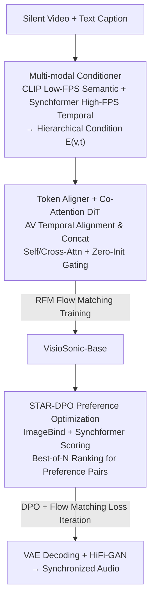

# Hear What You See: Video-to-Audio Generation with Diffusion Transformer and Semantic-Temporal Alignment-Ranked Direct Preference Optimization

**Conference**: CVPR 2026  
**Paper**: [CVF Open Access](https://openaccess.thecvf.com/content/CVPR2026/html/Wang_Hear_What_You_See_Video-to-Audio_Generation_with_Diffusion_Transformer_and_CVPR_2026_paper.html)  
**Code**: [Project Page VisioSonic](https://kaiw7.github.io/VisioSonic/)  
**Area**: Video-to-Audio Generation / Diffusion Models / Multi-modal Alignment  
**Keywords**: Video-to-Audio Generation, Diffusion Transformer, Rectified Flow Matching, Direct Preference Optimization (DPO), Temporal Alignment  

## TL;DR
VisioSonic utilizes a dual-stream condition of "CLIP low-frame-rate semantics + Synchformer high-frame-rate temporal" fed into a video-text-audio co-attention Diffusion Transformer for rectified flow matching to generate dubbing for silent videos. It further maximizes semantic and temporal alignment using STAR-DPO, a fully automated preference optimization requiring no human annotation. With only 151M trainable parameters (the fewest among similar works), it achieves the strongest distribution matching and audio-visual synchronization on VGGSound.

## Background & Motivation
**Background**: Video-to-audio (V2A) generation aims to synthesize sound for a silent video that is both "semantically corresponding" (e.g., a dog appearing should trigger a bark) and "temporally aligned" (e.g., the sound of a drum should occur at the frame the drumstick hits). There are two main approaches: 1) training diffusion models from scratch on large-scale audio-video pairs, or 2) converting video features into text/linguistic embeddings to condition a pre-trained text-to-audio (T2A) model.

**Limitations of Prior Work**: The first approach often uses datasets like VGGSound, which include off-screen sounds (e.g., background music) and have weak audio-visual synchronization, forcing subsequent works (e.g., MMAudio) to incorporate massive amounts of high-quality text-audio data, leading to skyrocketing compute costs and billion-level parameter counts. The second approach "translates" video into text to drive T2A, which naturally suffers from semantic loss and inaccurate descriptions, making fine-grained synchronization difficult.

**Key Challenge**: Capturing fine-grained temporal correspondence is difficult. Semantic encoders like CLIP operate at low frame rates (4~8 fps), which are sufficient to recognize "this is a dog" but unable to pinpoint which frame the "bark" should occur. Precise frame-level audio-visual synchronization is required. The root cause of poor synchronization is that semantic and temporal signals are blurred together by the same low-frame-rate visual backbone. Furthermore, supervised training (flow matching regression on ground-truth velocity fields) only learns "average resemblance" and does not directly optimize for "alignment," which is the true goal for human perception.

**Goal**: (1) To achieve strong semantic alignment and powerful temporal synchronization simultaneously without stacking data or parameters; (2) To find a mechanism beyond supervised training that does not rely on manual preference annotation to push alignment quality further.

**Key Insight**: The author makes two observations. First, audio and video are naturally synchronized on the time axis; their latents should be explicitly aligned in the temporal dimension and share an attention mechanism, rather than flattening the three modalities for shared self-attention as in MMDiT, which ignores the inherent temporal correlation. Second, pre-trained audio-visual joint embedding models like ImageBind and Synchformer are ready-made "alignment scorers" that can serve as reward models to automatically generate preference data.

**Core Idea**: Use a "dual-frame-rate multi-modal conditioner + Co-attention DiT" to integrate alignment into the generation backbone, and then use STAR-DPO (Direct Preference Optimization), which ranks based on joint semantic and temporal scores, to push alignment beyond supervision.

## Method

### Overall Architecture
VisioSonic takes a silent video and a text caption as input and outputs an audio waveform that is semantically consistent and temporally synchronized with the visual content. The pipeline consists of two stages: **first, training a flow-matching diffusion base (VisioSonic-Base)**, followed by **fine-tuning with STAR-DPO preference optimization**.

Generation occurs in the compressed latent space of the audio: the waveform is first converted into a mel-spectrogram $A \in \mathbb{R}^{T\times F}$ via STFT, then encoded into a latent $z_a \in \mathbb{R}^{N\times D}$ by a pre-trained VAE. During inference, the predicted latent is decoded back to a spectrogram and then passed through a HiFi-GAN vocoder to restore the waveform. Diffusion modeling uses **Rectified Flow Matching (RFM)**: a straight line $a_t = t a_1 + (1-t)a_0$ is drawn between noise $a_0\sim\mathcal{N}(0,I)$ and ground-truth audio $a_1$. The model learns to predict the velocity field $v_t = a_1 - a_0$ with the objective:

$$\mathcal{L}_{\text{RFM}} = \mathbb{E}_{t,\,p_0(a_0),\,p_1(a_1)}\big\| v_\theta(t, a_t, C) - (a_1 - a_0) \big\|_2^2$$

where the condition $C$ includes video and text. During inference, starting from noise, the learned velocity field is integrated via an ODE solver (Euler, 25 steps) to obtain the audio.

The backbone consists of two components: the **Multi-modal Conditioner** encodes video and text into semantic and temporal guidance paths; the **Co-attention DiT** (16 blocks) efficiently fuses the aligned audio-visual tokens with text tokens during the denoising process. In the second stage, STAR-DPO uses ImageBind and Synchformer as rewards to rank multiple candidate audios generated by the base model to create preference pairs for DPO fine-tuning.

### Key Designs

**1. Multi-modal Conditioner: Decoupling "Semantics" and "Temporal" via Dual Frame Rates**

To address the issue where low-frame-rate visual backbones fail to capture frame-by-frame synchronization, the conditioner extracts two complementary representations. **Low-frame-rate semantic path**: The CLIP visual backbone (8 fps) encodes frames $V\in\mathbb{R}^{T\times 3\times H\times W}$ into $E_v\in\mathbb{R}^{T\times D}$, aligned with the CLIP text path $E_t$, ensuring the model recognizes objects and remains consistent with the text. **High-frame-rate temporal path**: The Synchformer vision encoder (24 fps) extracts $E_v^{\text{hfr}}\in\mathbb{R}^{N\times D}$, with its frame count $N$ aligned with the audio latent, specifically providing frame-level motion-sound synchronization cues. Finally, the global video embedding $E_v^g$ and global text embedding $E_t^g$ are summed and passed through an MLP to obtain the semantic condition $E_{v,t}^g$, which is then added to the timestep embedding $E_{\text{time}}$ and high-frame-rate visual $E_v^{\text{hfr}}$ to produce the hierarchical condition $E_{v,t}$. Supplying semantic and temporal signals via encoders of different frame rates is key to achieving both types of alignment without excessive data—relying on CLIP for semantics and Synchformer for synchronization.

**2. Token Aligner + Co-attention DiT: Aligning AV on the Time Axis before Shared Attention**

To address the issue in MMDiT where "flattening three modalities for shared self-attention" ignores inherent audio-visual temporal correlations, the authors advocate that video and audio should be temporally aligned first before jointly performing semantic alignment with text. Since video frame rates are much lower than the temporal resolution of audio mel-spectrograms ($N\gg T$), the **Token Aligner** first interpolates the video embedding along the time axis to match the length of the noisy audio latent $E_v'\in\mathbb{R}^{N\times D}$. Two projection layers then reduce the audio and video latents to half channels each, concatenating them along the channel dimension into aligned AV tokens. In the **Co-attention block**, the aligned AV tokens are projected into $I^{av}_q,I^{av}_k,I^{av}_v$, and text into $I^t_v,I^t_k$. $I^{av}_q,I^{av}_k$ pass through LN + 2D RoPE for **self-attention** (AV internal interaction), followed by **cross-attention** using AV queries and text key/values to inject text semantics. The cross-attention output passes through a **zero-init gate** to dynamically control the strength of text injection. The condition $E_{v,t}$ modulates the block's input/output via scale/gate. Compared to the "one-pot" approach of MMDiT, this "AV alignment first, text injection second" structure improves synchronization while saving compute.

**3. STAR-DPO: Automated Preference Data Generation using Existing Alignment Models**

Since supervised flow matching only learns "resemblance" and not "alignment," and manual preference annotation is expensive, STAR-DPO is the first automated preference framework to introduce DPO for rectified flow in V2A. It uses two pre-trained models as **reward models**: ImageBind calculates the cosine similarity between audio-video embeddings to measure **semantic alignment**, and Synchformer calculates similarity along the time dimension to measure **temporal alignment**. A weighted sum forms the final reward. **Mechanism**: From an unseen validation set, video-text pairs are sampled. The base model $\theta_0$ generates $N$ ($N=5$ in implementation) candidate audios per prompt, ranked by the joint score. The highest score becomes the winner $a_i^w$ and the lowest the loser $a_i^l$, forming the preference set $D=\{(a_i^w, a_i^l, v_i, y_i)\}$. The **optimization objective** adds a flow-matching loss $\mathcal{L}_{\text{RFM}}$ to the standard DPO to prevent over-optimization:

$$\mathcal{L}_{\text{final}} = -\mathbb{E}\,\log\sigma\!\Big(\!-\beta\big[(L_w - L_w^{\text{ref}}) - (L_l - L_l^{\text{ref}})\big]\Big) + \mathcal{L}_{\text{RFM}}$$

where $L_w, L_l$ are the flow-matching regression errors of the current model, and $L_w^{\text{ref}}, L_l^{\text{ref}}$ are those of the reference model. This process can be iterated. The brilliance lies in outsourcing the subjective goal of "alignment" to pre-trained models already expert at judging it, achieving synchronization improvements with zero human labeling.

### Loss & Training
The base model is trained with AdamW for 300k steps, with a learning rate of 1e-4 followed by a linear warmup and piecewise decay to 1e-6. During training, visual and text tokens are masked with a 10% probability for classifier-free guidance. At inference, the guidance scale is 4.5. The STAR-DPO stage involves fine-tuning for 5k steps with a constant learning rate of 2e-6 after warmup. Audio-visual features are pre-extracted and cached to save training overhead.

## Key Experimental Results

### Main Results
Comparison with SOTA on the VGGSound test set (↓ lower is better, IS/IB↑ higher is better; DeSync is the synchronization offset in seconds predicted by Synchformer):

| Method | Params | FD_PaSST↓ | KL_PaSST↓ | IS↑ | IB-score↑ | DeSync↓ |
|------|-----------|-----------|-----------|-----|-----------|---------|
| MMAudio-S (44.1kHz) | 157M | 65.25 | 1.44 | 18.02 | 32.27 | 0.444 |
| MMAudio-L (44.1kHz) | 1.03B | 60.60 | 1.40 | 17.40 | 33.22 | 0.442 |
| HunyuanVideoFoley | - | 145.22 | - | 16.14 | **36.0** | 0.53 |
| **Ours (Base)** | **151M** | 58.27 | 1.30 | 18.12 | 32.8 | 0.45 |
| **Ours (STAR-DPO)** | **151M** | **55.48** | **1.29** | **18.41** | 33.1 | **0.41** |

VisioSonic achieves the best distribution matching metrics (FD_PaSST, KL_PaSST, etc.) with the fewest parameters (151M). While MMAudio-L and HunyuanVideoFoley perform better on some metrics, they rely on significantly larger models (1B range) and supplemental training data. STAR-DPO further improves the base model across all metrics.

Zero-shot cross-domain results (MovieGen-Audio / Kling-Audio Bench, trained only on VGGSound):

| Method | MovieGen IB↑ | MovieGen DeSync↓ | Kling IB↑ | Kling DeSync↓ |
|------|--------------|------------------|-----------|----------------|
| MMAudio | 0.27 | 0.80 | 0.30 | 0.56 |
| HunyuanVideoFoley | **0.35** | 0.74 | **0.38** | 0.54 |
| **Ours** | 0.27 | **0.72** | 0.32 | **0.50** |

Even when trained only on VGGSound, it achieves the best DeSync on two out-of-domain benchmarks, showing strong temporal generalization. IB is slightly lower than HunyuanVideoFoley, which used IB-filtered data.

### Ablation Study

Modality Fusion (VGGSound test set, proposed is T+AV, Co-attn):

| Config | FD_PaSST↓ | IS↑ | IB↑ | DeSync↓ | Description |
|------|-----------|-----|-----|---------|-------------|
| T+V+A, Co-attn | 59.71 | 15.70 | 31.0 | 0.47 | Three modalities fully separate; weakest semantic alignment |
| TV+A, Co-attn | 59.74 | 15.74 | 32.1 | 0.48 | Text-video combined first; worst temporal alignment |
| T+AV, Flux-like | 66.76 | 16.04 | 31.6 | 0.46 | Interaction weaker than co-attention |
| Label+AV, Co-attn | 62.72 | 16.48 | 32.6 | 0.48 | Using class labels instead of captions; significant decline |
| T+AV, MMDiT | 60.14 | 18.10 | 32.7 | 0.47 | Replaced with MM-DiT block; worse distribution similarity |
| **T+AV, Co-attn (Ours)** | **58.27** | **18.12** | **32.8** | **0.45** | Full model |

Reward Model / DPO Iteration Ablation:

| Config | FD_PaSST↓ | IB↑ | DeSync↓ | Description |
|------|-----------|-----|---------|-------------|
| CAVP (Semantic only) | 57.75 | 32.7 | 0.43 | Semantic reward weaker than IB-AV |
| AV-Align (Temporal only) | 55.99 | 31.7 | 0.44 | Temporal reward weaker than DeSync |
| IB-AV + DeSync (Ours) | **55.48** | **33.1** | **0.41** | Semantic + Temporal joint reward is best |
| DPO Iter 2 (Ours) | 55.48 | 33.1 | 0.41 | Step 2 is optimal; decline thereafter (over-optimization) |

### Key Findings
- **AV alignment before text injection is key for synchronization**: T+V+A (separate) has the weakest semantics, while TV+A (text-video first) has the worst temporal alignment, validating the "AV alignment first, text injection second" architecture.
- **Descriptive captions outperform class labels**: Label+AV saw a drop across the board, as rich text provides stronger context and sync cues.
- **Semantic + Temporal rewards must be combined**: Neither IB-AV nor DeSync alone outperformed the weighted combination; joint one-time ranking is superior to cascaded re-ranking.
- **STAR-DPO peaks at the 2nd iteration**: FD/IB scores declined by the 3rd iteration, suggesting preference optimization is effective for a few rounds before over-optimization occurs.

## Highlights & Insights
- **Dual-rate "Semantics to CLIP, Temporal to Synchformer" division**: Using two visual encoders with different frame rates to supply semantic and temporal conditions is why it beats 1B-scale models with only 151M parameters—it relies on decoupling alignment sub-goals rather than stacking data.
- **Outsourcing alignment targets to pre-trained judges**: STAR-DPO turns the subjective goal of "alignment" into a trainable signal using ImageBind+Synchformer as a zero-human-label best-of-N selector. This paradigm is transferable to any task with existing evaluators (e.g., aesthetics for T2I, alignment for T2A).
- **DPO + Flow Matching Loss to anchor quality**: Retaining $\mathcal{L}_{\text{RFM}}$ within the preference objective prevents degradation, which is a practical trick for introducing DPO into diffusion/flow matching.

## Limitations & Future Work
- **Domain-specific training data**: The base model was only trained on VGGSound. The authors admit IB-scores lag behind HunyuanVideoFoley, suggesting semantic alignment is partially bottlenecked by data quality.
- **DeSync slightly lags behind MMAudio/Kling**: The authors qualitatively attribute this to MMAudio's more complex shared-decouple DiT; however, it's unclear if this gap stems from architecture or training steps.
- **Narrow iteration window for DPO**: Over-optimization occurs after 2-3 iterations; long-term stable self-improvement remains unsolved. Reward model bias might also be amplified.
- **Heavy reliance on external pre-trained models**: Chaining CLIP, Synchformer, ImageBind, VAE, and HiFi-GAN introduces multiple dependencies; end-to-end controllability was not fully analyzed.

## Related Work & Insights
- **vs MMAudio**: MMAudio uses class labels and MMDiT's shared self-attention to flatten three modalities, ignoring inherent AV temporal correlation. Ours uses descriptive captions and co-attention (AV token alignment followed by text cross-attn), surpassing MMAudio on most metrics with only 151M parameters.
- **vs V2A-Mapper / FoleyCrafter (T2A Adapters)**: These map video to text embeddings to condition T2A models, introducing semantic loss. Ours directly aligns video-audio latents and uses high-FPS conditions for fine sync.
- **vs DPO-Diffusion / VideoDPO / TangoFlux (Preference Alignment)**: These introduce DPO for single-modality generation. STAR-DPO is the first preference framework for cross-modal V2A sync, using a joint ImageBind+Synchformer reward specifically to optimize semantic-temporal alignment.

## Rating
- Novelty: ⭐⭐⭐⭐ Dual-frame-rate condition decoupling + first automated preference optimization for V2A (STAR-DPO).
- Experimental Thoroughness: ⭐⭐⭐⭐⭐ 7 tables covering main comparisons, cross-domain, fusion, reward, iteration, and user studies.
- Writing Quality: ⭐⭐⭐⭐ Clear motivation and method, though some metric attribution is qualitative.
- Value: ⭐⭐⭐⭐⭐ Beats 1B models with 151M parameters; the "automated DPO with pre-trained evaluators" paradigm is highly transferable.

## Related Papers
<!-- RELATED:START -->

<!-- RELATED:END -->

## Related Papers

- [\[CVPR 2026\] FoleyDesigner: Immersive Stereo Foley Generation with Precise Spatio-Temporal Alignment for Film Clips](foleydesigner_immersive_stereo_foley_generation_with_precise_spatio-temporal_ali.md)
- [\[CVPR 2026\] FoleyDirector: Fine-Grained Temporal Steering for Video-to-Audio Generation via Structured Scripts](foleydirector_fine-grained_temporal_steering_for_video-to-audio_generation_via_s.md)
- [\[CVPR 2026\] Omni2Sound: Towards Unified Video-Text-to-Audio Generation](omni2sound_towards_unified_video-text-to-audio_generation.md)
- [\[CVPR 2026\] OmniSonic: Towards Universal and Holistic Audio Generation from Video and Text](omnisonic_towards_universal_and_holistic_audio_generation_from_video_and_text.md)
- [\[ICML 2026\] Towards Streaming Synchronized Spatial Audio Generation via Autoregressive Diffusion Transformer](../../ICML2026/audio_speech/towards_streaming_synchronized_spatial_audio_generation_via_autoregressive_diffu.md)

<!-- RELATED:END -->
