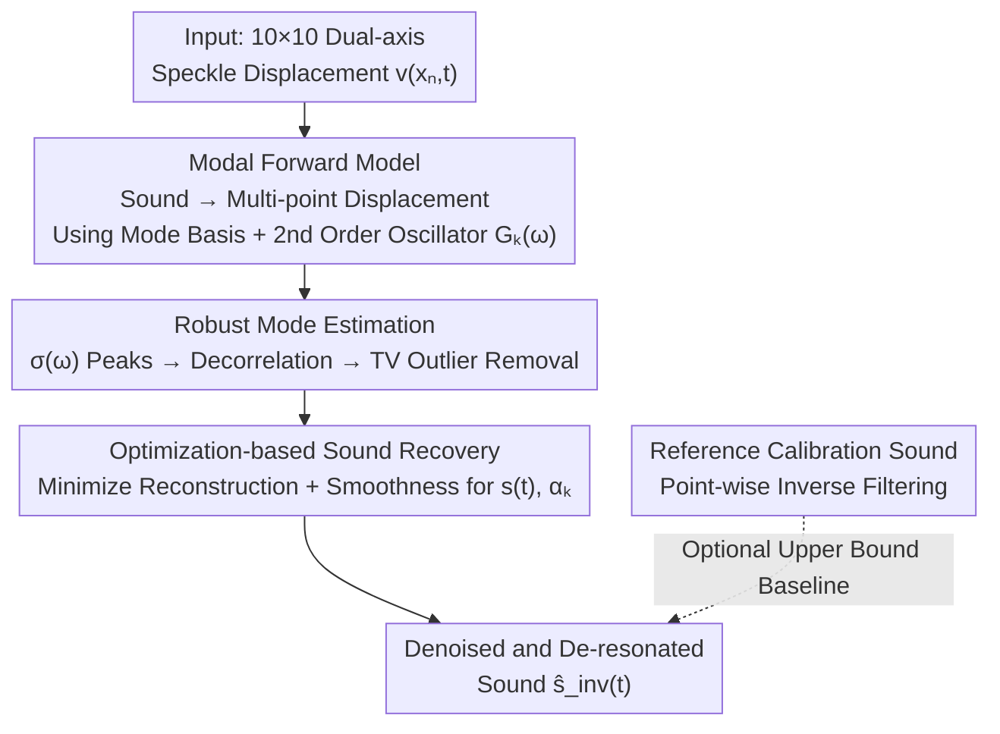

# Hearing the Room Through the Shape of the Drum: Modal-Guided Sound Recovery from Multi-Point Surface Vibrations

**Conference**: CVPR 2026  
**Paper**: [Project Page / CVF Open Access](https://shaibagon.github.io/hearing_the_shape_of_the_drum)  
**Code**: None (Project page only, includes audio demos)  
**Area**: Visual Sound Recovery / Computational Imaging / Multi-modal  
**Keywords**: Speckle vibrometry, visual microphone, vibration modes, physical forward model, sound recovery

## TL;DR
Addressing "hard" objects with poor response and strong resonance (drumheads, laptops, photo frames), this work utilizes speckle vibrometry to capture dual-axis vibrations from a 10×10 grid on the object surface. A physical forward model is derived to link "scene sound → multi-point vibrations" using the object's vibration modes as a bridge. By inverting this model via optimization, dozens of noisy vibration channels are fused into a single denoised, de-resonated sound, achieving quality significantly superior to single-point speckle vibrometry and classical signal processing fusion (averaging, delay-and-sum).

## Background & Motivation
**Background**: Optical vibration sensing transforms everyday objects into "visual microphones." Sound waves induce invisible micro-vibrations on nearby surfaces. By illuminating the surface with a laser and reading the displacement of the reflected speckle interference patterns, these micro-vibrations can be magnified and converted back into sound. Prior works (Davis's motion magnification, Sheinin's dual-camera speckle system, Kichler's 2D grid speckle) have enabled a single camera to simultaneously record vibrations at **multiple points** in a scene.

**Limitations of Prior Work**: Previous methods mostly targeted "easy" objects—either "active" objects that generate sound themselves (speaker membranes, guitar bodies) or thin-film objects extremely sensitive to sound (potato chip bags, leaves). For **rigid objects** like drumheads, laptops, binders, and photo frames, the surface response to ambient sound is either very weak or strongly resonant. Signal recovered from a single point is both noisy and "colored" by the object's own resonance frequencies, resulting in a distinct "drummy" sound.

**Key Challenge**: While multi-point signals suggest denoising through "averaging multiple channels," this work identifies it as a trap. Unlike microphone arrays—where channels differ only by a **global arrival delay**—points on an object's surface are connected by **mechanical wave propagation**. Sound travels fast in solids, and mechanical vibrations dominate the motion, leading to **different phase delays for different frequency components** between two surface points (e.g., 198 Hz might be out-of-phase while 411 Hz is in-phase). Direct averaging causes cancellation at certain frequencies; delay-and-sum can only align one dominant low frequency, losing high-frequency modes. Furthermore, energy distribution differs across points for different modal frequencies (points near modal nodes capture almost no vibration for that mode).

**Goal**: To fuse these dozens of noisy signals with varying phases and amplitudes into a single sound that maximizes denoising and "equalizes" the object's resonant timbre.

**Key Insight**: The authors' key insight is that **the object's modes (modal frequencies + mode shapes) are the missing bridge**. Under linear vibration assumptions, modes form an orthogonal basis that spans all surface vibrations. Knowing the modes allows for the approximate inversion of the object's spatio-temporal impulse response to estimate the original sound triggering the vibrations.

**Core Idea**: First, estimate the object's modal frequencies and mode shape gradients from the data. Use the modal basis to formulate an analytical forward model mapping "sound → multi-point speckle displacement," then **invert** this model through optimization. This is equivalent to "inverting" the object's resonance transfer function while fusing multi-point signals.

## Method

### Overall Architecture
The system input is a dual-axis speckle displacement signal $v(x_n,t)\in\mathbb{R}^2$ ($n=1,\dots,N$, with axes denoted $v_1,v_2$) captured over a 10×10 grid on a surface. The output is a fused, denoised sound estimate $\hat s_{\text{inv}}(t)$. The pipeline consists of three steps: (1) Expanding the physical vibration equation into a sum of modes to establish the "sound $s(t)$ → multi-point speckle displacement" forward model; (2) **Robustly** estimating modal frequencies $\hat\omega_k$ and mode shape gradients $\nabla\hat\phi_k(x_n)$ from the data; (3) Fixing the modes and performing optimization-based inversion for the sound. The paper also proposes an "optimal recovery" baseline requiring a reference calibration signal to define the upper bound of the unsupervised method.

### Key Designs

**1. Modal Forward Model: Formulating an Invertible Analytical Expression**

This is the physical foundation of the work, addressing the issue that "multi-point signals are not simple delays but are coupled by mechanical waves." The authors start from the general wave equation for thin elastic surfaces: $\rho\,\partial_{tt}u + c(x)\,\partial_t u - T\nabla^2 u + D\nabla^4 u = f(x,t)$ (membrane $D=0$, plate $T=0$). Under linear vibration assumptions, out-of-plane displacement can be expanded as $u(x,t)=\sum_{k=1}^{K}\phi_k(x)\,q_k(t)$. Projecting the equation onto each mode using orthogonality and assuming the driving pressure field is approximately uniform $f(x,t)=p(t)$ across the surface, each modal coordinate reduces to a second-order linear oscillator: $\ddot q_k + 2\zeta_k\omega_k\dot q_k + \omega_k^2 q_k = \alpha_k p(t)+\eta_k(t)$, with the frequency-domain transfer function:

$$G_k(\omega)=\frac{\alpha_k}{-\omega^2 + j\,2\zeta_k\omega_k\omega + \omega_k^2}.$$

Since speckle displacement measures the surface **gradient** $v(x_n,t)=\beta\nabla_x u(x_n,t)$, substituting $p(t)=\gamma s(t)$ yields the proposed forward model:

$$v(x_n,t)\approx \gamma\beta\sum_{k=1}^{K}\nabla\phi_k(x_n)\big(s(t)*g_k(t)\big)+\eta(x_n,t),$$

where $g_k(t)$ is the impulse response of $G_k(\omega)$. This formula is critical: it expresses every measurement (per point, per axis) as a weighted sum of the original sound $s(t)$ convolved with modal impulse responses. Fusion thus becomes a source separation problem given a mixing matrix (modes). Unlike microphone array models, this replaces global delay with **frequency-dependent modal phase relationships**, explaining why naive averaging fails.

**2. Robust Mode Estimation: Triple Filtering for Reliable Modal Frequencies**

To use the model, $\nabla\hat\phi_k(x_n)$ and $\hat g_k(t)$ must be estimated. The difficulty lies in the fact that modes are only excited by broadband stimuli, and they might not be prominent in standard recordings. The authors use a two-layer approach.

For frequency localization, instead of single-point spectra, they calculate the **cross-point standard deviation of FFT magnitudes** $\sigma(\omega)=\mathrm{std}_n(|V_n(x_n,\omega)|)$. True modes exhibit large magnitude variations across surface points (peaks/nodes), while uncorrelated noise varies little, causing modes to stand out in $\sigma(\omega)$. Mode shape gradients are read directly from the relative magnitudes of dual-axis harmonic signals at modal frequencies:

$$\nabla\hat\phi_k(x_n)=\mathrm{Re}\!\left\{\frac{V(x_n,\hat\omega_k)\cdot V_1(x_0,\hat\omega_k)^{*}}{\mathbb{E}_{n,a}[|V(x_n,\hat\omega_k)|]\cdot|V_1(x_0,\hat\omega_k)|}\right\},$$

using a reference point $x_0$ for phase alignment. This is followed by **triple consistency filtering**: ① 5 Hz Savitzky–Golay smoothing of $\sigma(\omega)$ followed by SciPy `find_peaks`; ② Decorrelation of redundant modes based on spatial correlation of shapes; ③ Total Variation ($\mathrm{TV}$) check of mode shapes to discard outliers that violate the physical principle that spatial complexity should increase monotonically with frequency. The authors demonstrate that broadband stimuli (like a clap or tap) in a long recording are sufficient to excite the full set of modes.

**3. Optimization-based Sound Recovery: Jointly Solving for $s(t)$ and Coupling Coefficients**

With modal frequencies and gradients fixed, the sound is treated as an unknown in a least-squares inversion of the forward model:

$$\arg\min_{s(t),\,\alpha_k}\ \Big\|\,v(x_n,t)-\sum_{k=1}^{K}\nabla\hat\phi_k(x_n)\big(s(t)*\hat g_k(t)\big)\Big\|_2^2+\lambda\|\dot s(t)\|_2^2,$$

where $\hat g_k(t)=\mathrm{iFFT}(G_k(\omega))$, $\zeta_k$ is fixed (0.01), and coupling coefficients $\alpha_k$ are **jointly optimized** with $s(t)$. This step performs two tasks: it incorporates the frequency-dependent phase relationships across $N$ points to "equalize" the object's resonance into a flatter spectrum, and the $\lambda\|\dot s\|_2^2$ term suppresses noise. Optimization is performed using PyTorch + Adam (10,000 steps, lr $10^{-4}$, $\lambda=1$), taking ~27s for a single segment on an RTX 4090.

### Loss & Training
The core objective is Eq. (12) (reconstruction error + first-order derivative smoothness). No network is trained; optimization is per recording. Pre-processing involves 22,000 fps (or 44,100 fps) capture, HOLOEYE beam splitter for 10×10 grid generation, PCLK+ for displacement calculation, and a 7th-order Butterworth bandpass filter (50–10,000 Hz).

## Key Experimental Results

### Main Results: Comparison of Fusion Methods on Drumheads (Fig. 4)

| Fusion Method | High-Freq Modes | Denoising | Resonant Timbre | Conclusion |
| :--- | :--- | :--- | :--- | :--- |
| Single Point (x-axis) | Partial | Poor (noisy) | Heavy (drummy) | Noisy and colored by resonance |
| Naive Averaging | Suppressed | Worse | Heavy | Phase mismatch causes cancellation |
| Delay-and-sum | High-freq lost | Medium | Medium | Single delay only aligns low frequencies |
| **Ours (Modal Inversion)** | **Preserved** | **Superior** | **Significant Suppression** | Richer spectrum, closer to source |

Qualitative results across objects (Fig. 5): Reconstructions were successful on wood, metal, plastic, and rubber, involving flat, curved, and irregular shapes (wooden binders, guitar bodies), and even solid yoga blocks.

### Ablation Study: Impact of Modal Accuracy (Fig. 6 / Fig. 7)

| Configuration | Key Observation |
| :--- | :--- |
| Modes from Clap | High quality (Default setting) |
| Modes from Recording itself | Comparable quality; the signal itself can be a reliable source |
| Randomly **Removing** 20% Modes | Slight loss in sharpness; timbre preserved |
| Randomly **Adding** 20% False Modes | Significant artifacts; unnatural resonance |
| vs. Calibration Upper Bound | Matches most frequencies with high fidelity |

### Key Findings
- **"Frequency Accuracy" > "Completeness"**: Including incorrect frequencies is far more damaging than missing true frequencies, as false frequencies are inverted into spurious resonances.
- Modes can be self-extracted from the target recording without specialized calibration; occasional broadband events (like a clap) are sufficient.
- The unsupervised results closely approach the calibration-based upper bound.
- Naive averaging is often worse than single-point measurement, proving that multi-point vibrations **cannot be treated as independent microphones** but must account for mechanical coupling.

## Highlights & Insights
- **Reformulating "Acoustic Inversion" as "Source Separation with Modal Mixing Matrix"**: Using mode shapes as an orthogonal basis cleverly turns "multi-point phase mismatch" from an obstacle into a physical constraint.
- **Cross-point standard deviation $\sigma(\omega)$ for mode detection**: This property—where true modes exhibit spatial structure while noise does not—is much more robust for peak finding than single-point spectra.
- **TV Monotonicity Prior for Outlier Detection**: The physical law that spatial complexity of mode shapes increases with frequency acts as a simple yet effective criterion for discarding numerical artifacts.

## Limitations & Future Work
- The method relies on a simplified **linear, modal** model; non-uniform forces, complex geometries, and heterogeneous materials may deviate from these assumptions.
- It assumes the driving pressure field is uniform $f(x,t)=p(t)$, which may fail for large objects or near-field directional sources.
- Only mode shapes covered by the laser grid are recovered; high-frequency modes tend to be underestimated in results (Fig. 7).
- It assumes a uniform optical scaling factor $\beta$ for all points, though the authors note the model is relatively insensitive to per-point variations.

## Related Work & Insights
- **vs. Single-point Speckle Vibrometry [Sheinin/Davis et al.]**: Prior works selected easy targets; rigid/resonant objects suffer from heavy coloring and noise. This work uses multi-point modal inversion to tackle "hard" solids.
- **vs. Naive Averaging / Delay-and-sum**: Classic methods assume global delays (microphone array paradigm), whereas this work uses frequency-dependent modal phase relationships derived from mechanical physicals.
- **vs. Calibrated Inverse Filtering (Baseline)**: While the baseline requires active scene intervention (reference chirps), the proposed unsupervised method approximates its performance passively.

## Rating
- **Novelty**: ⭐⭐⭐⭐⭐ Connects speckle vibrometry to mechanical modal analysis for the first time.
- **Experimental Thoroughness**: ⭐⭐⭐⭐ Broad material coverage and detailed ablations, though quantitative metrics are mainly in the supplement.
- **Writing Quality**: ⭐⭐⭐⭐⭐ Clear physical derivation and intuitive explanation of why simple averaging fails.
- **Value**: ⭐⭐⭐⭐ Extends visual sound recovery to "difficult" solids with a low barrier to deployment.

<!-- RELATED:START -->

## Related Papers

- [\[CVPR 2026\] MMAudioReverbs: Video-Guided Acoustic Modeling for Dereverberation and Room Impulse Response Estimation](mmaudioreverbs_video-guided_acoustic_modeling_for_dereverberation_and_room_impul.md)
- [\[AAAI 2026\] Hearing More with Less: Multi-Modal Retrieval-and-Selection Augmented Conversational LLM-Based ASR](../../AAAI2026/audio_speech/hearing_more_with_less_multi-modal_retrieval-and-selection_augmented_conversatio.md)
- [\[NeurIPS 2025\] Seeing Sound, Hearing Sight: Uncovering Modality Bias and Conflict of AI Models in Sound Localization](../../NeurIPS2025/audio_speech/seeing_sound_hearing_sight_uncovering_modality_bias_and_conflict_of_ai_models_in.md)
- [\[CVPR 2026\] Semantic Noise Reduction via Teacher-Guided Dual-Path Audio-Visual Representation Learning](semantic_noise_reduction_via_teacher-guided_dual-path_audio-visual_representatio.md)
- [\[CVPR 2025\] MultiFoley: Video-Guided Foley Sound Generation with Multimodal Controls](../../CVPR2025/audio_speech/video-guided_foley_sound_generation_with_multimodal_controls.md)

<!-- RELATED:END -->
