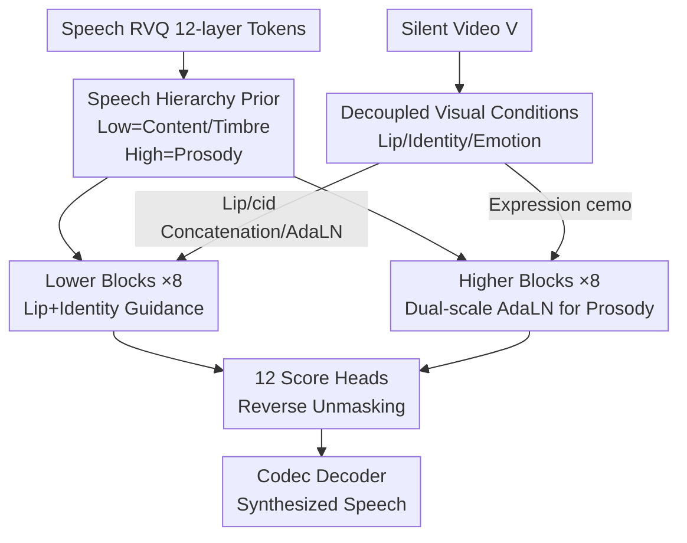

# Hierarchical Codec Diffusion for Video-to-Speech Generation

**Conference**: CVPR2026  
**arXiv**: [2604.15923](https://arxiv.org/abs/2604.15923)  
**Code**: https://github.com/Jiaxin-Ye/HiCoDiT (Available)  
**Area**: Multimodal Generation / Speech Synthesis / Discrete Diffusion  
**Keywords**: Video-to-Speech (VTS), RVQ Codec, Discrete Diffusion, Speech Hierarchy Prior, AdaLN

## TL;DR
HiCoDiT reframes "silent video to speech" generation as a masked diffusion task that proceeds **layer-by-layer along the RVQ discrete token hierarchy**. Lower-level tokens handle content and timbre under lip-motion and identity guidance, while higher-level tokens manage prosody via dual-scale AdaLN modulation of expressions. This approach achieves leading performance in naturalness, intelligibility, and lip-sync on LRS2/LRS3 through zero-shot cross-dataset evaluation.

## Background & Motivation
**Background**: Video-to-Speech (VTS) aims to infer and synthesize speech aligned with lip movements from silent facial videos. It finds applications in silent film dubbing, assistive communication for those with speech impairments, and noise/privacy-sensitive scenarios. Mainstream methods rely on "representation alignment"—aligning visual features with the semantic content (NaturalL2S), speaker identity (Face2Speech), or emotional prosody (FTV) before feeding them into a generative model.

**Limitations of Prior Work**: A significant **information asymmetry** exists between visual and acoustic signals; visual features are sparse and struggle to carry the dense representations of speech. Crucially, existing methods treat speech as a **flat, unified representation**, injecting visual features indiscriminately. This ignores the inherent "coarse-to-fine" hierarchical structure of speech (e.g., coarse speaker semantics vs. fine prosodic details), exacerbating the modality gap.

**Key Challenge**: Speech is not homogeneous—attributes like content, timbre, and prosody naturally reside at different abstraction levels. Similarly, visual cues like lip motion, facial identity, and expressions correspond to different speech attributes. Forcing them into a single representation causes "lip motion" to interfere with "prosody" and "expressions" to contaminate "content," leading to suboptimal alignment.

**Goal**: To establish a **hierarchical visual condition injection** mechanism where each visual cue refines only the specific layer of speech tokens it is responsible for.

**Key Insight**: The authors conducted a quantitative analysis of the RVQ codec (Figure 2 in the paper). RVQ encodes speech residually into 12 layers of VQ tokens. **Lower layers (VQ 1-2) primarily contribute to semantic content (+30.35%) and timbre (+20.10%), while higher layers (VQ 2-12) fill in prosodic details (+10.85%)**. This provides a natural hierarchical prior: lower-level tokens $\leftrightarrow$ speaker semantics, higher-level tokens $\leftrightarrow$ abstract prosody.

**Core Idea**: Utilize the "hierarchical prior of discrete speech tokens" as a bridge. VTS is formulated as **hierarchical masked token prediction**, where lip motion and identity refine lower tokens, and expressions modulate higher tokens, explicitly incorporating the speech hierarchy into a discrete diffusion framework for the first time.

## Method

### Overall Architecture
HiCoDiT takes a silent video $V$ and synthesizes high-fidelity speech aligned with the visuals. It discretizes speech into 12 RVQ token layers, split into low-level $x^{low}=x^{r_1:r_2}$ and high-level $x^{high}=x^{r_3:r_{12}}$. Simultaneously, it **decouples** three visual features from the video: lip motion $c_{lip}$, identity $c_{id}$, and emotion $c_{emo}$. A masked discrete diffusion Transformer acts as the score network: lower blocks use lip motion and identity to generate content/timbre tokens, while higher blocks use expressions to modulate prosody tokens. Finally, 12 linear score heads output concrete scores to drive reverse unmasking, and the recovered tokens are decoded into speech. This is a unidirectional pipeline: "visual decoupling $\to$ hierarchical streaming $\to$ block-wise conditional generation $\to$ decoding."

### Key Designs

**1. Speech Hierarchy Prior: Using Coarse-to-Fine RVQ Structure as an Alignment Scaffold**

Existing VTS treat speech as a flat entity, causing undifferentiated visual injection. The authors measured the layer-wise contribution of the RVQ codec: lower tokens (VQ 1-2) focus on semantic content (+30.35%) and timbre similarity (+20.10%), while prosodic quality relies on higher layers (VQ 2-12) (+10.85%). Based on this, the paper segments the 12 tokens into low-level $x^{r_1:r_2}$ and high-level $x^{r_3:r_{12}}$, mandating that content-related cues (lip/identity) refine the low layers, while prosody-related cues (expression) modulate the high layers. This replaces heuristic design with codec-specified alignment.

**2. Decoupled Visual Conditions: Three Adapters for Three Attributes**

Lip motion, identity, and expression are naturally entangled in video. HiCoDiT uses three independent adapters to decouple and align them: Lip motion uses AV-HuBERT's final hidden states (encoding discriminative audio-visual semantics), projected via MLP to $c_{lip}$ for content. Identity uses ArcFace facial features projected to $c_{id}$ and aligned to GE2E speech embeddings via $\ell_1$ distance to map "face" to "timbre." Emotion uses the Poster2 model for frame-level emotion prediction, smoothed over a 0.5s window to reduce identity bias jitter, resulting in $c_{emo}$ for prosody. Each feature follows its own dedicated injection channel.

**3. Dual-Block Structure for Hierarchical Masked Token Prediction: Matching Mechanisms to Signal Granularity**

HiCoDiT employs two complementary mechanisms within the masked discrete diffusion framework (based on the SEDD DSE training objective). For frame-synchronized fine-grained signals (lip motion), masked low-level features $m^{low}_t$ are concatenated with $c_{lip}$ along the channel dimension. For categorical attributes (identity, emotion), AdaLN is used. Lower blocks (×8) handle content/timbre, while higher blocks (×8) handle prosody. The forward process masks tokens following SEDD, and the reverse process uses Euler sampling (64 steps) for unmasking.

**4. Dual-scale Adaptive Layer Normalization (AdaLN): Capturing Global Timbre and Local Prosody Jitter**

Standard AdaLN in DiT only normalizes along the channel dimension, which captures global style but fails to model temporal prosody dynamics. HiCoDiT introduces dual-scale AdaLN in higher blocks. A channel-wise MLP uses emotion and time features to predict scaling/shifting $\gamma_{emo,c}, \beta_{emo,c}$ for global style, while a temporal MLP predicts a time-wise scale $\gamma_{emo,t}$ to capture local prosodic dynamics:

$$\underbrace{\gamma^i_{emo,t}\otimes \mathbf{1}_{25}}_{\text{Temporal-level}}\cdot\Big[\underbrace{(1+\gamma^i_{emo,c})\cdot\frac{h_t-\mu(h_t)}{\sigma(h_t)}+\beta^i_{emo,c}}_{\text{Channel-level}}\Big]$$

Where $\otimes$ is the Kronecker product. $\mathbf{1}_{25}$ upsamples temporal parameters to 50Hz to match the latent features. Identity uses single-scale channel AdaLN. This allows "emotion" to shape both overall timbre and frame-by-frame prosodic fluctuations.

### Loss & Training
The total loss is $L_{total}=L_{score}+\lambda L_{id}$, with $\lambda=100$. $L_{score}=\sum_{i=1}^{12}L_{DSE}(x^{r_i},t,c)$ is the multi-level DSE loss summed over all 12 RVQ layers. $L_{id}=\ell_1(c_{id},c_{GE2E})$ aligns visual identity with GE2E speech embeddings. Training uses predictor-free guidance (10% null condition probability). Ground truth acoustic features replace $c_{id}/c_{emo}$ during training for stability, while only visual features are used during inference. The RVQ codec is from MaskGCT (12 layers, 1024 codebook size); Transformer blocks use 768 channels and 12 heads.

## Key Experimental Results

### Main Results
Trained on VoxCeleb2 (261.5 hours, 169k samples), and evaluated **zero-shot** on LRS3 and LRS2. Table below shows LRS3 results (Video-only):

| Method | Source | WER↓ | DNSMOS↑ | UTMOS↑ | MCD↓ | LSE-C↑ | EmoAcc↑ | SpkSim↑ |
|------|------|------|---------|--------|------|--------|---------|---------|
| AlignDiT | ACM MM'25 | 31.37 | 3.24 | 3.76 | 10.02 | 6.95 | 76.11 | 0.5597 |
| FTV | CVPR'25 | 30.37 | 3.22 | **3.99** | 10.54 | 7.08 | 73.19 | **0.5981** |
| **HiCoDiT (V)** | - | **29.41** | **3.50** | 3.84 | 9.62 | **7.15** | **79.41** | 0.5678 |
| HiCoDiT (A+V) | - | **28.98** | 3.44 | 3.80 | **8.69** | 7.10 | 77.08 | **0.6715** |

On LRS2, HiCoDiT leads in DNSMOS (3.35 vs FTV 3.11) and LSE-C (7.95 vs 7.71). WER on OOD movie data (58.7) is significantly better than EmoDubber (88.3) and AlignDiT (80.8), showing strong robustness. Subjective MOSnat (3.17) and MOSsyn (3.50) ranks first.

### Ablation Study
| Configuration (LRS3) | WER↓ | DNSMOS↑ | EmoAcc↑ | SpkSim↑ | Description |
|------|------|---------|---------|---------|------|
| HiCoDiT (full) | 29.41 | 3.50 | 79.41 | 0.5678 | Full model |
| w/o Hierarchical Modeling | 30.65 | 3.36 | 76.98 | 0.5652 | Single module, indiscriminate injection |
| w/o Dual-scale AdaLN | 29.60 | 3.45 | 78.55 | 0.5621 | Reverts to utterance-level emotion |
| w/o GE2E $L_{id}$ | 29.38 | 3.41 | 74.47 | 0.3410 | SpkSim drops to 34.10% |

### Key Findings
- **Hierarchy is the Foundation**: Removing hierarchical modeling (collapsing the structure and injecting visuals across all tokens) leads to a wholesale drop in metrics, proving that visual attributes should be aligned to specific token layers.
- **GE2E Identity Loss is Critical**: Without it, SpkSim drops from 56.78% to 34.10%, while WER remains stable, indicating it effectively decouples timbre from content.
- **Dual-scale AdaLN Enhances Dynamics**: Replacing it with pooled utterance-level emotion reduces all metrics, particularly prosodic quality, showing that frame-level temporal normalization is key.
- **Honest Limitations**: SpkSim (0.5678) is lower than FTV (0.5981) in video-only mode due to training data diversity; however, using audio for identity guidance boosts SpkSim to 0.6715, the highest reported.

## Highlights & Insights
- **Transforming Metric Analysis into Architectural Prior**: The paper first quantifies RVQ layer contributions (30.35%/20.10%/10.85%) and then assigns visual conditions accordingly—this "measure then design" paradigm is highly transferable.
- **Discrete Diffusion + Codec Hierarchy**: This combination avoids continuous mel-spectrogram modeling, benefiting from codec reconstruction quality while avoiding the computational inefficiency of continuous diffusion.
- **Mechanism Selection based on Signal Granularity**: Using concatenation for synchronous signals and AdaLN for categorical attributes is a solid engineering judgment for multi-conditional generation.
- **Dual-scale AdaLN** cleanly separates global style from local dynamics into channel and temporal dimensions.

## Limitations & Future Work
- **Speaker Similarity**: Performance is constrained by training data diversity; video-only similarity is lower than FTV.
- **Dependency on Pre-trained Encoders**: Relies on a suite of models (AV-HuBERT, ArcFace, Poster2, etc.); domain shift in any single module could propagate through the system.
- **Heuristic Hierarchy Split**: The split point ($r_2/r_3$) is fixed based on statistical observations; whether this is optimal for all languages or sampling rates remains unexplored.
- **Inference Latency**: The 64-step Euler sampling plus 12 score heads overhead relative to autoregressive codec TTS is not explicitly reported.

## Related Work & Insights
- **vs FTV (CVPR'25)**: FTV uses flow matching with hierarchical visual encoders to project features into **continuous mel-space**. HiCoDiT operates in **discrete token space** and derives its hierarchy from the speech tokens themselves.
- **vs AlignDiT (ACM MM'25)**: AlignDiT lacks explicit exploitation of the speech hierarchy; HiCoDiT outperforms it across nearly all metrics and subjective preferences.
- **vs VoiceCraft-Dub**: While VoiceCraft-Dub adapts pre-trained AR discrete TTS, it blurs the hierarchical structure. HiCoDiT is trained from scratch to explicitly integrate this prior.

## Rating
- Novelty: ⭐⭐⭐⭐⭐ First to explicitly introduce speech hierarchy priors into discrete diffusion VTS based on quantitative RVQ analysis.
- Experimental Thoroughness: ⭐⭐⭐⭐ Extensive evaluation on LRS2, LRS3, and OOD data, though speaker diversity is a noted weakness.
- Writing Quality: ⭐⭐⭐⭐ Clear logical flow from motivation to design; requires familiarity with discrete diffusion.
- Value: ⭐⭐⭐⭐ Provides a paradigm for conditional generation using residual quantized representations.

<!-- RELATED:START -->

## Related Papers

- [\[AAAI 2026\] Diff-V2M: A Hierarchical Conditional Diffusion Model with Explicit Rhythmic Modeling for Video-to-Music Generation](../../AAAI2026/audio_speech/diff-v2m_a_hierarchical_conditional_diffusion_model_with_explicit_rhythmic_model.md)
- [\[CVPR 2026\] EchoFoley: Event-Centric Hierarchical Control for Video Grounded Creative Sound Generation](echofoley_event-centric_hierarchical_control_for_video_grounded_creative_sound_g.md)
- [\[CVPR 2026\] SAVE: Speech-Aware Video Representation Learning for Video-Text Retrieval](save_speech-aware_video_representation_learning_for_video-text_retrieval.md)
- [\[CVPR 2026\] Hear What You See: Video-to-Audio Generation with Diffusion Transformer and Semantic-Temporal Alignment-Ranked Direct Preference Optimization](hear_what_you_see_video-to-audio_generation_with_diffusion_transformer_and_seman.md)
- [\[CVPR 2026\] Omni2Sound: Towards Unified Video-Text-to-Audio Generation](omni2sound_towards_unified_video-text-to-audio_generation.md)

<!-- RELATED:END -->
