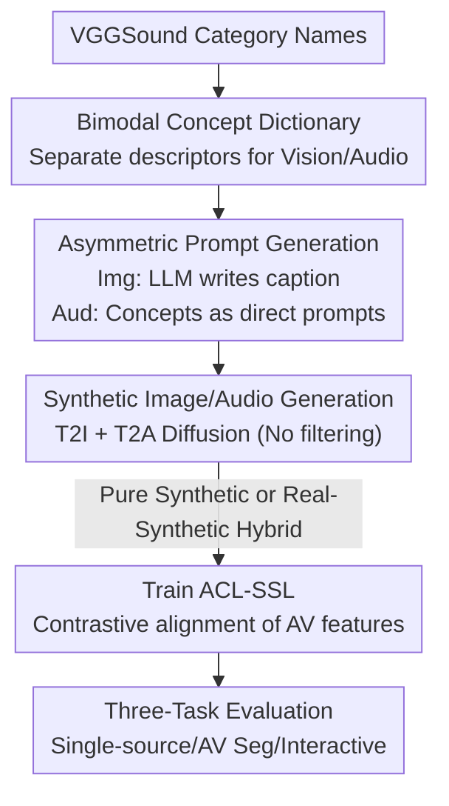

# How Far Can We Go With Synthetic Data for Audio-Visual Sound Source Localization?

**Conference**: CVPR 2026  
**Paper**: [CVF Open Access](https://openaccess.thecvf.com/content/CVPR2026/html/Senocak_How_Far_Can_We_Go_With_Synthetic_Data_for_Audio_Visual_CVPR_2026_paper.html)  
**Code**: https://github.com/swimmiing/SyntheticSSL  
**Area**: Multimodal VLM (Audio-Visual Self-Supervised)  
**Keywords**: Sound source localization, synthetic data, text-to-image/audio, data-centric learning, contrastive learning

## TL;DR
This paper proposes the first scalable framework to generate data in bulk using text-to-X generative models for training Sound Source Localization (SSL) models. It demonstrates that purely synthetic data can match the performance of real data, and replacing noisy real "intermediate frames" with synthetic images can "purify" the training set. Hybrid training involving real and synthetic data achieves new SOTA results across three tasks: single-source localization, audio-visual segmentation, and interactive localization.

## Background & Motivation
**Background**: Sound Source Localization (SSL) aims to delineate the "sounding object or region" within a visual frame. It has evolved from a sub-topic of audio-visual learning into an independent field with its own benchmarks and tasks, such as single-source localization, audio-visual segmentation, and interactive localization. However, mainstream research remains **model-centric**, focusing on refining model architectures, contrastive learning objectives, and regularization terms, while training data has long stagnated at the scale of VGGSound (fewer than 144,000 samples).

**Limitations of Prior Work**: Real training data suffers from two major flaws. First, **scalability is limited**; the 144,000-sample scale of VGGSound is essentially a ceiling, and the scalability of these models has never been verified. Second, **semantic misalignment** occurs because training images are typically sampled from the "middle frame" of a video. This frame may not actually contain the sounding object (e.g., the subject has moved off-camera, or the sound is a voice-over), leading to semantic discrepancies between the audio and the image (as shown in Figure 2 of the paper).

**Key Challenge**: While manual collection and cleaning could solve "scale" and "alignment" issues, the human labor cost is extremely high and unscalable. As new tasks and benchmarks emerge, models are required to be more generalizable, making the model-centric approach on small datasets increasingly difficult.

**Goal**: To pivot from a model-centric to a **data-centric** approach, answering three questions: (1) Can SSL models learn effectively from synthetic data? (2) Can synthetic data overcome the aforementioned bottlenecks? (3) What is the feasible recipe for building stronger SSL models?

**Key Insight**: Text-to-image (T2I) and text-to-audio (T2A) generative models are sufficiently controllable to produce pairs of images and audio "by concept" at scale. This naturally avoids the problem of middle-frame misalignment (generated images necessarily depict the sounding object) while allowing for infinite scaling. The authors treat synthetic data as a "verification and research tool" to detect the true bottlenecks of SSL.

**Core Idea**: Use generative models to create a "synthetic clone" of VGGSound, then train an existing SOTA SSL model (ACL-SSL) using purely synthetic or real-synthetic hybrid data to systematically answer "how far synthetic data can take us."

## Method

### Overall Architecture
The pipeline aims to automatically produce synthetic images and audio corresponding to VGGSound category names to train an SSL model. It consists of four serial steps: first, creating a "concept dictionary" for each category to expand descriptive terms; second, using an LLM to transform these concepts into generative prompts; third, generating synthetic images and audio using T2I/T2A diffusion models; and finally, training ACL-SSL using pure synthetic or hybrid data. The only step requiring manual intervention is the initial dictionary creation; the rest is fully automated.

### Key Designs

**1. Bimodal Concept Dictionary: Expanding category names for diversity**

Feeding a simple category name like "dog" into a generative model results in monotonous and semantically sparse outputs. The authors construct a **concept dictionary** for each VGGSound category, expanding category names into more descriptive entries. Crucially, **visual and audio dictionaries are maintained separately** because the information density of a description varies across modalities. For instance, "night" in "thunder in the night" is highly descriptive for a visual scene (night sky) but adds almost no information to the audio of the thunder. The dictionary was manually authored by 10 annotators (each responsible for 31 categories), with an average of only 3.35 visual and 7.80 audio concepts per category. This is the **only** manual step in the pipeline, and it is negligible compared to large-scale data collection.

**2. Asymmetric Prompt Generation: Different "tastes" for T2I and T2A**

The authors observed that T2I and T2A models have vastly different sensitivities to prompts. **T2I models prefer descriptive, linguistically rich captions, whereas T2A models struggle with full sentences and favor short concept words.** Thus, an asymmetric strategy is adopted. On the image side, a concept $k_i$ is sampled from the dictionary and passed to an LLM (Mistral-7B) to write a caption $t_i = G(p, k_i)$ of under 15 words. On the audio side, the concept word is used directly as the prompt. This is formalized as $T^{image}=\{G(p,k_i)\mid k_i\sim \text{Uniform}(D(c(x_i)))\}$ and $T^{audio}=\{k_i\sim \text{Uniform}(D(c(x_i)))\}$, where $D(c)$ returns the concept set for category $c$. This modal-specific prompting is key to high-quality generation.

**3. Synthetic Generation without Filtering: Low-cost "CLONE" of VGGSound**

Using Stable Diffusion 3 Medium (T2I) and Stable Audio Open 1.0 (T2A), the framework generates images $V=\{G_{T2I}(t_i)\}$ and audio $A=\{G_{T2A}(t_i)\}$. A deliberate choice was made to **perform no filtering** on generated samples. The goal was to verify how far "off-the-shelf standard generative models" could go, establishing a low-cost and reproducible recipe by avoiding complex cleaning stages.

**4. Hybrid Training Recipe: "Purification" via synthetic images**

The data is fed into ACL-SSL (which uses a CLIP vision encoder and BEATs audio encoder). The core contribution is the **recipe**, not the model. By comparing six data configurations, the authors concluded that (SynI, RealA) (synthetic images + real audio) performs best. This is because synthetic images have cleaner semantics and correct the misalignment found in real video frames. Purely synthetic training can match pure real training, and incorporating just 10,000 real samples (e.g., SynI+MixedA) significantly outperforms the pure real baseline. This indicates that **the visual modality is the primary beneficiary of synthetic data**.

### Loss & Training
The framework follows the self-supervised contrastive learning setup of ACL-SSL. It uses ViT-B/16 CLIP as the image encoder and BEATs as the audio encoder. Audio is projected as "text-like tokens" and passed through the CLIP text encoder to align audio-visual features. Training uses 10-second, 16 kHz audio clips and images resized to $352 \times 352$ over 20 epochs with a batch size of 16. Each baseline is trained 6 times to report mean and standard deviation.

## Key Experimental Results

### Main Results (Scale aligned at 144K, Single-Source Localization)
Comparison of six data configurations for single-source localization. **cIoU**: Consensus Intersection over Union at a fixed threshold; **AUC**: Area under the curve.

| Configuration | cIoU | cIoU Adap. | AUC | AUC Adap. |
| :--- | :--- | :--- | :--- | :--- |
| (a) Original (All Real) | 48.03 | 62.22 | 41.95 | 51.99 |
| (b) Synthetic (All Syn) | 47.97 | 60.88 | 41.86 | 51.03 |
| (c) (SynI, RealA) Syn Img + Real Aud | **55.13** | **67.16** | **46.73** | **55.06** |
| (d) (RealI, SynA) Real Img + Syn Aud | 46.38 | 61.66 | 41.43 | 51.28 |
| (e) (SynI, MixedA) | 52.24 | 64.75 | 44.66 | 53.37 |
| (f) (MixedI, SynA) | 50.61 | 62.75 | 43.96 | 52.16 |

Pure synthetic (b) is comparable to pure real (a). Replacing real images with synthetic ones (c) yields a $+7.10$ cIoU gain. The weakest combination is real images with synthetic audio (d).

### Key Findings
- **Vision is the major contributor**: Synthetic images consistently provide larger gains because real images suffer from noisy "middle frame" selection, whereas synthetic images are semantically aligned and "clean."
- **(RealI, SynA) is the only underperforming combo**: Coupling noisy real images with current (weaker) synthetic audio amplifies defects.
- **Minimal real data is sufficient**: Mixing just 10,000 real samples into the synthetic set allows (SynI, MixedA) to outperform the pure real baseline significantly.
- **Scalability to 2x scale**: Scaling the dataset to $2\times$ size (288K) further improves performance, reaching $56.36$ cIoU in single-source localization.

## Highlights & Insights
- **Robust Data-Centric Perspective**: Instead of inventing a new model, the paper systematically validates synthetic data's ability to replace, refine, and scale real data—a first for the audio-visual field.
- **Asymmetric Prompting**: The observation that T2I requires long captions while T2A requires short concepts is a crucial engineering insight for multimodal data generation.
- **Counter-intuitive "Purification"**: While people often worry about the domain gap of synthetic data, this paper argues the "reality" of video frames is actually the source of noise, making synthetic images a "purification tool."

## Limitations & Future Work
- **Manual Dictionary**: Although the effort is small, the dictionary creation still requires humans; future work could automate this using LLMs.
- **T2A Bottleneck**: Synthetic audio gains are limited by the maturity of current T2A models. The conclusion that "images are better than audio" is partly a reflection of current generative model performance.
- **Unfiltered Data**: While the "no-filter" recipe is low-cost, it remains to be seen if lightweight filtering/re-weighting could provide further gains.

## Related Work & Insights
- **Compared to Model-Centric SSL**: Previous works were stuck at the 144K real data ceiling; this work proves there is significant untapped "data dividend" in the SSL field.
- **Compared to IS4 [39]**: IS4 used synthetic images for **testing**; this paper is the first to use them for **training** across three major SSL tasks.

## Rating
- Novelty: ⭐⭐⭐⭐⭐ 
- Experimental Thoroughness: ⭐⭐⭐⭐⭐ 
- Writing Quality: ⭐⭐⭐⭐ 
- Value: ⭐⭐⭐⭐

<!-- RELATED:START -->

## Related Papers

- [\[CVPR 2025\] Object-aware Sound Source Localization via Audio-Visual Scene Understanding](../../CVPR2025/audio_speech/object-aware_sound_source_localization_via_audio-visual_scene_understanding.md)
- [\[CVPR 2025\] Improving Sound Source Localization with Joint Slot Attention on Image and Audio](../../CVPR2025/audio_speech/improving_sound_source_localization_with_joint_slot_attention_on_image_and_audio.md)
- [\[CVPR 2026\] Semantic Noise Reduction via Teacher-Guided Dual-Path Audio-Visual Representation Learning](semantic_noise_reduction_via_teacher-guided_dual-path_audio-visual_representatio.md)
- [\[CVPR 2026\] EgoAVU: Egocentric Audio-Visual Understanding](egoavu_egocentric_audio-visual_understanding.md)
- [\[CVPR 2026\] Unlocking Strong Supervision: A Data-Centric Study of General-Purpose Audio Pre-Training Methods](unlocking_strong_supervision_a_data-centric_study_of_general-purpose_audio_pre-t.md)

<!-- RELATED:END -->
