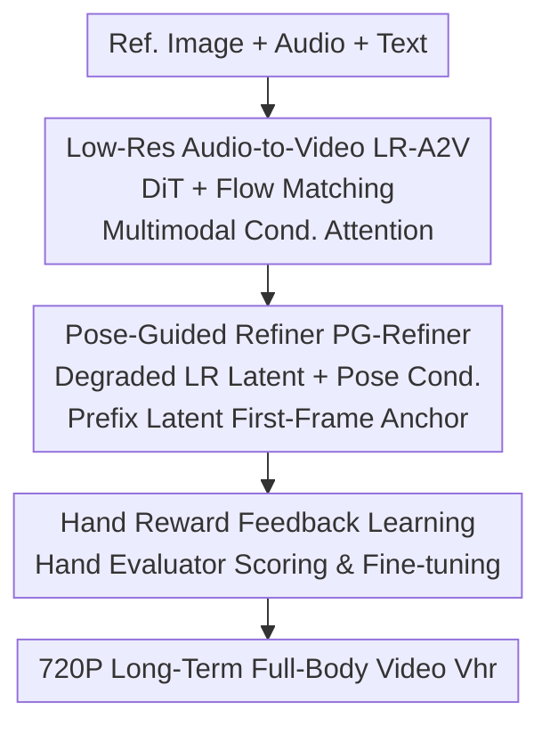

# InfinityHuman: Towards Long-Term Audio-Driven Human Animation

**Conference**: CVPR 2026  
**Paper**: [CVF Open Access](https://openaccess.thecvf.com/content/CVPR2026/html/Li_InfinityHuman_Towards_Long-Term_Audio-Driven_Human_Animation_CVPR_2026_paper.html)  
**Code**: https://infinityhuman.github.io/ (Project Page)  
**Area**: Video Generation (Audio-driven Human Animation)  
**Keywords**: Audio-driven Animation, Long Video Generation, Pose-guided Refinement, Hand Reward Learning, Diffusion Models

## TL;DR
InfinityHuman proposes a coarse-to-fine framework that "generates motion at low resolution first, then refines via pose guidance." By utilizing pose sequences—which are decoupled from appearance and naturally resistant to temporal degradation—alongside a first-frame visual anchor, the method combats identity drift and color shifts in long videos. It further introduces hand-specific reward feedback learning to correct hand distortions. The model achieves SOTA performance on EMTD/HDTF datasets in terms of image quality, identity preservation, hand accuracy, and lip-sync for long-term audio-driven full-body animation.

## Background & Motivation
**Background**: Audio-driven human animation generates talking person videos from a single reference image and an audio track. This field has evolved from driving faces/heads to full-body animation, with applications in advertising, vlogs, and film. Current mainstream methods rely on latent diffusion models and extend short videos into long ones autoregressively using **overlapping motion frames**.

**Limitations of Prior Work**: Long video generation faces two major issues. First, **poor long-term visual consistency**: as the sequence lengthens, errors in autoregressive frame continuation accumulate, leading to identity drift (changes in face shape or clothing), global color shifts (shimmering tones), and scene instability (background objects drifting or disappearing), as illustrated in Figure 2. Second, **unnatural hand movements**: prior works focus on the face and torso, ignoring hands—which involve "small but fast" movements—resulting in frequent distortions, incorrect finger counts, and lack of synchronization with audio.

**Key Challenge**: The autoregressive mechanism itself is the source of error accumulation—as each segment is conditioned on the previous output, appearance-related features (color, identity) drift over time. Additionally, hands are difficult to model because their movements are rapid and human perception is highly sensitive to hand artifacts.

**Goal**: The problem is split into two sub-problems: (1) how to suppress appearance drift and maintain identity/lip-sync during ultra-long (tens of seconds) generation; (2) how to specifically improve the structural correctness and realism of hands.

**Key Insight**: The authors observe that **pose sequences are structurally decoupled from appearance and are naturally resistant to temporal degradation**: while color and identity might drift, skeletal keypoints remain highly stable over long sequences while retaining fine-grained motion like lip movements. Thus, pose is used as a "reliable navigation signal," paired with the first frame as a visual anchor. For hands, a preference fine-tuning approach is used with a reward model to align with hand realism.

**Core Idea**: A coarse-to-fine strategy—initially generating low-resolution motion synchronized with audio, followed by a **Pose-Guided Refiner** to produce high-resolution long videos. Pose ensures stability, the first-frame anchor ensures resemblance, and hand rewards ensure correctness.

## Method

### Overall Architecture
InfinityHuman starts with a reference image $I_{ref}$, audio $c_{audio}$, and optional text $c_{text}$ to produce a high-resolution long-term full-body talking video $V_{hr}$. This is achieved in three stages. The first stage, **Low-Resolution Audio-to-Video (LR-A2V)**, uses DiT and Flow Matching to generate coarse motion $V_{lr}$ (360P) synced with the audio. The second stage, **Pose-Guided Refiner (PG-Refiner)**, takes $V_{lr}$ and $I_{ref}$ as conditions, using pose sequences and first-frame anchors to refine the coarse video into 720P HD while correcting accumulated errors. A third stage, **Hand Reward Feedback Learning**, is integrated into training to fix hand distortions.

### Key Designs

**1. LR-A2V + Multimodal Conditional Attention: Prioritizing Motion and Lip-Sync**

The coarse stage prioritizes motion and audio alignment over image quality. Using a DiT $f_\theta$ backbone trained with **Flow Matching**, for each frame latent $z^{lr}_i$, noise is added via $z^{lr}_{i,t}=(1-t)\epsilon_i + t\,z^{lr}_{i,1}$ to predict the velocity field $v_{i,t}=z^{lr}_{i,1}-\epsilon_i$. A key design is **Multimodal Conditional Attention**: since audio and text/image conditions can interfere, the authors use a **separate cross-attention branch for audio**: $CA^{mm}(x^{lr},c_{text},c_{audio})=CA(x^{lr},c_{text})+CA(x^{lr},c_{audio})$. This decoupling allows audio cues to drive lip shapes and body dynamics more precisely.

**2. Pose-Guided Refiner: Correcting Drift with Pose and Anchors**

This is the core for combating identity drift. PG-Refiner uses three conditions: (a) **Degraded LR Latent Condition**: intentional low-pass filtering and noise $z_{deglr}=\text{LPF}(z^{lr})+\alpha_{deg}\cdot\epsilon$ simulate temporal degradation, forcing the model to learn detail recovery and structural correction. (b) **Pose Guidance**: human and background landmarks are encoded into an 8-channel pixel-level pose tensor $P$ (7 for body, 1 for background), then projected and added to the high-res latent $z'_{hr}=z_{hr}+\text{Proj}(P')$. Pose is structural and does not accumulate errors, proving more stable than raw audio for reducing motion artifacts. (c) **Prefix-Latent First-Frame Anchor**: the reference image is encoded as a prefix latent $z^{hr}_0=E(I_{ref})$. During diffusion, **only future frames are noised**: $0\le i\le m$ frames remain noise-free and are excluded from the loss (via mask $w_i$). The DiT’s 3D global attention extracts identity features directly from this noise-free prefix.

**3. Hand Reward Feedback Learning: Targeted Distortion Correction**

Humans are sensitive to hand artifacts (incorrect finger counts, unnatural joints). The authors constructed a dataset of 10k pairs of hand structures to fine-tune a **Hand Evaluator** $r_{hand}$ based on the MPS model. During training, low-res latent sequences are decoded into RGB frames, and a random frame $X^{lr}_i$ is scored by the evaluator. The objective is $L_{hand}(\theta)=\mathbb{E}\,[\,T - r_{hand}(X^{lr}_i, c)\,]$ where $T$ is a quality threshold. This fine-grained preference tuning pushes the diffusion model toward generating more realistic hands without extra labels.

### Loss & Training
Both LR-A2V and PG-Refiner are initialized from pre-trained Goku-I2V. The refiner is trained on 7,700 hours of single-person clips filtered by quality and motion. LR-A2V is trained on 1,800 hours (4s segments) filtered by SyncNet for lip-sync. Training uses multimodal dropout (10% for text/audio, 20% for reference/first frame). PG-Refiner employs HumanDiT’s multi-resolution strategy with 20% dropout for pose and LR latents. Both models use 128 NVIDIA GPUs with a learning rate of 5e-5. During inference, PG-Refiner is distilled into a 1-step model for acceleration.

## Key Experimental Results

### Main Results (EMTD Full-Body + HDTF Talking Head)
`*` denotes methods supporting only talking heads.

| Dataset / Method | FID↓ | FVD↓ | IQA↑ | SYNC-C↑ | FSIM↑ | HKC↑ |
|------|------|------|------|---------|-------|------|
| HDTF · Hallo3 | 74.10 | 250.12 | 1.95 | 7.31 | 0.91 | - |
| HDTF · MultiTalk | 85.01 | 404.45 | 1.78 | 8.76 | 0.84 | - |
| HDTF · **Ours** | **69.28** | **239.05** | **2.11** | 8.59 | 0.89 | - |
| EMTD · Hallo3 | 104.51 | 1256.10 | 2.31 | 4.26 | 0.73 | 0.77 |
| EMTD · OmniAvatar | 82.54 | 1104.99 | 2.16 | 5.40 | 0.72 | 0.86 |
| EMTD · **Ours** | **60.71** | **979.88** | **2.48** | **6.56** | **0.84** | **0.90** |

> **FSIM**=FaceSIM (Identity Consistency); **HKC** (Hand Keypoint Confidence)=higher values indicate more reliable hand structures; **HKV** (Hand Keypoint Variance) represents hand movement amplitude/jitter.

### Ablation Study

| Config | FID↓ | FVD↓ | FSIM↑ | HKC↑ | Note |
|------|------|------|-------|------|------|
| w/o refiner | 109.54 | 876.49 | 0.79 | 0.85 | Removing refiner significantly degrades FID/FSIM |
| w/o lr cond | 91.92 | 1001.00 | 0.86 | 0.85 | Removing LR condition increases FVD |
| w/o pose cond | 156.74 | 1163.75 | 0.83 | 0.83 | Removing pose condition causes sharpest drop |
| w/o hand refl | 86.32 | 844.57 | 0.86 | 0.85 | Removing hand reward drops HKC to 0.85 |
| **Ours (Full)** | 91.74 | **758.98** | **0.88** | **0.87** | Full model achieves best FVD/FSIM/HKC |

### Key Findings
- **Pose condition is the most critical**: Removing it spikes FID from 91.74 to 156.74, verifying that pose serves as the primary anti-degradation signal.
- **Refiner determines identity and quality**: Without the refiner, FSIM drops from 0.88 to 0.79, indicating severe identity drift over time.
- **Hand rewards specialize in hands**: The hand reward module successfully raises HKC from 0.85 to 0.87, improving structural confidence.

## Highlights & Insights
- **Pose Resistance to Degradation**: Converting the intuition that "skeletons don't drift even if colors do" into a navigation signal is more elegant than simply adding more reference networks.
- **Prefix-Latent Anchor + Selective Noising**: Using the DiT’s global attention to pull identity from a noise-free prefix is a clean trick for identity preservation without an independent ReferenceNet.
- **Degradation Simulation Training**: Intentionally simulating LPF and noise during training prepares the refiner for the specific errors encountered during autoregressive inference.
- **Hands as Independent Reward Targets**: Isolating the most perceptually sensitive body part for preference tuning effectively patches a common failure mode in full-body generation.

## Limitations & Future Work
- **High Resource Barrier**: Requires 7,700 hours of high-quality data and 128 GPUs, making reproduction difficult for smaller labs.
- **Single-Frame Hand Reward**: The hand loss is calculated on random frames; a video-level reward might better capture temporal hand continuity.
- **Dependency on Pose Estimation**: The system relies heavily on the accuracy of the Sapiens pose estimator; failures in pose estimation during occlusion will lead to refiner errors.
- **Autoregressive Nature**: While mitigated, error accumulation is not fundamentally eliminated for extremely long sequences beyond the 74s tested.

## Related Work & Insights
- **vs. Overlapping Motion Frame Methods (MultiTalk/Hallo3)**: These direct autoregressive methods suffer from drift; ours decouples long-term stability via coarse-to-fine pose guidance.
- **vs. Training-free Extension Methods (Gen-L-Video)**: Sliding window attention often lacks temporal coherence compared to a specifically trained refiner.
- **vs. Talking Head Methods (SadTalker/EchoMimic)**: These focus solely on the face; InfinityHuman handles full-body and hand realism, offering broader application value.

## Rating
- Novelty: ⭐⭐⭐⭐ Combining pose navigation, prefix anchors, and hand rewards is a robust solution to a persistent problem.
- Experimental Thoroughness: ⭐⭐⭐⭐⭐ Extensive comparison across 8 SOTA methods and comprehensive ablation studies.
- Writing Quality: ⭐⭐⭐⭐ Equations and pipelines are clear, though certain ablation metrics show minor non-monotonicity.
- Value: ⭐⭐⭐⭐ A strong baseline for long-term digital humans, though high training costs limit accessibility.

## Related Papers

- [\[CVPR 2026\] Soul: Breathe Life into Digital Human for High-fidelity Long-term Multimodal Animation](soul_breathe_life_into_digital_human_for_high-fidelity_long-term_multimodal_anim.md)
- [\[CVPR 2026\] One-to-All Animation: Alignment-Free Character Animation and Image Pose Transfer](one-to-all_animation_alignment-free_character_animation_and_image_pose_transfer.md)
- [\[CVPR 2026\] Vanast: Virtual Try-On with Human Image Animation via Synthetic Triplet Supervision](vanast_virtual_try-on_with_human_image_animation_via_synthetic_triplet_supervisi.md)
- [\[CVPR 2026\] UniAVGen: Unified Audio and Video Generation with Asymmetric Cross-Modal Interactions](uniavgen_unified_audio_and_video_generation_with_asymmetric_cross-modal_interact.md)
- [\[CVPR 2026\] Free-Lunch Long Video Generation via Layer-Adaptive O.O.D Correction](free-lunch_long_video_generation_via_layer-adaptive_ood_correction.md)

<!-- RELATED:END -->

<!-- RELATED:START -->

## Related Papers

- [\[CVPR 2026\] Soul: Breathe Life into Digital Human for High-fidelity Long-term Multimodal Animation](soul_breathe_life_into_digital_human_for_high-fidelity_long-term_multimodal_anim.md)
- [\[CVPR 2026\] UniAVGen: Unified Audio and Video Generation with Asymmetric Cross-Modal Interactions](uniavgen_unified_audio_and_video_generation_with_asymmetric_cross-modal_interact.md)
- [\[CVPR 2026\] Lighting-grounded Video Generation with Renderer-based Agent Reasoning](lighting-grounded_video_generation_with_renderer-based_agent_reasoning.md)
- [\[CVPR 2026\] SwitchCraft: Training-Free Multi-Event Video Generation with Attention Controls](switchcraft_training-free_multi-event_video_generation_with_attention_controls.md)
- [\[CVPR 2026\] M4V: Multimodal Mamba for Efficient Text-to-Video Generation](m4v_multimodal_mamba_for_efficient_text-to-video_generation.md)

<!-- RELATED:END -->
