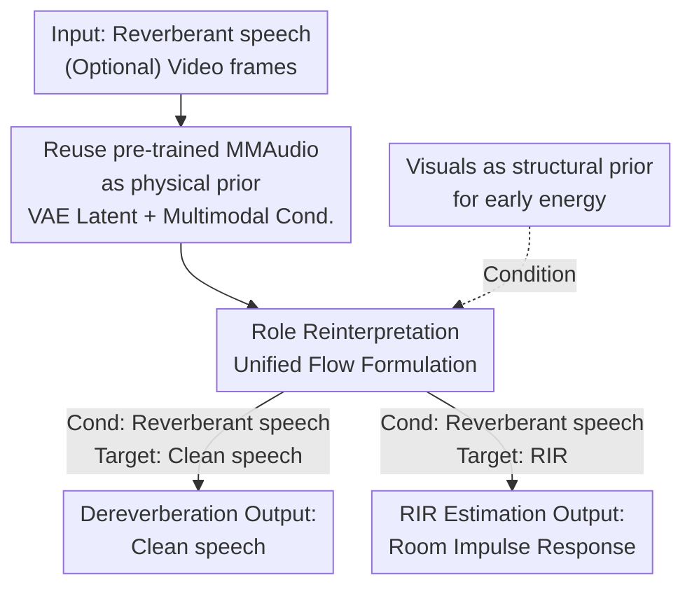

# MMAudioReverbs: Video-Guided Acoustic Modeling for Dereverberation and Room Impulse Response Estimation

**Conference**: CVPR 2026  
**arXiv**: [2605.00431](https://arxiv.org/abs/2605.00431)  
**Code**: None  
**Area**: Audio & Speech / Multimodal  
**Keywords**: Video-to-Audio, Dereverberation, Room Impulse Response, Flow Matching, Physical Priors

## TL;DR
This paper discovers that the pre-trained Video-to-Audio (V2A) foundation model MMAudio implicitly encodes the relationship between "visuals $\leftrightarrow$ room acoustics." By **maintaining the network architecture** and fine-tuning only on small datasets, the authors repurpose it into a unified framework for both dereverberation and Room Impulse Response (RIR) estimation. The experiments reveal a functional division: "visuals primarily assist early energy, while late reverberation depends on acoustics."

## Background & Motivation

**Background**: Recent V2A models (e.g., MMAudio) can synthesize semantically reasonable sounds from video frames with high perceptual realism. Room acoustic modeling (dereverberation, RIR estimation) remains a fundamental component for applications such as speech enhancement, virtual acoustics, and video dubbing.

**Limitations of Prior Work**: V2A models pursue "content/perceptual similarity" but **do not explicitly model room acoustic effects** (reverberation, RIR), leading to a lack of controllability over these phenomena. Conversely, existing vision-guided acoustic methods (geometry-aware RIR, material-aware modeling, etc.) design **task-specific architectures** to inject geometric or material priors, resulting in high migration and reuse costs for each task.

**Key Challenge**: A gap exists between general large models that "understand visuals but lack physical acoustics" and specialized methods that "understand physical acoustics but require non-general specialized architectures."

**Goal**: To verify the hypothesis that SOTA V2A foundation models **have already implicitly encoded the relationship between visual cues and room acoustic properties** (room geometry, spatial layout, materials, source-receiver relationships), allowing them to be directly "borrowed" for physically-grounded acoustic tasks without architectural modifications.

**Key Insight**: Inspired by MMAudioSep, the authors argue that MMAudio has "incidentally" learned information such as scene layout, object placement, and source-receiver relationships during large-scale V2A pre-training. Since it understands "how the room looks and how sound propagates," it can serve as a **source of physical priors**.

**Core Idea**: Treat the pre-trained V2A model as an off-the-shelf physical prior. **Without changing the architecture, only fine-tuning is performed**. By **reinterpreting the roles of "conditional signals" and "target trajectories"** within the same flow-matching formulation, the same set of parameters can simultaneously handle two inverse/conditional generation tasks: dereverberation and RIR estimation.

## Method

### Overall Architecture
The core proposition of the method is: "Keep the MMAudio network intact, only swap its input-output roles in the flow, and fine-tune." The input consists of reverberant speech (optionally with corresponding video frames), and the output is either clean speech (dereverberation) or a room impulse response (RIR estimation) depending on the task. The framework reuses three components of MMAudio: the latent space of the pre-trained audio VAE, the unified multimodal conditional interface, and the flow-matching generative dynamics. Both tasks share the same learnable parameters and architectural components; the only difference lies in "which serves as the condition and which serves as the target latent trajectory"—conceptually replacing the interface in the top-right of the MMAudio diagram with dereverberation or RIR estimation connections.

### Key Designs

**1. Repurposing pre-trained V2A as physical prior with zero architectural changes**

To address the contradiction between general V2A models and specialized acoustic architectures, this work utilizes SOTA MMAudio as a backbone **without changing a single line of architecture**. It is fine-tuned on a small dataset (SoundSpaces-Speech, 2.56s segments, 20k steps). This is feasible based on the hypothesis that MMAudio implicitly learned scene layouts and source-receiver relationships during pre-training. Experimental evidence supports this: fine-tuning from pre-trained weights achieves lower RTE in dereverberation and better RIR metrics compared to training from scratch (Scratch), proving that pre-trained representations provide a beneficial starting point for room acoustics.

**2. Role reinterpretation under a unified Flow formulation for dual-task capability**

The key insight is that **the same flow dynamics can be reused across tasks without re-parameterization**, expressing both inverse mapping and conditional generation. Instead of modeling each task separately, the authors instantiate different tasks by **reinterpreting the roles of "conditional signals" and "target latent trajectories."** Dereverberation is modeled as a conditional mapping "from reverberant speech to clean speech" to suppress acoustic inconsistencies. RIR estimation is modeled as "generating a consistent RIR conditioned on reverberant audio." At inference, classifier-free guidance (CFG) is disabled because it introduces stochasticity that reduces the precision required for physical estimation tasks.

**3. Visuals as structural priors for early energy, complementary to acoustic evidence**

To clarify the contribution of vision, the paper compares two settings at inference: Audio-only (A) vs. Audio+Visual (A+V). The conclusion is that **visuals primarily act as structural priors for early sound propagation, while late reverberation is fundamentally determined by acoustic evidence**. Physically, late reverberation (e.g., RT60) is dominated by accumulated time-domain acoustic evidence, whereas early energy and the direct-to-reverberation ratio (DRR) are strongly correlated with scene layout and source-receiver geometry. The evidence shows that in RIR estimation, adding visuals significantly reduces DRR error (benefiting early energy), while RT60 metrics are sometimes better in the A-only setting.

## Key Experimental Results

The dataset is SoundSpaces-Speech (16 kHz, panoramic RGB cropped to 120° views). BigVGAN is used as the vocoder, and the two tasks are trained separately. "A" denotes audio-only, "A+V" denotes audio + visual.

### Main Results

**Dereverberation (Table 1a)**: ↑ higher is better, ↓ lower is better.

| Method | Modality | SRMR↑ | RT60(ms)↓ | RTE(ms)↓ | DNSMOS-OVRL↑ |
|------|------|-------|-----------|----------|--------------|
| Clean (Ref) | – | 7.26 | 39.4 | – | 3.19 |
| Reverberant (Input) | – | 4.75 | 403.1 | 363.9 | 2.09 |
| WPE | A | 5.97 | 137.2 | 127.3 | 2.34 |
| VIDA | A+V | 6.54 | 78.2 | 56.2 | 2.62 |
| Ours (Scratch) | A | 7.22 | 30.1 | 29.4 | 3.24 |
| Ours (Finetune) | A | 7.27 | **27.1** | **28.7** | 3.24 |
| Ours (Finetune) | A+V | **7.29** | 27.2 | 28.9 | 3.24 |

Ours significantly reduces RTE from VIDA's 56.2 ms to 28.7 ms. Some metrics even exceed the "Clean" reference, suggesting the model suppresses residual noise in the original clean signals. Fine-tuning vs. Scratch proves the value of pre-trained initialization.

**RIR Estimation (Table 1b)**: $\Delta$ denotes absolute error compared to reference RIR parameters (lower is better).

| Method | Modality | $\Delta$RT60(ms)↓ | $\Delta$DRR(dB)↓ | $\Delta$EDT(ms)↓ |
|------|------|-----------|-----------|-----------|
| Image2Reverb | V | 131.7 | 4.94 | 382.1 |
| FiNS | A | 87.7 | 3.30 | 235.7 |
| S2IR-GAN | A | 63.1 | 3.04 | 168.3 |
| AV-RIR | A | 88.8 | 2.96 | 122.4 |
| AV-RIR | A+V | 40.2 | 1.76 | 77.2 |
| Ours (Finetune) | A | 51.6 | 2.40 | **41.9** |
| Ours (Finetune) | A+V | 60.0 | 2.36 | 47.5 |

Ours significantly outperforms AV-RIR (A+V) in $\Delta$EDT (41.9 ms vs 77.2 ms). Notably, A-only is better for the late reverb metric $\Delta$RT60, while A+V is slightly better for the early energy metric $\Delta$DRR.

### Ablation Study

| Configuration | Phenomenon | Explanation |
|------|------|------|
| Finetune vs Scratch | Lower errors for weights (RIR $\Delta$RT60 78.9 $\rightarrow$ 51.6) | Pre-trained representations are beneficial initializations. |
| A vs A+V (Dereverb) | Nearly identical (RTE 28.7 vs 28.9) | Acoustic conditions are sufficient; visuals are redundant. |
| A vs A+V (RIR Early) | Lower $\Delta$DRR for A+V (2.40 $\rightarrow$ 2.36) | Visuals provide structural priors for early energy. |
| A vs A+V (RIR Late) | Lower $\Delta$RT60 for A-only (51.6 vs 60.0) | Late reverb is dominated by time-domain acoustic evidence. |
| CFG On/Off | Disable CFG | CFG introduces stochasticity, reducing estimation precision. |

### Key Findings
- **Pre-trained initialization is effective**: The contrast between Scratch and Fine-tuning is the critical ablation. RIR estimation $\Delta$RT60 dropped from 78.9 to 51.6, proving MMAudio's multimodal pre-training encodes physical priors beneficial for acoustics.
- **Boundaries of visual utility**: Visuals only provide gains for early energy/direct-to-reverberant ratio ($\Delta$DRR) and have little benefit for late reverberation (RT60).
- **Invisibility of sources limits vision**: Sources are often not visible in frames, making it difficult to infer source-receiver distance from visuals alone.

## Highlights & Insights
- **Repurposing foundation models with zero architecture changes**: This paradigm transforms a generative model into two physical estimators by simply reinterpreting flow roles and fine-tuning on small data.
- **Quantifying modality contributions**: Instead of a vague "visuals help," this work uses split metrics (DRR vs RT60) to provide the interpretable conclusion that "visuals = early structural prior, acoustics = late dominant."
- **Unified flow for inverse problems and conditional generation**: The same flow-matching framework handles both "Reverb $\rightarrow$ Clean" inverse mapping and "Audio $\rightarrow$ RIR" generation.

## Limitations & Future Work
- **Conceptual description lacks formal detail**: The paper (in short-form) lacks formal mathematical definitions for the role reinterpretation.
- **Small, single dataset**: Validation is limited to SoundSpaces-Speech (simulated, 16 kHz), leaving generalization to real-world RIRs or higher sample rates uncertain.
- **Vision limited by source visibility**: The inability to see sound sources limits visual modeling of source-receiver relationships.
- **Lack of subjective evaluation**: No subjective MOS testing was conducted for the dereverberation task.

## Related Work & Insights
- **vs. V2A Generative Models (MMAudio)**: These pursue perceptual realism; Ours extracts the implicit physical knowledge from these models.
- **vs. Specialized Acoustic Methods (AV-RIR / Image2Reverb)**: These use specialized architectures; Ours validates that a general V2A model can implicitly provide superior priors.
- **vs. MMAudioSep**: MMAudioSep showed V2A models encode spatial relationship; this work extends that hypothesis to physical acoustic tasks.

## Rating
- Novelty: ⭐⭐⭐⭐ Repurposing a V2A foundation model for physical acoustics via role reinterpretation is a clever perspective.
- Experimental Thoroughness: ⭐⭐⭐ Good dual-task and modality ablations, but limited by a single simulated dataset and lack of subjective tests.
- Writing Quality: ⭐⭐⭐⭐ Clear motivation and insights, though formal methodological details are slightly thin.
- Value: ⭐⭐⭐⭐ The "visuals for early, acoustics for late" conclusion provides practical guidance for multimodal acoustic modeling.

<!-- RELATED:START -->

## Related Papers

- [\[ICLR 2026\] AC-Foley: Reference-Audio-Guided Video-to-Audio Synthesis with Acoustic Transfer](../../ICLR2026/audio_speech/ac-foley_reference-audio-guided_video-to-audio_synthesis_with_acoustic_transfer.md)
- [\[CVPR 2026\] Hearing the Room Through the Shape of the Drum: Modal-Guided Sound Recovery from Multi-Point Surface Vibrations](hearing_the_room_through_the_shape_of_the_drum_modal-guided_sound_recovery_from_.md)
- [\[CVPR 2025\] MultiFoley: Video-Guided Foley Sound Generation with Multimodal Controls](../../CVPR2025/audio_speech/video-guided_foley_sound_generation_with_multimodal_controls.md)
- [\[CVPR 2026\] Semantic Noise Reduction via Teacher-Guided Dual-Path Audio-Visual Representation Learning](semantic_noise_reduction_via_teacher-guided_dual-path_audio-visual_representatio.md)
- [\[CVPR 2026\] SAVE: Speech-Aware Video Representation Learning for Video-Text Retrieval](save_speech-aware_video_representation_learning_for_video-text_retrieval.md)

<!-- RELATED:END -->
