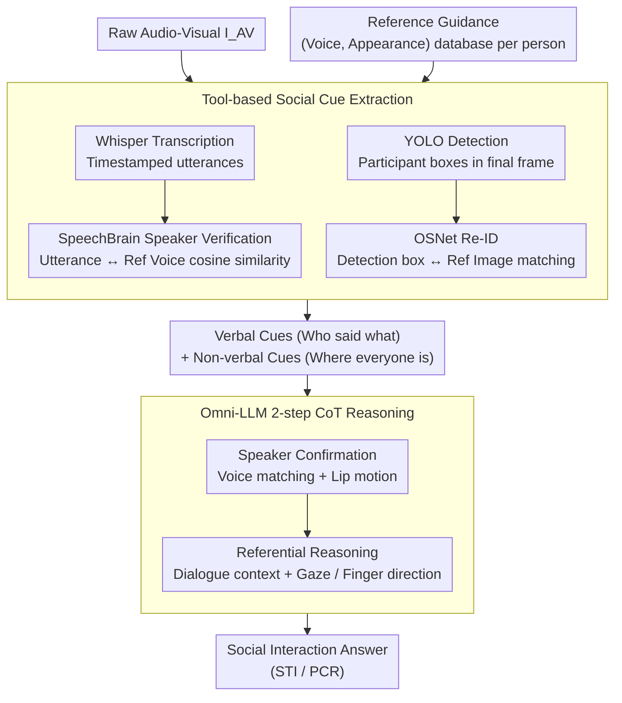

# Omni-MMSI: Toward Identity-Attributed Social Interaction Understanding

**Conference**: CVPR 2026  
**arXiv**: [2604.00267](https://arxiv.org/abs/2604.00267)  
**Code**: [Project Page](https://sampson-lee.github.io/omni-mmsi-project-page)  
**Area**: Audio-Speech / Social Understanding  
**Keywords**: Social Interaction Understanding, Identity Attribution, Multimodal Reasoning, Chain-of-Thought, Reference-guided  

## TL;DR

Ours proposes the Omni-MMSI task—understanding multi-person social interactions from raw audio-visual inputs rather than pre-processed oracle social cues. It designs the Omni-MMSI-R reference-guided pipeline, achieving accurate social interaction understanding through tool-generated identity-attributed social cues combined with Chain-of-Thought (CoT) reasoning.

## Background & Motivation

Multimodal Multi-person Social Interaction (MMSI) understanding aims to interpret human behavior in social scenes, forming the foundation for social intelligent AI systems. While existing research (e.g., Speaker Target Identification STI, Pronominal Coreference Resolution PCR) has made significant progress, a fundamental assumption exists: **identity-attributed social cues are perfectly provided as oracle inputs**, meaning "who is saying what" and "where everyone is" are known a priori.

However, in real-world deployment, AI assistants must perceive and reason from raw audio-visual data. When switching from oracle inputs to raw inputs:
- Performance of previous pipelines (Lee et al., Li et al.) drops by an average of **28.1%**.
- Performance of human annotators and advanced Omni-LLMs (Qwen2.5 Omni, Gemini 2.5 Pro) also decreases by **9.52%**.

**Key Challenge is Identity Attribution**:
- **Visual Attribution**: Existing detectors are prone to identity swaps during occlusion or overlap in multi-person scenes (e.g., Gemini assigns identities based on left-to-right spatial order, leading to errors when detection fails).
- **Speech Attribution**: Post-ASR systems often fail to correctly match utterances with speakers (the recognized content is frequently attributed to the wrong person).

## Method

### Overall Architecture

Omni-MMSI shifts multi-person social interaction understanding from assuming "perfect oracle identity-attributed cues" to "perception from raw audio-visual data," where the bottleneck is identity attribution—identifying who is speaking and where they are. Omni-MMSI-R is a reference-guided LLM pipeline, formally defined as:

$$f: (P, I_{AV}, \mathcal{R}) \rightarrow X_{answer}$$

The input consists of a system prompt $P$, raw audio-visual data $I_{AV}$, and a reference set $\mathcal{R} = \{(a_i, v_i)\}_{i=1}^N$ (representative voice and appearance for each participant). The **Mechanism** involves: loading references $\rightarrow$ generating identity-attributed cues using specialized tools $\rightarrow$ performing CoT reasoning via Omni-LLM $\rightarrow$ outputting the answer. The core idea is to delegate "identity" to reliable specialized tools before performing social reasoning on attributed cues.

### Key Designs

**1. Reference Guidance: Profiling participants like acquaintances**

General LLMs frequently misattribute identities in multi-person occlusion scenarios. Omni-MMSI-R draws inspiration from the human ability to "associate after remembering appearance and voice." It constructs a reference pair for each participant by manually cropping upper-body images and extracting speech segments, totaling 69 audio-visual profiles. In deployment, these can be collected via device registration/verification, providing a baseline identity database for social reasoning.

**2. Tool-based Social Cue Extraction: Identifying via specialized models instead of LLMs**

Accurate identity attribution relies on task-specific tools. On the audio side, Whisper converts audio into timestamped utterance sequences, and SpeechBrain performs speaker verification by encoding utterances and references into embeddings to calculate cosine similarity. On the visual side, YOLO detects bounding boxes in the final frame, and OSNet performs Person Re-ID by matching boxes to reference images. These outputs form identity-attributed verbal and non-verbal cues for downstream reasoning.

**3. CoT Social Reasoning: Mapping cues to references via a two-step chain**

With attributed cues, the model must infer "who is talking to whom." Reasoning is designed as a two-step structured chain: first, Speaker Confirmation, which fuses voice matching and visible lip motion to lock the final speaker; second, Referential Reasoning, which combines verbal cues (context) and non-verbal signals (gaze, pointing) to infer the targeted object. CoT training data is generated via Gemini 2.5 Pro, followed by rejection sampling and manual review.

**4. Loss & Training: Lightweight fine-tuning on Qwen2.5-Omni**

The base model is Qwen2.5-Omni-7B, fine-tuned using LoRA (rank=8) via the LLaMA-Factory framework. It uses cross-entropy loss with a cosine learning rate scheduler, a learning rate of $1\times10^{-4}$, for 3 epochs with a 16,384 token context length. This allows the model to learn the two-step reasoning chain while preserving base multimodal perception.

### Loss & Training

Standard cross-entropy loss is used to train the model to generate both the reasoning process $X_{think}$ and the final answer $X_{answer}$:

$$X_{answer}, X_{think} = f_\theta^{\text{Omni-LLM}}(P, I_{AV}, \mathcal{R}, \mathcal{S})$$

## Key Experimental Results

### Main Results

**Social Interaction Understanding (Ego4D + YouTube)**:

| Method | Ego4D STI | Ego4D PCR | Ego4D Avg. | YouTube STI | YouTube PCR | YouTube Avg. |
|------|-----------|-----------|------------|-------------|-------------|--------------|
| Qwen2.5 Omni 7B | 26.29 | 28.57 | 27.43 | 14.00 | 26.18 | 20.09 |
| Gemini 2.5 Pro | 36.12 | 39.28 | 37.70 | 36.13 | 53.47 | 44.80 |
| Lee et al. | 28.98 | 32.14 | 30.56 | 29.01 | 34.80 | 31.91 |
| Li et al. | 29.73 | 32.27 | 31.00 | 26.30 | 30.14 | 28.22 |
| **Omni-MMSI-R** | **40.57** | **45.54** | **43.06** | **37.46** | **56.62** | **47.04** |

Omni-MMSI-R outperforms prior pipelines by over 12% on Ego4D and over 15% on YouTube.

**Identity Attribution Accuracy**:

| Method | Ego4D Verbal | Ego4D Non-verbal | Ego4D Avg. | YouTube Avg. |
|------|--------------|----------------|-----------|-------------|
| Gemini 2.5 Pro | 44.75 | 26.52 | 35.64 | 58.04 |
| Qwen3 Omni 30B | 52.61 | 57.61 | 55.11 | 55.14 |
| **Omni-MMSI-R** | **71.09** | **86.48** | **78.79** | **76.95** |

Omni-MMSI-R surpasses Omni-LLMs in identity attribution by approximately 23.7% (Ego4D) and 18.9% (YouTube).

### Ablation Study

**Reference-guided Input Configuration (Ego4D)**:

| Ref Audio | Ref Visual | Verbal Cue | Non-verbal Cue | Avg. Acc |
|----------|----------|----------|-----------|-----------|
| ✗ | ✗ | ✗ | ✗ | 33.97% |
| ✓ | ✓ | ✗ | ✗ | 35.98% |
| ✗ | ✗ | ✓ | ✓ | 39.44% |
| ✓ | ✓ | ✓ | ✓ | **43.06%** |

Raw references and tool-extracted cues are complementary; joint usage yields optimal performance.

**CoT Reasoning Granularity**:

| Config | Reasoning Steps | Avg. Acc |
|------|---------|-----------|
| W/ Ref | None | 39.41% |
| W/ Ref | 1-step (Referential) | 39.70% |
| W/ Ref | 2-step (Speaker + Referential) | **43.06%** |
| W/ Ref | 3-step (+ Extraction) | 34.43% |

**2-step CoT is optimal**. The 3-step approach causes a significant drop, as excessive reasoning chains distract the model and exceed its capacity.

### Key Findings

1. **Identity attribution is the core bottleneck** when moving from oracle to raw inputs: advanced Omni-LLMs are competent at extracting cues but fail significantly at associating them with specific individuals.
2. Reference guidance is more critical for smaller models (7B) than large ones. Small Omni-LLMs might drop in performance if they cannot effectively utilize raw reference info, highlighting the necessity of tool assistance.
3. LLMs do not blindly trust tools: by combining raw audio-visual evidence with extracted cues, the model can self-correct inaccurate cues during CoT reasoning.
4. Moderate reasoning granularity (2-step) is optimal; excessive decomposition is detrimental.
5. Audio and visual modalities are complementary: adding audio attribution alone gives +5.87%, visual alone gives +4.59%, and both give +9.09%.

## Highlights & Insights

- **The problem definition itself is valuable**: Advancing MMSI from oracle to raw input is a critical step toward real-world deployment.
- **Reference Guidance** is a practical design: Borrowing from face-unlock/voiceprint registration, it is feasible to collect references in deployment scenarios.
- **Tool + LLM Reasoning** is more reliable than pure end-to-end LLMs—task-specific tools (Whisper/YOLO/SpeechBrain/OSNet) far outperform general LLMs in identity attribution.
- The CoT granularity experiment provides practical insights: reasoning chain design must match model capacity and data volume.

## Limitations & Future Work

1. Reference pairs currently require manual construction; automated reference acquisition is an important future direction.
2. Overall accuracy remains relatively low (43% Ego4D, 47% YouTube), indicating a gap before real-world deployment.
3. CoT data generated via Gemini 2.5 Pro may introduce automated generation bias.
4. Validation is limited to Werewolf game datasets, lacking scene diversity.
5. Current toolchain errors propagate to downstream reasoning, necessitating more robust error-handling mechanisms.

## Related Work & Insights

- Direct extension of Lee et al. and Li et al. MMSI research—a paradigm shift from oracle to raw.
- First systematic exploration of LLM tool usage in social understanding, bridging MMSI and LLM agents.
- Demonstrates the value of structured reasoning for fine-grained multimodal understanding in social contexts.
- Insight for AI assistants: Identity tracking/attribution is a prerequisite for understanding social dynamics in multi-person scenarios.

## Rating

- Novelty: ⭐⭐⭐⭐ (Novel task definition, practical reference-guided design, though methodology leverages engineering integration over architecture).
- Experimental Thoroughness: ⭐⭐⭐⭐⭐ (Multiple baselines, LLM comparisons, detailed ablation, qualitative analysis).
- Writing Quality: ⭐⭐⭐⭐ (Clear motivation, quantitative evidence effectively demonstrates the oracle-raw gap).
- Value: ⭐⭐⭐⭐ (Drives the MMSI field toward more realistic scenarios).

<!-- RELATED:START -->

## Related Papers

- [\[CVPR 2026\] Multi-speaker Attention Alignment for Multimodal Social Interaction](multi-speaker_attention_alignment_for_multimodal_social_interaction.md)
- [\[ICLR 2026\] Human Behavior Atlas: Benchmarking Unified Psychological and Social Behavior Understanding](../../ICLR2026/audio_speech/human_behavior_atlas_benchmarking_unified_psychological_and_social_behavior_unde.md)
- [\[CVPR 2026\] OmniRet: Efficient and High-Fidelity Omni Modality Retrieval](omniret_efficient_and_high-fidelity_omni_modality_retrieval.md)
- [\[ICML 2026\] Towards Understanding Modality Interaction in Multimodal Language Models via Partial Information Decomposition](../../ICML2026/audio_speech/towards_understanding_modality_interaction_in_multimodal_language_models_via_par.md)
- [\[CVPR 2026\] HAVE-Bench: Hierarchical Audio-Visual Evaluation from Perception to Interaction](have-bench_hierarchical_audio-visual_evaluation_from_perception_to_interaction.md)

<!-- RELATED:END -->
