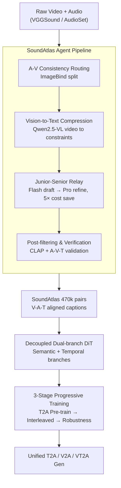

# Omni2Sound: Towards Unified Video-Text-to-Audio Generation

**Conference**: CVPR 2026  
**Paper**: [CVF Open Access](https://openaccess.thecvf.com/content/CVPR2026/html/Dai_Omni2Sound_Towards_Unified_Video-Text-to-Audio_Generation_CVPR_2026_paper.html)  
**Code**: Project Page https://omni2sound.github.io  
**Area**: Diffusion Models / Audio Generation / Multimodal VLM  
**Keywords**: Unified Audio Generation, Video-Text-to-Audio, Diffusion Transformer, Dataset Construction, Multi-task Training

## TL;DR
This paper aims to train a **single model to simultaneously excel** in video-to-audio (V2A), text-to-audio (T2A), and video-text-to-audio (VT2A). The research identifies two primary hurdles: the scarcity of high-quality V-A-T aligned captions and the competition between/within tasks. To address these, the authors developed SoundAtlas, a dataset of 470k pairs of tightly aligned captions generated via an agent-based labeling pipeline. This is combined with Omni2Sound, a decoupled dual-branch DiT model with a three-stage progressive training strategy, achieving SOTA performance across all three tasks using a standard DiT backbone.

## Background & Motivation
**Background**: Audio generation is shifting from single-modality conditions to unified frameworks. T2A offers strong semantic fidelity but lacks dense temporal control, while V2A provides good temporal synchronization but struggles with complex scene reasoning and often generates unwanted music or vocals. VT2A utilizes both video and text, offering balanced semantics and timing, but is **heavily dependent on the presence of both inputs**; missing one (e.g., only video or only text) results in severe degradation. Developing a unified model that natively supports VT2A/V2A/T2A is a natural progression in AIGC to avoid switching between multiple specialized models.

**Limitations of Prior Work**: The authors identify two overlooked fundamental challenges in unified VT2A frameworks. First is the **scarcity of high-quality captions**—many existing works use captions generated purely from audio for video, leading to **semantic conflict** between visual content and audio-derived captions (e.g., fireworks vs. tennis hits, or car engines vs. electric drills). This mismatch, compounded by hallucinations in early audio-language models, leads to unstable convergence and reduced fidelity. Second is **task competition**: across tasks, a zero-sum trade-off exists between V2A and T2A; within VT2A, modality bias occurs (leaning toward text results in poor sync, while leaning toward video leads to poor off-screen text fidelity).

**Key Challenge**: A unified model seeks to balance all aspects, but insufficient data quality and natural heterogeneity between tasks cause joint training to become a zero-sum game.

**Goal**: (1) Create a large-scale dataset with tightly aligned V-A-T captions; (2) Design a unified model and training scheme that converts competition into collaboration and suppresses modality bias.

**Key Insight**: The primary observation is that **vision should be treated as a "contextual constraint" rather than the "primary input"**, and **high-quality VT2A data can serve as a "semantic bridge"** connecting heterogeneous video/text feature spaces, turning zero-sum competition into collaboration.

**Core Idea**: A pipeline that compresses video into text constraints, followed by primary/senior agent-based generation and multi-step filtering, is used to create highly aligned captions. This is paired with a three-stage curriculum (T2A pre-training → multi-task interleaving → robustness training) to unify three tasks within a single DiT.

## Method

### Overall Architecture
The approach consists of two main components: first, **SoundAtlas data construction**, which provides human-expert level, V-A-T tightly aligned captions (470k pairs) for raw videos in VGGSound/AudioSet; second, the **Omni2Sound model**, a standard DiT backbone utilizing decoupled dual-branch blocks to inject multimodal conditions, trained via a three-stage progressive curriculum to support flexible T2A / V2A / VT2A generation. The data pipeline addresses "dirty captions," while the decoupled architecture and three-stage training solve the modality and task competition issues.

### Key Designs

**1. SoundAtlas Agent Pipeline: Vision as constraint for high alignment and cost efficiency**

To solve the conflict between audio-only captions and visual content, a four-step pipeline was designed. First, **A-V Consistency Routing**: ImageBind alignment scores $s_{ib}$ categorize samples—$s_{ib}>0.30$ enters the "enhanced path" (reliable vision), $0.20\le s_{ib}\le 0.30$ enters the "audio-only path" (vision is discarded to prevent hallucination), and $s_{ib}<0.20$ is discarded. Second, **Vision-to-Text Compression**: For enhanced samples, Qwen2.5-VL processes video alone to generate a text representation $c_v = \mathrm{Qwen}(V)$, replacing expensive raw video input with a cheaper "text-audio" prompt. Since only semantic context is provided (e.g., "a man and woman standing"), **direct visual bias is removed**. Third, **Junior-Senior Agent Relay**: Each sample is first processed by a junior agent $G_{junior}$ (Gemini 2.5 Flash), which takes audio $A$ and optional visual context $c_v$ to produce caption $c_a$. Only if $c_a$ meets complexity standards, contains hallucinations, or $\mathrm{CLAP}(c_a, A)<\tau_{clap}$ (default $\tau_{clap}=0.35$; music $0.15$) is it upgraded to a senior agent $G_{senior}$ (Gemini 2.5 Pro), saving **5×** cost. Fourth, **Post-filtering**: CLAP(T-A) filters unfaithful captions, and an A-V-T validator checks if enhanced samples are acoustically consistent with $c_v$.

**2. Decoupled Dual-branch DiT: Separating "What" from "When" for flexible modality degradation**

To ensure semantic fidelity and temporal sync while supporting single-modality inputs, the DiT backbone decouples multimodal conditions into **two branches**. The **Semantic Branch (What)** handles global semantics by concatenating Flan-T5 text embeddings $F_t$ and CLIP visual features $F_v$ (sampled at 8 fps) along the temporal dimension, injected via cross-attention. This concatenation allows for **single-modality generation (V2A or T2A) by simply omitting the absent modality without padding constraints**. The **Temporal Branch (When)** handles fine-grained synchronization using Synchformer to extract dense visual temporal features $F_s$, injected via AdaLN. 

**3. Three-stage Progressive Training: Turning competition into collaboration**

Standard joint training suffers from both cross-task and intra-task competition. The authors use three stages. **Stage 1: Large-scale T2A Pre-training**: Learns a robust generation prior on text-audio pairs using standard L2 denoising loss $L = \mathbb{E}_{t,z_t,\epsilon}\lVert \epsilon - \epsilon_\theta(z_t, t, H_c)\rVert^2$. **Stage 2: Multi-task Interleaved Training**: In each step, a **single** task $s\in\{V2A, T2A, VT2A\}$ is sampled from a categorical distribution $\mathrm{Cat}(\pi)$, performing one gradient update. High-alignment **VT2A data acts as a "semantic bridge"**, converting the V2A↔T2A zero-sum game into collaborative optimization. **Stage 3: Robustness Training**: Two complementary augmentations combat modality bias: **Text Dropout** forces the model to attend to vision for sync, while **Off-screen Synthesis** includes samples where audio content is not in the frame but described in text, forcing the model to prioritize text cues for off-screen sounds. This stage must occur **after** Stage 2 convergence.

## Key Experimental Results

### Caption Quality (Data Side)
SoundAtlas outperforms existing automatic pipelines and human experts in semantic fidelity (CLAP) and quality:

| Pipeline | AudioSet LA-CLAP↑ | VGGSound LA-CLAP↑ | MLLM Judge MWR-S↑ |
|---|---|---|---|
| AudioSetCaps | 0.330 | 0.351 | — |
| Auto-ACD | 0.396 | 0.409 | 0.39 |
| Human-Expert (AudioCaps) | — | — | 0.36 |
| **SoundAtlas (Ours)** | **0.447** | **0.461** | **0.75** |

The semantic win rate for SoundAtlas is 0.75, significantly higher than Auto-ACD (0.39) and human expert annotations (0.36).

### Main Results
On the VGGSound-Omni benchmark, Omni2Sound achieves SOTA across all tasks:

| Task | Method | FAD↓ | FD↓ | DS↓ | IB↑ | CLAP↑ |
|---|---|---|---|---|---|---|
| T2A | MMAudio | 1.63 | 8.62 | — | — | 0.50 |
| T2A | **Ours** | **1.01** | **4.61** | — | — | **0.53** |
| V2A | MMAudio | 0.81 | 5.65 | 0.48 | 0.28 | 0.43 |
| V2A | **Ours** | **0.51** | **3.41** | **0.47** | **0.35** | **0.44** |
| VT2A | MMAudio | 0.91 | 5.28 | 0.49 | 0.29 | 0.49 |
| VT2A | **Ours** | **0.53** | **2.95** | 0.49 | **0.34** | **0.52** |

### Ablation Study
| Configuration | Result Insight |
|---|---|
| TA+VA, $\pi_{T2A}$ 0.20→0.40 | T2A FAD improves (1.36→1.06), but V2A FAD worsens (0.56→0.62), confirming the zero-sum trade-off. |
| **+ SoundAtlas VTA\* (Bridge)** | Best across all: T2A FAD **0.94**, V2A FD **3.61**, VT2A FD **2.83**. Bridge data resolves competition. |
| Replace with low-quality TA/VTA | T2A FAD 1.13 (significantly worse). Quality matters, not just the task presence. |
| Stage 1 → [Stage 2 + Stage 3] | V2A FD 3.81 (worse than full version). Premature robustness training disrupts stability. |
| **S1→S2→S3 (Full)** | Optimal across all metrics (V2A FAD **0.51** / IB **0.35**). |

### Key Findings
- **Bridge effect depends on data quality**: Introducing the VT2A task only resolves the V2A-T2A competition if using high-alignment data (SoundAtlas); low-quality audio-only captions still cause degradation.
- **Stage order is critical**: Mixing robustness (S3) with multi-task training (S2) degrades metrics; S3 must follow S2 convergence.
- **Pre-training leads to data efficiency**: The T2A prior from S1 allows the T2A sampling rate in S2 to drop to 0.1 without catastrophic forgetting.

## Highlights & Insights
- **Vision as constraint, not primary input**: Compressing video into text via VLM reduces visual reasoning costs and removes direct visual bias/hallucinations.
- **VT2A data as a "Semantic Bridge"**: A compelling training perspective that shows how high-quality aligned data can unify heterogeneous tasks instead of causing them to compete.
- **Decoupled dual-branches for flexible degradation**: The design allows for single-modality generation by simply omitting branches, a scalable approach for any multimodal task.

## Limitations & Future Work
- **Dependency on closed-source models**: Dataset construction relies heavily on Gemini and Qwen, limiting reproducibility; routing/filtering thresholds are empirical.
- **Domain gaps**: Performance lags slightly behind HunyuanVideo-Foley on specific benchmarks due to the latter's 50x larger training volume.
- **Off-screen sync**: Modality bias remains a challenge and requires specific robustness training stages, indicating fragility under highly asymmetric inputs.

## Related Work & Insights
- **vs. MMAudio**: MMAudio is V2A-centric and treats T-A as an augmentation; Ours treats T2A as an equal task and resolves competition via three-stage training.
- **vs. AudioX**: AudioX uses brute-force data (9M samples) and ignores task competition; Ours achieves SOTA with high-quality bridge data and a standard DiT.
- **vs. UniFlow-Audio**: UniFlow analyzes task competition but lacks VT2A integration; Ours bridges the gap between temporal and non-temporal alignment tasks.

## Rating
- Novelty: ⭐⭐⭐⭐⭐ 
- Experimental Thoroughness: ⭐⭐⭐⭐⭐ 
- Writing Quality: ⭐⭐⭐⭐ 
- Value: ⭐⭐⭐⭐⭐ 

<!-- RELATED:START -->

## Related Papers

- [\[CVPR 2026\] OmniSonic: Towards Universal and Holistic Audio Generation from Video and Text](omnisonic_towards_universal_and_holistic_audio_generation_from_video_and_text.md)
- [\[ACL 2026\] UniSonate: A Unified Model for Speech, Music, and Sound Effect Generation with Text Instructions](../../ACL2026/audio_speech/unisonate_a_unified_model_for_speech_music_and_sound_effect_generation_with_text.md)
- [\[CVPR 2025\] VinTAGe: Joint Video and Text Conditioning for Holistic Audio Generation](../../CVPR2025/audio_speech/vintage_joint_video_and_text_conditioning_for_holistic_audio_generation.md)
- [\[CVPR 2026\] Echoes Over Time: Unlocking Length Generalization in Video-to-Audio Generation Models](echoes_over_time_unlocking_length_generalization_in_video-to-audio_generation_mo.md)
- [\[CVPR 2026\] Hear What You See: Video-to-Audio Generation with Diffusion Transformer and Semantic-Temporal Alignment-Ranked Direct Preference Optimization](hear_what_you_see_video-to-audio_generation_with_diffusion_transformer_and_seman.md)

<!-- RELATED:END -->
