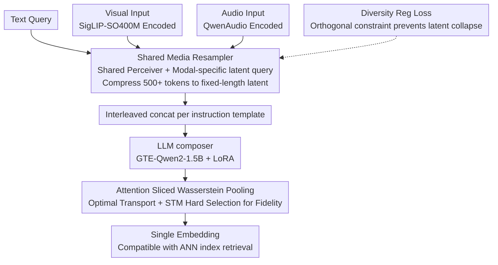

# OmniRet: Efficient and High-Fidelity Omni Modality Retrieval

**Conference**: CVPR 2026  
**arXiv**: [2603.02098](https://arxiv.org/abs/2603.02098)  
**Code**: [hmchuong/omniret](https://github.com/hmchuong/omniret)  
**Area**: Audio and Speech  
**Keywords**: omni-modal retrieval, multimodal embedding, Sliced Wasserstein, composed query, audio retrieval

## TL;DR

Ours proposes OmniRet, the first unified retrieval model supporting text-vision-audio tri-modal composed queries. It enhances computational efficiency via a Shared Media Resampler and introduces Attention Sliced Wasserstein Pooling (ASWP) to preserve fine-grained information, achieving leading results on 12 out of 13 retrieval tasks.

## Background & Motivation

**Background**: Information retrieval has evolved from single-modality (e.g., text search) to complex scenarios requiring composed queries across heterogeneous data such as images, videos, audio, and text. Existing systems struggle to cover more than two modalities.

**Limitations of Prior Work**: Classical models like CLIP, BLIP, and CLAP only support alignment between two modalities (text-vision or text-audio) and cannot handle composed queries involving three modalities simultaneously.

**Key Challenge**: Compressing rich multi-modal inputs into a single embedding vector causes significant information loss. Simple mean pooling or [EOS] token methods discard fine-grained information from LLM outputs.

**Computational Efficiency**: Media encoder token sequences often exceed 500, leading to a computational explosion when fed directly into an LLM. This restricts training batch sizes and weakens the effectiveness of contrastive learning.

**Key Insight**: Methods like ColBERT that retain token-level embeddings offer high fidelity but incur excessive storage and computational costs, making them unsuitable for large-scale retrieval systems.

**Goal**: There is a lack of systematic evaluation benchmarks for composed audio retrieval (audio+text→audio) and audio-visual retrieval (audio→image/video), which limits research development in this direction.

## Method

### Overall Architecture

OmniRet employs GTE-Qwen2-1.5B-Instruct as the core LLM acting as a cross-modal composer. Visual inputs are encoded by SigLIP-SO400M, and audio inputs by QwenAudio Encoder. Tokens from each modality are compressed by a Shared Media Resampler, interleaved according to instruction templates, and fed into the LLM. Finally, ASWP aggregates LLM outputs into a single embedding for retrieval. Training only updates the resampler, projection layers, pooling layer, and LLM LoRA (rank=16), with approximately 84M trainable parameters.

### Key Designs

**1. Shared Media Resampler: Compressing hundreds of tokens to fixed-length latents via modal-specific queries**

Token sequences from encoders often exceed 500, which would explode computation and crush training batch sizes. OmniRet uses a Perceiver architecture to resample these tokens into a fixed number of compact latent vectors. The **Core Idea** is sharing a single Perceiver module while providing independent sets of latent queries for each modality—sharing the backbone ensures cross-modal generalization, while specific queries preserve modality specificity. Video inputs undergo 3D trilinear interpolation to remove frame-level redundancy before resampling. This keeps sequence lengths controllable without the information loss typical of simple pooling.

**2. Attention Sliced Wasserstein Pooling (ASWP): Compressing to a single vector via optimal transport to retain fine-grained details**

When compressing LLM outputs into a single embedding, mean pooling or [EOS] tokens lose significant fine-grained information, while ColBERT-style late interaction is too costly. ASWP uses an attention resampler to compress LLM outputs into $S$ latent embeddings $\mathbf{Z}$, treated as a distribution. By calculating the Monge coupling distance between $L$ 1D projection directions and $S$ learnable reference points $\mathbf{X}$, an intermediate representation $\mathbf{Z}' \in \mathbb{R}^{S \times L}$ is obtained. A Straight-Through Maximum (STM) technique then generates a binary attention mask to select the most relevant reference point for each projection direction. Column summation yields the final $L$-dimensional embedding ($L=4096, S=128$). The output remains a single vector compatible with ANN indices but preserves token-level structure via optimal transport.

**3. Diversity Regularization Loss: Forcing resampled tokens to capture distinct information**

If resampled tokens are highly similar, the compression is inefficient. Therefore, an orthogonality constraint is applied to the output vectors $\mathbf{M}$ by calculating the pairwise similarity matrix $\mathbf{MM}^\top$, removing diagonal self-similarity, and penalizing non-orthogonality using Smooth L1 loss ($\gamma=0.5$) after Dropout sparse sampling. Dropout ensures efficiency by calculating the loss on random subsets while globally encouraging diversity, ensuring each latent captures different information.

**4. Two-stage Training Strategy: Warm-up alignment followed by full fine-tuning**

Directly fine-tuning the LLM is expensive and unstable. Stage 1 (Warm-up) trains only the projection layers, resampler, and pooling layer on single-modality and text-bound tasks with the LLM frozen (batch size 2048, 2M samples). Stage 2 (Fine-tuning) continues training across all 30 datasets (6.2M query-target pairs) with LoRA fine-tuning for the LLM (batch size 3072, randomly selecting 4 tasks per batch with 2-step gradient accumulation, 18M samples total).

## Loss & Training

The total loss is a weighted combination of three terms:

$$\mathcal{L} = \mathcal{L}_{\text{cont}} + \mu_1 \mathcal{L}_{\text{triplet}} + \mu_2 \mathcal{L}_{\text{div}}$$

- $\mathcal{L}_{\text{cont}}$: Hard-negative InfoNCE contrastive loss, temperature $\tau=0.07$, adaptive weight $\beta=0.5$.
- $\mathcal{L}_{\text{triplet}}$: Hinge-based triplet loss, margin $\eta=0.1$.
- $\mathcal{L}_{\text{div}}$: Diversity regularization loss.
- Weights: $\mu_1=1, \mu_2=0.1$.

## Key Experimental Results

### Table 1: Recall Comparison across 13 Extended M-BEIR Tasks (1.5B Model)

| Model | I→I | T→T | I→T | T→I | V→T | T→V | A→T | T→A | T→I,T | I,T→T | I,T→I | I,T→I,T | V,T→V |
|------|------|------|------|------|------|------|------|------|-------|-------|-------|---------|-------|
| VLM2VecV2 | 30.0 | 81.1 | 43.4 | 39.8 | 17.6 | 18.4 | - | - | 61.6 | 24.5 | 28.7 | 33.6 | 76.4 |
| **Ours** | 24.4 | **86.7** | **50.6** | **46.9** | **43.8** | **43.2** | **66.8** | **62.4** | **70.5** | **44.4** | **36.5** | **64.8** | **86.2** |

OmniRet leads in 12 out of 13 tasks, outperforming specialized models in audio and video tasks.

### Table 2: Generalization Performance on MMEBv2 Subset (Recall@1)

| Model | Image CLS | Image RET | Video CLS | Video RET | Video MRET |
|------|-----------|-----------|-----------|-----------|------------|
| VLM2VecV2 | 62.9 | 69.5 | 39.3 | 28.8 | 38.5 |
| **Ours** | 51.7 | 65.3 | **48.6** | **36.5** | **43.3** |

Ours achieves SOTA in video tasks and maintains median performance in image tasks despite not using their training data.

### Table 3: ACM Benchmark (Recall@5)

| Model | A,T→A | A→V | V→A | A→I | I→A |
|------|-------|-----|-----|-----|-----|
| ImageBind | 7.32 | **35.5** | **36.3** | **30.1** | **29.7** |
| **Ours** | **23.0** | **35.5** | 34.4 | 24.5 | 26.0 |

Ours significantly leads in composed audio retrieval (A,T→A) and is competitive with ImageBind in audio-visual tasks.

### Ablation Study

- Removing ASWP and using [EOS] vector: Recall dropped by **6.8%**.
- Removing Media Resampler: Dropped by **3.5%**.
- Removing $\mathcal{L}_{\text{div}}$: Dropped by **3.1%**.
- Replacing STM with Average Pooling in ASWP: Dropped by **29.5%**, indicating "hard selection" is critical for fidelity.

## Highlights & Insights

- **First Unified Tri-modal Retrieval**: Realizes composed retrieval for text+vision+audio for the first time, filling the gap for audio in general retrieval.
- **Efficiency and Fidelity Balance**: The Shared Media Resampler compresses 500+ tokens into fixed latents, while ASWP preserves token-level details in a single-vector format compatible with ANN indices.
- **New Benchmark Contribution**: Constructs the ACM Benchmark to introduce composed audio retrieval and audio-visual retrieval, validated by human evaluation.
- **Experimental Thoroughness**: Extensive ablations covering embedding types, projection counts, pooling methods, and loss functions quantify the contribution of each component.

## Limitations & Future Work

- Limited by computational resources, scaling effects with larger LLM backbones and more training data have not been explored.
- Only covers text/vision/audio; extension to depth maps, 3D point clouds, and speech is pending.
- The ACM Benchmark scenarios are relatively simple and do not involve complex retrieval of interleaved mixed-media documents.
- A performance gap remains in single-modality image retrieval (I→I) compared to specialized models like PE-Core (24.4 vs 32.0).

## Related Work & Insights

- **Multimodal Embedding**: CLIP/BLIP series focus on text-vision alignment; CLAP focuses on text-audio; ImageBind attempts a six-modality joint space but lacks computational efficiency.
- **General Multimodal Retrieval**: UniIR pioneered universal retrievers trained on multiple datasets; VLM2Vec utilize VLMs for embedding; MMEmbed leverages LLM instruction-following.
- **Embedding Pooling**: Evolves from mean pooling/[EOS] to ColBERT's late interaction and NV-Embed's learnable queries. OmniRet's ASWP finds a balance between single-vector formats and late interaction.

## Rating

- Novelty: ⭐⭐⭐⭐ — First unified tri-modal retrieval framework; ASWP and ACM Benchmark are original contributions.
- Experimental Thoroughness: ⭐⭐⭐⭐ — Comprehensive evaluation across 13+ tasks, MMEBv2 generalization, new benchmark, and five ablation groups.
- Writing Quality: ⭐⭐⭐⭐ — Clear structure, well-defined problems, rich visualizations, and complete derivations.
- Recommendation: ⭐⭐⭐⭐ — High practical value in advancing modality coverage and the efficiency-quality trade-off in multimodal retrieval.
- Value: TBD

<!-- RELATED:START -->

## Related Papers

- [\[ICCV 2025\] Lyra: An Efficient and Speech-Centric Framework for Omni-Cognition](../../ICCV2025/audio_speech/lyra_an_efficient_and_speechcentric_framework_for_omnicognit.md)
- [\[ACL 2026\] Omni-Embed-Audio: Leveraging Multimodal LLMs for Robust Audio-Text Retrieval](../../ACL2026/audio_speech/omni-embed-audio_leveraging_multimodal_llms_for_robust_audio-text_retrieval.md)
- [\[CVPR 2026\] Omni-MMSI: Toward Identity-Attributed Social Interaction Understanding](omni-mmsi_toward_identity-attributed_social_interaction_understanding.md)
- [\[ICLR 2026\] Flow2GAN: Hybrid Flow Matching and GAN with Multi-Resolution Network for Few-step High-Fidelity Audio Generation](../../ICLR2026/audio_speech/flow2gan_hybrid_flow_matching_and_gan_with_multi-resolution_network_for_few-step.md)
- [\[AAAI 2026\] Improving Multimodal Sentiment Analysis via Modality Optimization and Dynamic Primary Modality Selection](../../AAAI2026/audio_speech/improving_multimodal_sentiment_analysis_via_modality_optimization_and_dynamic_pr.md)

<!-- RELATED:END -->
