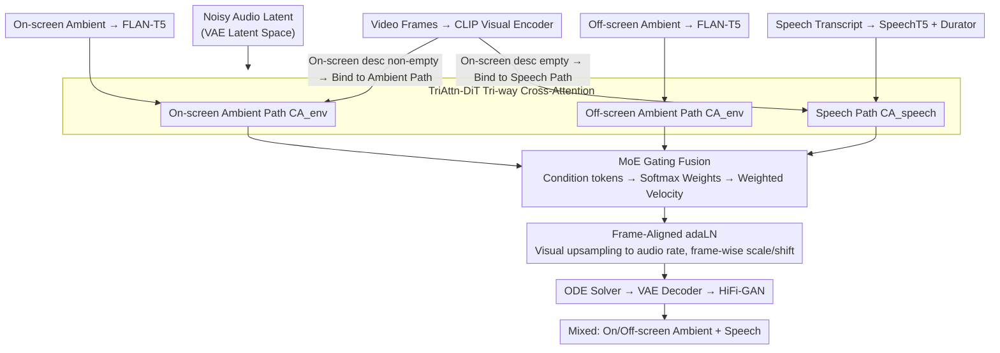

# OmniSonic: Towards Universal and Holistic Audio Generation from Video and Text

**Conference**: CVPR 2026  
**arXiv**: [2604.04348](https://arxiv.org/abs/2604.04348)  
**Code**: [https://weiguopian.github.io/OmniSonic_webpage/](https://weiguopian.github.io/OmniSonic_webpage/)  
**Area**: Audio Generation / Multimodal  
**Keywords**: Video-to-Audio Generation, Holistic Audio, Diffusion Models, Speech Synthesis, Mixture-of-Experts

## TL;DR

This paper proposes the Universal Holistic Audio Generation (UniHAGen) task and the OmniSonic framework. Utilizing a TriAttn-DiT architecture with tri-way cross-attention and a MoE gating mechanism, it achieves the unified synthesis of on-screen/off-screen ambient sounds and human speech for the first time, significantly outperforming SOTA models on the newly constructed UniHAGen-Bench.

## Background & Motivation

1.  **Background**: Diffusion models have made significant progress in audio generation. V2A (Video-to-Audio) methods like Diff-Foley and MMAudio have continuously improved in quality and semantic alignment. Joint text-video-to-audio (VT2A) methods like VinTAGe have begun to consider both on-screen and off-screen sounds.

2.  **Limitations of Prior Work**: (1) V2A models only generate sounds corresponding to visible events, ignoring off-screen auditory events; (2) VT2A models, while considering off-screen sounds, are limited to ambient audio and cannot generate human speech; (3) Environmental speech generation models (e.g., VoiceLDM) rely solely on text input and lack visual grounding.

3.  **Key Challenge**: Real-world auditory scenes are complex—a person speaking might have birds chirping in front of them or machine noise in the background. Existing models cannot handle all permutations of "Ambient + Speech + On/Off-screen" within a unified framework.

4.  **Goal**: Define a new task, UniHAGen, which requires the model to simultaneously generate integrated audio from three sources: on-screen ambient sound, off-screen ambient sound, and human speech.

5.  **Key Insight**: Decompose the problem into three conditional paths (on-screen ambient description, off-screen ambient description, speech transcript). Design a specialized tri-way cross-attention mechanism to process them separately, followed by dynamic fusion via MoE gating.

6.  **Core Idea**: Use TriAttn-DiT tri-way cross-attention to handle on-screen ambient, off-screen ambient, and speech conditions respectively. Adaptively balance the contributions of the three paths through MoE gating to achieve holistic audio generation.

## Method

### Overall Architecture

OmniSonic aims to generate three types of sounds existing simultaneously in real auditory scenes—ambient sounds from visible on-screen events, invisible off-screen ambient sounds, and speech from people in the frame—within a single model. It is based on a Flow Matching diffusion framework, denoising in the latent space of an audio VAE. There are four conditional signals: video frames via a CLIP visual encoder, on-screen and off-screen ambient descriptions via FLAN-T5, and speech transcripts via SpeechT5 with a Durator encoder. These four paths are fed into the core TriAttn-DiT, which stacks multiple blocks to predict the velocity field in the latent space. During inference, an ODE solver integrates the audio latent representation from noise, which is then restored to a waveform by the VAE decoder and HiFi-GAN vocoder. The key methodological innovations are concentrated within the TriAttn-DiT: processing three acoustically distinct conditions separately, fusing them dynamically according to the scene, and aligning them frame-by-frame to the visuals.

### Key Designs

**1. TriAttn-DiT Tri-way Cross-Attention: Preventing Interference between Ambient and Speech**

Merging ambient sound and speech into the same attention layer leads to mutual contamination—their acoustic statistics differ significantly, and shared Q/K/V projections cannot learn alignments optimized for both. OmniSonic separates cross-attention into three paths: ambient (on-screen / off-screen) and speech follow independent routes, performing cross-attention only with their respective conditions ($\text{CA}_{env}$ or $\text{CA}_{speech}$). For example, the on-screen path is $\mathbf{x}_t^{on} = \text{CA}_{env}(\text{RoPE}(\mathbf{x}_t), \text{RoPE}(\mathbf{c}^{on}_{txt,v}[L_{on}:,:]), \mathbf{c}^{on}_{txt,v})$, with similar logic for off-screen and speech.

A simple but crucial visual binding rule is applied: visual features $\mathbf{c}_v$ are not concatenated to all paths simultaneously. Instead, if the on-screen ambient description is non-empty (sound events in the frame), visuals are bound to the on-screen ambient path. If empty (the frame shows a speaking person), visuals are bound to the speech path. This allows the model to explicitly determine whether the subject in the frame is a sound source or a speaker, routing visual grounding to the correct condition. RoPE is only added to the visual token portion to encode temporal positions, ensuring subsequent alignment with audio frames.

**2. MoE Gating Fusion: Dynamically Determining Path Priority**

After calculating the three paths separately, they must be synthesized into a single velocity prediction. However, the importance of these three sources varies across scenes—in purely ambient clips, the speech path should be silent, whereas in a speech-dominant interview, ambient sound is merely background. Fixed-weight summation cannot adapt to these transitions, so a lightweight MoE gate generates dynamic weights: representative tokens are obtained by averaging condition embeddings along the sequence dimension, concatenated, and passed through an MLP with Softmax to obtain normalized $[\omega^{sp}, \omega^{on}, \omega^{off}]$. The final velocity is the weighted sum:

$$\mathbf{v}_t = \omega^{sp}\mathbf{x}_t^{sp} + \omega^{on}\mathbf{x}_t^{on} + \omega^{off}\mathbf{x}_t^{off}$$

Driven by the conditions themselves, this gating allows the model to adaptively transition between "amplifying the speech path when speech is needed" and "suppressing it for silence."

**3. Frame-Aligned Adaptive Layer Normalization: Pinning Audio to Video Frame-by-Frame**

Video and audio have different temporal resolutions. Using a single global visual vector to modulate the entire audio segment often leads to synchronization errors. Here, the visual condition $\mathbf{c}_v$ is projected into the same space as the timestep embedding and added to form $\mathbf{c}_{vt}$. This is then upsampled to the audio temporal resolution using nearest-neighbor interpolation, generating frame-wise adaLN parameters $[\alpha_1, \beta_1, \gamma_1, \alpha_2, \beta_2, \gamma_2]$. Each frame of audio features is modulated by the scale/shift generates from the corresponding video frame, refining synchronization from "global alignment" to "frame-level alignment."

### Loss & Training

The model uses a Flow Matching objective $\mathcal{L}_{FM} = \mathbb{E}_{t, \mathbf{x}_0, \mathbf{x}_1}[\|\mathcal{V}_\theta(\mathbf{x}_t, t) - (\mathbf{x}_1 - \mathbf{x}_0)\|_2^2]$, where the network regresses the velocity field from noise $\mathbf{x}_0$ to data $\mathbf{x}_1$. Training data is synthesized by mixing VGGSound (~195K ambient), LRS3 (~33K speech video), and CommonVoice (~1.67M speech) at random SNR levels to mimic the distribution of overlapping speech and ambient sounds in real scenes. During training, FLAN-T5 and the CLIP visual encoder are frozen, while SpeechT5 and the Durator are fine-tuned.

## Key Experimental Results

### Main Results

Objective evaluation on UniHAGen-Bench (1003 samples, 3 scenes):

| Method | FAD↓ | MKL↓ | Mean(AT+AV)↑ | WER↓ | DeSync↓ |
|------|------|------|-------------|------|---------|
| VoiceLDM | 3.58 | 5.74 | 14.03 | 0.15 | 1.25 |
| MMAudio | 5.82 | 5.60 | 17.25 | 1.50 | **0.51** |
| HunyuanVideo-Foley | 6.00 | 5.88 | 16.95 | 1.36 | 0.38 |
| **Ours** | **3.07** | **2.79** | **18.54** | **0.14** | 0.72 |

Subjective MOS Evaluation:

| Method | MOS-Q↑ | MOS-EF↑ | MOS-SF↑ | MOS-T↑ |
|------|--------|---------|---------|--------|
| VoiceLDM | 3.13 | 3.40 | 4.05 | 2.54 |
| MMAudio | 3.74 | 3.24 | 1.15 | 3.71 |
| **Ours** | **4.35** | **4.42** | **4.74** | **4.29** |

### Ablation Study

| Configuration | FAD↓ | Mean↑ | WER↓ | DeSync↓ |
|------|------|-------|------|---------|
| Ours (Full) | 3.07 | 18.54 | 0.14 | 0.72 |
| w/o MoE Gating | 6.12 | 15.94 | 0.56 | 1.23 |

### Key Findings

- Removing MoE gating doubles the FAD from 3.07 to 6.12 and increases WER fourfold from 0.14 to 0.56, proving the gearing mechanism's necessity for multi-source balance.
- OmniSonic is slightly inferior to MMAudio and HunyuanVideo-Foley in DeSync, as the latter use Synchformer for fine-grained temporal features, while OmniSonic uses only CLIP features.
- MMAudio and HunyuanVideo-Foley have extremely low MOS-SF (1.15/1.17), failing to generate speech; VoiceLDM generates good speech but poor ambient sound (MOS-EF 3.40).
- Visualizing MoE branches shows that manually suppressing the speech branch results in no speech output, while suppressing the ambient branch loses background sounds, verifying the functional specialization of each path.

## Highlights & Insights

- **Forward-looking Task Definition**: UniHAGen defines three "On/Off-screen × Ambient/Speech" scenarios, incorporating speech into holistic audio generation for the first time.
- **Elegant TriAttn-DiT Design**: The architecture of three independent attention paths + shared MoE gating ensures specialized processing of diverse conditions while enabling dynamic fusion without interference.
- **Dynamic Visual-Condition Binding**: Determining whether visual features bind to ambient or speech descriptions based on whether the on-screen description is empty effectively distinguishes between "sound events" and "speakers" in the frame.
- This multi-path attention + MoE gating paradigm can be transferred to other generation tasks requiring the processing of heterogeneous conditions.

## Limitations & Future Work

- Temporal synchronization (DeSync) is lower than methods using Synchformer; introducing finer-grained temporal visual features could improve this.
- Training data consists of synthetic mixtures; spatial distribution and reverberation in real scenes are not explicitly modeled.
- Currently supports only 10-second generation; consistency for longer audio remains unverified.
- Speech quality is high but lacks detailed comparison against specialized SOTA TTS systems.

## Related Work & Insights

- **vs MMAudio**: MMAudio uses a multimodal DiT for joint video-text modeling but only for ambient sound; OmniSonic expands to speech via tri-way attention and provides better ambient quality.
- **vs VoiceLDM**: VoiceLDM is purely text-conditioned speech generation lacking visual grounding; OmniSonic uses video to distinguish between on-screen and off-screen sources.
- **vs VinTAGe**: VinTAGe introduced "panoramic" audio generation but limited it to ambient sound; OmniSonic achieves true holistic coverage by including both ambient and speech.

## Rating

- Novelty: ⭐⭐⭐⭐ UniHAGen task and TriAttn-DiT are novel; MoE gating is a significant addition.
- Experimental Thoroughness: ⭐⭐⭐⭐ Objective and subjective evaluations are comprehensive; core components are validated via ablation, though benchmarks are somewhat small.
- Writing Quality: ⭐⭐⭐⭐⭐ Clear problem definition, detailed methodology, and rich qualitative analysis.
- Value: ⭐⭐⭐⭐ Fills a significant gap in unified "Ambient + Speech" generation with direct applications in film post-production.

<!-- RELATED:START -->

## Related Papers

- [\[CVPR 2025\] VinTAGe: Joint Video and Text Conditioning for Holistic Audio Generation](../../CVPR2025/audio_speech/vintage_joint_video_and_text_conditioning_for_holistic_audio_generation.md)
- [\[CVPR 2026\] Hear What You See: Video-to-Audio Generation with Diffusion Transformer and Semantic-Temporal Alignment-Ranked Direct Preference Optimization](hear_what_you_see_video-to-audio_generation_with_diffusion_transformer_and_seman.md)
- [\[CVPR 2026\] Echoes Over Time: Unlocking Length Generalization in Video-to-Audio Generation Models](echoes_over_time_unlocking_length_generalization_in_video-to-audio_generation_mo.md)
- [\[CVPR 2026\] FoleyDirector: Fine-Grained Temporal Steering for Video-to-Audio Generation via Structured Scripts](foleydirector_fine-grained_temporal_steering_for_video-to-audio_generation_via_s.md)
- [\[CVPR 2026\] SAVE: Speech-Aware Video Representation Learning for Video-Text Retrieval](save_speech-aware_video_representation_learning_for_video-text_retrieval.md)

<!-- RELATED:END -->
