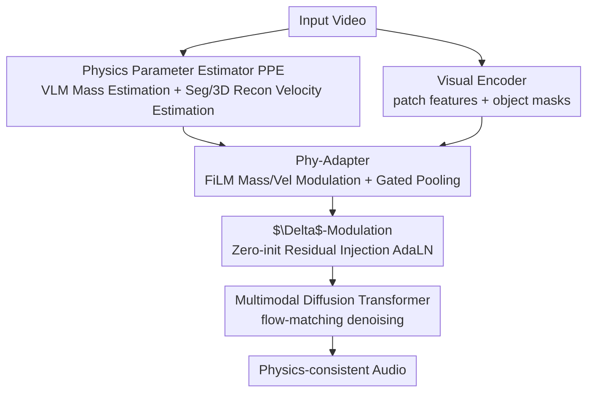

# PAVAS: Physics-Aware Video-to-Audio Synthesis

**Conference**: CVPR 2026  
**Paper**: [CVF Open Access](https://openaccess.thecvf.com/content/CVPR2026/html/Hyun-Bin_PAVAS_Physics-Aware_Video-to-Audio_Synthesis_CVPR_2026_paper.html)  
**Code**: Project Page https://physics-aware-video-to-audio-synthesis.github.io  
**Area**: Audio Generation / Diffusion Models / Multi-modal  
**Keywords**: Video-to-Audio, Physics-Aware, Latent Diffusion, FiLM Modulation, Quality and Velocity Estimation

## TL;DR
PAVAS explicitly injects two physical quantities, "object-level mass + velocity," into a latent diffusion Video-to-Audio (V2A) framework. It utilizes a VLM to estimate mass and combines segmentation with dynamic 3D reconstruction to estimate velocity. These physical cues are fed into a Diffusion Transformer via a Phy-Adapter with zero-initialized residuals, ensuring that generated sound intensity and decay align with physical dynamics. On the self-constructed VGG-Impact benchmark, it reduces the physics consistency metric (APCC-∆) from over 0.5 to 0.378.

## Background & Motivation

**Background**: Recent V2A generation (Autoregressive, GAN, Diffusion) has achieved high performance in perceptual quality and audio-visual synchronization. Specifically, latent diffusion frameworks (e.g., MMAudio), leveraging large-scale text-audio data, can reliably map visual events like a "hammer strike" to semantic categories like "metallic clanging."

**Limitations of Prior Work**: These models are essentially **appearance-driven**—they learn correlations between "visual appearance $\leftrightarrow$ acoustic features" but ignore the underlying physical factors. Consequently, the model may know to produce a "metallic sound" but lacks knowledge of how loud it should be or how fast it should decay. A light tap and a heavy blow might result in sounds with identical loudness, which is physically implausible (as shown in the anomalous long/loud impact sounds in Fig. 1 of the paper).

**Key Challenge**: The authentic properties of sound (loudness, spectral sharpness, impact envelope) are determined by **measurable physical quantities** (object mass, collision velocity $\rightarrow$ kinetic energy). Current V2A models fail to model these quantities and lack evaluation protocols to verify whether generated audio changes consistently with physical variables. Benchmarks like VGGSound only measure semantic/perceptual alignment, failing to capture physical realism.

**Goal**: (1) Explicitly estimate object-level physical quantities and inject them into the diffusion process; (2) Propose a protocol to quantitatively evaluate "physics-acoustic consistency."

**Key Insight**: Off-the-shelf visual modules (VLM, open-vocabulary segmentation, dynamic 3D reconstruction) are sufficiently reliable to estimate mass and velocity from monocular video **without audio-physics annotations**. Mass is inferred via VLM common sense, while velocity is derived from segmentation masks and metric-scale 3D point cloud trajectories.

**Core Idea**: Extract physical quantities from video using "VLM-based mass estimation + Segmentation/3D reconstruction-based velocity estimation," then gently inject them into the latent diffusion backbone using a lightweight adapter (Phy-Adapter) with zero-initialized residuals to generate physics-consistent sound.

## Method

### Overall Architecture
PAVAS is built upon a multi-modal latent diffusion backbone (a flow-matching DiT similar to MMAudio, trained in a mel-spectrogram latent space, decoded via VAE, and reconstructed via vocoder). Given an input video, the **Physics Parameter Estimator (PPE)** first detects all actively moving objects, estimating a time-invariant mass $m_i$ (kg) and a frame-wise velocity sequence $\{v_i^\ell\}$ (m/s) for each. Simultaneously, a visual encoder extracts patch features which, combined with segmentation masks, form object-centric features. The **Physics-driven Audio Adapter (Phy-Adapter)** then modulates these object-centric features with mass and velocity, aggregating them into $c_\text{mass}$ and $c_\text{vel}$ conditions via gated pooling. Finally, through **$\Delta$-modulation**, these are added as zero-initialized residuals to the AdaLN parameters of each Diffusion Transformer block to guide the diffusion trajectory toward physically plausible audio.

### Key Designs

**1. Physics Parameter Estimator PPE: Extracting Object-level Mass and Velocity without Annotations**

This addresses the pain point that "existing V2A has no access to physical quantities." PPE estimates mass and velocity via a three-stage unsupervised pipeline. **Moving Object Discovery**: A VLM distinguishes "true motion" from "apparent displacement caused by camera movement," outputting a structured set $S=\{(o_i,a_i)\}$, where each entry is a localized moving object (e.g., "runner in a striped shirt") and its action ("sprinting"). This text representation serves as a semantic interface for open-world generalization. **Mass Estimation**: The VLM infers mass $m_i=f_\text{mass}(I_{1:L}, T_\text{mass})$ based on the object name $o_i$, action $a_i$, and video context. This bypasses geometric methods like NeRF2Physics that require multi-view static calibration, making it applicable to dynamic monocular videos. **Velocity Estimation**: Florence-2 generates boxes and SAM-2 provides frame-wise pixel-level masks $M_i^\ell$ propagated over time. Dynamic 3D reconstruction (CUT3R) recovers metric-scale point clouds $P^\ell$ and camera extrinsics. Projecting masks back to 3D yields object point sets $X_i^\ell$, from which centroids $c_i^\ell$ are calculated, resulting in instantaneous metric velocity $v_i^\ell = \|c_i^{\ell+1}-c_i^\ell\|_2 / \Delta\tau$ (where $\Delta\tau=1/\text{FPS}$).

**2. Phy-Adapter: FiLM Modulation of Object-Centric Visual Features**

Phy-Adapter aligns physical quantities with visual feature sequences. It takes three inputs: CLIP-ViT patch embeddings $V^\ell$, binary masks $M_i^\ell$, and estimated $\{m_i, v_i\}$. **Object Feature Extraction**: Patch features are aggregated into frame-wise object features via mask-weighted summation $f_i^\ell=\sum_{h,w} M_i^\ell[h,w]\cdot V^\ell[h,w,:]$, projected and normalized to obtain $h_i^\ell$. Learnable object-occlusion tokens handle missing frames. **Mass/Velocity Modulation**: Mass is normalized via $\log(1+m_i)$ followed by z-score, while velocity is directly z-score normalized. Both are expanded via Fourier feature mapping $[\sin(2\pi\omega_k\cdot),\cos(2\pi\omega_k\cdot)]$ and passed through MLPs to generate FiLM coefficients $(\gamma, \beta)$. The modulation follows: $h_{\text{mass},i}=(1+\tfrac12\tanh(\gamma))\odot h_i+\tfrac12\tanh(\beta)$. A key physical intuition is applied: **Mass modulation is constant over time** (controlling global loudness/decay), while **velocity modulation is frame-wise** (aligning audio with instantaneous motion). **Gated Pooling**: Multiple objects are aggregated via $c_\text{mass}=\frac{\sum_i G_{\text{mass},i} h_{\text{mass},i}}{\sum_i G_{\text{mass},i}}$ with gating $G=\sigma(\text{MLP}(\cdot))$.

**3. $\Delta$-Modulation: Gentle Injection via Zero-Initialized Residuals**

Directly adding physical features to multimodal conditions can disrupt the pre-trained V2A backbone. Instead, the AdaLN modulation parameter $\omega$ in each Transformer block is calculated from multimodal conditions $c_\text{multi}$, onto which a **zero-initialized residual** is added: $\tilde\omega=\omega(c_\text{multi})+\alpha_m g_m(c_\text{mass})+\alpha_v g_v(c_\text{vel})$. $g_m, g_v$ are zero-initialized lightweight MLPs, and $\alpha_m, \alpha_v$ are learnable gates. Because it is initially zero, the physical terms produce no disturbance at the start of training. The model **progressively** introduces mass/motion effects, ensuring diffusion dynamics align with physics without sacrificing perceptual quality.

### Loss & Training
The backbone is trained using a conditional flow-matching objective: $\mathcal{L}_\text{CFM}=\mathbb{E}\|f_\theta(t,Y,x_t)-u(x_t|x_0,x_1)\|^2$, where $x_t=(1-t)x_0+tx_1$ and the target velocity $u=x_1-x_0$. Training follows two stages: ① Backbone training on VGGSound + large-scale audio-text corpora for 300k steps (AdamW, lr $1\times10^{-4}$, batch 512) for general V2A; ② Freezing encoders and training only the Diffusion Transformer and PPE/Phy-Adapter condition paths for 30k steps (lr reduced to $1\times10^{-5}$) using only VGGSound. Physical tokens are replaced with null tokens with 0.1 probability to handle cases lacking motion cues.

## Key Experimental Results

**Audio–Physics Correlation Coefficient (APCC)** measures the correlation between "kinetic energy change at impact" and "onset spectral intensity." **APCC-∆** is the difference between correlations of real and generated audio; **lower** values indicate generated audio better approximates the true "kinetic-acoustic" coupling.

### Main Results (VGGSound Test Set)

| Method | Params | APCC-∆↓ | FD$_\text{PaSST}$↓ | IS↑ | IB-score↑ | DeSync↓ |
|------|--------|---------|--------------------|-----|-----------|---------|
| MMAudio-L (Prev. SOTA) | 1.03B | 0.536 | 60.60 | 17.40 | 33.22 | 0.442 |
| TARO | 258M | 0.758 | 159.1 | 9.62 | 22.85 | 1.169 |
| V2A-Mapper | 229M | 0.671 | 84.57 | 12.47 | 22.58 | 1.225 |
| **PAVAS-L (Ours)** | 1.04B | **0.378** | **47.38** | **17.51** | **35.41** | 0.446 |

PAVAS leads in physics consistency (APCC-∆ 0.378, the only one significantly below 0.5), distribution matching (FD 47.38), and semantic alignment (IB-score 35.41). DeSync is comparable to MMAudio. This suggests explicit physical conditions improve not only physical plausibility but also perceptual quality.

**User Study** (27 participants, 1–5 Likert scale):

| Method | Quality | Semantic Align | Time Align | Phys. Realism |
|------|---------|---------------|------------|--------------|
| MMAudio-L | 3.98 | 4.14 | 4.06 | 3.90 |
| **PAVAS-L (Ours)** | **4.23** | **4.47** | **4.45** | **4.37** |

### Ablation Study (S-16kHz Backbone)

| Configuration | FD$_\text{PaSST}$↓ | IS↑ | IB-score↑ | DeSync↓ |
|------|--------------------|-----|-----------|---------|
| Backbone | 70.19 | 14.44 | 29.13 | 0.483 |
| + Training longer only | 71.99 | 14.34 | 29.46 | 0.486 |
| + $c_\text{mass}$ only | 66.89 | 15.94 | 29.40 | 0.480 |
| + $c_\text{vel}$ only | 67.22 | 15.07 | 29.33 | 0.446 |
| + Mass + Vel (Ours) | **65.67** | **16.50** | 29.41 | 0.448 |
| Direct summation injection | 67.31 | 16.30 | 29.40 | 0.455 |
| $\Delta$-Modulation (Ours) | **65.67** | **16.50** | 29.41 | 0.448 |

### Key Findings
- **Longer training alone is ineffective**: Training the backbone further on VGGSound slightly increased FD from 70.19 to 71.99, confirming gains come from physical components.
- **Mass and Velocity are complementary**: $c_\text{mass}$ and $c_\text{vel}$ independently improve distribution and perceptual metrics; combined, they achieve the lowest FD (65.67) and highest IS (16.50). Velocity significantly aids synchronization (DeSync 0.446).
- **Injection method is crucial**: $\Delta$-modulation outperforms direct summation in FD (65.67 vs 67.31), proving that gradual injection preserves backbone stability better.
- **Existing models suffer from physical distortion**: Most SOTA models exceed 0.5 on APCC-∆, indicating they capture semantics but fail to capture physical dynamics.

## Highlights & Insights
- **Zero-cost physical quantity extraction**: Instead of collecting audio-physics labels, the authors leverage VLM world knowledge for mass and "masks + 3D point cloud trajectories" for velocity. This "composition of off-the-shelf models" approach is highly transferable.
- **Physical Intuition in Modulation**: Modeling mass as a constant global modulation and velocity as a frame-wise modulation matches the physical reality where mass sets energy bounds and velocity dictates impact timing.
- **$\Delta$-Modulation as a Reusable Trick**: This zero-initialized residual pattern allows adding new conditions to pre-trained diffusion backbones without degradation, a pattern also seen in ControlNet.
- **Quantifying Physics Consistency**: APCC provides a measurable dimension for physics-acoustic coupling that was previously ignored in V2A evaluation.

## Limitations & Future Work
- **Heavy visual pipeline dependency**: The framework relies on several pre-trained modules (VLM, Florence-2, SAM-2, CUT3R, etc.). Future work could explore more compact adapters or jointly optimized estimators.
- **Limited physical factors**: Factors like material, elasticity, and friction are not yet modeled. Evaluation is primarily validated on impact scenarios with clear contact dynamics.
- **VLM Mass Inference Reliability**: While effective for common objects, the error propagation for rare or complex objects requires further quantification.
- **Robustness of 3D Reconstruction**: Velocity estimation depends on CUT3R's metric scale. Errors in extreme occlusion or ultra-fast motion remain an open problem.

## Related Work & Insights
- **vs MMAudio**: Improves upon MMAudio by adding PPE + Phy-Adapter. The reduction in APCC-∆ (0.536 to 0.378) shows that physical conditions are **complementary** to multimodal conditions.
- **vs NeRF2Physics**: Avoids the need for multi-view static calibration by using VLM on monocular dynamic video, sacrificing some precision for open-world generalization.
- **vs Su et al. / SonifyAR**: Moves beyond specific impact scenarios or indoor/AR material cues by modeling object-level mass and motion as general conditions for broader interactions.

## Rating
- Novelty: ⭐⭐⭐⭐⭐ First to explicitly inject object-level mass/velocity into latent diffusion V2A with a dedicated consistency metric.
- Experimental Thoroughness: ⭐⭐⭐⭐ Comprehensive main results and ablations, though physical evaluation is limited to the specialized VGG-Impact subset.
- Writing Quality: ⭐⭐⭐⭐ Clear motivation, well-defined pipeline, and distinct modular responsibilities.
- Value: ⭐⭐⭐⭐⭐ Introduces "physics-consistent" as a vital dimension for V2A and provides a reusable paradigm for physics-aware generation.

<!-- RELATED:START -->

## Related Papers

- [\[CVPR 2026\] SAVE: Speech-Aware Video Representation Learning for Video-Text Retrieval](save_speech-aware_video_representation_learning_for_video-text_retrieval.md)
- [\[ICLR 2026\] AC-Foley: Reference-Audio-Guided Video-to-Audio Synthesis with Acoustic Transfer](../../ICLR2026/audio_speech/ac-foley_reference-audio-guided_video-to-audio_synthesis_with_acoustic_transfer.md)
- [\[CVPR 2026\] Echoes Over Time: Unlocking Length Generalization in Video-to-Audio Generation Models](echoes_over_time_unlocking_length_generalization_in_video-to-audio_generation_mo.md)
- [\[CVPR 2026\] FoleyDirector: Fine-Grained Temporal Steering for Video-to-Audio Generation via Structured Scripts](foleydirector_fine-grained_temporal_steering_for_video-to-audio_generation_via_s.md)
- [\[CVPR 2026\] OmniSonic: Towards Universal and Holistic Audio Generation from Video and Text](omnisonic_towards_universal_and_holistic_audio_generation_from_video_and_text.md)

<!-- RELATED:END -->
