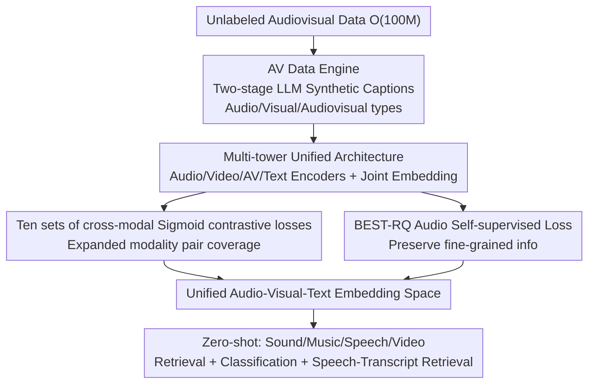

# Pushing the Frontier of Audiovisual Perception with Large-Scale Multimodal Correspondence Learning

**Conference**: CVPR 2026  
**Paper**: [CVF Open Access](https://openaccess.thecvf.com/content/CVPR2026/html/Vyas_Pushing_the_Frontier_of_Audiovisual_Perception_with_Large-Scale_Multimodal_Correspondence_CVPR_2026_paper.html)  
**Code**: https://github.com/facebookresearch/perception_models  
**Area**: Multimodal Representation Learning / Contrastive Learning / Audiovisual Understanding  
**Keywords**: Audiovisual-Text Encoder, Contrastive Learning, Synthetic Caption Data Engine, Joint Embedding, Zero-shot Retrieval

## TL;DR
PEAV (Perception Encoder Audiovisual) is a family of unified "audio-visual-text" contrastive encoders proposed by Meta. It utilizes a two-stage synthetic caption data engine to generate high-quality captions across three categories (audio, visual, audiovisual) for O(100M) audiovisual pairs. By employing up to ten sets of cross-modal contrastive losses to align audio, video, and text into a single space, it sets new SOTA benchmarks across four zero-shot categories: sound, music, speech, and video (e.g., AudioCaps T→A R@1 improved from 35.4 to 45.8, VGGSound classification from 36.0 to 47.1). Furthermore, it enables "speech→transcript" retrieval to work effectively for the first time, jumping from near 0 to 85.6.

## Background & Motivation

**Background**: CLIP-style contrastive models have successfully aligned image/audio with text. Models like ImageBind, LanguageBind, and InternVideo2 further chain multiple modalities through a "single-anchor" (image or text) to achieve cross-modal zero-shot retrieval and classification.

**Limitations of Prior Work**: These "single-anchor" models suffer from two major flaws. First, they **collapse when the anchor is missing**—LanguageBind (text-anchored) performs poorly on audio→visual tasks without text (VGGSound V→A is only 1.6 R@1); ImageBind (image-anchored) fails on audio→text tasks without video (AudioCaps T→A is only 6.6 R@1). Second, there is a **serious imbalance in scale and diversity of modality pairs**: vision-language data is abundant, while audio-visual data is sparse and narrow, leading to the audiovisual domain lagging behind. Existing audio models also tend to specialize in a single domain (either sound effects, music, or speech).

**Key Challenge**: Binding all modalities to a single hub essentially masks the underlying issue of asymmetric cross-modal data scales. What is truly missing is **alignment supervision with sufficient scale and quality covering all modality pairs**. However, audio captioners themselves are currently too weak to produce large-scale, high-quality audio-text supervision directly.

**Goal**: (1) Create high-quality captions covering audio, visual, and audiovisual categories at O(100M) scale with cross-modal balance; (2) Expand contrastive objectives to cover as many cross-modal pairs as possible to learn a truly unified audio-visual-text embedding; (3) Enable a single audio encoder to simultaneously cover speech, music, and sound effect domains.

**Key Insight**: The authors observed that while "visual captioners are already very strong, audio captioners remain weak." Consequently, they used an LLM to merge outputs from multiple weak audio captioners (along with confidence scores) and video captions to rewrite them into synthetic captions that outperform ground-truth labels. With this rich supervision, the contrastive loss can be expanded from a single "audio-text" pair to ten pairs.

**Core Idea**: Use a data engine combining "LLM fusion of weak captions + video context" to gain large-scale balanced supervision. Then, utilize "ten sets of cross-modal contrastive pairs + audio self-supervision" to compress audio-visual-text into the same embedding space, fundamentally bypassing the asymmetry of single-anchor models.

## Method

### Overall Architecture
PEAV consists of five towers: a text encoder (ModernBERT), a video frame encoder (reusing PE), a video encoder (several temporal Transformer layers stacked atop the frame encoder), an audio encoder (DAC-VAE tokens + Transformer with RoPE), and an audiovisual fusion encoder (concatenating temporally aligned audio/visual tokens followed by a shallow Transformer). Training data comes from a **two-stage synthetic caption data engine**: First, Llama-3.1-8B fuses outputs from two weak audio captioners (EnCLAP, CoNeTTE), their confidence scores under Joint-CLAP, and video captions to generate three types of captions (audio, visual, and audiovisual) for O(100M) videos. Second, a PLM generates fine-grained video captions while PLM-AV produces multi-variant audio captions, followed by a second LLM-based summarization and refinement. With these captions, the model uses **ten sets of cross-modal contrastive pairs** (8 for pre-training + 2 for fine-tuning) with Sigmoid contrastive loss to align the `[CLS]` outputs of each encoder, and an additional **BEST-RQ self-supervised loss** on the audio encoder to preserve fine-grained information. A two-stage training strategy is used: Phase 1 involves large-scale pre-training on 92M samples, and Phase 2 involves fine-tuning on 32M balanced samples (focusing on speech transcripts and video data).

### Key Designs

**1. Two-stage Audiovisual Data Engine: Using LLMs to fuse weak captions into supervision surpassing ground truth**

This step addresses the pain points of "weak audio captioners and imbalanced cross-modal data." **Stage 1**: The authors' pilot study found that EnCLAP and CoNeTTE make different types of errors (reflected in CLAP confidence), and video captions provide disambiguation context (e.g., "TV show" helping identify audio events). Thus, Llama-3.1-8B takes two weak audio captions, discretized confidence (low/medium/high), and video captions as input to rewrite three types of captions, covering O(100M) videos in 30-second clips. In a blind test of ~50 samples, LLM audio captions were **strictly better** than EnCLAP on 65.2% of samples, equal on 28.3%, and worse on only 6.5%. **Stage 2**: A PLM generates fine-grained spatio-temporal video captions, and Llama summarizes Stage 1 outputs and PLM captions into even better video captions. On the audio side, a PLM-AV is trained (using Stage 1 PEAV as the AV encoder and Llama as the decoder) to produce three variants focusing on audio events, captions, and acoustic environments. Ablations (Table 5/6) show: **Using only synthetic captions is better than using only ground-truth captions**; a mixture of both (Ground-truth:Synthetic = 1:10) is optimal, proving the quality and diversity of synthetic captions.

**2. Multi-tower Unified Architecture & Joint Embedding: Preventing collapse when anchors are missing**

To address the fragility of single-anchors, PEAV does not set a fixed hub. Instead, it builds unique encoders for text, audio, video, and audiovisual modalities, projecting their `[CLS]` tokens into a **single shared space** to obtain $h_{ta},h_{tv},h_{tav},h_a,h_v,h_{av}$. The video side uses PE-L as the frame encoder with 4 light temporal Transformer layers (fewer parameters than InternVideo2/PE-G but stronger). The audio side prepends a learnable `[CLS]` to projected DAC-VAE tokens and passes them through multi-layer Transformers with RoPE. The fusion tower concatenates audio/visual tokens after nearest-neighbor temporal alignment. Crucially, **text-conditioned joint embeddings** are introduced: the `[CLS]` of the query modality is concatenated channel-wise with the text `[CLS]` and projected to get $h_{vt},h_{at}$. This supports retrieval tasks like V+T→A and A+T→V where "text supplements missing cues in the query." Table 4 shows joint embeddings significantly outperform single-modality queries when modalities are complementary (e.g., AudioCaps V+T→A improves by +6.9 R@1 over single-query).

**3. Ten Cross-modal Contrastive Pairs: Expanding coverage to strengthen the shared space**

PEAV uses a Sigmoid contrastive loss (similar to SigLIP) to align every modality pair:

$$\mathcal{L}(h^a,h^v)=-\frac{1}{B}\sum_{b=1}^{B}\sum_{b'=1}^{B}\log\sigma\!\big(z_{bb'}(-\alpha_{av}h_b^a\cdot h_{b'}^v+\beta_{av})\big)$$

Where $\alpha,\beta$ are the temperature and bias for that pair, and $z_{bb'}=1$ (positive) / $-1$ (negative). Pre-training covers 8 pairs (Audio↔Audio Cap, Audio↔Video, Audio↔AV Cap, AV↔Audio Cap, AV↔AV Cap, Video↔Audio Cap, Video↔Video Cap, Video↔AV Cap), and fine-tuning adds 2 joint embedding pairs (Audio→Video with Video Cap, Video→Audio with Audio Cap), totaling ten. Ablations (Table 9) clearly show: with only the "Audio-Audio Cap" pair, audio→video retrieval is near zero (0.1 R@1). As pairs expand to 8, cross-modal alignment and zero-shot performance improve monotonically, peaking when all 8 pairs are covered—confirming that "expanding cross-modal pair coverage" is a key lever for unified space quality.

**4. BEST-RQ Self-supervised Loss: Preserving fine-grained (especially speech) info beyond contrastive learning**

Pure contrastive loss targets semantic-level alignment at the expense of fine-grained details, which is fatal for speech tasks requiring phonetic information (e.g., transcript retrieval). The authors add a BEST-RQ self-supervised loss to the audio encoder: unmasked DAC-VAE features are passed through a random projection quantizer to generate pseudo-labels; the audio encoder's output (excluding `[CLS]`) predicts pseudo-labels for masked frames via linear projection. BEST-RQ's large codebook forces top layers to retain fine-grained info, making it superior to wav2vec 2.0 contrastive SSL. Combined with the labeled English speech corpora added in Phase 2, PEAV's VCTK speech→transcript retrieval jumped from 16.7 post-pretraining to 85.6 R@1, while all baselines remained near 0.

### Loss & Training
Total Loss = Ten sets (8 Pre-train + 2 Fine-tune) of Sigmoid contrastive losses + BEST-RQ SSL loss for the audio encoder. Two-stage training: Phase 1 pre-trains for 250K steps, batch size 3024, lr $10^{-4}$, with randomly initialized video/audio/fusion encoders and end-to-end fine-tuning of all encoders (including text) on 92M samples. Phase 2 involves short fine-tuning on 32M balanced samples, emphasizing speech transcripts and long video data with up-sampling of key visual concept videos. Three scales for the audio encoder (S/B/L, 0.09B–1.1B); hidden dimensions scale by layer count ×64.

## Key Experimental Results

> Custom terminology: **A/V/T** refer to Audio/Video/Text; **T→A R@1** is Recall@1 for text-to-audio; **OOD setting** refers to using only out-of-domain data for fine-tuning (purer zero-shot) without touching downstream training sets; **Joint Embedding** (e.g., V+T→A) refers to a native joint query rather than taking the max of two single-modal results.

### Main Results: Zero-shot Sound/Music/Speech

| Benchmark (Metric) | Prev. SOTA | PEAV-L | Gain |
|--------------------|------------|--------|------|
| AudioCaps T→A R@1 | 35.4 (CLAP-Fusion) | **45.8** | +10.4 |
| VGGSound A→T Class Acc | 36.0 (MS-CLAP) | **47.1** | +11.1 |
| AudioCaps V→A R@1 | 51.3 (ImageBind) | **88.3** | +37.0 |
| VCTK Speech→Transcript R@1 | ~0 (All baselines) | **85.6** | First viable |

PEAV is the **first known** audio-visual-text encoder to simultaneously outperform pure audio models (CLAP-family) and audio-visual models (ImageBind/LanguageBind) across all sound tasks. Even in the OOD setting, it exceeds baselines trained directly on downstream in-domain data.

### Main Results: Zero-shot Video

| Benchmark | PE-L | PE-G (1.9B) | PEAV-L (0.5B) |
|-----------|------|-------------|---------------|
| Retrieval Avg R@1 | 57.1 | 61.4 | **67.9** |
| Classification Avg Acc | 58.5 | 61.1 | — |
| Kinetics-400 Acc | 73.4 | 76.9 | **78.9** |
| ActivityNet T→V R@1 | 46.4 | 54.7 | **66.5** |

With only 0.5B video encoder parameters, PEAV-L improves retrieval by +10.8 R@1 and classification by +5.0 Acc over PE-L. It even outperforms PE-G (which has 4× the parameters) by +6.5 R@1 and +1.6 Acc, as well as InternVideo2 by +5.7 Acc in classification.

### Ablation Study

| Ablation Dimension | Key Comparison | Conclusion |
|---------------------|----------------|------------|
| Data Engine | EnCLAP Caption Avg 33.1 → Stage-1 38.9 → Stage-2 41.5 | Two-stage engine progressively improves quality |
| Real vs Synthetic | Real Only 1.4 / Synthetic Only 55.4 / Mix (1:10) 58.2 | Synthetic > Real; mixing is optimal |
| Data Scale | 2M → 64M | Monotonic increases peaking at 64M |
| Pair Coverage | 1 Pair (A-T only) → 8 Pairs | Broader coverage strengthens alignment; 8 is best |
| Model Scale | 0.03B → 1.1B (8 → 28 layers) | Performance scales with depth; saturates after ~20 layers in subset tests |

### Key Findings
- **Synthetic captions are surprisingly more useful than real ones**: A model trained only on ground-truth captions had near-zero video retrieval (K700 V2T 0.1), while synthetic only achieved an average of 55.4. A 1:10 mixed ratio was optimal—this is the most counter-intuitive and valuable conclusion.
- **Expanding cross-modal pair coverage is a core lever**: Moving from "audio-text only" to 8 pairs improved audio→video retrieval from 0.1 to normal levels and boosted zero-shot classification, indicating that unified space quality stems from pair coverage density rather than just raw data volume.
- **Speech transcript capability comes from Phase 2 speech augmentation + BEST-RQ**: VCTK jumping from 16.7 to 85.6 represents an emergent capability unattainable by any other baseline.
- **Joint embedding is only worth it for complementary modalities**: On vision tasks like DiDeMo and VTT, "audio-enhanced text queries" outperformed single queries by +21.7 / +11.5 R@1, but gains were limited when modalities were redundant.

## Highlights & Insights
- **"Using LLMs to fuse weak captions into strong supervision" is a reusable data paradigm**: Instead of waiting for a perfect audio captioner, it is better to have an LLM arbitrate between multiple weak captioners' complementary errors, confidence levels, and video context. This "weak-label ensemble + LLM refinement" approach can migrate to any domain where individual labelers are weak but mutually corrective.
- **Abandoning single-anchors for multi-towers + joint embeddings**: Directly addressing the structural flaw of anchor dependence with native joint embeddings for V+T→A/A+T→V is a clear evolution beyond ImageBind/LanguageBind, allowing queries to be supplemented by another modality when information is missing.
- **Complementary Contrastive + Self-Supervision**: Contrastive loss handles semantic alignment while BEST-RQ preserves fine-grained details. This division of labor explains how PEAV can perform both coarse-grained retrieval and phonetic-level transcript retrieval.
- **Striking Parameter Efficiency**: A 0.5B video encoder outperforming a 1.9B PE-G suggests that in representation learning, "data coverage + alignment density" can be more valuable than raw parameter scaling.

## Limitations & Future Work
- **Heavy reliance on a suite of pre-trained models**: PE, DAC-VAE, ModernBERT, Llama-3.1, PLM, Joint-CLAP... both the data engine and architecture are built on numerous existing models, resulting in high reproduction barriers and compute costs.
- **Potential inheritance of synthetic caption bias**: Captions are rewritten by LLMs from weak outputs. If weak captioners systematically miss certain acoustic events, LLMs might not recover them. Quality was proven via blind tests, but ⚠️ the sample size was small (~50 samples).
- **Saturation in ablations not fully explained**: Performance saturated around 20 layers and 8 pairs. The authors attribute this to "ablation budget (steps/data) limits," but ⚠️ there is no full proof that scaling would continue under full training.
- **Speech tasks remain retrieval/classification focused**: While transcript retrieval is unlocked, there is still a gap to reach actual Automatic Speech Recognition (ASR). Fine-grained Sound Event Detection (SED) is relegated to the supplementary PEA-Frame variant.

## Related Work & Insights
- **vs ImageBind**: ImageBind bridges modalities using an image anchor; it collapses on audio→text tasks without video (AudioCaps T→A 6.6 vs PEAV 45.8). PEAV avoids this asymmetry using multi-tower and multi-pair contrast.
- **vs LanguageBind**: The text-anchored LanguageBind effectively fails on audio→video tasks without text (VGGSound V→A 1.6 vs 48.3). PEAV fills this gap with balanced synthetic captions and ten sets of pairs.
- **vs Pure Audio Encoders (CLAP, M2D-CLAP, AudioFlamingo2)**: These usually focus on a single domain (sounds, music, or speech) and lack video channels. PEAV's single audio encoder covers all three domains and outperforms their in-domain results even in OOD settings.
- **vs Video Encoders (PE, InternVideo2)**: By adding a light temporal Transformer to the PE-L frame encoder and utilizing broader audiovisual data, PEAV exceeds the zero-shot video performance of PE-G (1.9B) and InternVideo2 (1.0B) with significantly fewer parameters (0.5B).

## Rating
- Novelty: ⭐⭐⭐⭐ The combination of the data engine + ten-pair contrast + multi-tower joint embedding is solid, though individual components (synthetic captions, SigLIP loss, BEST-RQ) are largely scaled integrations of existing tech.
- Experimental Thoroughness: ⭐⭐⭐⭐⭐ Covers four major categories (sound/music/speech/video), retrieval + classification + joint modalities, plus five sets of ablations (engine/real-vs-synthetic/scale/coverage/model size).
- Writing Quality: ⭐⭐⭐⭐ Motivation and data engine are clear; ablations are well-supported. However, the high density of acronyms and external model dependencies makes the initial read challenging.
- Value: ⭐⭐⭐⭐⭐ Sets new SOTA benchmarks for audiovisual zero-shot learning, enables speech-transcript retrieval, and the open-sourcing of models/code is highly beneficial to the community.

<!-- RELATED:START -->

## Related Papers

- [\[CVPR 2026\] HAVE-Bench: Hierarchical Audio-Visual Evaluation from Perception to Interaction](have-bench_hierarchical_audio-visual_evaluation_from_perception_to_interaction.md)
- [\[ACL 2026\] DuIVRS-2: An LLM-based Interactive Voice Response System for Large-scale POI Attribute Acquisition](../../ACL2026/audio_speech/duivrs-2_an_llm-based_interactive_voice_response_system_for_large-scale_poi_attr.md)
- [\[CVPR 2025\] LiveCC: Learning Video LLM with Streaming Speech Transcription at Scale](../../CVPR2025/audio_speech/livecc_learning_video_llm_with_streaming_speech_transcription_at_scale.md)
- [\[ACL 2026\] Multimodal In-Context Learning for ASR of Low-Resource Languages](../../ACL2026/audio_speech/multimodal_in-context_learning_for_asr_of_low-resource_languages.md)
- [\[CVPR 2026\] Semantic Noise Reduction via Teacher-Guided Dual-Path Audio-Visual Representation Learning](semantic_noise_reduction_via_teacher-guided_dual-path_audio-visual_representatio.md)

<!-- RELATED:END -->
