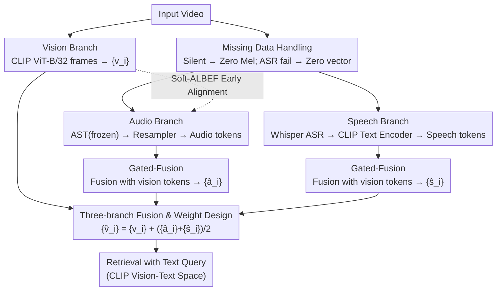

# SAVE: Speech-Aware Video Representation Learning for Video-Text Retrieval

| Information | Content |
|------|------|
| **Conference** | CVPR 2026 |
| **arXiv** | [2603.08224](https://arxiv.org/abs/2603.08224) |
| **Area** | Human Understanding |
| **Keywords** | Video-Text Retrieval, Speech-Aware, Audio-Visual Fusion, soft-ALBEF, Multimodal Learning |

## TL;DR

Ours proposes the SAVE method, which achieves speech-aware video representation learning by adding a dedicated speech branch (Whisper ASR + CLIP text encoder) and a soft-ALBEF vision-audio early alignment strategy, significantly outperforming the SOTA on five video-text retrieval benchmarks.

## Background & Motivation

In the field of Video-Text Retrieval (VTR), CLIP is commonly used as a foundation. However, since CLIP only provides image and text encoders, existing methods naturally ignore the audio track of videos. Recent audio-visual methods (EclipSE, TEFAL, AVIGATE) introduce audio encoders but face two critical issues:

**Audio encoders cannot effectively represent speech content**: Existing audio encoders (ResNet-18, AST) are trained on environmental sound datasets and perform poorly in encoding speech semantics. The authors demonstrate through an experiment that speech samples from different categories are completely mixed in the feature space of AST and cannot be distinguished.

**Lack of alignment before vision-audio fusion**: Visual features (CLIP image encoder) and audio features (AST) are never pre-aligned, limiting the effectiveness of direct fusion. Although ALBEF (align before fuse) has succeeded in vision-language pre-training, video-audio pairs often lack semantic correspondence (e.g., background music irrelevant to video content). Directly applying hard ALBEF introduces spurious correlations.

## Method

### Overall Architecture

SAVE aims to solve a specific problem: existing audio-visual retrieval methods ignore the semantics of **what is being said** in the video. It incorporates a **speech branch** alongside the "vision + audio" dual branches of AVIGATE, fusing three signals into a "speech-aware" video representation for retrieval with text queries.

The pipeline operates as follows: the vision branch extracts frame features $\{v_i\}$ using CLIP ViT-B/32; the audio branch processes audio tokens extracted by AST (frozen) through a Resampler and fuses them with visual tokens via Gated-Fusion to obtain $\{\hat{a}_i\}$; the new speech branch uses Whisper large-v3 for ASR, feeds the text into a CLIP text encoder to obtain speech tokens $\{s_i\}$, and similarly uses Gated-Fusion to obtain $\{\hat{s}_i\}$. Finally, the three paths are combined into a speech-aware video representation $\{\tilde{v}_i\} = \{v_i\} + (\{\hat{a}_i\} + \{\hat{s}_i\})/2$. Retrieval is completed within CLIP’s vision-text space.

### Key Designs

**1. Three-branch fusion and weight design: Extracting speech semantics as a separate path without over-dominance**

Existing audio encoders (ResNet-18, AST) are trained on ambient sounds and are nearly powerless regarding "what was said"—the authors' toy experiment shows speech categories are indistinguishable in AST's feature space. SAVE bypasses this by using Whisper to transcribe speech and encoding it with the CLIP text encoder, effectively mapping speech semantics back into the already aligned CLIP vision-text space. During fusion, visual features $\{v_i\}$ maintain dominance through original weighting, while speech and audio are averaged as $(\{\hat{a}_i\} + \{\hat{s}_i\})/2$: visual info is the primary signal for retrieval, and since the specific importance of speech vs. audio is unknown a priori, Gated-Fusion is used to learn which signal to amplify.

**2. Soft-ALBEF Early Alignment: Avoiding spurious correlations with soft labels**

Visual and audio features are never pre-aligned, limiting direct fusion. While ALBEF's "align before fuse" works for vision-language pre-training, direct application to video-audio fails because audio tracks (like background music) often lack semantic relevance to the visual content. Hard ALBEF would force these unrelated pairs together. SAVE uses soft labels by pre-calculating a video-audio affinity matrix $M_0$ via ImageBind to serve as supervision. The network's affinity matrix $M_1$ is driven to approximate the relative structure of $M_0$ rather than a 0/1 binary:

$$\ell_{\text{pearson}} = \frac{1}{b}\sum_{i=1}^{b} d_p(\sigma(M_0[i,\cdot]), \sigma(M_1[i,\cdot])) + \frac{1}{b}\sum_{j=1}^{b} d_p(\sigma(M_0[\cdot,j]), \sigma(M_1[\cdot,j]))$$

where $d_p$ is the Pearson distance. Pearson distance is chosen over MSE/Huber because it is insensitive to scale and shift; the network only needs to learn the ranking structure of "which video-audio pairs are more relevant," providing tolerance for noisy cross-modal correspondences and preventing fitting to noise as if it were a hard label.

**3. Missing data handling: Ensuring robustness for samples without sound or speech**

Real-world videos may lack audio or contain speech that ASR fails to recognize. SAVE provides zero-value placeholders for both: for silent videos, the Mel filterbank is set to zero; for ASR failures, an empty string is used, which the tokenizer converts to a zero vector. This ensures missing samples do not interrupt the batch or contribute misleading signals to the fusion.

### Loss & Training

The Pearson distance loss serves as an auxiliary objective, added with equal weight to AVIGATE's original adaptive margin contrastive loss. During fine-tuning, a very small learning rate (1e-7) is assigned to the CLIP backbone to prevent catastrophic forgetting, while other modules use 1e-4. Training is conducted on 8× RTX 3090.

## Key Experimental Results

### Main Results: Text-to-Video Retrieval SumR

| Method | MSRVTT-9k | MSRVTT-7k | VATEX | Charades | LSMDC | mR1 |
|------|:---:|:---:|:---:|:---:|:---:|:---:|
| CLIP4Clip | 197.5 | 150.1 | 248.5 | 107.6 | 112.7 | 35.1 |
| PIG | 203.0 | 157.1 | 252.1 | - | - | - |
| AVIGATE | 207.7 | 162.7 | 249.3 | 110.6 | 125.7 | 37.9 |
| **Ours** | **216.2** | **165.8** | **255.5** | **121.4** | **128.3** | **39.6** |

SAVE gains in SumR compared to AVIGATE: MSRVTT-9k +8.5, VATEX +6.2, Charades +10.8.

### Group Analysis (MSRVTT-9k)

| Group | SAVE vs AVIGATE SumR Difference |
|------|:---:|
| Vision-related (499 cases) | Positive Gain |
| Sound-related (226 cases) | +11.5 |
| Speech-related (171 cases) | +12.9 |
| Sound+Speech-related (104 cases) | **+16.4** |

### Efficiency Analysis

| Method | Computational Complexity | Inference Time | SumR |
|------|:---:|:---:|:---:|
| TEFAL | $O(n_{\mathcal{A}} n_{\mathcal{T}} + n_{\mathcal{V}} n_{\mathcal{T}})$ | 140.57ms | 209.2 |
| AVIGATE | $O(n_{\mathcal{A}} + n_{\mathcal{V}} + n_{\mathcal{T}})$ | 9.90ms | 207.7 |
| **Ours** | $O(n_{\mathcal{S}} + n_{\mathcal{A}} + n_{\mathcal{V}} + n_{\mathcal{T}})$ | **9.90ms** | **216.2** |

SAVE maintains the same inference latency as AVIGATE (9.90ms) because video features can be extracted offline.

### Ablation Study: Speech Branch vs. Audio Branch

- Removing speech branch: SumR -4.3
- Removing audio branch: SumR -8.7
- Both contribute significantly; the audio branch has a larger impact due to more sound-related queries in the dataset.

## Highlights & Insights

1.  **Precise Problem Insights**: The toy experiment demonstrating AST's clustering failure in speech space makes the motivation highly persuasive.
2.  **Elegant Speech Branch**: The Whisper ASR → CLIP text encoder pipeline cleverly leverages CLIP's pre-aligned text-vision capabilities to encode speech.
3.  **Strong Generalization of soft-ALBEF**: Using ImageBind to provide noise-tolerant soft supervision solves the fundamental issue of missing correspondences in vision-audio pairs.
4.  **Zero Extra Inference Cost**: All added computations can be performed offline.
5.  **Impressive Gains on Charades**: Despite only 13.5% of videos having ASR text, SumR improved by 10.8, proving that soft-ALBEF effectively utilizes the audio modality.

## Limitations & Future Work

- Validated only on short video clips; ASR text in long videos (e.g., e-commerce live streams) is typically longer and noisier.
- Dependent on Whisper's ASR quality; performance may vary for non-English languages.
- Uses ViT-B/32; larger backbones were not explored due to GPU budget constraints.
- Using ImageBind for soft-ALBEF introduces additional offline computational costs.
- Limited potential for improvement in entirely silent videos.

## Rating

| Dimension | Score |
|------|------|
| Novelty | ⭐⭐⭐⭐ |
| Experiments | ⭐⭐⭐⭐⭐ |
| Writing | ⭐⭐⭐⭐⭐ |
| Overall Value | ⭐⭐⭐⭐ |

<!-- RELATED:START -->

## Related Papers

- [\[ACL 2025\] ChildMandarin: A Comprehensive Mandarin Speech Dataset for Young Children Aged 3-5](../../ACL2025/audio_speech/childmandarin_a_comprehensive_mandarin_speech_dataset_for_young_children_aged_3-.md)
- [\[NeurIPS 2025\] LeVo: High-Quality Song Generation with Multi-Preference Alignment](../../NeurIPS2025/audio_speech/levo_high-quality_song_generation_with_multi-processing_refined_supervision.md)
- [\[CVPR 2025\] DualTalk: Dual-Speaker Interaction for 3D Talking Head Conversations](../../CVPR2025/audio_speech/dualtalk_dual-speaker_interaction_for_3d_talking_head_conversations.md)
- [\[CVPR 2026\] PAVAS: Physics-Aware Video-to-Audio Synthesis](pavas_physics-aware_video-to-audio_synthesis.md)
- [\[CVPR 2026\] Omni2Sound: Towards Unified Video-Text-to-Audio Generation](omni2sound_towards_unified_video-text-to-audio_generation.md)

<!-- RELATED:END -->
