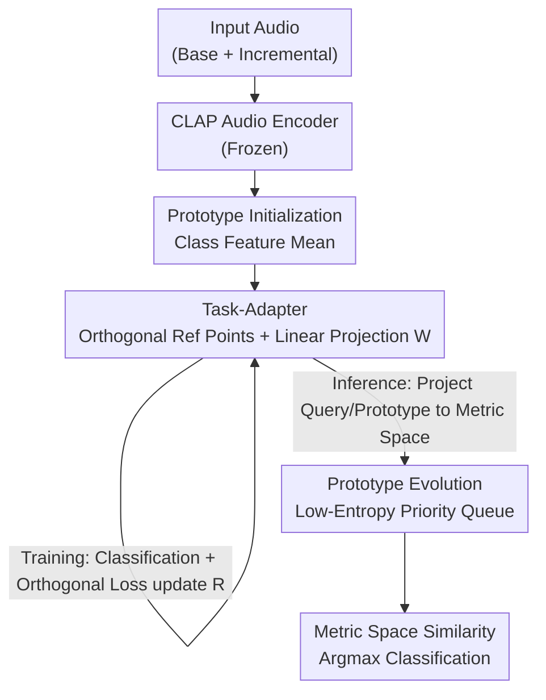

# TAPE: Task-Adaptive Prototype Evolution in Audio-Language Models for Fully Few-shot Class-incremental Audio Classification

**Conference**: CVPR 2026  
**Paper**: [CVF Open Access](https://openaccess.thecvf.com/content/CVPR2026/html/Gao_TAPE_Task-Adaptive_Prototype_Evolution_in_Audio-Language_Models_for_Fully_Few-shot_CVPR_2026_paper.html)  
**Code**: https://github.com/YvoGao/TAPE  
**Area**: Audio/Speech  
**Keywords**: Audio-Language Models, Few-Shot Class-Incremental Learning, Catastrophic Forgetting, Prototype Evolution, CLAP

## TL;DR
Addressing the "Fully Few-shot Class-incremental Audio Classification" (FFCAC) task where both base and incremental stages have extremely few samples, TAPE avoids fine-tuning the text branch of CLAP. Instead, it freezes the audio encoder and learns a linear Task-Adapter to project audio into an orthogonal reference point space to resist forgetting. During inference, it dynamically updates class prototypes using low-entropy query samples to combat overfitting. The method improves average accuracy from 54.93% to 82.76% across three datasets.

## Background & Motivation
**Background**: Few-shot class-incremental audio classification (FCAC) requires learning new classes from very few labeled audio samples in each new session without forgetting old ones. However, existing works usually assume the "base session has sufficient data," which does not hold in real-world scenarios like identifying criminal voiceprints or monitoring endangered species. In these cases, both base and incremental sessions provide **only a few samples** (FFCAC). Currently, only EDE and AISP address this by expanding and fine-tuning an Audio Spectrogram Transformer (AST), which becomes increasingly bulky and difficult to deploy as sessions increase.

**Limitations of Prior Work**: A natural idea is to leverage the strong generalization of pre-trained Audio-Language Models (ALM, e.g., CLAP). However, the authors found that applying CLAP directly to FFCAC fails for two reasons. First, **Text-Audio Misalignment**: CLAP is trained on far less data (0.128M) than CLIP (400M), leading to weak alignment between text and audio. Zero-shot CLAP achieves only ~10% accuracy on LBS-100; furthermore, in tasks like speaker recognition, class names are speaker IDs with no semantic link to waveforms, making the text branch useless. Second, **Catastrophic Forgetting + Overfitting**: Fine-tuning ALMs with trainable prompts (e.g., PALM) yields high accuracy in the base session (94% on Nsynth-100 session 0) but suffers sharp performance drops in incremental sessions, as 5 samples per class severely limit generalization.

**Key Challenge**: Leveraging the generalization of ALMs without relying on an unreliable text branch, and suppressing both forgetting of old knowledge and overfitting to the sparse training distribution.

**Goal**: Adapt ALMs for FFCAC without fine-tuning CLAP or expanding the model, while simultaneously addressing forgetting and overfitting.

**Key Insight**: Since the text branch is unreliable and samples are too scarce for fine-tuning CLAP, the model should **learn entirely from the audio feature side**, bypassing text. Furthermore, knowledge should be "absorbed" from query audio during the inference stage, not just during training.

**Core Idea**: Freeze the CLAP audio encoder and learn a linear transformation to project audio into a space of **orthogonal reference points** (anti-forgetting). Use **low-entropy query samples to evolved class prototypes dynamically** during inference (anti-overfitting)—referred to as Task-Adaptive Prototype Evolution (TAPE).

## Method

### Overall Architecture
TAPE splits the problem into training and inference phases, manipulating only audio features while the text branch remains uninvolved. During training: The frozen CLAP audio encoder $f_A$ encodes labeled audio, and class prototypes $P$ are initialized by class-wise averaging. The Task-Adapter uses an orthogonal reference layer $R$ and the prototype matrix $P$ to solve for a linear transformation matrix $W$, projecting features and prototypes into a "task-adaptive metric space." Only the reference layer is updated via classification loss. During inference: Query audio is encoded and projected by the same $W$. Prototype Evolution selects **low-entropy (high confidence)** query features and adds them to per-class priority queues. These features "evolve" prototypes toward the true class centers. Classification is performed via similarity in the metric space.

### Key Designs

**1. Task-Adapter: Geometric isolation via orthogonal reference points to resist forgetting**

Forgetting occurs when samples from all classes are crowded in the same feature space, causing new sessions to erase old class boundaries. The Task-Adapter projects each class prototype **onto a set of fixed, mutually orthogonal reference points**. Since the reference points are maximally separated, new and old prototypes are naturally pushed apart in the projected space. Specifically, let $R$ be the reference layer weight matrix (each row is a normalized per-class vector $r_c/\lVert r_c\rVert$, learned and then frozen for old sessions). $P=[p_1,\dots,p_{N_t}]$ is the prototype matrix where each new class prototype is $p_c=\frac{1}{|D_c|}\sum_{(x_i,y_i)\in D_c} f_A(x_i)$. Instead of a non-linear transform, the authors **solve the linear equation $PW=R$** directly using the Moore-Penrose pseudoinverse $P^{+}=P^{T}(PP^{T})^{-1}$, yielding $W=P^{+}R\in\mathbb{R}^{d\times d}$. This linear solution has few parameters, preventing overfitting when only 5 samples per class are available. Classification uses softmax over cosine distances: $p(y|x_q)=\frac{\exp(-d(f_A(x_q)W, p_cW))}{\sum_{p_i\in P}\exp(-d(f_A(x_q)W, p_iW))}$. Training includes an **orthogonal regularization** term $\lambda\lVert R^{T}R-I\rVert_F^2$ ($\lambda=0.1$).

**2. Prototype Evolution: Dynamic prototype correction via low-entropy queries to resist overfitting**

Overfitting occurs because the initial prototype (mean of 5 samples) deviates from the true class center. Prototype Evolution draws on test-time adaptation: as queries arrive during inference, they are used to "pull" the prototype toward the true center. The model maintains a **priority queue** $Q_c$ of size $M$ for each class, sorted by **self-information entropy** $h=-\frac{1}{N_t}\sum_{i=1}^{N_t}Pr_i\log Pr_i$. Queries are enqueued based on **pseudo-labels**. If the queue is full, a new query replaces the entry with the highest entropy if its own entropy is lower. Prototypes are updated via momentum: $p_c\leftarrow(1-\alpha)\hat{p}_c+\alpha\frac{1}{|Q_c|}\sum_m f_A(x_q^m)$, where $\hat{p}_c$ is the original prototype and $\alpha\in[0,1]$ is the momentum coefficient. Queues are **reset at the start of each session** to prevent error accumulation.

### Loss & Training
The training loss consists of cross-entropy and orthogonal regularization: $\mathcal{L}=-\frac{1}{|Q|}\sum_{x_q\in Q}\sum_{c=1}^{C} y_c\log(\tilde{y}) + \lambda\lVert R^{T}R-I\rVert_F^2$ with $\lambda=0.1$. Only the reference layer $R$ is optimized per session. The priority queue capacity is $M=5$. CLAP weights are from public pre-training. Experiments involve 5 sessions, with 25 classes per dataset split into 5 non-overlapping sets, averaged over 100 random seeds.

## Key Experimental Results

### Main Results
Evaluated on instrument recognition (Nsynth-100), event detection (FSC-89), and speaker recognition (LBS-100) using Average Accuracy (AA↑) and Performance Drop (PD↓).

| Dataset | Metric | TAPE | Next Best Baseline | Gain |
|--------|------|------|----------|------|
| Nsynth-100 | AA↑ | 94.78% | 65.40% (EDE) | +29.38 |
| Nsynth-100 | PD↓ | 4.08% | 10.94% (AISP) | -6.82 |
| FSC-89 | AA↑ | 68.97% | 45.31% (AISP) | +23.66 |
| FSC-89 | PD↓ | 20.53% | 29.23% (AISP) | -8.70 |
| LBS-100 | AA↑ | 84.53% | ~61.2% | +23.32 |
| LBS-100 | PD↓ | 12.78% | ~35.57% | -22.79 |

TAPE improves AA from 54.93% to 82.76% and reduces PD from 28.74% to 12.56%. While PALM is strong in Session 0, it crashes by Session 4 (PD 62.77), whereas TAPE remains stable.

### Ablation Study
Baseline: CLAP encoder + ProtoNet (AA↑ / PD↓):

| Configuration | LBS-100 | Nsynth-100 | FSC-89 |
|------|---------|------------|--------|
| Baseline | 40.30 / 61.94 | 79.07 / 28.89 | 48.12 / 42.79 |
| + Prototype Evolution | 83.54 / 15.30 | 93.10 / 6.40 | 67.88 / 21.19 |
| + Task-Adapter | 82.20 / 15.49 | 93.67 / 5.83 | 68.05 / 21.68 |
| TAPE (Full) | 84.53 / 12.78 | 94.78 / 4.08 | 68.97 / 20.53 |

## Highlights & Insights
- **Bypassing the text branch is effective**: For tasks where class names lack semantics (e.g., speaker IDs), relying solely on audio features via metric learning avoids the pitfalls of weak text-audio alignment in ALMs like CLAP.
- **Linear solver $PW=R$ is parameter-efficient**: Solving for a transformation rather than learning a non-linear network minimizes overfitting in the 5-shot regime. Orthogonal reference points provide a robust geometric prior for class separation.
- **Turning inference into "learning"**: Prototype Evolution treats inference as an opportunity for adaptation. The combination of low-entropy priority queues, momentum updates, and periodic resets allows the model to refine its boundaries using unlabeled test data.

## Limitations & Future Work
- **Dependency on pseudo-label quality**: Prototype Evolution relies on the accuracy of early pseudo-labels; highly confident but incorrect predictions ("confirmative bias") can misguide the prototype.
- **Heuristic entropy criteria**: Using self-entropy as a confidence measure is simple and does not account for model calibration issues.
- **Frozen encoder upper bound**: Since the CLAP encoder is never updated, the system's performance is limited by the pre-trained feature representation, especially for out-of-domain audio (e.g., extreme noise).

## Related Work & Insights
- **vs EDE / AISP**: Unlike these methods that expand the model architecture, TAPE keeps the model size constant, making it more practical for deployment while achieving higher accuracy.
- **vs PALM / COOP**: TAPE avoids the instability and catastrophic forgetting associated with fine-tuning text prompts in incremental scenarios.
- **vs FSCIL (CEC / FACT)**: TAPE leverages the broad knowledge of ALMs while introducing inference-time evolution to handle audio-specific challenges.

## Rating
- Novelty: ⭐⭐⭐⭐
- Experimental Thoroughness: ⭐⭐⭐⭐⭐
- Writing Quality: ⭐⭐⭐⭐
- Value: ⭐⭐⭐⭐

<!-- RELATED:START -->

## Related Papers

- [\[AAAI 2026\] AHAMask: Reliable Task Specification for Large Audio Language Models without Instructions](../../AAAI2026/audio_speech/ahamask_reliable_task_specification_for_large_audio_language.md)
- [\[CVPR 2026\] AudioStory: Generating Long-Form Narrative Audio with Large Language Models](audiostory_generating_long-form_narrative_audio_with_large_language_models.md)
- [\[CVPR 2026\] Echoes Over Time: Unlocking Length Generalization in Video-to-Audio Generation Models](echoes_over_time_unlocking_length_generalization_in_video-to-audio_generation_mo.md)
- [\[ACL 2026\] SEPT: Semantically Expanded Prompt Tuning for Audio-Language Models](../../ACL2026/audio_speech/generalizable_prompt_tuning_for_audio-language_models_via_semantic_expansion.md)
- [\[ACL 2026\] MCGA: A Multi-task Classical Chinese Literary Genre Audio Corpus](../../ACL2026/audio_speech/mcga_a_multi-task_classical_chinese_literary_genre_audio_corpus.md)

<!-- RELATED:END -->
