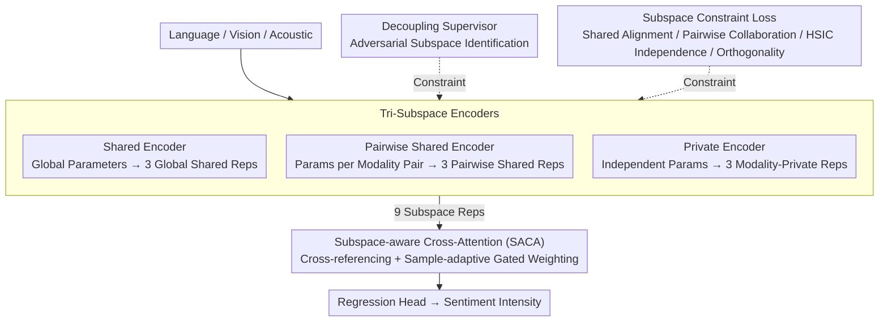

# Tri-Subspaces Disentanglement for Multimodal Sentiment Analysis

**Conference**: CVPR 2026  
**arXiv**: [2602.19585](https://arxiv.org/abs/2602.19585)  
**Code**: None  
**Area**: Speech/Audio  
**Keywords**: Multimodal Sentiment Analysis, Tri-Subspaces Disentanglement, Cross-Attention Fusion, Pairwise Shared, HSIC

## TL;DR

The TSD framework is proposed to explicitly decompose multimodal features into three complementary subspaces: global shared, pairwise shared, and modality-private. A subspace-aware cross-attention fusion module adaptively integrates these three layers of information, achieving state-of-the-art (SOTA) performance on CMU-MOSI and CMU-MOSEI datasets.

## Background & Motivation

Multimodal sentiment analysis integrates linguistic, visual, and acoustic modalities. Most existing methods adopt a "shared-private" binary approach (e.g., MISA), dividing features into global-shared and modality-private components. However, many emotional cues in human communication are shared only between specific pairs of modalities—for instance, in sarcastic scenarios, tone and facial expressions concurrently convey negative emotion while the text remains positive. Such "pairwise-shared" signals are often ignored or misclassified in the binary paradigm.

## Method

### Overall Architecture

The TSD framework aims to resolve the omission of pairwise signals in the "shared-private" binary approach by introducing an additional representation layer for each modality. Multimodal features are first encoded and explicitly decomposed into three types of subspaces: global shared, pairwise shared, and modality-private. This results in 9 subspace representations across three modalities (3 shared + 3 pairwise + 3 private). A set of decoupling losses and an adversarial supervisor ensure that these 9 representations are strictly constrained to their respective roles without leakage. Finally, the SACA fusion module allows subspaces to cross-reference each other with adaptive weighting before being fed into a regression head for sentiment intensity prediction.

### Key Designs

**1. Tri-Subspace Encoders: Providing a dedicated space for "pairwise-shared" signals**

The binary approach only accounts for "shared by all" and "unique to one." In reality, cues shared only between tone and expression (excluding text) lack a proper representation space. TSD decomposes encoding into three parallel branches: the shared encoder $I(\cdot;\theta_c)$ uses common parameters for all modalities to extract modality-invariant global features $\mathbf{C}_m$; the pairwise shared encoder $S_{mn}(\cdot;\theta_{mn})$ uses specific parameters for each modality pair $(m,n)$ to capture interaction features $\mathbf{S}_{mn}^{(m)}$; the private encoder $P_m(\cdot;\theta_m)$ is modality-specific to retain unique information $\mathbf{P}_m$. The granularity of parameter sharing corresponds to the scope of information sharing.

**2. Decoupling Supervisor: Using adversarial discrimination to block information leakage**

Encoder structure alone cannot guarantee that each subspace contains only its intended information. The supervisor is a three-branch discriminator that predicts the "subspace origin" (shared, pairwise, or private) for any given embedding. Encoders are trained to make these identities recognizable:

$$\mathcal{L}_{sup} = -\frac{1}{M}\sum_m \Big[\log D_{com}(\mathbf{c}_m) + \sum_{n \neq m}\log D_{sub}(\mathbf{s}_{mn}^{(m)}) + \log D_{pri}(\mathbf{p}_m)\Big]$$

Unlike MISA, which uses a modality discriminator, TSD employs subspace attribution, providing finer constraints to suppress cross-subspace leakage.

**3. Subspace Constraint Loss: Defining geometric constraints for alignment and orthogonality**

While the supervisor handles identity, these losses define the geometric relationships between representations. The shared consistency loss $\mathcal{L}_{com}=\sum\|\mathbf{c}_m-\mathbf{c}_n\|_2^2$ aligns shared representations across modalities. The pairwise collaboration loss $\mathcal{L}_{pair}=\sum\|\mathbf{s}_{mn}^{(m)}-\mathbf{s}_{mn}^{(n)}\|_2^2$ aligns pairwise representations from different modalities within the same pair. The private independence loss $\mathcal{L}_{pri}=\sum\text{HSIC}(\mathbf{p}_{m_1},\mathbf{p}_{m_2})$ uses Hilbert-Schmidt Independence Criterion (HSIC) to minimize non-linear statistical dependencies between private representations. The orthogonality loss $\mathcal{L}_{ort}=\sum\|\mathbf{C}_m^\top\mathbf{P}_m\|_F^2+\cdots$ forces shared and private directions to be orthogonal.

**4. Subspace-aware Cross-Attention (SACA): Adaptive weighting based on internal visibility**

Simple concatenation fails to determine which signals are more reliable for a given sample. SACA constructs a context set for each subspace consisting of all other subspaces, performs multi-head cross-attention for enhancement, and then uses a gating network to compute adaptive weights $\psi_k$ for a weighted sum:

$$\mathbf{Y}_{final} = \sum_k \psi_k \cdot F_{\mathcal{S}}^{(k)}$$

This allows the model to prioritize pairwise subspaces in sarcastic samples while de-prioritizing global shared subspaces when they contain conflicting information.

### Mechanism Example

Consider a sarcastic comment "Great job!" (positive text, sarcastic tone, dismissive expression). The pairwise shared representation $\mathbf{S}_{ta}$ between text and acoustics strongly encodes that the tone negates the literal meaning. Meanwhile, the global shared representation may be weak due to contradictions across three modalities. SACA detects the importance of the pairwise shared layer and increases its weight $\psi$, leading to a correct "negative sentiment" prediction, whereas binary methods might misclassify it as "positive."

### Loss & Training

The total loss combines the task regression term with tri-subspace regularization: $\mathcal{L}_{all} = \mathcal{L}_{task} + \mathcal{L}_{TS}$. The term $\mathcal{L}_{TS}$ aggregates the supervisor loss and the four geometric constraint losses, with weights $\lambda_{1\text{-}4}$ tuned via a validation set.

## Key Experimental Results

### Main Results

| Dataset | Metric | TSD | EMOE (Prev. SOTA) | Gain |
|--------|------|-----|--------------|------|
| CMU-MOSI | MAE ↓ | **0.691** | 0.697 | -0.9% |
| CMU-MOSI | ACC7 ↑ | **49.0%** | 47.8% | +2.5% |
| CMU-MOSI | ACC2 ↑ | **86.5%** | 85.4% | +1.3% |
| CMU-MOSEI | ACC7 ↑ | **54.9%** | 54.1% | +1.5% |
| CMU-MOSEI | ACC2 ↑ | **86.2%** | 85.5% | +0.8% |

### Ablation Study

| Configuration | MOSI MAE | Description |
|------|----------|------|
| w/o Pairwise Shared | +0.015 | Pairwise signals are critical for sentiment |
| w/o Decoupling Supervisor | +0.012 | Supervisor effectively prevents leakage |
| w/o SACA | +0.018 | Hierarchical fusion outperforms concatenation |
| HSIC replaced by L2 | +0.008 | HSIC ensures better independence |

### Key Findings

- The tri-subspace approach outperforms the binary (shared-private) approach across all metrics with low variance.
- The model demonstrates strong transferability on multimodal intent recognition tasks.

## Highlights & Insights

1. **Novelty**: Explicit modeling of "pairwise-shared" subspaces fills a theoretical gap in the shared-private binary paradigm.
2. **Mechanism**: The SACA hierarchical fusion allows each subspace to "observe" others before determining its contribution.
3. **Decoupling**: The subspace-based adversarial supervisor is more precise than traditional modality discriminators.

## Limitations & Future Work

1. Scalability: For $n$ modalities, the number of pairwise subspaces grows at $C_n^2$, leading to potential combinatorial explosion.
2. Hyperparameters: Weights $\lambda_{1-4}$ for various losses require careful tuning.
3. Temporal Dynamics: The model currently operates at the utterance level without explicit sequential modeling.

## Related Work & Insights

- Comparison with MISA: Expands from 2 subspaces to 3, adding the pairwise shared dimension.
- The HSIC independence constraint is applicable to other multi-view learning tasks requiring feature decorrelation.

## Rating

- Novelty: ⭐⭐⭐⭐ Clear theoretical motivation for tri-subspace decomposition.
- Experimental Thoroughness: ⭐⭐⭐⭐ Dual datasets + transfer tasks + comprehensive ablation.
- Writing Quality: ⭐⭐⭐⭐ Standardized mathematical notation.
- Value: ⭐⭐⭐ Incremental gains, but addresses a correct fundamental direction.

<!-- RELATED:START -->

## Related Papers

- [\[AAAI 2026\] PSA-MF: Personality-Sentiment Aligned Multi-Level Fusion for Multimodal Sentiment Analysis](../../AAAI2026/audio_speech/psa-mf_personality-sentiment_aligned_multi-level_fusion_for_multimodal_sentiment.md)
- [\[AAAI 2026\] PaSE: Prototype-aligned Calibration and Shapley-based Equilibrium for Multimodal Sentiment Analysis](../../AAAI2026/audio_speech/pase_prototype-aligned_calibration_and_shapley-based_equilibrium_for_multimodal_.md)
- [\[AAAI 2026\] Improving Multimodal Sentiment Analysis via Modality Optimization and Dynamic Primary Modality Selection](../../AAAI2026/audio_speech/improving_multimodal_sentiment_analysis_via_modality_optimization_and_dynamic_pr.md)
- [\[AAAI 2026\] A Text-Routed Sparse Mixture-of-Experts Model with Explanation and Temporal Alignment for Multi-Modal Sentiment Analysis](../../AAAI2026/audio_speech/text-routed_sparse_mixture-of-experts_model_with_explanation_and_temporal_alignm.md)
- [\[CVPR 2026\] UniM: A Unified Any-to-Any Interleaved Multimodal Benchmark](unim_a_unified_any-to-any_interleaved_multimodal_benchmark.md)

<!-- RELATED:END -->
