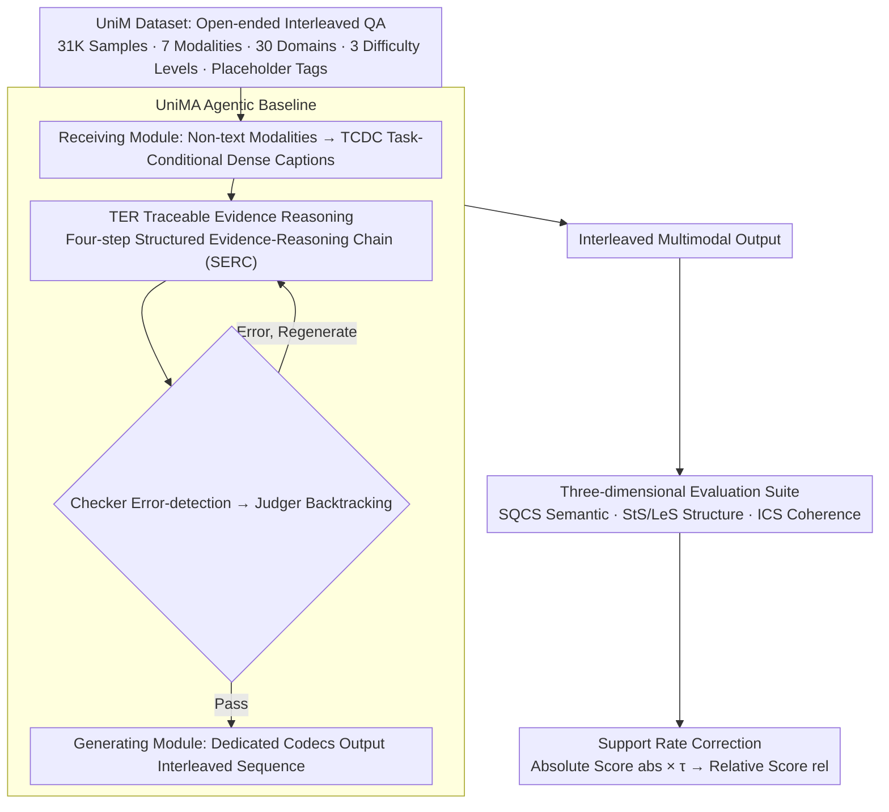

# UniM: A Unified Any-to-Any Interleaved Multimodal Benchmark

**Conference**: CVPR 2026  
**arXiv**: [2603.05075](https://arxiv.org/abs/2603.05075)  
**Code**: Yes ([Project Page](https://any2any-mllm.github.io/unim))  
**Area**: Audio/Speech (Multimodal Benchmark)  
**Keywords**: Multimodal Benchmark, Any-to-Any, Interleaved Multimodal, Evaluation Suite, Agent Models

## TL;DR

This paper introduces UniM, the first unified any-to-any interleaved multimodal benchmark (31K samples, 7 modalities, 30 domains), along with a three-dimensional evaluation suite and an agentic baseline UniMA based on traceable reasoning. The study reveals significant deficiencies in existing MLLMs under the interleaved multimodal paradigm.

## Background & Motivation

### 1. Background
Multimodal Large Language Models (MLLMs) have rapidly evolved from early vision-language understanding to unified frameworks supporting simultaneous understanding and generation (e.g., NExT-GPT, AnyGPT, MIO). Interleaved multimodal learning has become a core capability for next-generation systems.

### 2. Limitations of Prior Work
Existing interleaved multimodal benchmarks (MMIE, CoMM, ISG-Bench, OpenING, etc.) exhibit three critical flaws:

- **Narrow Modality Coverage**: Limited to text and images, failing to evaluate broader combinations such as audio, video, documents, code, and 3D.
- **Isolated Capability Assessment**: Each instance tests only a single capability, failing to reflect the composite reasoning of intertwined capabilities in real-world scenarios.
- **Insufficient Domain Diversity**: Concentrated in general domains, neglecting specialized scenarios like natural and social sciences.

### 3. Key Challenge
Model capabilities have expanded to multimodal any-to-any conversion, yet systematic evaluation benchmarks are lacking. The evaluation dimensions, modality coverage, and difficulty scaling of existing benchmarks lag significantly behind model development.

### 4. Goal
The objective is to construct a unified interleaved multimodal benchmark covering **multiple modalities** (7 types), **multiple domains** (30 domains), **multiple capabilities** (multi-task per instance), and **multiple difficulty levels** (3 levels), while designing corresponding evaluation methods and baseline models.

### 5. Key Insight
Starting from real-world data (public datasets, social media, knowledge bases like Wikipedia/YouTube), the authors construct a large-scale interleaved multimodal dataset in an open-ended QA format, where both input and output are interleaved sequences of arbitrary modalities.

### 6. Core Idea
Three major contributions: (1) UniM Dataset—the first unified any-to-any interleaved multimodal benchmark; (2) UniM Evaluation Suite—three-dimensional assessment of semantic correctness, structural integrity, and interleaved coherence; (3) UniMA—an agentic baseline model based on traceable evidence reasoning.

## Method

### Overall Architecture

UniM addresses a question missed by existing benchmarks: when a model can process "any modality in, any modality out," how is the quality of its generated interleaved sequence measured? The work consists of three components: a large-scale dataset, a three-dimensional evaluation suite, and an agentic baseline. The data follows a unified open-ended QA format: inputs and outputs are interleaved sequences where non-text content is embedded into text via placeholder tags (e.g., `<<image1>>`, `<<video2>>`). This allows images, audio, video, and 3D to be referenced and evaluated within a consistent textual backbone. The final dataset comprises 31,026 high-quality instances across 7 modalities and 30 domains (categorized into Natural Sciences, Social Sciences, and General Domain), categorized into Easy/Medium/Hard difficulty levels. The figure below illustrates the data flow involving the dataset, the UniMA reasoning pipeline, and the 3D evaluation with support rate correction:

### Key Designs

**1. Three-dimensional Evaluation Suite: Decomposing "Interleaved Multimodal Quality" into Orthogonal Dimensions**

Traditional accuracy metrics fail for open-ended generation as multiple reasonable interleaved responses may exist. The paper decomposes quality into three orthogonal dimensions: SQCS (Semantic Quality and Correctness Score), which converts all modality outputs into caption-like text for LLM-as-Judge semantic correctness (SC) and applies a reference-free generation quality (GQ) assessment. These are combined as $\text{SQCS} = \text{SC} \cdot (\eta^{\text{SQCS}} + (1 - \eta^{\text{SQCS}}) \cdot \text{GQ})$, with $\eta^{\text{SQCS}} = 0.7$. Structural integrity is split into Strict Score (StS) and Loose Score (LeS), quantifying instruction following. Coherence is measured by ICS, calculated as $\eta^{\text{ICS}} \cdot \text{HC} + (1 - \eta^{\text{ICS}}) \cdot \text{SH}$ ($\eta^{\text{ICS}} = 0.8$), where HC measures cross-modal semantic consistency and SH measures stylistic coordination. This decoupling allows for precise failure localization.

**2. Support Rate Correction: Distinguishing Between Capability and Coverage**

Applying absolute scores to all models is unfair if a baseline does not support specific modalities (e.g., 3D or audio). The paper introduces the support rate $\tau$ to convert absolute ability into relative ability:

$$\mathcal{X}^{rel} = \tau \cdot \mathcal{X}^{abs}$$

Here, $\mathcal{X}^{abs}$ denotes the absolute score across all samples, while $\tau$ reflects the proportion of modalities actually supported. Absolute scores (abs) represent performance in the full task space, while relative scores (rel) represent performance within the model's supported scope.

**3. UniMA Agentic Baseline: Traceable Evidence Reasoning**

Most MLLMs fail significantly on this benchmark. UniMA is designed as an agentic pipeline to establish a strong baseline. The Receiving Module converts non-text modalities into Task-Conditional Dense Captions (TCDC), mapping inputs into a unified textual space. The Traceable Evidence Reasoning (TER) module executes a four-step Structured Evidence-Reasoning Chain (SERC): generating TCDC, determining if data analysis is needed via a code interpreter, organizing content categories for SQCS/ICS/StS-LeS dimensions, and integrating all evidence into a draft. A Checker-Judger loop iteratively corrects factual and logical errors before the Generating Module outputs the final interleaved sequence using dedicated codecs.

### Loss & Training

UniMA is an agentic framework rather than an end-to-end trained model; it does not utilize gradient optimization. Its capability stems from the SERC process and component integration. The weights $\eta^{\text{SQCS}} = 0.7$ and $\eta^{\text{ICS}} = 0.8$ are calibrated through alignment with human evaluation.

## Key Experimental Results

### Main Results

**Table 1: Semantic Quality and Correctness Score (SQCS) and Support Rate**

| Domain | Model | SC | GQ | SQCS_abs | τ | SQCS_rel |
|------|------|---:|---:|---:|---:|---:|
| Natural Sciences | AnyGPT | 13.7 | 37.9 | 11.1 | 90.4 | 10.7 |
| Natural Sciences | NExT-GPT | 8.4 | 23.4 | 6.2 | 62.0 | 2.9 |
| Natural Sciences | MIO | 19.7 | 29.1 | 15.9 | 59.2 | 10.0 |
| Natural Sciences | **UniMA** | **59.8** | **79.7** | **57.3** | **100** | **57.3** |
| Social Sciences | AnyGPT | 18.0 | 23.8 | 15.5 | 94.7 | 14.7 |
| Social Sciences | NExT-GPT | 16.8 | 31.9 | 13.3 | 89.0 | 10.8 |
| Social Sciences | MIO | 25.2 | 32.8 | 21.4 | 80.8 | 16.1 |
| Social Sciences | **UniMA** | **76.2** | **81.0** | **72.7** | **100** | **72.7** |
| General | **UniMA** | **64.7** | **83.6** | **62.2** | **100** | **62.2** |

**Table 2: Interleaved Coherence Evaluation (ICS)**

| Domain | Model | HC | SH | ICS_abs | ICS_rel |
|------|------|---:|---:|---:|---:|
| Natural Sciences | AnyGPT | 39.9 | 46.3 | 41.8 | 38.5 |
| Natural Sciences | NExT-GPT | 23.5 | 26.1 | 24.9 | 16.3 |
| Natural Sciences | MIO | 49.4 | 63.7 | 52.1 | 31.8 |
| Natural Sciences | **UniMA** | **68.4** | **71.9** | **69.1** | **69.1** |
| Social Sciences | AnyGPT | 31.3 | 35.3 | 32.1 | 29.2 |
| Social Sciences | MIO | 46.3 | 55.0 | 51.6 | 42.0 |
| Social Sciences | **UniMA** | **73.1** | **76.5** | **73.8** | **73.8** |
| General | MIO | 68.3 | 77.7 | 60.0 | 45.7 |
| General | **UniMA** | **68.7** | **74.3** | **69.8** | **69.8** |

### Ablation Study

**Table 3: UniMA Ablation Study**

| Configuration | SQCS | ICS | StS | LeS |
|------|---:|---:|---:|---:|
| UniMA (Full) | 85.1 | 63.4 | 52.7 | 82.6 |
| w/o TER | 72.9 (-12.2) | 56.6 (-6.8) | 16.4 (-36.3) | 21.8 (-60.8) |
| w/o TCDC | 78.4 (-6.7) | 57.7 (-5.7) | 46.2 (-6.5) | 82.1 (-0.5) |
| w/o Verification | 72.9 (-12.2) | 54.7 (-8.7) | 38.3 (-14.4) | 66.8 (-15.8) |

### Key Findings

1. **Poor Performance of Existing Models**: SQCS for baseline models is mostly below 20%, and StS/LeS for NExT-GPT and MIO are mostly below 5%, indicating current MLLMs are inadequate for interleaved multimodal learning.
2. **Support Rate Limits Relative Performance**: Broad modality support is a core bottleneck; for instance, AnyGPT's StS drops from 12.5% to 9.8% (rel) in general domains.
3. **Significant Domain Disparity**: Social Sciences yield the highest SQCS (common concepts), while General Domain yields the highest ICS. Natural Sciences perform worst due to requirements for precise terminology and logic.
4. **UniMA Dominance**: UniMA surpasses AnyGPT by 2-6x and NExT-GPT/MIO by 15-40x in StS/LeS.
5. **Difficulty Sensitivity**: Only UniMA exhibits a performance gradient consistent with task difficulty levels.

## Highlights & Insights

- **Problem Definition**: This work systematically defines "Any-to-Any Interleaved Multimodal Learning," filling a void with 7 modalities, 30 domains, and multi-level difficulty.
- **Sophisticated Evaluation**: The SQCS/StS-LeS/ICS suite successfully decouples semantics, structure, and coherence, showing a Pearson correlation of up to 0.974 with human judgment.
- **Fairness via Support Rate**: The $\tau$ correction mechanism differentiates between a model's inherent reasoning flaws and its architectural modality limitations.
- **Agentic Strength**: The TER module's evidence traceability and iteration loop effectively improve structured output quality in an agentic framework.

## Limitations & Future Work

- UniMA is an agentic pipeline rather than a unified end-to-end model; its performance stems from integration rather than architectural breakthroughs.
- Modality imbalance exists, with code (2.6%) and 3D (1.4%) having low representation.
- Evaluation depends heavily on LLM-as-Judge, potentially inheriting evaluator bias.
- Absence of a human performance baseline makes it difficult to gauge the absolute proficiency of the ~60% SQCS score.
- Partial reliance on GPT-5-mini for instance generation may introduce synthetic data bias.

## Related Work & Insights

- **Comparison with MMIE/CoMM**: UniM scales modalities from 2 to 7 and domains from ~10 to 30, representing a significant jump in complexity.
- **Baseline Limitations**: Experiments expose severe limitations in models like NExT-GPT and AnyGPT in interleaved contexts.
- **Reasoning Paradigm**: The "Generate → Check → Backtrack → Regenerate" paradigm used in TER offers a valuable template for complex multimodal tasks.
- **Orthogonal Evaluation**: Decomposing multimodal evaluation into semantic, structural, and coherence dimensions provides more actionable insights than a single score.

## Rating

⭐⭐⭐⭐ An important benchmark contribution that systematically defines and evaluates any-to-any interleaved multimodal learning. High data scale and thoughtful evaluation design, though the UniMA baseline is more of an engineering integration than a model innovation.

<!-- RELATED:START -->

## Related Papers

- [\[CVPR 2025\] Contextual AD Narration with Interleaved Multimodal Sequence](../../CVPR2025/audio_speech/contextual_ad_narration_with_interleaved_multimodal_sequence.md)
- [\[AAAI 2026\] Cross-Space Synergy: A Unified Framework for Multimodal Emotion Recognition in Conversation](../../AAAI2026/audio_speech/cross-space_synergy_a_unified_framework_for_multimodal_emotion_recognition_in_co.md)
- [\[CVPR 2026\] Tri-Subspaces Disentanglement for Multimodal Sentiment Analysis](tri-subspaces_disentanglement_for_multimodal_sentiment_analysis.md)
- [\[CVPR 2026\] AMUSE: Audio-Visual Benchmark and Alignment Framework for Agentic Multi-Speaker Understanding](amuse_audio-visual_benchmark_and_alignment_framework_for_agentic_multi-speaker_u.md)
- [\[CVPR 2026\] Pushing the Frontier of Audiovisual Perception with Large-Scale Multimodal Correspondence Learning](pushing_the_frontier_of_audiovisual_perception_with_large-scale_multimodal_corre.md)

<!-- RELATED:END -->
