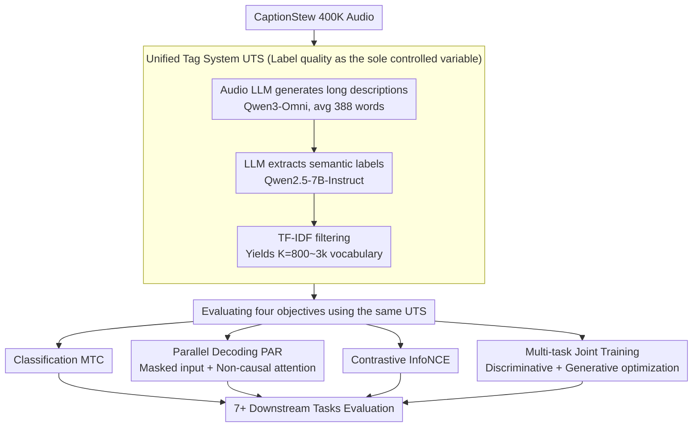
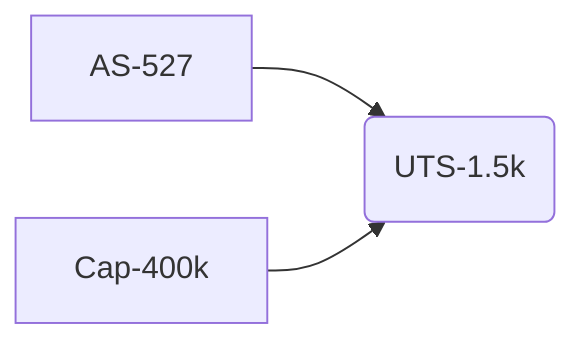

# Unlocking Strong Supervision: A Data-Centric Study of General-Purpose Audio Pre-Training Methods

**Conference**: CVPR 2026  
**arXiv**: [2603.25767](https://arxiv.org/abs/2603.25767)  
**Code**: [https://github.com/AudenAI/Auden/tree/main/examples/uts](https://github.com/AudenAI/Auden/tree/main/examples/uts)  
**Area**: Audio & Speech  
**Keywords**: Audio Pre-training, Unified Tag System, Data-Centric, Label Quality, Cross-domain Generalization

## TL;DR

This paper demonstrates through systematic data-centric experiments that audio pre-training performance is primarily driven by label/supervision quality rather than model design. It proposes the Unified Tag System (UTS) to unify speech, music, and environmental sounds into a fine-grained vocabulary of 800-3k labels. Models trained with UTS achieve performance surpassing AudioSet baselines on out-of-domain tasks like speech (VoxCeleb2) and music (MusicCaps) using 5 times less data.

## Background & Motivation

1. **Background**: Audio pre-training is mainly divided into two paradigms: (1) Label classification pre-training (standardized by AudioSet-527 labels); (2) Audio-language alignment pre-training (e.g., CLAP, audio captioning). The former depends on the manual label system of AudioSet, while the latter relies on the quality of text descriptions.
2. **Limitations of Prior Work**: (1) AudioSet's 527 labels primarily cover environmental sounds, while speech and music labels are severely insufficient, leading to poor generalization in speech/music downstream tasks; (2) Improvements in data scale and model architecture are approaching a bottleneck, but the role of label quality has been significantly underestimated.
3. **Key Challenge**: The industry pursues larger datasets and bigger models but may overlook the fundamental question of "whether the label system itself is good enough"—if labels are not fine-grained, the model cannot learn detailed semantic distinctions regardless of data volume.
4. **Goal**: Design a unified high-quality label system and systematically compare the performance of various pre-training objectives (classification/captioning/contrastive/multi-task) under this system.
5. **Key Insight**: Leverage powerful audio LLMs like Qwen3-Omni to generate high-fidelity audio descriptions (averaging 388 words), then employ LLMs to extract semantic labels to construct a cross-domain unified label vocabulary.
6. **Core Idea**: Automatically extract labels from high-quality audio descriptions using LLMs, construct the UTS vocabulary through TF-IDF filtering, and then systematically evaluate classification, generative, contrastive, and multi-task pre-training under this label system.

## Method

### Overall Architecture

The question this paper addresses is not "which network or pre-training objective is stronger," but "how much pre-training performance can be improved if the label system itself is optimized first." To this end, the authors established a pipeline to convert "raw audio" into "high-quality supervisory signals" for various pre-training objectives: starting from CaptionStew 400K audio, an audio LLM first transcribes each audio into a long description, semantic labels are extracted and filtered via statistical metrics to form a cross-domain vocabulary (UTS). Four models are then trained on the same UTS vocabulary and evaluated across 7+ downstream tasks. The only controlled variable is "label quality," allowing performance differences to be cleanly attributed to the supervisory signals.

### Key Designs

**1. Unified Tag System UTS: Replacing manual labels with LLM-mined fine-grained vocabularies**

The limitation established in the background is that AudioSet's 527 manual labels focus almost exclusively on environmental sounds, which forces speech and music semantics into very coarse categories. UTS delegates the task of "defining labels" entirely to LLMs: Qwen3-Omni generates detailed descriptions (avg 388 words) for each audio, and Qwen2.5-7B-Instruct extracts semantic labels. LLMs are preferred over traditional POS tagging due to the complexity of descriptive phrasing. Candidate labels are filtered by TF-IDF scores defined as:

$$s(t) = df(t) \cdot \log\!\Big(\frac{N+1}{df(t)+1}\Big)$$

where $df(t)$ is the document frequency of label $t$, and $N$ is the total number of audios. This score rewards labels that are frequent (general) but penalizes ubiquitous filler words, retaining the most discriminative terms to form vocabularies of $K\in\{800,1\text{k},1.5\text{k},2\text{k},3\text{k}\}$. As these labels are extracted from cross-domain descriptions, they naturally unify speech, music, and environmental semantics—t-SNE analysis confirms that UTS encapsulates the entire AudioSet semantic space as a more detailed superset.

**2. Parallel Decoding Objective PAR: Closing the "linguistic prior" shortcut in captioning**

Captioning-based pre-training intends to force the encoder to learn rich representations capable of detailed description. However, standard autoregressive (AR) decoding has a loophole: the decoder can rely on previously generated tokens and linguistic priors to predict the next word without fully utilizing the audio features. PAR eliminates this shortcut by encoding multi-hot label vectors into a canonical text sequence $Y_i=\text{"tag\_a, tag\_d, tag\_k"}$, and during decoding, masks all input tokens and removes causal attention. Each position must independently predict tokens based solely on the audio representation:

$$\mathcal{L}_{\text{par}} = -\sum_{t=1}^T \log p_\phi(y_t\mid z_i^a)$$

Since the decoder's only source of information is the audio encoder output $z_i^a$, the encoder must consolidate all necessary information into $z_i^a$ to reduce loss. Experimentally, PAR significantly outperforms AR on speech tasks (38.78 vs 29.87), validating the counter-intuitive design that weakening the decoder can actually strengthen the encoder.

**3. Multi-task Joint Training: Enabling discriminative and descriptive capabilities in a single encoder**

Standalone objectives have specific biases: pure classification (MTC) produces discriminatively strong but generatively weak models, while generative objectives exhibit the converse. The authors propose joint optimization:

$$\mathcal{L}_{\text{MTL}} = \mathcal{L}_{\text{MTC}} + \lambda\,\mathcal{L}_{\text{gen}}$$

where $\mathcal{L}_{\text{MTC}}$ is the multi-label binary cross-entropy on UTS (discriminative term), and $\mathcal{L}_{\text{gen}}$ is a hybrid captioning objective using a 0.25/0.75 mixture of AR and PAR (descriptive term), with $\lambda$ balancing the two. This ensures the encoder is constrained by both classification and reconstruction gradients, allowing it to excel in classification, captioning, and retrieval tasks simultaneously.

### Loss & Training

The discriminative term MTC uses multi-label binary cross-entropy; contrastive learning uses symmetric InfoNCE; captioning uses a mixture of AR and PAR. The backbone architecture includes a Zipformer-M audio encoder, a BERT-base text encoder, and a BART-base decoder. MTC is trained for 700k steps, while other objectives are trained for 400k steps, all on 8×V100 GPUs with a batch size of 640 audio seconds.

## Key Experimental Results

### Main Results

| Model | FSD-50k | VggSound | VoxCeleb2↑ | CREMA-D↑ | MTAT | NSynth |
|------|---------|----------|------------|----------|------|--------|
| MTC-AudioSet Baseline | **0.656** | **56.46** | 18.84 | 67.14 | **0.407** | **67.19** |
| MTC-UTS (Ours) | 0.459 | 37.70 | **37.10** | 66.01 | 0.375 | 63.62 |
| Contrastive (Ours) | 0.445 | 40.78 | 33.88 | 67.29 | 0.396 | 61.40 |
| Multi-task (Ours) | 0.485 | 40.81 | 34.62 | 65.31 | 0.396 | 59.94 |

### Ablation Study

| UTS Size | Linear Probing | Captioning | Retrieval | Description |
|---------|---------|------|------|------|
| K=800 | Medium | Medium | Medium | Labels too coarse |
| K=1.5k | **Peak** | **Peak** | **Peak** | Optimal balance point |
| K=3k | Decrease | Robust | Slight Dec | Increased data sparsity |

### Key Findings

- **Core Finding**: UTS-MTC outperforms the AudioSet-MTC baseline by 18.26% on speech tasks (37.10 vs 18.84) while using 5 times less data—demonstrating that supervision quality is more important than data quantity.
- The AudioSet baseline remains superior in in-domain tasks (FSD-50k, VggSound), suggesting that AudioSet labels are highly optimized for environmental sounds.
- PAR decoding is superior to AR in speech tasks (38.78 vs 29.87), confirming that removing linguistic shortcuts forces the encoder to learn more robust features.
- There is an optimal label system size (K=1.5k); excessively large vocabularies lead to insufficient training of long-tail labels.

## Highlights & Insights

- **Strong evidence for "Quality > Quantity"**: Achieving superior out-of-domain performance with 80k samples compared to a 2M-sample baseline is a profound insight for the general pre-training field.
- **PAR eliminates linguistic shortcuts**: The design philosophy of "strengthening the encoder by weakening the decoder" is elegant and applicable to other modalities like image captioning.
- **Scalability of UTS**: The toolchain (LLM captioner → LLM tagger → TF-IDF filtering) is fully automated, allowing for zero-cost adaptation to new domains.

## Limitations & Future Work

- UTS is dependent on the description quality of a single "teacher" model (Qwen3-Omni), which may introduce systemic biases.
- In-domain tasks (FSD-50k, VggSound) still trail the AudioSet baseline, suggesting large-scale data still holds advantages within specific domains.
- The optimal label size (K=1.5k) may fluctuate based on data distribution, and a self-adaptive selection mechanism is currently missing.
- Developing a single unified objective that is optimal across all downstream tasks remains an open challenge.
- Future work intends to combine data mixing strategies with the UTS label system on larger datasets.

## Related Work & Insights

- **vs AudioSet-MTC**: While AudioSet provides broad coverage, its semantic granularity is limited to 527 classes. UTS fills the semantic gap in speech and music categories.
- **vs CLAP/LAION-Audio**: While contrastive methods rely on the quality of text-audio pairs, this work achieves precise semantic alignment through a structured label system.
- **vs BEATs/Audio-MAE**: Self-supervised methods do not require labels but suffer from low pre-training efficiency and require extensive labeled fine-tuning for downstream tasks.

## Rating

- Novelty: ⭐⭐⭐⭐ The construction of UTS and the PAR decoding design are innovative, though the emphasis on data quality is an evolving trend.
- Experimental Thoroughness: ⭐⭐⭐⭐⭐ Extremely comprehensive, covering 5 pre-training objectives, multiple vocabulary sizes, and 7 downstream tasks with varied evaluation modes.
- Writing Quality: ⭐⭐⭐⭐ Clear narrative logic from a data-centric perspective.
- Value: ⭐⭐⭐⭐⭐ Provides a systematic solution to the "label system" issue in audio pre-training; the open-sourced UTS toolchain is highly reusable.

<!-- RELATED:START -->

<!-- RELATED:END -->

## Related Papers

- [\[CVPR 2026\] Echoes Over Time: Unlocking Length Generalization in Video-to-Audio Generation Models](echoes_over_time_unlocking_length_generalization_in_video-to-audio_generation_mo.md)
- [\[ACL 2026\] Towards Fine-Grained and Multi-Granular Contrastive Language-Speech Pre-training](../../ACL2026/audio_speech/towards_fine-grained_and_multi-granular_contrastive_language-speech_pre-training.md)
- [\[CVPR 2026\] GEM-TFL: Bridging Weak and Full Supervision for Forgery Localization](gem-tfl_bridging_weak_and_full_supervision_for_forgery_localization_through_em-g.md)
- [\[CVPR 2026\] EchoFoley: Event-Centric Hierarchical Control for Video Grounded Creative Sound Generation](echofoley_event-centric_hierarchical_control_for_video_grounded_creative_sound_g.md)
- [\[CVPR 2026\] How Far Can We Go With Synthetic Data for Audio-Visual Sound Source Localization?](how_far_can_we_go_with_synthetic_data_for_audio-visual_sound_source_localization.md)

<!-- RELATED:END -->
