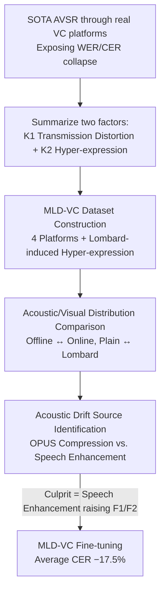

# When AVSR Meets Video Conferencing: Dataset, Degradation, and the Hidden Mechanism Behind Performance Collapse

**Conference**: CVPR 2026  
**Paper**: [CVF Open Access](https://openaccess.thecvf.com/content/CVPR2026/html/Huang_When_AVSR_Meets_Video_Conferencing_Dataset_Degradation_and_the_Hidden_CVPR_2026_paper.html)  
**Code/Data**: https://huggingface.co/datasets/nccm2p2/MLD-VC  
**Area**: Audio-Visual Speech Recognition / Datasets & Analysis  
**Keywords**: AVSR, Video Conferencing, Lombard Effect, Formant Shift, Speech Enhancement

## TL;DR
The authors perform the first systematic evaluation of mainstream Audio-Visual Speech Recognition (AVSR) models in real video conferencing (VC) scenarios, finding that error rates skyrocket from 0.93%/0.56% to the 33% range. Consequently, they construct the first VC-oriented multimodal dataset, MLD-VC (31 speakers, 22.79 hours, 4 platforms, with explicit Lombard effect injection). By deconstructing the transmission pipeline, they identify that "speech enhancement algorithms shifting F1/F2 formants upward" is the hidden culprit behind performance collapse; fine-tuning on MLD-VC reduces the average CER by 17.5%.

## Background & Motivation
**Background**: AVSR feeds both audio and lip visuals into models and has performed exceptionally well in scenarios involving offline processing, additive noise, or missing modalities—for instance, Auto-AVSR achieves a WER of 0.93% on the offline LRS3 dataset. In the post-pandemic era, platforms like Zoom, Lark, Tencent Meeting, and DingTalk have become central to remote communication, with meeting transcription and accessibility subtitles relying heavily on AVSR.

**Limitations of Prior Work**: Almost all "robust AVSR" research focuses solely on background noise or modality loss using clean, strictly aligned offline datasets with artificially added noise. No previous study has tested models within a real video conferencing pipeline. The authors observed catastrophic results: using the same Auto-AVSR model, the WER for audio-visual modalities on Zoom surged from 0.93% to 33.09%, and CER from 0.56% to 33.01%. This collapse is consistent across platforms, languages, and modalities.

**Key Challenge**: A massive gap exists between the distribution of offline training data and real-world VC data. Previously, the exact causes of this gap remained a black box. The authors decompose this into two long-ignored factors: signal distortion from the transmission link (K1) and spontaneous "hyper-expression" (K2) occurring in constrained communication environments.

**Key Insight**: Given the lack of data, the authors chose to collect data directly through real VC platforms. They leverage the Lombard Effect—where speakers unconsciously increase intensity, slow down, and exaggerate pronunciation in noisy environments—to explicitly induce and amplify K2. With real data containing both factors, they can dissect exactly where the distribution is degraded.

**Core Idea**: Use a real VC dataset (MLD-VC) that explicitly models K1+K2 as a microscope to reverse-engineer the root cause of performance collapse. The study eventually identifies that speech enhancement algorithms within VC platforms systematically raise F1/F2 formants. Lombard data is more robust precisely because its spectral shift resembles that of speech enhancement.

## Method

### Overall Architecture
This paper is not a proposal for a new model but a systematic "Diagnosis → Dataset Construction → Source Identification → Mitigation" study. The methodology covers dataset construction and mechanism analysis. It starts by running three SOTA models (Auto-AVSR, mWhisper-Flamingo, LiPS-AVSR) through real VC platforms to expose the collapse. It then summarizes K1 (transmission distortion) and K2 (hyper-expression) as the two primary factors to build the MLD-VC dataset. Subsequently, it compares acoustic and visual distribution shifts between offline/online and plain/Lombard data. Finally, it deconstructs the VC pipeline into "codec compression" and "speech enhancement" to isolate the culprit and validates the findings through fine-tuning.

### Key Designs

**1. MLD-VC Dataset Construction: Explicitly injecting VC factors into the pipeline**

Prior datasets were recorded clean and offline, making it impossible to replicate the black-box processing (K1) of codecs, noise suppression, and speech enhancement, or capture spontaneous hyper-expression (K2). The authors recruited 31 volunteers (15 male, 16 female) to read prompts while transmitting via Tencent Meeting, Lark, DingTalk, and Zoom. Input-side recordings serve as offline data, while receiver-side recordings serve as VC data, naturally injecting K1. For K2, the authors induced hyper-expression by playing background noise (Plain, 40 dB, 60 dB, 80 dB) through the speakers' headphones. The corpus uses a Grid-style grammar (e.g., "bin blue at A 2 please"). The resulting 22.79-hour MLD-VC dataset is currently the largest Lombard/VC dataset in terms of duration and platform variety.

**2. Acoustic Feature Drift Attribution: Identifying the culprit in the VC pipeline**

The authors extracted five acoustic features: fundamental frequency (F0), first and second formants (F1/F2), loudness, and the AlphaRatio (energy ratio between 50–1kHz and 1k–5kHz). Comparing offline and online data revealed that while F0 remains stable, F1 and F2 show significant upshifts (e.g., ~$+170$ Hz for F1 on DingTalk), and the AlphaRatio decreases (higher high-frequency energy). To isolate the cause, they simulated the pipeline using OPUS (for compression) and three algorithms: Sepformer, NoiseReduce, and DeepFilterNet (for enhancement). Results showed that OPUS compression had negligible effects on F1/F2, whereas speech enhancement caused upshifts highly consistent with real VC recordings. Thus, speech enhancement is identified as the primary acoustic cause of AVSR collapse in VC.

**3. Counter-intuitive Visual Findings: Landmarks are stable, image-level representations collapse**

Intuition suggests VC compression would degrade the visual modality. However, using task-oriented metrics like lip width, height, and roundness (height/width ratio) calculated from face landmarks, the authors found that geometric shifts are minimal. The collapse in current models (Auto-AVSR, etc.) occurs because they use image-level features (e.g., ResNet18 or AVHuBERT) which are sensitive to compression and artifacts. This suggests that future AVSR visual encoders should shift from unstable image-level representations to stable geometric (landmark) representations.

**4. MLD-VC Fine-tuning Mitigation: Translating analysis into performance gains**

To close the loop, the authors fine-tuned LiPS-AVSR on the MLD-VC training set. This resulted in an average CER reduction of 17.5% across platforms. On the MLD-VC test set specifically, the CER dropped from 42.37% to 13.91% (a 67.2% reduction), validating that accounting for K1 and K2 is essential for recovering performance.

### Key Experimental Results

#### Main Results: Collapse of SOTA Models under VC

| Model | Dataset | Modality | Platform | WER(%)↓ | CER(%)↓ |
|-------|---------|----------|----------|---------|---------|
| Auto-AVSR | LRS3 | AV | Offline | 0.93 | 0.56 |
| Auto-AVSR | LRS3 | AV | Zoom | 33.09 | 33.01 |
| Auto-AVSR | LRS3 | V | Zoom | 90.26 | 74.32 |
| Auto-AVSR | Lombard-Grid | AV | Zoom | 12.36 | 9.93 |

Collapse is consistent across languages, platforms, and modalities. The visual-only modality is the most fragile (WER > 90% on Zoom). Lombard data exhibits significantly less degradation, confirming its inherent robustness to VC distortion.

#### Acoustic Feature Peak Drift (Table 3, Excerpt)

| Feature | Offline | Zoom | DingTalk | Trend |
|---------|---------|------|----------|-------|
| F0 (Plain) | 37.28 | 37.39 | 37.66 | Stable |
| F1 (Plain) | 606.90 | 687.88 | 774.61 | Significant Upshift |
| F2 (Plain) | 1655.66 | 1727.45 | 1783.51 | Significant Upshift |
| AlphaRatio (Plain) | -12.12 | -14.59 | -12.52 | Lower Online (High-freq enhanced) |

#### Fine-tuning Results (Table 4, LiPS-AVSR)

| Test Set | Platform | Pre-FT CER(%) | Post-FT CER(%) | Relative Gain |
|----------|----------|---------------|----------------|---------------|
| Chinese-Lips | Tencent Mtg | 10.97 | 9.65 | 12.0% |
| Chinese-Lips | Lark | 18.53 | 13.64 | 26.4% |
| Chinese-Lips | Zoom | 9.22 | 7.93 | 14.0% |

#### Ablation Study: Two Factors are Indispensable (Table 5)

| Online (K1) | Hyper-expression (K2) | Tencent Mtg CER | Lark CER | Zoom CER |
|-------------|-----------------------|-----------------|----------|----------|
| ✓ | ✓ | 9.65 | 13.64 | 7.93 |
| ✗ | ✓ | 10.15 | 15.52 | 10.53 |
| ✓ | ✗ | 10.01 | 14.48 | 9.61 |

#### Key Findings
- **Culprit is Speech Enhancement, not Compression**: OPUS compression leaves F1/F2 unchanged, whereas enhancement algorithms shift them upward, matching real VC patterns.
- **Online Recording Impact > Hyper-expression**: Removing online data (K1) increases CER by 15.9%, while removing hyper-expression (K2) increases it by 10.5%. Both factors contribute significantly to the domain gap.
- **Visual Fragility is Representation-based**: Landmark geometry is stable, but image-based features collapse, suggesting a need for geometric visual encoders.

## Highlights & Insights
- **Lombard Effect as a "Controllable Knob"**: By using background noise to induce hyper-expression, the authors transformed a spontaneous behavioral variable into a reproducible and graded experimental factor.
- **Deconstructing Black-box Pipelines**: Since VC platforms are proprietary, the authors approximated them using OPUS and three open-source enhancement algorithms to successfully isolate the root cause.
- **Causal Chain of Robustness**: The study links the observation (Lombard data is robust) to the mechanism (F1/F2 spectral shifts) and the root cause (speech enhancement). This chain of reasoning provides a powerful explanation for previously misunderstood performance variances.

## Limitations & Future Work
- **Reliance on Grid-style Corpus**: The fixed sentence structure and small vocabulary differ from spontaneous natural speech in real meetings.
- **Platform Approximation**: Using open-source algorithms to approximate proprietary commercial software ensures "high similarity" but does not provide absolute proof of the exact algorithms used by platforms.
- **Mitigation via Fine-tuning**: The study identifies the root cause (spectral rewriting) but mitigates it only through fine-tuning rather than architectural changes like formant alignment or "de-enhancement" layers.
- **Scale**: The dataset involves 31 speakers, mostly university students, lacking diversity in age and accent.

## Related Work & Insights
- **vs. Traditional Robust AVSR**: While previous work focuses on additive noise, this paper shows that VC distortion involves systematic spectral rewriting by speech enhancement, rendering existing robustness methods ineffective.
- **vs. Lombard / Hyper-expression Research**: This work connects behavioral observations (Lindblom’s hyper/hypo theory) with specific acoustic shifts (F1/F2) and systems-level causes (speech enhancement).
- **vs. Image Quality Metrics (PSNR/SSIM)**: The study demonstrates that these metrics fail to capture the information AVSR relies on (lip motion), advocating for task-aligned metrics like landmark geometry.

## Rating
- Novelty: ⭐⭐⭐⭐ First systematic evaluation of AVSR in VC + first VC multimodal dataset + identifying speech enhancement as the culprit.
- Experimental Thoroughness: ⭐⭐⭐⭐ Multi-model, multi-platform, cross-lingual analysis. Pipeline deconstruction provides strong causal evidence.
- Writing Quality: ⭐⭐⭐⭐ Logical flow from phenomenon to root cause to mitigation.
- Value: ⭐⭐⭐⭐ Provides a practical dataset and diagnostic methodology for real-world deployment of meeting transcription.

<!-- RELATED:START -->

## Related Papers

- [\[ICLR 2026\] The Devil behind the Mask: An Emergent Safety Vulnerability of Diffusion LLMs](../../ICLR2026/audio_speech/the_devil_behind_the_mask_an_emergent_safety_vulnerability_of_diffusion_llms.md)
- [\[CVPR 2026\] SAVE: Speech-Aware Video Representation Learning for Video-Text Retrieval](save_speech-aware_video_representation_learning_for_video-text_retrieval.md)
- [\[ACL 2026\] TellWhisper: Tell Whisper Who Speaks When](../../ACL2026/audio_speech/tellwhisper_tell_whisper_who_speaks_when.md)
- [\[ACL 2025\] ChildMandarin: A Comprehensive Mandarin Speech Dataset for Young Children Aged 3-5](../../ACL2025/audio_speech/childmandarin_a_comprehensive_mandarin_speech_dataset_for_young_children_aged_3-.md)
- [\[CVPR 2026\] PAVAS: Physics-Aware Video-to-Audio Synthesis](pavas_physics-aware_video-to-audio_synthesis.md)

<!-- RELATED:END -->
