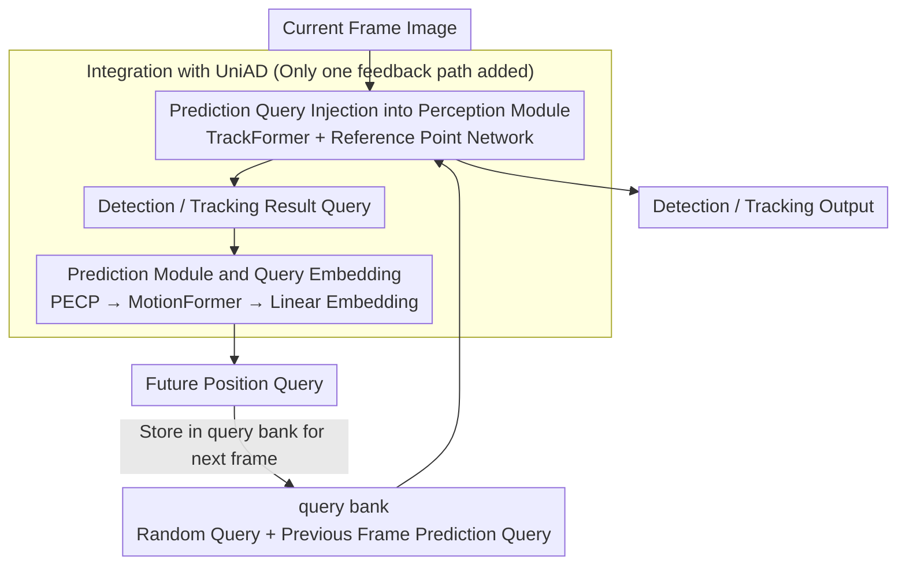

# A Prediction-as-Perception Framework for 3D Object Detection

**Conference**: CVPR 2026  
**arXiv**: [2603.12599](https://arxiv.org/abs/2603.12599)  
**Code**: TBD  
**Area**: Autonomous Driving  
**Keywords**: 3D Perception, Object Detection, Predictive Perception, Autonomous Driving, nuScenes, End-to-End

## TL;DR

Inspired by the "predictive perception" mechanism of the human brain, the PAP framework is proposed—injecting trajectory prediction results from historical frames as queries into the current frame's perception module, achieving a 10% gain in tracking accuracy and a 15% gain in inference speed on UniAD.

---

## Background & Motivation

**Predictive Perception of the Human Brain**: Neuroscience research indicates that the human brain does not passively receive sensory signals but continuously generates predictions of future inputs, iteratively refining internal models via "prediction errors." For instance, when tracking a bird, one predicts the next position before focusing the gaze.

**Lack of Predictive Priors in Existing Perception Models**: Current mainstream 3D detection models (Sparse4D, StreamPETR, DETR3D, etc.) initialize queries randomly in each frame or perform simple temporal propagation, failing to utilize explicit trajectory prediction results to guide current frame perception.

**Fragmentation of Perception and Prediction**: In traditional detect→track→predict pipelines, modules are trained independently, leading to cumulative errors. Even end-to-end models often feature unidirectional information flow (perception→prediction), lacking a feedback loop from prediction to perception.

**Inefficiency of Random Queries**: Attention-based detectors generate a large number of random queries per frame, most of which are far from the actual target positions, resulting in slow convergence and computational waste.

**Loss of Temporal Cues**: Randomly initialized queries cannot carry the cognition of target motion trends from preceding frames, often leading to ID switches during tracking.

**Goal**: To demonstrate that using the future positions output by the prediction module as part of the perception queries for the next frame can simultaneously improve perception accuracy and inference efficiency.

---

## Method

### Overall Architecture

The PAP (Prediction-As-Perception) framework consists of two parts: a **perception module** and a **prediction module**. These interact through queries to form a closed-loop iteration:

> Current Frame Image + Previous Frame Prediction Query → Perception Module → Detection/Tracking Result Query → Prediction Module → Future Position Query → Store in Query Bank → Call by Next Frame Perception Module

When no historical prediction is available for the first frame, random queries are used entirely.

### Key Designs

**1. Injecting Prediction Queries into the Perception Module: Setting the "Future Position" of the Previous Frame as the Search Starting Point**

The inefficiency of random queries stems from their ignorance of target locations—most queries fall far from the actual targets, wasting attention computation. The Mechanism of PAP is to map the future coordinates output by the previous frame's prediction module through an embedding layer to the same dimension as the perception queries, and then combine them with random queries into the current frame's query set $q_i^T \in (q_{random}^T \cup q_{predict}^{T-1})$. These are collectively sent to the reference point network $c_i^T = \varnothing^{ref}(q_i^T)$ to obtain reference points. These prediction queries naturally fall in regions where the target is likely to appear next, providing the detector with a "prior landing point." This reduces invalid searches, accelerates convergence, and brings the cognition of motion trends from preceding frames into the current frame, making ID switches less likely during tracking.

**2. Prediction Module and Query Embedding: Feeding Detection Results Back to Prediction for Next-Frame Queries**

To maintain the closed-loop, "perception→prediction" is required to feed back the results. The detection result queries $c_i^T$ from the perception module are processed via PECP and sent to the prediction module to obtain multi-frame future coordinates $c_{predict}^T = \text{PRED}(\text{PECP}(c_i^T))$. These are then mapped through a linear embedding layer $\phi^{embd}$ into queries $q_{predict}^T = \phi^{embd}(c_{predict}^T)$ that can be directly called by the next frame. This step explicitly defines the interface of "input detection results, output future coordinates" without altering the internal structure or loss of the prediction module. Consequently, any trajectory prediction model capable of producing future coordinates can be integrated into PAP in a plug-and-play manner.

**3. Integration with UniAD: Verifying the Idea via a Minimally Invasive Feedback Path**

To prove the effectiveness of the "prediction→perception" loop, the most reliable approach is to modify only this part within an existing end-to-end architecture. Since UniAD modules already interact via queries, PAP only needs to extract prediction queries from the output of MotionFormer, align their dimensions, and send them into TrackFormer alongside existing Track Queries. This adds only a single feedback path (MotionFormer → TrackFormer); the Planning module and other losses remain unchanged. This approach reuses UniAD's end-to-end capabilities while ensuring all hyperparameters remain consistent with the original model, allowing the Gain from comparison to be cleanly attributed to PAP itself.

---

## Loss & Training

- The perception module loss remains consistent with the original model (TrackFormer in UniAD). Learning of prediction queries is completed via backpropagation of combined perception + prediction losses.
- All training hyperparameters are identical to the original UniAD to ensure fair comparison.
- Training environment: 4× A100 GPU, 64-core CPU, 256 GB RAM.
- Training time was reduced from the original 91h to 78h (↓14.3%) because prediction queries accelerated detection convergence.

---

## Key Experimental Results

**Table 1: Overall Comparison of UniAD vs. UniAD+PAP on nuScenes val**

| Metric | UniAD | UniAD+PAP | Gain |
|------|-------|-----------|------|
| AMOTA ↑ | 0.359 | **0.395** | +10.0% |
| AMOTP ↓ | 1.32 | **1.22** | -7.6% |
| Recall ↑ | 0.467 | **0.493** | +5.6% |
| IDS ↓ | 906 | **826** | -8.8% |
| Training Time | 91h | **78h** | -14.3% |
| FPS ↑ | 14 | **16** | +14.3% |

**Table 2: Category-wise Performance of UniAD+PAP**

| Category | AMOTA | AMOTP | Recall | IDS |
|------|-------|-------|--------|-----|
| Bicycle | 0.372 | 1.297 | 0.453 | 15 |
| Bus | 0.465 | 1.225 | 0.535 | 8 |
| Car | **0.613** | **0.744** | **0.667** | 405 |
| Motor | 0.438 | 1.253 | 0.500 | 24 |
| Pedestrian | 0.411 | 1.192 | 0.487 | 342 |
| Trailer | 0.330 | 1.551 | 0.201 | 4 |
| Truck | 0.411 | 1.267 | 0.611 | 28 |

The Car category showed the best metrics (AMOTA 0.613), while the Pedestrian category had the highest IDS (342), reflecting that pedestrian movement patterns are more random and harder to predict.

---

## Highlights & Insights

- **Simple and Effective Bionic Design**: Adding only one "prediction→perception" feedback path improved all metrics, providing a clear conceptual framework.
- **Plug-and-Play**: Both perception and prediction modules can be replaced with stronger off-the-shelf models, offering high framework versatility.
- **Simultaneous Speedup**: Replacing random queries with prediction queries reduced invalid attention computation, increasing FPS by 14.3% and shortening training time by 14.3%—a rare occurrence in model improvements where computational cost typically increases.
- **Zero Extra Supervision**: No new annotations or auxiliary tasks are required; the learning of prediction queries is entirely driven by the original losses.

---

## Limitations & Future Work

1. **Validated only on UniAD**: As UniAD's modules are not the current SOTA, it remains unclear if PAP can maintain Gains on stronger baselines like Sparse4Dv3 or StreamPETR.
2. **Lack of Ablation Study**: The impact of key hyperparameters, such as the prediction query replacement ratio, query bank size, and prediction time horizon, was not analyzed.
3. **Single Dataset**: Testing was limited to nuScenes; generalization to larger datasets like Waymo or Argoverse2 has not been verified.
4. **First-Frame Degradation**: The first frame uses only random queries, where PAP provides no Gain. While this has little impact on long sequences, it warrants attention in short-sequence scenarios.
5. **Prediction Error Propagation**: If the prediction module produces significant bias, the injected queries might mislead the perception module. There is currently no filtering mechanism based on prediction confidence.

---

## Related Work & Insights

- **BEV Detection (BEVDet, BEVDepth)**: These lift to 3D via depth estimation, but explicit depth estimation can be inaccurate; PAP follows a query-based route and is complementary to BEV methods.
- **Query-based Detection (DETR3D, PETR, Sparse4D)**: The PAP framework can be directly grafted onto these models, substituting random queries with prediction queries.
- **End-to-End Autonomous Driving (UniAD)**: PAP further closes the loop between perception, prediction, and planning.
- **Trajectory Prediction (THOMAS, AutoBot, GoHome)**: These models can serve directly as the prediction module for PAP.
- **Insights**: This approach can be extended to tasks like occupancy prediction (using historical occupancy prediction queries to initialize the current occupancy decoder) and 4D scene flow estimation.

---

## Rating

| Dimension | Rating |
|------|-------|
| Novelty | ⭐⭐⭐ |
| Theory Depth | ⭐⭐ |
| Experimental Thoroughness | ⭐⭐ |
| Value | ⭐⭐⭐⭐ |

## Related Work & Insights

| Method | Perception→Prediction | Prediction→Perception | End-to-End | Temporal Query |
|------|----------|----------|--------|----------|
| DETR3D | ✗ | ✗ | ✗ | ✗ |
| StreamPETR | ✓ | ✗ | ✗ | Propagative |
| Sparse4Dv3 | ✓ | ✗ | ✗ | Propagative |
| UniAD | ✓ | ✗ | ✓ | Propagative |
| **UniAD+PAP** | ✓ | **✓** | ✓ | **Predictive** |

Unlike the temporal query propagation in methods like StreamPETR and Sparse4D, PAP queries are processed by an explicit trajectory prediction module, incorporating reasoning about future positions rather than just continuing past features. While UniAD's original design features a unidirectional flow from perception to prediction and planning, PAP completes the feedback loop from prediction to perception.

## Insights

1. **Extension to Occupancy Prediction**: Historical occupancy flow predictions can serve as initial queries for the current occupancy decoder, reducing the search space for dense predictions.
2. **Extension to 4D Scene Flow**: In scene flow estimation, motion predictions from preceding frames can initialize the matching search window for the current frame, reducing computational load.
3. **Integration with World Models**: Replacing the prediction module in PAP with a stronger world model (e.g., OccWorld) could provide more accurate prediction queries.
4. **Query Confidence Filtering**: Currently, PAP trusts prediction queries unconditionally. Adding prediction uncertainty estimation could filter low-quality queries to further enhance robustness.
5. **Multi-modal Fusion**: The PAP framework is not limited to vision; LiDAR-camera fusion detectors (e.g., BEVFusion) can also integrate the predictive feedback path.

<!-- RELATED:START -->

## Related Papers

- [\[CVPR 2025\] PAP: A Prediction-as-Perception Framework for 3D Object Detection](../../CVPR2025/autonomous_driving/a_prediction-as-perception_framework_for_3d_object_detection.md)
- [\[CVPR 2026\] RaGS: Unleashing 3D Gaussian Splatting from 4D Radar and Monocular Cue for 3D Object Detection](rags_unleashing_3d_gaussian_splatting_from_4d_radar_and_monocular_cue_for_3d_obj.md)
- [\[CVPR 2026\] R4Det: 4D Radar-Camera Fusion for High-Performance 3D Object Detection](r4det_4d_radar-camera_fusion_for_high-performance_3d_object_detection.md)
- [\[CVPR 2026\] SToRe3D: Sparse Token Relevance in ViTs for Efficient Multi-View 3D Object Detection](store3d_sparse_token_relevance_in_vits_for_efficient_multi-view_3d_object_detect.md)
- [\[CVPR 2026\] Query2Uncertainty: Robust Uncertainty Quantification and Calibration for 3D Object Detection under Distribution Shift](query2uncertainty_robust_uncertainty_quantification_and_calibration_for_3d_objec.md)

<!-- RELATED:END -->
