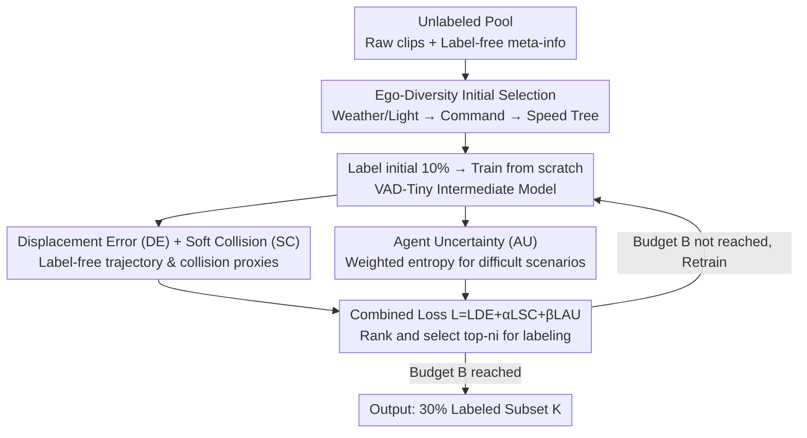

# ActiveAD: Planning-Oriented Active Learning for End-to-End Autonomous Driving

**Conference**: CVPR 2026  
**Paper**: [CVF Open Access](https://openaccess.thecvf.com/content/CVPR2026/html/Lu_ActiveAD_Planning-Oriented_Active_Learning_for_End-to-End_Autonomous_Driving_CVPR_2026_paper.html)  
**Code**: https://github.com/Thinklab-SJTU/ActiveAD  
**Area**: Autonomous Driving  
**Keywords**: Active Learning, End-to-End Autonomous Driving, Planning-oriented, Data Labeling Efficiency, Long-tail Distribution

## TL;DR
ActiveAD designs a "planning-oriented" active learning strategy for end-to-end autonomous driving: it uses nearly free meta-information (weather/lighting/driving commands/speed) for diversity initialization to solve the cold-start problem, and selects the most critical scenarios using three label-free criteria: displacement error, soft collision, and agent uncertainty. Training on only 30% of the data matches the performance of SOTA models trained on 100% data in both nuScenes open-loop and CARLA closed-loop evaluations.

## Background & Motivation

**Background**: End-to-end (E2E) differentiable paradigms have become the mainstream in autonomous driving. Methods like UniAD and VAD directly regress ego planning trajectories from raw sensor data, avoiding error accumulation found in modular systems (separate perception $\rightarrow$ prediction $\rightarrow$ planning). However, these methods are essentially **supervised learning** and require fine-grained annotations such as 3D bounding boxes and semantic segmentation of lanes/traffic signs, leading to extremely high labeling costs.

**Limitations of Prior Work**: Annotation is the core bottleneck for scaling up end-to-end methods. Furthermore, autonomous driving data suffers from a severe **long-tail distribution**—most collected data consists of mundane samples like "driving straight on an empty road," while only a few are safety-critical scenarios. Indiscriminate full-scale labeling wastes a significant budget on mundane frames that contribute little to planning.

**Key Challenge**: Is it necessary to label all raw data to achieve optimal performance? The authors provide an empirical **NO**—more data does not necessarily lead to better performance; the key lies in "labeling accurately" rather than "labeling more."

**Goal**: Automatically select the most valuable clips for **planning** under a limited annotation budget. This is decomposed into two sub-problems: (1) what to label in the first batch during cold-start (no model available), and (2) what to label incrementally in subsequent rounds once an intermediate model exists.

**Key Insight**: Most existing active learning methods target single-modality image classification. In contrast, autonomous driving naturally provides video streams, trajectories, and nearly free multi-modal meta-information such as speed, weather, and lighting. Furthermore, the "planning-oriented" philosophy of UniAD inspired the authors: sample selection criteria should directly align with planning objectives rather than perceptual information gain.

**Core Idea**: Re-design both diversity and uncertainty measures for active learning to be **planning-oriented** and as **label-free** as possible, ensuring sample selection directly serves the reduction of L2 error and collision rates.

## Method

### Overall Architecture

ActiveAD is wrapped around an end-to-end autonomous driving framework (using a lightweight VAD-Tiny as the base) to turn data selection into an iterative closed loop. The input is a pool of unlabeled clips $P_u=\{X_i\}$, where each clip includes label-free information $X_i=(S_i,\tau_i,O_i)$—raw sensor streams, recorded ego trajectories, and meta-information $O_i=(e_i,w_i,l_i)$ (ego state, weather, lighting). The output is a set of indices $K$ for clips selected for fine-grained labeling within a budget $B$ (set to 30% in experiments).

The process consists of two stages. **Stage 1: Initial Set Selection**: Without any trained model, Ego-Diversity utilizes free meta-information to select the first batch (10%) from the pool. **Stage 2: Incremental Selection**: An intermediate model is trained from scratch using currently labeled data and then used to perform inference on the unlabeled pool. Each clip is scored based on a "Total Loss" combined from Displacement Error, Soft Collision, and Agent Uncertainty. The top-$n_i$ clips with the highest total loss (indicating where the model struggles most) are selected for labeling. The model is then retrained and the process iterates for $M$ rounds until the budget is exhausted. The experimental setup uses an initial 10% plus two incremental rounds of 10% each, totaling 30%.

### Key Designs

**1. Ego-Diversity Initial Selection: Using Free Meta-info to Replace Random Initialization**

The first batch of samples in active learning usually relies on raw images without usable features, so traditional methods use Random selection. This is disadvantageous for long-tailed driving data, as random selection likely picks mostly straight-road samples. ActiveAD exploits the fact that speed, trajectory, weather, and lighting are recorded automatically. It builds a multi-way tree for hierarchical splitting: the first layer splits into four mutually exclusive subsets (Day-Sunny, Day-Rainy, Night-Sunny, Night-Rainy); the second layer classifies clips into Left (L), Right (R), Overtake (O), or Straight (S) based on the counts of driving commands and a threshold $\tau_c$; the third layer sorts by average speed and performs interval sampling.

Crucially, weights are not distributed equally but biased toward rare classes using a parameter $\gamma$. The first-level weight is:

$$P_x=\frac{n_x^{\gamma}}{\sum_{z\in\{DS,DR,NS,NR\}} n_z^{\gamma}},\quad x\in\{DS,DR,NS,NR\}$$

The second-level weight follows a similar form $P_{x,y}=P_x\cdot n_{x,y}^{\gamma}/\sum_z n_{x,z}^{\gamma}$. When $\gamma=1$, classes are sampled proportionally; when $\gamma<1$, the budget shifts toward classes with fewer samples (e.g., Night-Rainy, Overtake). The subset quota is $n^{(l)}_s=n_0 P_s$. This ensures the first batch covers long-tail dangerous scenarios, providing a stable starting point—ablation studies show this reduces the initial 10% collision rate from 0.67% to 0.41%.

**2. Displacement Error + Soft Collision: Label-free Proxies for "Planning Difficulty"**

To determine if an unlabeled clip is worth labeling, the model's performance on it is the most direct signal. However, collision rates typically require 3D box labels. The authors bypass this with two criteria. **Displacement Error (DE)** calculates the L2 distance between the predicted trajectory $\tau$ and the recorded human trajectory $\tau^*$: $L_{DE}=\frac{1}{T}\sum_{t=1}^{T}\|\tau_t-\tau^*_t\|_2$. Since human trajectories are recorded for free, DE is the core, zero-cost priority criterion.

To prevent overfitting to L2 and further reduce collision rates, **Soft Collision (SC)** is introduced. It uses the minimum distance between the predicted ego trajectory and predicted agent trajectories as a risk coefficient:

$$L_{SC}=\sum_{t=1}^{T}\exp\!\left(-\min_{a\in\text{agents}}(\tau_{t,\text{ego}}-\tau_{t,a})\right)$$

Two insights here: first, SC only depends on the model's own inference without box labels; second, hard collisions occur in <1% of SOTA predictions, making them too sparse for selection. The continuous "nearest distance" provides a **dense supervision** signal to identify high-risk scenarios.

**3. Agent Uncertainty: Identifying "Difficult-to-Predict" Scenarios**

While DE/SC focus on ego planning, many risks arise from the **uncertainty of surrounding agents**. The motion prediction module outputs multi-modal trajectories and confidences. The authors measure uncertainty by filtering agents within a distance threshold $\delta_d$ and calculating the entropy of their multi-modal probabilities, weighted by distance:

$$L_{AU}=-\sum_{a\in\text{agent}}\exp(\delta_d-d_a)\sum_{i=1}^{N_m}P_i(a)\log P_i(a)$$

where $d_a$ is the predicted distance, $N_m$ is the number of modes, and $P_i(a)$ is the confidence. High entropy indicates the model is uncertain about an agent's intent. Combining these three normalized criteria into $L=L_{DE}+\alpha L_{SC}+\beta L_{AU}$ (with $\alpha=\beta=1$) allows for selecting the top-$n_i$ samples. Ablations show that without SC, collision rates remain high; all three are needed to reach a 0.21% collision rate at 30% budget.

### Loss & Training
The VAD-Tiny base uses default hyperparameters: AdamW + Cosine Annealing for 20 epochs, weight decay 0.01, and an initial learning rate of $2\times10^{-4}$. Active learning hyperparameters: confidence threshold $\epsilon_a=0.5$, distance threshold $\delta_d=3.0$m, command threshold $\tau_c=4$, diversity parameter $\gamma=0.5$, and loss weights $\alpha=\beta=1$. The 30% budget is split into 10% (initial) + 10% + 10%, with the model retrained from scratch each round.

## Key Experimental Results

Experiments conducted on nuScenes (1000 clips) and CARLA. Metrics include Planning Displacement Error (L2) and Collision Rate. Base model: VAD-Tiny. Baselines: Coreset, VAAL, KECOR, ActiveFT, and Random.

### Main Results (Planning Performance, Avg. L2 / Collision Rate, lower is better)

| Config | Data Amount | Avg. L2 (m) ↓ | Avg. Collision (%) ↓ |
|------|--------|--------------|----------------------|
| VAD-Tiny (Full Training) | 100% | 0.70 | 0.25 |
| Random | 30% | 0.78 | 0.37 |
| Coreset | 30% | 0.73 | 0.54 |
| VAAL | 30% | 0.81 | 0.35 |
| KECOR | 30% | 0.82 | 0.45 |
| ActiveFT | 30% | 0.78 | 0.39 |
| **ActiveAD (Ours)** | **30%** | **0.68** | **0.21** |

With only 30% data, ActiveAD's L2 (0.68) and Collision Rate (0.21%) are **slightly better than the 100% data** VAD-Tiny (0.70/0.25), outperforming all active learning baselines significantly. Performance saturates at 40-50%, confirming the long-tail nature of the data.

### Ablation Study (Initialization + Combined Criteria, 30% results)

| ID | Config | L2@30% | CR@30% |
|----|------|--------|--------|
| 1 | RA (Random Init + Random Selection) | 0.78 | 0.37 |
| 2 | ED (Ego-Diversity Init only) | 0.74 | 0.34 |
| 3 | ED + DE | 0.70 | 0.35 |
| 4 | ED + DE + SC | 0.73 | 0.26 |
| 5 | RA + DE + SC + AU | 0.71 | 0.26 |
| 6 | **ED + DE + SC + AU (Full)** | **0.68** | **0.21** |

### Key Findings
- **Ego-Diversity significantly boosts cold-start**: It reduces the initial 10% collision rate from 0.67% to 0.41% (-0.26), providing a better baseline for iterations (ID 5 with random init still lags at 0.26% CR).
- **Single criteria are biased**: Adding only DE (ID 3) reduces L2 but does not improve collision rates. SC is necessary to drop the collision rate to 0.26%, and AU further reduces it to 0.21%—the three are complementary.
- **Scenario Robustness**: ActiveAD consistently outperforms baselines across Night, Rainy, and various maneuvers (Left/Right/Overtake), maintaining advantages in critical long-tail slices.

## Highlights & Insights
- **Planning-oriented Perspective**: While previous active learning for AD focused on perception (3D detection), ActiveAD is the first to align selection with E2E planning goals, leading to superior performance.
- **Label-free Proxies for Expensive Metrics**: By using the "exponential of nearest predicted distance" as a Soft Collision signal, the authors create a label-free, dense supervision proxy that bypasses the sparsity of actual collisions.
- **Empirical Proof of "Quality Over Quantity"**: 30% well-selected data > 100% total data. This challenges the "more is better" drone and highlights the importance of data governance alongside model architecture.

## Limitations & Future Work
- The framework was only validated on VAD-Tiny and nuScenes/CARLA; its generalizability to heavier E2E frameworks like UniAD or larger real-world datasets requires further exploration.
- Many hyperparameters ($\gamma, \alpha, \beta, \tau_c, \delta_d$) are empirically set; cross-dataset transferability is an open question. Ego-Diversity relies on nuScenes meta-tags, which may need to be reconstructed for other datasets. ⚠️
- Performance saturation at 30% suggests limited gains for samples already well-covered by the model. Detecting truly out-of-distribution samples in closed-loop remains a harder challenge.

## Related Work & Insights
- **vs. Coreset / VAAL / ActiveFT (General AL)**: These rely on image feature diversity or adversarial uncertainty. ActiveAD utilizes AD-specific multi-modal label-free info and aligns with planning, leading to a substantial lead (L2 0.68 vs 0.78-0.84 at 30%).
- **vs. KECOR / CRB (AD Perception AL)**: These focus on 3D detection and perception information gain. ActiveAD proves that "selecting for planning" and "selecting for perception" are distinct optimization directions.
- **vs. UniAD / VAD (E2E AD Bases)**: ActiveAD does not change the model structure but applies the planning-oriented philosophy to the data side, making it orthogonal and stackable with these methods.

## Rating
- Novelty: ⭐⭐⭐⭐ First planning-oriented AL for E2E AD; clever label-free design (SC, AU, ED).
- Experimental Thoroughness: ⭐⭐⭐⭐ OpenV/Closed-loop, multiple budgets, and thorough ablations; however, limited to a single base model.
- Writing Quality: ⭐⭐⭐⭐ Clear logical flow from motivation to formulas and results.
- Value: ⭐⭐⭐⭐ Matching 100% performance with 30% data has direct practical significance for reducing costs.

<!-- RELATED:START -->

## Related Papers

- [\[CVPR 2026\] GuideFlow: Constraint-Guided Flow Matching for Planning in End-to-End Autonomous Driving](guideflow_constraint-guided_flow_matching_for_planning_in_end-to-end_autonomous_.md)
- [\[CVPR 2026\] Scaling-Aware Data Selection for End-to-End Autonomous Driving Systems](scaling-aware_data_selection_for_end-to-end_autonomous_driving_systems.md)
- [\[CVPR 2026\] ResAD: Normalized Residual Trajectory Modeling for End-to-End Autonomous Driving](resad_normalized_residual_trajectory_modeling_for_end-to-end_autonomous_driving.md)
- [\[CVPR 2026\] EE-RL: Vision Language Guided Reinforcement Learning with Explorer and Expert model for End-to-End Autonomous Driving](ee-rl_vision_language_guided_reinforcement_learning_with_explorer_and_expert_mod.md)
- [\[CVPR 2026\] DriveMoE: Mixture-of-Experts for Vision-Language-Action Model in End-to-End Autonomous Driving](drivemoe_mixture-of-experts_for_vision-language-action_model_in_end-to-end_auton.md)

<!-- RELATED:END -->
