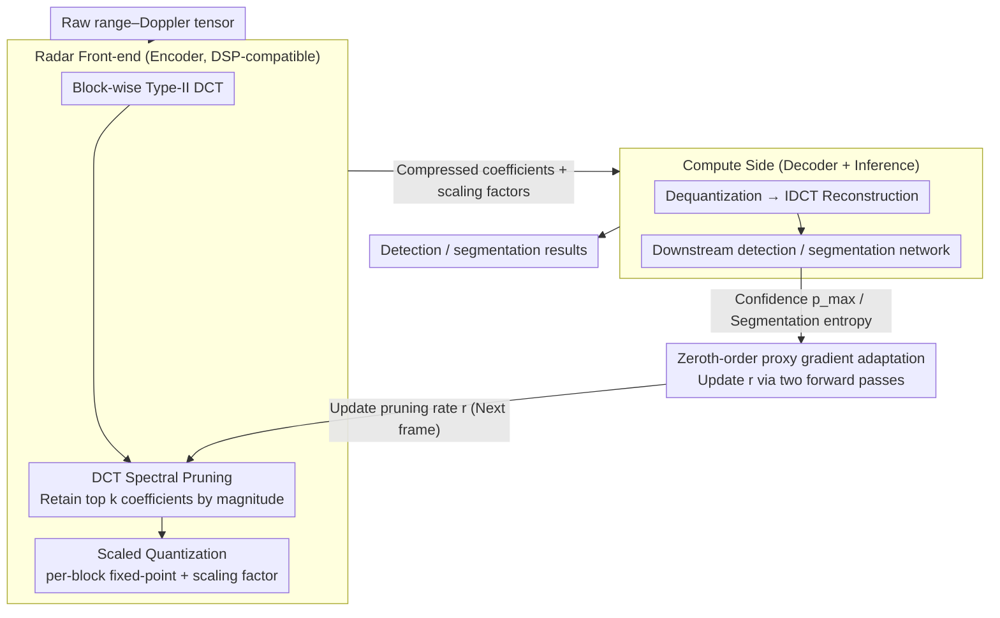

# AdaRadar: Rate Adaptive Spectral Compression for Radar-based Perception

**Conference**: CVPR2026  
**arXiv**: [2603.17979](https://arxiv.org/abs/2603.17979)  
**Code**: [Project Page](https://jp4327.github.io/adaradar/)  
**Area**: Autonomous Driving  
**Keywords**: Radar Perception, Adaptive Compression, Spectral Pruning, Zeroth-order Gradient, Bitrate Control, Quantization, DCT, Object Detection, Semantic Segmentation

## TL;DR

The authors propose AdaRadar, an online adaptive radar data compression framework based on DCT spectral pruning and zeroth-order proxy gradients. It achieves over 100× compression with only ~1%p loss in detection/segmentation performance, effectively alleviating the bandwidth bottleneck between radar sensors and compute units.

## Background & Motivation

**Central Role of Radar in Autonomous Driving**: Compared to cameras and LiDAR, mmWave radar offers robustness across all weather and lighting conditions and directly measures range and Doppler velocity, making it an indispensable modality for perception systems.

**Explosion of Raw Radar Data**: Modern MIMO radar data volume grows quadratically with the number of Tx/Rx antennas. For instance, a single frame from a 16x12 cascaded MIMO configuration is approximately 100 MB. A 10 fps throughput reaches several Gbps, far exceeding the transmission capacity of low-bandwidth links like CAN buses.

**Lack of Dedicated Radar Codecs**: While the vision domain has mature JPEG or learned compression schemes, no universal codec exists for radar. Current practices often use CFAR to compress data into sparse point clouds, which inevitably loses rich tensor-level information.

**Limitations of Prior Work**: Energy-based index-value compression schemes, such as RadarOcc, operate at a fixed compression rate. They cannot dynamically adjust based on the scene at test time, wasting bandwidth in simple scenarios and suffering performance degradation in complex ones.

**Infeasibility of Traditional Backpropagation**: Pruning and quantization operations are non-differentiable. Even if gradients could be estimated, the gradient tensors would be as large as the raw radar data, and transmitting them would negate the compression gains.

**Deployment Constraints for Autoencoders**: Learned compression models often have more parameters than the downstream perception models, making them unsuitable for deployment on radar front-end DSPs with extremely limited compute and memory resources.

## Method

### Overall Architecture

AdaRadar connects the radar front-end (encoder) and the compute side (decoder + inference network) into a feedback loop, allowing the compression rate to be adjusted online based on the scene. A raw range–Doppler tensor undergoes DCT, adaptive spectral pruning, and scaled quantization at the front-end. Only the compressed coefficients and scaling factors are transmitted. The compute side performs dequantization and IDCT reconstruction before feeding the data into downstream networks. Crucially, the loop uses detection confidence (or segmentation entropy) as a feedback signal to update the pruning rate for the next frame using zeroth-order proxy gradients, achieving online bitrate adaptation.

### Key Designs

**1. DCT Spectral Pruning: Magnitude-based Adaptive Retention for Radar Sparsity**

Unlike JPEG, radar lacks a universal codec, and CFAR point clouds discard tensor-level details. AdaRadar partitions concatenated real/imaginary radar feature maps into $M \times M$ blocks and applies Type-II DCT to each. This leverages the observation that radar DCT coefficients concentrate energy in a few frequency components (e.g., high-frequency regions in RADIal). Given a pruning rate $r$, only the $k = \lfloor M^2 / r \rfloor$ coefficients with the largest magnitudes are retained. Unlike the fixed quantization tables in JPEG, this magnitude-based sorting adapts to diverse radar signal frequency structures.

**2. Scaled Quantization: Per-block Fixed-point for High Dynamic Range**

Radar signals exhibit a high dynamic range, making uniform quantization inaccurate. The proposed scheme calculates the peak magnitude $Q_{c,b}$ for each block and uses it as a reference for per-block uniform fixed-point quantization (e.g., 8-bit). The overhead of transmitting one scaling factor per block is only $s_{\text{FP}} / (s_{\text{FxP}} \cdot M^2)$. For a 64×64 block with 8-bit quantization, this is merely 0.097%, preserving high dynamic range with negligible cost.

**3. Zeroth-order Proxy Gradient Adaptation: Efficient Bitrate Tuning**

Online bitrate adjustment faces two hurdles: non-differentiable operations and the overhead of gradient transmission. AdaRadar bypasses these using zeroth-order optimization. By using the maximum bounding-box confidence $p_{\max}$ (or mean pixel-level entropy for segmentation) as a proxy objective, a small negative perturbation $\epsilon$ is applied to the current rate to obtain $p^-$ via a second forward pass. The gradient is estimated via finite differences $\hat{\nabla}_r h \approx (p - p^-) / \epsilon$, and the rate is updated via $r_{t+1} = r_t - \eta \hat{\nabla}_{r_t} J$. This requires only **two forward passes**, no backpropagation, and no gradient transmission, enabling execution on front-end DSPs.

### Loss & Training

The online optimization goal is $\max_{\{r_t\}} \mathbb{E}[J_t(r_t)]$, where $J_t = h(\mathbf{x}_t, r_t) - \lambda \cdot B(r_t)$, with $\lambda$ controlling the accuracy-bandwidth trade-off and $B(\cdot)$ representing the instantaneous bitrate. During training, on-the-fly compression augmentation is performed using randomly sampled pruning rates $r \sim U(r_{\min}, r_{\max})$ and quantization bit-widths to ensure the downstream network is robust to varying compression levels.

## Key Experimental Results

### Main Results

**RADIal Dataset (Detection + Segmentation)**

| Method | Bit-width | Bitrate (bpp) | Compression | Precision | Recall | F1 | mIoU |
|------|------|-----------|--------|-----------|--------|-----|------|
| Uncompressed Baseline | 32 | 32 | 1× | 97.24 | 95.93 | 96.58 | 75.97 |
| Index-value [RadarOcc] | 32 | 2.67 | 12× | 97.55 | 62.12 | 75.91 | 49.86 |
| **AdaRadar (Ours)** | 4 | **0.32** | **101×** | 96.25 | 94.04 | **95.13** | **79.34** |

**CARRADA Dataset (Semantic Segmentation)**

| Method | Bit-width | Compression | mIoU | mDice |
|------|------|--------|------|-------|
| Uncompressed Baseline | 32 | 1× | 55.25 | 67.13 |
| Index-value | 32 | 29× | 38.96 | 46.90 |
| **AdaRadar (Ours)** | 8 | **117×** | **54.03** | **65.87** |

**Radatron Dataset (Object Detection)**

| Method | Bit-width | Compression | mAP | AP50 | AP75 |
|------|------|--------|-----|------|------|
| Baseline | 32 | 1× | 46.07 | 83.60 | 44.16 |
| Index-value | 32 | 7.5× | 45.72 | 80.44 | 47.54 |
| **AdaRadar (Ours)** | 8 | **30×** | **48.46** | **83.69** | **49.07** |

### Ablation Study & Key Findings

- **Spectral Pruning vs. Spatial Index-value**: Spectral pruning shows almost no performance loss within 5× compression. Its roll-off gradient (23.1%/dec) is significantly superior to index-value (46.6%/dec), demonstrating much higher robustness.
- **Rate-Accuracy Trade-off**: Accuracy remains nearly constant above 1 bpp, which can be used to set the lower bound $r_{\min}$ for adaptive control.
- **Compression as Denoising**: On Radatron, detection AP75 actually increased by ~5% after compression. The authors suggest that spectral pruning filters out noise and clutter.
- **Online Adaptation Performance**: Adaptive control achieves an average of 0.279 bpp (115× compression) with 93.91% AR. The bitrate fluctuates with scene complexity, automatically decreasing the compression rate in complex scenes to maintain performance.

## Highlights & Insights

- **High Practicality**: The encoder only requires DCT, sorting, and rounding, allowing it to run directly on existing embedded DSPs without deploying neural networks.
- **100×+ Compression Rate**: Achieves 101× compression on RADIal with only a ~1.5%p F1 drop and 117× on CARRADA with only a ~1%p mIoU drop.
- **Elegant Use of Zeroth-order Gradients**: Effectively bypasses non-differentiability and gradient transmission costs, completing online bitrate adjustment with just two forward passes.
- **Strong Versatility**: Applicable to different FMCW radars, tasks (detection/segmentation), and datasets (RADIal/CARRADA/Radatron), and can be integrated into existing DNN pipelines without modification.

## Limitations & Future Work

- Joint compression with camera images was not considered; collaborative radar-camera compression in multimodal systems remains an open area.
- Adaptive control relies on the assumption of temporal continuity between frames; bitrate tracking may lag if the sequence is interrupted or the scene changes abruptly.
- The use of lossless bitstream encoding (e.g., Huffman/RLE) could further improve compression rates but was excluded to minimize latency.
- Evaluation focused on 2D range-Doppler/range-azimuth planes; the effectiveness on full 4D radar tensors requires verification.

## Related Work & Insights

- **Radar Perception**: FFTRadNet and T-FFTRadNet use raw radar tensors directly, outperforming point-cloud-based methods but facing data volume challenges.
- **Radar Compression**: RadarOcc’s index-value scheme offers limited compression and significant performance drops. Autoencoder schemes are too large for sensor-side deployment.
- **Image Compression**: JPEG’s fixed quantization and learned end-to-end compression (e.g., Ballé et al.) are designed for visual perception and do not suit the multi-channel, high-dynamic-range nature of radar signals.
- **Adaptive Bitrate Control**: Prior works mostly involve offline optimization of rate-distortion trade-offs under fixed constraints. This work is the first to achieve task-feedback-based online test-time bitrate adaptation for radar.

## Rating

- Novelty: ⭐⭐⭐⭐ — The use of zeroth-order proxy gradients for online bitrate adaptation is novel, and the systematic application of DCT spectral pruning to radar is a first.
- Experimental Thoroughness: ⭐⭐⭐⭐ — Comprehensive quantitative and qualitative analysis across three datasets and two task types.
- Writing Quality: ⭐⭐⭐⭐ — Clear motivation, rigorous algorithm description, and well-designed visuals.
- Value: ⭐⭐⭐⭐⭐ — Responds to a critical engineering bottleneck in radar systems with a lightweight, deployable solution.
- Overall: ⭐⭐⭐⭐ — A landmark work in radar data compression addressing an important problem with a practical and well-validated approach.

<!-- RELATED:START -->

## Related Papers

- [\[ICLR 2026\] Rate-Distortion Optimized Pragmatic Communication for Collaborative Perception](../../ICLR2026/autonomous_driving/rate-distortion_optimized_pragmatic_communication_for_collaborative_perception.md)
- [\[AAAI 2026\] RadarMP: Motion Perception for 4D mmWave Radar in Autonomous Driving](../../AAAI2026/autonomous_driving/radarmp_motion_perception_for_4d_mmwave_radar_in_autonomous_driving.md)
- [\[CVPR 2026\] Learning Mutual View Information Graph for Adaptive Adversarial Collaborative Perception](learning_mutual_view_information_graph_for_adaptive_adversarial_collaborative_pe.md)
- [\[CVPR 2026\] Hybrid Robust Collaborative Perception with LiDAR-4D Radar Fusion under Adverse Weather Conditions](hybrid_robust_collaborative_perception_with_lidar-4d_radar_fusion_under_adverse_.md)
- [\[NeurIPS 2025\] V2X-Radar: A Multi-Modal Dataset with 4D Radar for Cooperative Perception](../../NeurIPS2025/autonomous_driving/v2x-radar_a_multi-modal_dataset_with_4d_radar_for_cooperative_perception.md)

<!-- RELATED:END -->
