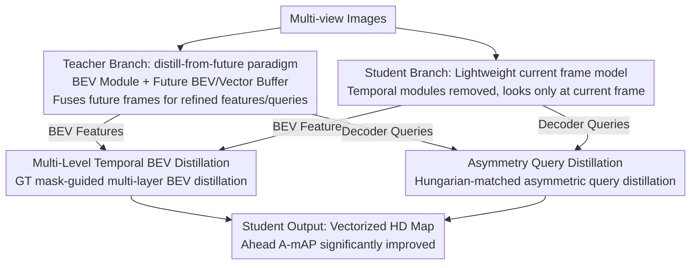

# AMap: Distilling Future Priors for Ahead-Aware Online HD Map Construction

**Conference**: CVPR 2026  
**Paper**: [CVF Open Access](https://openaccess.thecvf.com/content/CVPR2026/html/Li_AMap_Distilling_Future_Priors_for_Ahead-Aware_Online_HD_Map_Construction_CVPR_2026_paper.html)  
**Code**: [Project Page](https://buaa-rickyli.github.io/AMap/)  
**Area**: Autonomous Driving / Online HD Map Construction / Knowledge Distillation  
**Keywords**: Online HD Map, Ahead-Aware Perception, Future Prior Distillation, BEV Distillation, Temporal Modeling

## TL;DR
AMap identifies a safety hazard in existing temporal HD mapping methods: they "only enhance the rear area already passed and provide almost no improvement for the critical road ahead." It proposes a "distill-from-future" paradigm—using a teacher capable of seeing future frames to implicitly instill forward priors into a lightweight student observing only the current frame, significantly improving ahead-mapping accuracy (A-mAP) with zero inference overhead.

## Background & Motivation
**Background**: Online High-Definition (HD) map construction directly infers vectorized elements like lane lines, crosswalks, and road boundaries from on-vehicle cameras/sensors in real-time. Current SOTA methods generally introduce **historical temporal fusion** (MapTracker, StreamMapNet, etc.), accumulating past frames to mitigate occlusion and improve temporal consistency, achieving impressive overall mAP.

**Limitations of Prior Work**: The authors discovered a neglected but fatal flaw in the "historical fusion" paradigm—it is **spatially "backward-looking"**. Since historical frames come from regions the vehicle has already passed, gains are concentrated in the rear; however, for the **unseen road ahead**, temporal fusion provides almost no help. Quantitative evaluation using new metrics reveals that MapTracker (ResNet-18/50) exhibits a gap of over 8 points between A-mAP (ahead) and R-mAP (rear).

**Key Challenge**: This bias is **completely misaligned** with the actual needs of autonomous driving. Planning and decision-making rely heavily on an accurate understanding of the **geometry of the road ahead**, while sensitivity to already-passed areas is low. A control experiment using downstream trajectory prediction (see below) shows that occluding the ahead map causes monotonic deterioration of minADE/minFDE (100% occlusion increases minADE by 9.73% and minFDE by 13.95%), whereas occluding the rear has almost no impact or even slight improvement (70% occlusion reduced MR from 0.0854 to 0.0807). In other words, the rear accuracy being optimized so intensely yields low marginal benefits for downstream tasks.

**Goal**: Can a **lightweight, plug-and-play** module be designed to specifically bridge the gap in ahead perception without adding any architectural changes or inference costs?

**Key Insight**: Future frames are **accessible during the training phase** (entire video sequences are available in datasets), even though they are unavailable at deployment. "Future" can be treated as **privileged information**. By using it as a supervisory signal during training, the student model can function without future or historical frames during inference.

**Core Idea**: "distill-from-future"—first train a strong teacher with access to future temporal context, then **distill** its forward priors into a lightweight student looking only at the current frame, granting the student "forecasting" capabilities with zero inference overhead.

## Method

### Overall Architecture
AMap is a **plug-and-play** teacher-student distillation framework designed to fix the "rear-biased gain" of current temporal mapping models. It consists of: (1) a teacher model injected with **future temporal information**, and (2) a **lightweight student model** processing only the current frame. The authors instantiate this pair using the MapTracker codebase. Crucially, the "future" in the teacher has **no physical meaning at inference** (real-world future sensor inputs are unavailable); it serves only as a **privileged information container** for ahead-aware knowledge. The deployed student implicitly absorbs this knowledge into its static queries, thus **introducing no additional spatio-temporal overhead**.

The pipeline is: Multi-view images → (respective) Image backbones → BEV module for current frame BEV → Teacher uses Future BEV/Vector Memory Buffer to fuse future cache for "refined" features; Student utilizes only current frame features by removing temporal modules → Distillation occurs at the **BEV level** and **Query level** to transfer forward priors → Student outputs maps using filtered high-confidence queries. Training is two-stage: pre-train the teacher, then **freeze the teacher and update only the student** for joint training.

### Key Designs

**1. distill-from-future paradigm: Injecting "Future" privileged info into current frame students**

This directly addresses the motivation: historical fusion only enhances the rear because it consumes information from already-passed regions; to improve the front, one needs a knowledge source that has "seen ahead." The authors construct a **teacher** comprising 4 components: BEV Module, Future BEV Memory Buffer, Vector Module, and Future Vector Memory Buffer. The teacher transforms future BEV "memory" $B_{t+1}$ to the current frame coordinate system, uses spatial deformable cross-attention (similar to BEVFormer) to get a basic BEV $B^{t,\text{basic}}_T$, and then fuses 4 future BEV frames from the buffer into a refined feature $B^{t,\text{refined}}_T$. The Vector Module takes future query memories $Q^{t+1}_T$ from the Future Vector Buffer, aligns them via MLP, and concatenates them with new candidates to form current frame initial queries $Q^{t,\text{basic}}_T = [\,Q^{t+1\,\text{prop}}_T,\ Q^{t,\text{new}}_T\,]$, where $Q^{t+1\,\text{prop}}_T$ are "tracked" elements from frame $t{+}1$ and $Q^{t,\text{new}}_T$ are 100 new candidates. The student is a current-frame version of MapTracker with temporal modules removed, possessing only learnable queries $Q^{t,\text{new}}_S$. This design ensures future knowledge is compressed into the training process, while the student maintains single-frame inference speeds (FPS identical to pure student).

**2. Multi-Level Temporal BEV Distillation: Focusing distillation on foreground via Segmentation GT mask**

Distilling BEV features directly has two pitfalls: global distillation on the entire feature map **introduces significant background noise**, and sparse foreground semantics lead to **optimization imbalance**. The authors introduce two key changes: first, distilling not just the **basic BEV**, but also the **refined BEV** (the layer used for segmentation tasks), forming a "basic + refined" multi-layer distillation; second, using a binary spatial mask $M$ generated from segmentation GT to compute loss only in high-information foreground regions:

$$L_{\text{feat}} = \frac{1}{\sum_{i,j} M_{i,j}} \sum_{i=1}^{H}\sum_{j=1}^{W} M_{i,j}\,\big\| F^{(i,j)}_S - F^{(i,j)}_T \big\|^2$$

where $F_T, F_S \in \mathbb{R}^{C\times H\times W}$ are teacher/student BEV features, and $M_{i,j}\in\{0,1\}$ is derived from segmentation GT. Ablations show that using either layer alone yields limited gains; the "basic+refined" combination is crucial.

**3. Asymmetry Query Distillation: Solving misalignment with Hungarian Matching**

Vectorized mapping involves **set-based, dynamic tracking**. The teacher (future-aware) and student (current frame) operate in different contexts, leading to **asymmetry in query count and semantics** (Teacher has 116, Student has 100, and MapTracker queries drift over time). Methods like MapDistill that require hard one-to-one alignment fail here. Borrowing from DETRDistill, the authors use **matching-based dynamic query distillation**: first use the Hungarian algorithm to find the optimal one-to-one matching $\hat{\sigma}$ between $N_S$ student queries and $N_T$ teacher queries, then calculate logits distillation **only on matched pairs**:

$$L_{\text{logitsKD}} = \sum_{i=1}^{N_S} L_{\text{KL}}\big(\text{Logits}_S[i]\ \|\ \text{Logits}_T[\hat{\sigma}(i)]\big)$$

This step resolves the "temporal query inconsistency" inherent in such models. Ablation (Table 8) shows that dummy/Top-K matching causes mAP to drop significantly; only the combination of Hungarian matching and pair-wise KL achieves optimal results (63.63 mAP).

### Loss & Training
Two-stage training: (1) Separate pre-training of the teacher; (2) Joint training with the teacher **fully frozen**, updating only the student. Total Loss = Original mapping loss + BEV distillation $L_{\text{feat}}$ + Query logits distillation $L_{\text{logitsKD}}$. The teacher follows MapTracker defaults, sampling 4 frames chronologically from 10 consecutive frames. Optimizer: AdamW, initial LR 5e-4, weight decay 0.01, cosine decay to 1.5e-6, trained on 8 H20 GPUs.

## Key Experimental Results

### Downstream Sensitivity (Motivation Experiment)
Using MapTR for mapping and HiVT for trajectory prediction, with ahead/rear vectorized maps occluded proportionally:

| Occluded Area | Ratio | minADE↓ | minFDE↓ | MR↓ |
|---------------|-------|---------|---------|-----|
| Ahead | 100% | 0.4231 (+9.73%) | 0.9024 (+13.95%) | 0.1033 (+20.96%) |
| Rear | 70% | 0.3870 (+0.36%) | 0.7932 (+0.16%) | 0.0807 (-5.50%) |
| Rear | 100% | 0.3882 (+0.67%) | 0.7971 (+0.66%) | 0.0816 (-4.45%) |

Conclusion: Ahead map quality is the primary determinant of downstream performance; rear accuracy yields low marginal benefit or even harm (overfitting irrelevant details).

### Main Results (nuScenes val, Camera-only non-KD comparison)

| Method | Temporal | Backbone | mAP↑ | A-mAP↑ | R-mAP↑ | FPS↑ |
|--------|----------|----------|------|--------|--------|------|
| MapTracker (Temp) | ✓ | R50 | 72.93 | 70.03 | 78.92 | 15.6 |
| MapTracker (Static)| ✗ | R50 | 68.30 | 69.30 | 69.47 | 20.1 |
| **AMap (Ours)** | ✗ | R50 | **69.26** | **70.19** | 69.61 | 20.1 |
| MapTracker (Static)| ✗ | R18 | 62.81 | 64.63 | 64.04 | 31.5 |
| **AMap (Ours)** | ✗ | R18 | **64.49** | **66.28** | 65.11 | 31.5 |

Under R50, AMap's A-mAP (70.19) **surpasses** MapTracker with 5-frame temporal fusion (70.03) while maintaining single-frame inference speed. Unlike other temporal models that boost R-mAP, AMap's gains are concentrated ahead.

### Comparison with KD Methods (nuScenes val, Future→Static)

| Method | mAP↑ | A-mAP↑ | R-mAP↑ |
|--------|------|--------|--------|
| Student baseline (R18) | 62.81 | 64.63 | 64.04 |
| BEVDistill* | 57.97 (-4.84) | 60.08 (-4.55) | 60.06 |
| MapDistill* | 57.82 (-5.61) | 59.97 (-4.66) | 59.87 |
| **AMap (Ours)** | **64.49 (+1.68)** | **66.28 (+1.65)** | 65.11 |

Standard BEVDistill/MapDistill methods designed for static distillation **actually drop mAP by 5~6 points**, highlighting the difficulty of asymmetric temporal distillation.

### Ablation Study

| BEV-basic | BEV-refined | Query | mAP↑ | A-mAP↑ | R-mAP↑ |
|-----------|-------------|-------|------|--------|--------|
| ✗ | ✗ | ✗ | 62.81 | 64.63 | 64.04 |
| ✓ | ✓ | ✗ | 63.47 | 65.20 | 65.54 |
| ✗ | ✗ | ✓ | 63.57 | 64.61 | 64.91 |
| ✓ | ✓ | ✓ | **64.49** | **66.28** | 65.11 |

### Key Findings
- **Single-layer BEV distillation is insufficient**: Combined basic+refined distillation is necessary for significant gains.
- **BEV + Query Complementarity**: Both layers contribute independently; their combination achieves the best performance.
- **Strong Generalization**: When applied to MapTR, A-mAP surged by +14.95 (36.34→51.29). On Argoverse 2, A-mAP increased by 2.52.

## Highlights & Insights
- **Problem identification is high-value**: The first to systematically identify the "backward-looking" bias in temporal HD mapping and provide **safety-level arguments** via downstream sensitivity.
- **Creative use of "Future as Privileged Information"**: Distilling naturally existing future frames into a student is more elegant than stacking historical frames and costs nothing at deployment.
- **Engineering of Asymmetric Query Distillation**: Identifies the misalignment of vectorized mapping queries and resolves it cleanly with Hungarian matching + pair-wise KL divergence.

## Limitations & Future Work
- The teacher requires stable access to aligned future frames, relying on video annotations.
- The inconsistency between A-mAP/R-mAP and global mAP (mAP drops when distilling only refined BEV) is attributed to regional partitioning strategies but remains partially unexplained in the main text.
- Gains are primarily in ahead perception; overall mAP improvements are relatively moderate (e.g., +0.96 for R50).

## Related Work & Insights
- **vs Temporal Fusion (MapTracker/StreamMapNet)**: These use past frames for consistency at the cost of rear-bias and latency; AMap distills the "future" into a static student for ahead-aware performance with zero overhead.
- **vs Standard KD (BEVDistill/MapDistill)**: These require hard alignment; AMap handles asymmetric temporal context via dynamic matching.

## Rating
- Novelty: ⭐⭐⭐⭐⭐ 
- Experimental Thoroughness: ⭐⭐⭐⭐ 
- Writing Quality: ⭐⭐⭐⭐ 
- Value: ⭐⭐⭐⭐⭐ 

<!-- RELATED:START -->

## Related Papers

- [\[CVPR 2026\] MapGCLR: Geospatial Contrastive Learning of Representations for Online Vectorized HD Map Construction](mapgclr_geospatial_contrastive_learning_of_represe.md)
- [\[ECCV 2024\] Stream Query Denoising for Vectorized HD-Map Construction](../../ECCV2024/autonomous_driving/stream_query_denoising_for_vectorized_hd-map_construction.md)
- [\[NeurIPS 2025\] SDTagNet: Leveraging Text-Annotated Navigation Maps for Online HD Map Construction](../../NeurIPS2025/autonomous_driving/sdtagnet_leveraging_text-annotated_navigation_maps_for_online_hd_map_constructio.md)
- [\[AAAI 2026\] PriorDrive: Enhancing Online HD Mapping with Unified Vector Priors](../../AAAI2026/autonomous_driving/priordrive_enhancing_online_hd_mapping_with_unified_vector_p.md)
- [\[ICCV 2025\] DAMap: Distance-aware MapNet for High Quality HD Map Construction](../../ICCV2025/autonomous_driving/damap_distance-aware_mapnet_for_high_quality_hd_map_construction.md)

<!-- RELATED:END -->
