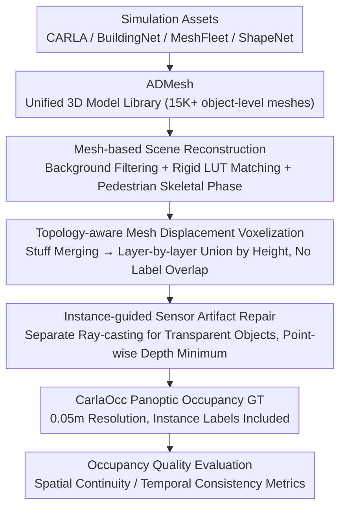

# An Instance-Centric Panoptic Occupancy Prediction Benchmark for Autonomous Driving

**Conference**: CVPR 2026  
**arXiv**: [2603.27238](https://arxiv.org/abs/2603.27238)  
**Code**: [https://mias.group/CarlaOcc](https://mias.group/CarlaOcc)  
**Area**: Autonomous Driving  
**Keywords**: Panoptic Occupancy Prediction, 3D Mesh Library, CARLA Simulation, Instance-level Annotation, Occupancy Dataset Quality

## TL;DR
Ours proposes ADMesh (a high-quality 3D model library with 15K+ assets) and CarlaOcc (a panoptic occupancy dataset with 100k frames and 0.05m precision). It provides the first instance-level annotations and physically consistent ground truth for 3D panoptic occupancy prediction in autonomous driving, along with occupancy quality evaluation metrics and a systematic benchmark.

## Background & Motivation

**Background**: 3D occupancy prediction is evolving from pure semantic occupancy to fine-grained panoptic occupancy (joint semantic and instance prediction). Methods like SparseOcc and PanoOcc have been proposed, but they are constrained by dataset quality.

**Limitations of Prior Work**: (1) Existing datasets lack instance-level annotations—SparseOcc/PaSCo generate pseudo-panoptic labels via heuristics (3D box grouping/clustering), introducing boundary artifacts and instance overlaps; (2) Current ground truth (GT) relies on LiDAR point cloud aggregation and voxelization, resulting in coarse resolution (0.2-0.5m), incomplete geometry (sensor-visible surfaces only), and physical inconsistency (holes and fractures); (3) Lack of a unified high-quality 3D model library—existing resources are fragmented and platform-dependent.

**Key Challenge**: Panoptic occupancy prediction requires precise instance-level geometric annotations, but existing generation pipelines (LiDAR aggregation → voxelization) fundamentally fail to provide physically consistent and complete ground truth.

**Key Insight**: Start from 3D meshes rather than point clouds—meshes contain complete geometry and can be voxelized at any arbitrary resolution.

**Core Idea**: Construct a unified 3D model library (ADMesh) → Reconstruct complete scene meshes via CARLA simulation → Apply topology-aware voxelization to generate physically consistent panoptic occupancy labels.

## Method

### Overall Architecture
This paper addresses the issue of "lack of high-quality data" for panoptic occupancy prediction: existing ground truth derived from LiDAR aggregation is coarse, incomplete, and lacks instance labels. The authors adopt a mesh-based generation route, as meshes inherently contain complete geometry. The pipeline consists of two primary stages: first, consolidating assets from various simulation platforms into a unified 3D model library, ADMesh; second, using CARLA simulation to reconstruct complete scene meshes frame-by-frame. Through topology-aware voxelization and sensor artifact repair, physically consistent panoptic occupancy GT (CarlaOcc) with instance labels is produced at 0.05m resolution. Finally, a set of metrics and benchmarks are provided to quantify dataset quality.

### Key Designs

**1. ADMesh: Consolidating Fragmented Simulation Assets into a Unified Library**

Generating data from meshes requires clean, consistently annotated 3D models. However, simulation assets are highly fragmented with varying coordinate systems and platform locks. ADMesh integrates 15K+ models from CARLA, BuildingNet, MeshFleet, and ShapeNet using an automated mesh export toolchain. It extracts component-level assets from CARLA, queries hierarchies and transforms via UE Editor interfaces, and integrates native semantic systems to reassemble parts into complete object-level meshes. This ensures consistent naming, coordinates, and semantic hierarchies for large-scale reuse.

**2. Mesh-based Scene Reconstruction: Replacing Sparse Point Clouds with Complete Geometry**

LiDAR aggregation suffers from sparse sampling and occlusion, missing object rears. Ours reconstructs the full panoptic scene mesh $\mathcal{M}^{pano}$ frame-by-frame: static backgrounds filter mesh $\mathcal{S}_{bg}$ intersecting the occupancy region; rigid foregrounds (vehicles) use a Look-Up Table (LUT) to match models $\mathcal{S}_{fg}^r$ from ADMesh; non-rigid foregrounds (pedestrians) use a skeletal motion analyzer. The analyzer pre-processes walking animations into $D$ discrete phase templates, matching the current skeletal state $\delta_k$ to the nearest phase $d_k = \arg\min_d \mathcal{G}(\delta_k, \delta_d)$ via geodesic distance. This reconstruction avoids LiDAR-induced holes and fractures.

**3. Topology-aware Mesh Displacement: Clean Voxelization for Overlap-free Labels**

Individual mesh voxelization causes label conflicts and redundant computation. This strategy first merges "stuff" (background) meshes to eliminate internal boundaries. Instances are then sorted by world-coordinate height and integrated layer-by-layer from bottom to top. This ensures lower structures (like ground) are not overwritten by high-level object voxels, producing naturally overlap-free output where each voxel belongs to exactly one semantic/instance ID.

**4. Instance-guided Sensor Artifact Repair: Correcting Depth/Semantic Errors for Transparent Objects**

CARLA rendering often allows depth and semantics to penetrate transparent objects (e.g., windows), embedding errors into the GT. The fix involves constructing a scene mesh containing only transparent objects, performing ray-casting to obtain accurate depths, and taking the point-wise minimum relative to the original depth. This recovers transparent surfaces closer to the camera, overwriting penetration errors.

**5. Occupancy Quality Evaluation Metrics: Quantifiable Standards for Dataset Quality**

Ours defines two metrics to characterize label quality beyond simple resolution. The spatial continuity score $s_{sc}$ measures if occupancy voxels of the same semantic class form continuous volumes (fragmentation or holes lower the score). The temporal consistency score $s_{tc}$ measures the stability of labels across adjacent frames (higher values indicate smoother temporal transitions). These transform subjective "geometric completeness" into comparable quantitative data.

### Key Experimental Results

#### Dataset Quality Comparison

| Dataset | Synthetic | Resolution (m) | Instance Label | $s_{sc}$↑ | $s_{tc}$↑ |
| :--- | :--- | :--- | :--- | :--- | :--- |
| SemanticKITTI | No | 0.2 | No | 0.353 | 0.023 |
| Occ3D-nuScenes | No | 0.4 | No | 0.721 | 0.431 |
| SurroundOcc | No | 0.5 | No | 0.878 | 0.589 |
| CarlaSC | Yes | 0.4 | No | 0.887 | 0.775 |
| **CarlaOcc (Ours)** | **Yes** | **0.05** | **Yes** | **0.996** | **0.873** |

#### Benchmark Model Testing (Semantic Occupancy mIoU)

| Model | Key Finding |
| :--- | :--- |
| Various SOTA Methods | Models trained on CarlaOcc benefit from more refined ground truth. |
| Panoptic Occupancy Task | Evaluations on true instance-level annotations are possible for the first time. |

### Key Findings
- CarlaOcc's spatial continuity (0.996) and temporal consistency (0.873) significantly outperform all existing datasets.
- The 0.05m resolution is 4x finer than the previous best (SemanticKITTI 0.2m).
- The instance-guided repair pipeline effectively corrects rendering artifacts for transparent objects.
- Mesh-based generation entirely avoids information loss associated with LiDAR aggregation.

## Highlights & Insights
- **Paradigm Shift from Point Clouds to Meshes**: Meshes contain complete geometric information, fundamentally solving the resolution and completeness limits of LiDAR aggregation. This inspires new methodologies for synthetic dataset construction.
- **Skeletal Motion Analyzer**: Provides an elegant solution for precise reconstruction of non-rigid objects (pedestrians) via animation phase pre-processing and geodesic matching.
- **Quality Evaluation Metrics**: Quantitatively defines spatial continuity and temporal consistency for the first time to evaluate occupancy dataset quality.

## Limitations & Future Work
- **Sim-to-real gap**: Can models trained on CarlaOcc transfer effectively to real-world driving scenarios?
- **Asset Diversity**: ADMesh assets are primarily from CARLA; diversity remains limited by simulation platforms.
- **Computational Cost**: 0.05m resolution generates massive voxel volumes, increasing memory and compute overhead for training.
- **Animation Complexity**: Pedestrian animations currently cover walking cycles; complex actions (crouching, bending) require further expansion.

## Related Work & Insights
- **vs. Occ3D/SurroundOcc**: These use LiDAR aggregation on real data but suffer from incomplete geometry. CarlaOcc uses mesh-based generation for physical consistency at the cost of the sim-to-real gap.
- **vs. CarlaSC**: Also a CARLA dataset, but lacks instance labels and has coarser resolution (0.4m vs. 0.05m).
- **vs. SparseOcc/PanoOcc**: While those focus on methodological innovation, this work provides necessary dataset infrastructure.

## Rating
- Novelty: ⭐⭐⭐⭐ First instance-level panoptic occupancy benchmark; ADMesh and mesh reconstruction pipeline are innovative.
- Experimental Thoroughness: ⭐⭐⭐⭐ Comprehensive dataset quality evaluation, though downstream model benchmarks could be more extensive.
- Writing Quality: ⭐⭐⭐⭐⭐ Pipeline descriptions are clear and complete; dataset statistics are detailed.
- Value: ⭐⭐⭐⭐⭐ Provides critical infrastructure for 3D panoptic occupancy research, driving the field forward.

<!-- RELATED:START -->

## Related Papers

- [\[CVPR 2026\] PanDA: Unsupervised Domain Adaptation for Multimodal 3D Panoptic Segmentation in Autonomous Driving](panda_unsupervised_domain_adaptation_for_multimodal_3d_panoptic_segmentation_in_.md)
- [\[ICCV 2025\] UniOcc: A Unified Benchmark for Occupancy Forecasting and Prediction in Autonomous Driving](../../ICCV2025/autonomous_driving/uniocc_a_unified_benchmark_for_occupancy_forecasting_and_prediction_in_autonomou.md)
- [\[CVPR 2026\] DLWM: Dual Latent World Models enable Holistic Gaussian-centric Pre-training in Autonomous Driving](dlwm_dual_latent_world_models_enable_holistic_gaussian-centric_pre-training_in_a.md)
- [\[CVPR 2026\] E3AD: An Emotion-Aware Vision-Language-Action Model for Human-Centric End-to-End Autonomous Driving](e3ad_an_emotion-aware_vision-language-action_model_for_human-centric_end-to-end_.md)
- [\[CVPR 2026\] TopoHR: Hierarchical Centerline Representation for Cyclic Topology Reasoning in Driving Scenes with Point-to-Instance Relations](topohr_hierarchical_centerline_representation_for_cyclic_topology_reasoning_in_d.md)

<!-- RELATED:END -->
