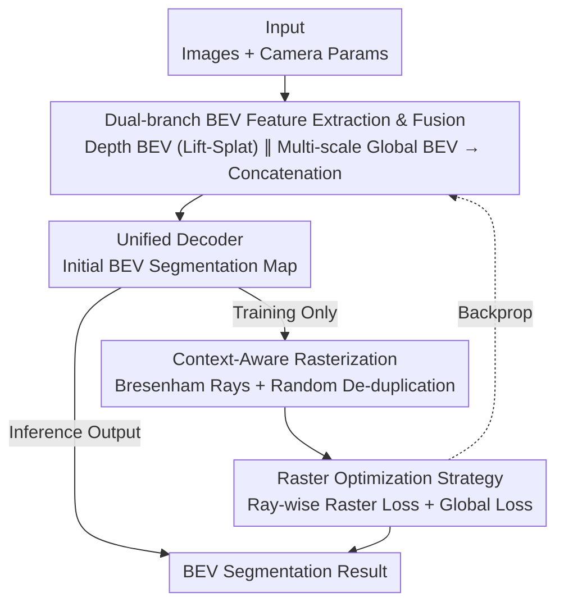

# BEV-CAR: Enhancing Monocular Bird's Eye View Segmentation with Context-Aware Rasterization

**Conference**: CVPR 2026  
**Paper**: [CVF Open Access](https://openaccess.thecvf.com/content/CVPR2026/html/Xiong_BEV-CAR_Enhancing_Monocular_Birds_Eye_View_Segmentation_with_Context-Aware_Rasterization_CVPR_2026_paper.html)  
**Code**: https://github.com/BEV-DAR/BEV-DAR  
**Area**: Autonomous Driving / BEV Perception  
**Keywords**: Monocular BEV Segmentation, Context-Aware Rasterization, Occlusion Reasoning, Ray Supervision, Depth Perception  

## TL;DR
BEV-CAR introduces a "training-only, inference-removed" context-aware rasterization mechanism that rearranges decoder outputs into rays along the lines of sight. Using discrete sampling via the Bresenham algorithm and ray-wise supervision, combined with a dual-branch (depth + global) BEV feature fusion, it achieves SOTA results on nuScenes (31.5% mIoU) and Argoverse (29.9% mIoU) with zero additional inference overhead at 43.1 FPS.

## Background & Motivation
**Background**: Monocular BEV semantic segmentation is a cost-effective alternative to LiDAR/radar for autonomous driving. Mainstream methods are divided into two categories: Cartesian-based methods using Transformer encoders/decoders + GAN-like decoders (deployment-friendly but lacking geometric priors), and Polar-based methods (better depth modeling and alignment with perspective views but computationally expensive due to coordinate transformations).

**Limitations of Prior Work**: Cartesian methods lack explicit geometric supervision along the line of sight, making them struggle with regions occluded by foreground objects. These invisible regions often appear as unnaturally large or distorted areas in the BEV map due to a reliance on priors during view transformation. Polar methods, while geometry-aligned, suffer from repeated resampling of proximal points and high computational costs for coordinate transformations.

**Key Challenge**: There is a trade-off between Cartesian methods (deployment-friendly but lacking ray-wise supervision) and Polar methods (superior depth structure but computationally expensive and representationally incompatible). Obtaining occlusion-aware geometric supervision usually requires accepting the costs of coordinate transformations.

**Goal**: This work aims to introduce polar-style ray-wise semantic consistency supervision to solve segmentation distortion caused by foreground occlusion while maintaining a standard Cartesian BEV representation for zero-latency deployment.

**Key Insight**: The authors observe that occlusion is essentially a 1D structural problem along a line of sight (depth direction). It is unnecessary to transform the entire map to polar coordinates. By treating the BEV plane as a set of discrete rays originating from the ego-vehicle during training, pixels can be rearranged into 1D sequences where indices naturally encode relative distance. This allows the injection of geometric priors—such as depth continuity, occlusion transitions, and object boundaries—without breaking the Cartesian grid.

**Core Idea**: Utilize "training-time temporary rasterization + ray-wise loss" to replace "inference-time coordinate transformation." By embedding occlusion reasoning into the loss function rather than the network architecture, the model gains polar geometric supervision while retaining zero-cost Cartesian deployment.

## Method

### Overall Architecture
BEV-CAR takes monocular (surround-view) images and camera parameters as input to output a BEV semantic segmentation map. The pipeline consists of three stages: first, a **dual-branch encoder** extracts and fuses depth-based BEV features and multi-scale global BEV features for a robust representation; a unified decoder then generates the initial BEV segmentation map; finally, during training, a **context-aware rasterization mechanism** rearranges the decoder output along rays with random de-duplication, supervised by a **raster optimization strategy** (ray-wise raster loss + global loss). Crucially, the rasterization component is removed during inference, leaving a standard Cartesian process.

### Key Designs

**1. Dual-branch BEV Feature Extraction: Offsetting Lift-Splat limitations**

To address the inaccurate depth estimation for distant small objects and blurry boundaries in monocular "lift-splat" methods, BEV-CAR utilizes a bifurcation encoder where implicit depth and global information complement each other. The depth branch follows the Lift-Splat-Shoot (LSS) approach, which projects image features into BEV space via depth predictions but struggle with precise boundaries and long-range relationships. The global branch employs multi-scale fusion with **distance-aware resolution allocation**: high-resolution feature maps model distant areas (where objects occupy fewer pixels), while low-resolution maps handle proximal areas. Each scale is transformed into BEV features $G_k \in \mathbb{R}^{C_k \times Z_k \times X_k}$ via a dense transformer and concatenated:

$$G_{BEV} = \mathrm{Concat}_{k=0}^{K} G_k$$

The combined multi-scale global and implicit depth features result in a BEV representation more sensitive to foreground depth and sharper boundaries.

**2. Context-Aware Rasterization: Modeling occlusion as 1D ray structure**

Standard BEV approaches model scenes as uniform Cartesian grids, ignoring the anisotropic resolution and occlusion structures inherent in perspective imaging. This design treats the BEV plane as a bundle of discrete rays originating from the ego-vehicle. Points are sampled along each ray by increasing depth, forming 1D sequences where indices encode relative distance. This allows local context modeling (depth continuity, occlusion transitions) within each ray without expensive global attention.

To map rays to the discrete grid, the **Bresenham line algorithm** is used to ensure topological continuity. Each ray is defined by the optical center $(x_0, y_0)$ and an endpoint $(x_1, y_1)$ at the image boundary. For the case $0 \le m \le 1$ and $x_0 < x_1$, the decision variable is initialized as $d = 2(y_1 - y_0) - (x_1 - x_0)$, and iterated: if $d \le 0$, select $(x+1, y)$; otherwise, select $(x+1, y+1)$. This produces an 8-connected, depth-ordered path. Since proximal points are oversampled during this rearrangement, a **random de-duplication** strategy (similar to dropout) is applied to remove redundant samples, ensuring balanced accuracy for both proximal and distal regions.

**3. Raster Optimization Strategy: Ray-wise + Top-K Hard Sample Mining**

The actual geometric supervision is provided by the raster loss, applied only during training. Prior to calculation, **Random De-duplication** is performed on the sampled rays. Given the segmentation map $P \in \mathbb{R}^{B \times C \times W \times H}$, labels $T$, and ray set $R$, samples are removed with a probability $p_{drop}=0.5$. This forces the optimizer to focus on unique points and reduces proximal redundancy. The ray-wise raster loss is a binary cross-entropy:

$$L_r(l_r, t_r) = -\sum_{r=1}^{N}\big[t_r\log(l_r) + (1-t_r)\log(1-l_r)\big]$$

The framework applies **Top-K** mining, backpropagating only through the $k$ rays with the highest error: $L_{raster} = \frac{1}{k}\sum_{r=1}^{k}\mathrm{topk}(L(l_r,t_r))$. This online hard-example mining targets difficult areas such as occlusions and long distances. The final loss is $Loss = \lambda L_{raster} + L_{global}$, where $L_{global}$ is a weighted cross-entropy for class balancing.

### Loss & Training
The total loss is $Loss = \lambda L_{raster} + L_{global}$ with $\lambda=10$ and $p_{drop}=0.5$. The BEV field of view is 50m forward and 25m on each side, with a resolution of 25cm/pixel ($200 \times 198$ ground truth). Training is conducted on an A100 GPU using Adam with an initial learning rate of 0.00018, weight decay of 0.01, and batch size of 12.

## Key Experimental Results

### Main Results
On the nuScenes validation set (IoU %, following PON split):

| Dataset | Metric | BEV-CAR | Prev. SOTA | Description |
| :--- | :--- | :--- | :--- | :--- |
| nuScenes | Mean IoU | **31.5** | 29.3 (OEBEV) | All-class SOTA |
| nuScenes | Crossing | **48.3** | 41.6 (GitNet) | Significant gain in crosswalks |
| nuScenes | Walkway | **49.2** | 42.3 (TaDe) | Significant gain in walkways |
| nuScenes | Drivable | 70.9 | 75.7 (FTVP) | Second best in drivable area |
| Argoverse | Mean IoU | **29.9** | 29.7 (HFT) | New SOTA |
| Argoverse | Vehicle | **43.1** | 35.8 (TIM) | Significant lead in vehicles |

Computational overhead (nuScenes, 1024×1024, RTX 4090):

| Method | FLOPs | Params | FPS |
| :--- | :--- | :--- | :--- |
| **BEV-CAR** | 125.82G | 34.54M | **43.1** |
| HFT | 122.02G | 43.97M | 34.6 |
| PON | 135.67G | 37.42M | 35.3 |

The CAR mechanism adds no inference latency, and the model maintains real-time performance at 43.1 FPS.

### Ablation Study
Ablation of components (nuScenes, DB=Depth BEV, GB=Global BEV, RL=Raster Loss):

| DB | GB | RL | Layout | Objects | Mean |
| :--- | :--- | :--- | :--- | :--- | :--- |
| ✓ | | | 41.2 | 13.8 | 27.5 |
| ✓ | ✓ | | 44.8 | 23.7 | 34.4 |
| ✓ | ✓ | ✓ | **50.6** | 23.9 | **37.3** |

*Note: There is a discrepancy between the 31.5% mIoU reported in the main text and the 37.3% in Table 7, likely due to different evaluation protocols (e.g., visibility masks).*

$p_{drop}$ sensitivity (nuScenes val):

| $p_{drop}$ | 0.0 | 0.3 | **0.5** | 0.7 |
| :--- | :--- | :--- | :--- | :--- |
| Layout IoU | 51.5 | 50.9 | 50.6 | 48.5 |
| Object IoU | 21.0 | 22.9 | **23.9** | 22.1 |

Plug-and-play generalization: Adding CAR to PYVA improved Mean IoU from 22.13 to 27.99; for PON, it improved from 23.08 to 25.47.

### Key Findings
- **Global branch contribution**: Adding the GB improved Object IoU by 9.9, suggesting that foreground object segmentation relies heavily on multi-scale global context rather than simple depth projection.
- **Raster loss for layout**: Adding the RL improved Layout IoU by 5.8, confirming that ray-wise supervision enhances spatial consistency for occluded structures.
- **Optimal $p_{drop}$**: A value of 0.5 balances proximal and distal accuracy; values below 0.4 lead to overfitting on proximal points.
- **Gains in long-range and occlusion**: Performance was significantly higher in the 30–56m range for difficult classes like Trailers, attributed to the depth-aware context of the raster loss.

## Highlights & Insights
- **Inference-Free Structural Prior**: Using rasterization strictly during training to inject geometric priors is a clever paradigm for "having your cake and eating it too"—obtaining geometry-aware supervision without deployment costs.
- **Bresenham for Ray Sampling**: This classical algorithm effectively maps rays onto Cartesian grids while maintaining topological continuity and depth order without expensive transformations.
- **Ray-wise Dropout**: Treating random de-duplication as a regularization technique solves the oversampling issue of proximal points while improving generalization.

## Limitations & Future Work
- **Metric Consistency**: Discrepancies between main text and table values suggest sensitivity to evaluation settings.
- **Drivable Area Performance**: The method shows lesser gains in large drivable areas compared to occlusion-heavy or small object classes.
- **Ray Assumptions**: The model assumes straight-line rays from a single center; handling fisheye cameras or multi-camera overlap areas remains to be explored.
- **Data Distribution**: As a "soft supervision" during training, its robustness to deployment scenarios with radically different occlusion patterns is unproven.

## Related Work & Insights
- **Vs. Polar Methods (TIM/TaDe)**: These require explicit transformations and suffer from resampling overhead; BEV-CAR achieves similar geometric awareness via training-time loss without transformation costs.
- **Vs. Cartesian Generative Decoders (MonoLayout/VPN)**: These lack geometric priors and output distorted objects; BEV-CAR explicitly fixes this via ray-wise supervision.
- **Vs. Lift-Splat (LSS)**: BEV-CAR supplements LSS with a distance-aware global branch to sharpen boundaries and improve distant object detection.

## Rating
- Novelty: ⭐⭐⭐⭐ (Clever training-time rasterization and ray-wise dropout)
- Experimental Thoroughness: ⭐⭐⭐⭐ (Extensive ablations and cross-dataset SOTA)
- Writing Quality: ⭐⭐⭐⭐ (Clear motivation and detailed formulas)
- Value: ⭐⭐⭐⭐ (Real-time compatibility and plug-and-play nature for practical deployment)

<!-- RELATED:START -->

## Related Papers

- [\[CVPR 2026\] BEV-SLD: Self-Supervised Scene Landmark Detection for Global Localization with LiDAR Bird's-Eye View Images](bev-sld_self-supervised_scene_landmark_detection_for_global_localization_with_li.md)
- [\[CVPR 2026\] CycleBEV: Regularizing View Transformation Networks via View Cycle Consistency for Bird's-Eye-View Semantic Segmentation](cyclebev_regularizing_view_transformation_networks_via_view_cycle_consistency_fo.md)
- [\[CVPR 2026\] Spe-BEVHead: Rethinking the Detection Head Design for Bird's-Eye-View Object Detection](spe-bevhead_rethinking_the_detection_head_design_for_birds-eye-view_object_detec.md)
- [\[CVPR 2026\] MTA: Multimodal Task Alignment for BEV Perception and Captioning](mta_multimodal_task_alignment_for_bev_perception_and_captioning.md)
- [\[CVPR 2026\] Monocular Open Vocabulary Occupancy Prediction for Indoor Scenes (LegoOcc)](monocular_open_vocabulary_occupancy_prediction_for_indoor_scenes.md)

<!-- RELATED:END -->
