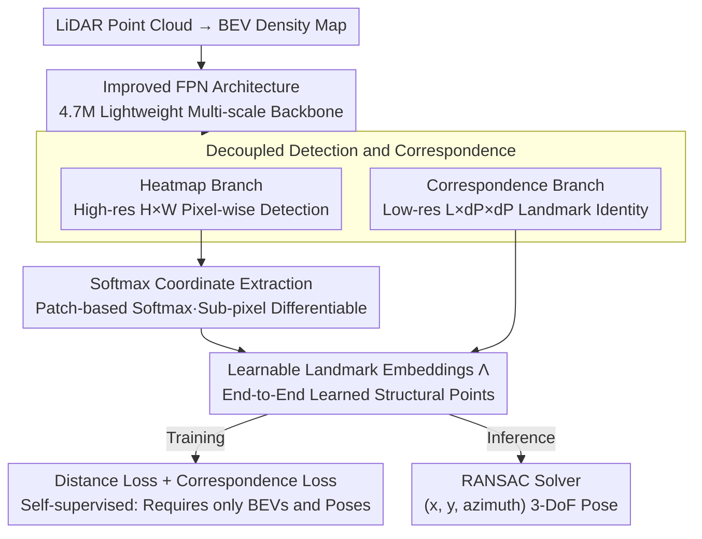

# BEV-SLD: Self-Supervised Scene Landmark Detection for Global Localization with LiDAR Bird's-Eye View Images

**Conference**: CVPR 2026  
**arXiv**: [2603.17159](https://arxiv.org/abs/2603.17159)  
**Code**: [davidskdds/BEV-SLD](https://github.com/davidskdds/BEV-SLD)  
**Area**: Autonomous Driving  
**Keywords**: LiDAR localization, BEV, scene landmark detection, self-supervised learning, global localization

## TL;DR

This paper proposes BEV-SLD, a LiDAR global localization method based on self-supervised Scene Landmark Detection (SLD). By decoupling detection from correspondence prediction, it achieves high-precision $(x, y, \text{azimuth})$ pose estimation across various scenarios with a compact storage footprint of only 20MB.

## Background & Motivation

LiDAR global localization is a core capability for autonomous driving and robot navigation. Existing methods are primarily categorized into two types:

- **Place recognition-based**: e.g., BEVPlace++, which retrieves the nearest neighbor map frame before refining the pose. Retrieval relies on global descriptors and suffers performance degradation in query areas far from existing trajectories, as these methods implicitly assume the presence of database frames near the query location.
- **Point cloud registration-based**: e.g., KISS-Matcher, which directly matches local feature points for pose estimation. This approach is computationally expensive, requires storing full point cloud maps, and has limited scalability.

Scene Landmark Detection (SLD) was originally proposed in the vision domain. The core idea is to **learn fixed, repeatedly detectable landmarks in a scene, establish observation-to-map correspondences, and solve for the pose using PnP/RANSAC**. This paradigm is naturally suited for large-scale localization due to its compact landmark lists and lack of dependence on spatial coverage density of database frames.

However, moving the original SLD design from camera images to LiDAR BEV presents challenges: (1) information density differences and (2) the need to balance detection accuracy with large-scale scalability. BEV-SLD is designed to address these issues.

## Method

### Overall Architecture

BEV-SLD reformulates LiDAR global localization as detecting a fixed set of reproducible scene landmarks on a bird's-eye view. It involves three steps: offline joint learning of the landmark set $\Lambda$ and detection network $N(\theta)$; map building by storing only the learned landmarks $\Lambda$ and weights $\theta$ (approx. 20MB total); and online inference where the network predicts heatmaps and correspondence maps from a BEV density map to estimate the 3-DoF $(x, y, \text{azimuth})$ pose via RANSAC. The input BEV density map is a projection of LiDAR point cloud occupancy.

### Key Designs

**1. Decoupled Detection and Correspondence**

This is the core innovation of BEV-SLD. If a single branch predicts both location and identity, the resolution and computation conflict as the total number of landmarks $L$ increases. BEV-SLD splits the network: a Heatmap branch predicts "is this a landmark" at high resolution ($H\times W$) for sub-pixel accuracy, while the Correspondence maps branch predicts the identity at lower resolution ($L\times d_P\times d_P$). This ensures heatmap accuracy is independent of $L$, allowing for scalability to large maps.

**2. Softmax Extraction of Landmark Coordinates**

To enable end-to-end learning, extraction must be differentiable. Global coordinates are extracted using softmax weighting within each heatmap patch:

$$\hat{s}_i = \sum_{p \in \text{patch}_i} \text{softmax}(h_p) \cdot c_p$$

where $h_p$ is the heatmap value and $c_p$ represents the pixel's world coordinates. The resulting coordinates are differentiable and achieve sub-pixel precision.

**3. Learnable Landmark Embeddings $\Lambda$**

The landmark set $\Lambda$ is not manually selected but treated as learnable parameters optimized end-to-end. Each $\Lambda_j$ is a 2D world coordinate. During training, landmarks automatically aggregate at stable structural positions (building corners, trees), ensuring reproducibility without manual labels and maintaining robustness even far from training trajectories.

**4. Improved FPN Architecture**

Based on a Feature Pyramid Network, the backbone contains only 4.7M parameters. Multi-scale feature fusion captures both local details and global context, enabling edge deployment and a compact 20MB map size.

### Loss & Training

The training utilizes a combination of two losses. **Distance Loss** aligns each detected landmark $\hat{s}_i$ to the nearest $\Lambda_j$ in the map:

$$\mathcal{L}_{\text{dist}} = \sum_i \log\left(1 + \gamma \cdot \min_j \|\hat{s}_i - \Lambda_j\|\right)$$

The log function suppresses outliers. **Correspondence Loss** applies cross-entropy to the correspondence map output, using the index of the nearest landmark as the ground truth:

$$\mathcal{L}_{\text{corr}} = -\sum_i \log P(j^* | \hat{s}_i)$$

where $j^* = \arg\min_j \|\hat{s}_i - \Lambda_j\|$. Training is fully self-supervised, requiring only BEV images and poses (from SLAM or odometry).

## Key Experimental Results

### Main Results

Success rate comparison (percentage of successful localization within pose error thresholds) across four scenarios:

| Method | MCD (Campus) | NCLT (Campus) | Wild-Places (Forest) | Factory Floor |
|------|-----------|------------|-------------------|---------------------|
| BEVPlace++ | Low | Medium | Low | Medium |
| LightLoc | Medium | Medium | Low | Medium |
| KISS-Matcher | Medium | High | Medium | High |
| PosePN++ | Low | Medium | Low | Medium |
| **Ours (BEV-SLD)** | **Best** | **Best** | **Best** | **Best** |

BEV-SLD achieves the highest success rate across all datasets, with significant advantages in non-standard environments like forests and factories.

### Ablation Study

| Component | Success Rate Change |
|------|-----------------|
| W/O Decoupled Design (Single Branch) | Significant Decrease |
| W/O Learnable Λ (Fixed Grid) | Notable Decrease |
| Reducing Landmark Count L | Minor for small maps, major for large maps |
| Replacing Log-Distance with L2 | Sensitive to outliers, slight decrease |

### Key Findings

1. **Performance Gains in Off-Trajectory Queries**: Retrieval methods fail when query positions are far from training tracks, whereas BEV-SLD remains stable due to distributed landmarks.
2. **Extreme Efficiency**: Map representation requires only 20MB, far smaller than point cloud maps.
3. **Generalization**: Effective across campus, forest, and factory environments.

## Highlights & Insights

- **Paradigm Shift**: Effectively migrates SLD from 6-DoF visual localization to 3-DoF LiDAR BEV, a clever dimensionality reduction.
- **Elegant Decoupling**: High-res heatmaps ensure precision while low-res correspondence maps ensure scalability.
- **Self-Supervised**: Zero manual labeling required, lowering deployment barriers.
- **Compactness**: The 20MB map size is ideal for resource-constrained robotic platforms.

## Limitations & Future Work

1. **3-DoF Only**: Cannot handle scenarios requiring height information (e.g., multi-story car parks).
2. **BEV Quality Dependency**: Occlusions and sparse point clouds affect density projections.
3. **Fixed $L$**: The number of landmarks requires manual tuning; adaptive mechanisms are lacking.
4. **Dynamic Environments**: Long-term stability under seasonal or structural changes is not fully explored.

## Related Work & Insights

- **SLD (Original)**: Panek et al. inspired the introduction of the landmark concept to LiDAR.
- **BEVPlace++**: Demonstrates that the landmark paradigm outperforms the retrieval paradigm in sparse data.
- **KISS-Matcher**: Shows comparable accuracy but at the cost of significantly larger map storage.

## Rating

| Dimension | Score (1-5) | Explanation |
|------|-----------|------|
| Novelty | 4.5 | Elegant transition of SLD to BEV with decoupled design. |
| Practicality | 4.5 | 20MB map and 4.7M parameters are highly deployment-friendly. |
| Experimental Thoroughness | 4.0 | Covers diverse scenarios, though dataset scale is moderate. |
| Writing Quality | 4.0 | Clear structure and complete derivations. |
| **Overall** | **4.3** | Simple, elegant, and highly practical balance of precision and efficiency. |

## Comparison with Related Work

| Method | Paradigm | Map Size | Labels Needed | Off-traj Robustness | 3-DoF Accuracy |
|------|------|---------|-----------|-------------|----------|
| BEVPlace++ | Retrieval + Refinement | Medium | ✗ | Poor | Medium |
| KISS-Matcher | Point Cloud Registration | Large | ✗ | Medium | High |
| LightLoc | Pose Regression | Small | ✗ | Medium | Medium |
| **Ours (BEV-SLD)** | **Landmark Detection** | **Tiny (20MB)** | **✗ (Self-sup)** | **Strong** | **Highest** |

<!-- RELATED:START -->

## Related Papers

- [\[CVPR 2026\] BEV-CAR: Enhancing Monocular Bird's Eye View Segmentation with Context-Aware Rasterization](bev-car_enhancing_monocular_birds_eye_view_segmentation_with_context-aware_raste.md)
- [\[CVPR 2026\] Spe-BEVHead: Rethinking the Detection Head Design for Bird's-Eye-View Object Detection](spe-bevhead_rethinking_the_detection_head_design_for_birds-eye-view_object_detec.md)
- [\[CVPR 2026\] TerraSeg: Self-Supervised Ground Segmentation for Any LiDAR](terraseg_self-supervised_ground_segmentation_for_any_lidar.md)
- [\[CVPR 2026\] TACO: Task-Aware Contrastive Learning for Joint LiDAR Localization and 3D Object Detection](taco_task-aware_contrastive_learning_for_joint_lidar_localization_and_3d_object_.md)
- [\[CVPR 2026\] CycleBEV: Regularizing View Transformation Networks via View Cycle Consistency for Bird's-Eye-View Semantic Segmentation](cyclebev_regularizing_view_transformation_networks_via_view_cycle_consistency_fo.md)

<!-- RELATED:END -->
