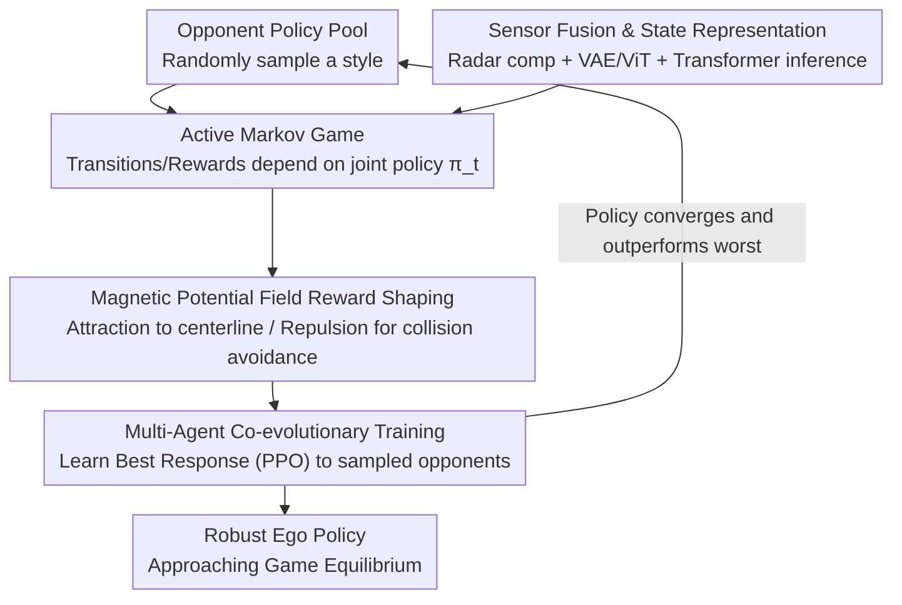

# Beyond Rule-Based Agents: Active Markov Games for Realistic Multi-Agent Interaction in Autonomous Driving

**Conference**: CVPR 2026  
**Paper**: [CVF Open Access](https://openaccess.thecvf.com/content/CVPR2026/html/Gui_Beyond_Rule-Based_Agents_Active_Markov_Games_for_Realistic_Multi_Agent_Interaction_CVPR_2026_paper.html)  
**Code**: None  
**Area**: Autonomous Driving  
**Keywords**: Autonomous Driving Decision-Making, Multi-Agent, Active Markov Games, Co-evolutionary Training, Potential Field Reward Shaping

## TL;DR
This paper models the driving environment as an "Active Markov Game" (AMG) where both state transitions and rewards depend on the current policies of all agents. By employing multi-agent co-evolutionary training, the ego policy plays against and evolves with a pool of diverse opponent strategies. This approach learns robust interactive decision-making in CARLA unsignaled intersections and long-tail scenarios, reducing the collision rate to 0.02 and achieving a success rate of 98%.

## Background & Motivation

**Background**: Autonomous driving decision-making in complex urban scenarios (especially unsignaled intersections and roundabouts) primarily follows two paths: behavior cloning or conditional distribution fitting using large-scale real driving datasets, and trial-and-error learning via Deep Reinforcement Learning (DRL) in simulation platforms like CARLA or SUMO.

**Limitations of Prior Work**: Real datasets are mostly collected from regions with well-developed infrastructure and compliant drivers, making long-tail interactions—such as "malicious cutting-in, illegal overtaking, or pedestrians suddenly rushing out"—extremely rare. Models often fail in out-of-distribution (OOD) scenarios due to sample sparsity and insufficient causal information. While simulation can create extreme scenarios, **surrounding vehicles are mostly simplified into rule-based agents** with preset trajectories that stop for obstacles and fail to react to the ego vehicle's strategy.

**Key Challenge**: Rule-based opponents are "non-responsive"; they do not become conservative when the ego vehicle is aggressive, nor do they take the lead when the ego vehicle hesitates. This eliminates the **policy coupling** between drivers in real traffic—exactly where the difficulty of intersection decision-making lies. Even with MARL, simultaneous updates of multiple agents introduce environmental non-stationarity, making training unstable and difficult to reach a cooperative equilibrium.

**Goal**: (1) Provide a mathematical framework that explicitly expresses "my opponent changes according to me"; (2) Enable the ego vehicle to truly encounter diverse and evolving opponent behaviors during training rather than static obstacles.

**Core Idea**: Use **Active Markov Games (AMG)** to define the state transition kernel and reward function as dependent on the joint policy $\pi_t$. Then, apply **multi-agent co-evolution**—each agent maintains a policy pool, and in each episode, an opponent style is randomly sampled from the pool to compete with the ego vehicle. The ego vehicle learns the best response to this mixed opponent, and once converged, the new policy is added back to the pool to gradually approach the game equilibrium.

## Method

### Overall Architecture

The system aims to allow the ego vehicle to encounter realistic, diverse, and responsive opponents in simulation. It consists of two layers: the bottom layer is the **AMG environment abstraction**, transforming the environment from a passive physical system into a game entity that responds to policies; the top layer is **co-evolutionary training**, allowing the ego vehicle and a pool of opponent strategies to learn and adapt to each other alternately.

The single-step decision data flow is: multi-source sensors (Radar with motion compensation + clustering, front-view camera via VAE and ViT, HD maps, vehicle states) are fused into a unified observation → a Transformer implicitly infers opponent strategies and extracts contextual features → actions (throttle/brake/steering) are sampled from a Gaussian policy → sent to CARLA → dense rewards are calculated via magnetic potential field formulas. On the training side, ego and opponent pools are maintained separately and updated via alternating learning. When an agent's policy converges and outperforms the worst strategy in its pool (if the pool is full), the new policy is added to expand diversity.

### Key Designs

**1. Active Markov Games (AMG): Letting the Opponent's Policy Truly Rewrite the Environment**

To address the issue where "rule-based opponents do not respond and policy coupling is eliminated." Traditional Markov Games (MG) assume a stationary state transition kernel and reward function. AMG makes both explicitly dependent on the joint policy $\pi_t = (\pi_t^1,\dots,\pi_t^N)$ of all agents:

$$s_{t+1} \sim P_U(s_{t+1} \mid s_t, a_t, \pi_t), \qquad r_t^i = R_U(s_t, a_t, \pi_t)$$

where $a_t=(a_t^1,\dots,a_t^N)$ is the joint action. Intuition: The same control action $a_t$ leads to different outcomes under different opponent policies. For merging, if the ego vehicle takes low acceleration and the opponent uses a safe policy $\pi_t^{\text{safe}}$, both slow down to a safe state $s_{t+1}^{\text{safe}}$ with $r_t^i>0$; if the opponent uses an aggressive policy $\pi_t^{\text{agg}}$, it might accelerate to block, leading to a crash $s_{t+1}^{\text{crash}}$ with $r_t^i<0$:

$$P_U(s_{t+1}^{\text{safe}} \mid s_t, a_t, \pi_t^{\text{safe}}) > P_U(s_{t+1}^{\text{safe}} \mid s_t, a_t, \pi_t^{\text{agg}})$$

The value of this step is embedding "the opponent responds to me" into the environment dynamics itself, providing a mathematical foundation for interactive learning.

**2. Sensor Fusion and State Representation: Physically Credible Observation and Implicit Opponent Inference**

Reliable decision-making requires clean states with clear physical meaning while predicting opponent intent. The Radar undergoes a multi-stage pipeline: **ego-motion compensation** → discarding low-confidence detections → robust motion thresholding using Median Absolute Deviation (MAD) → ground plane clustering → multi-frame gating (consistency over $k$ frames) to maintain lightweight temporal tracks. Camera images go through **VAE + ViT** for high-dimensional visual features, fused with Radar, vehicle states (speed/angle/accel/history), and maps. This fused vector is fed into a **Transformer module to implicitly infer opponent strategies**, outputting context for the Gaussian policy actions.

**3. Multi-Agent Co-evolutionary Training: Eliminating "Non-responsive Opponents" via Policy Pools + Best Response**

Each agent maintains a policy pool $P_i=\{\pi_1^i,\pi_2^i,\dots,\pi_K^i\}$. At the start of each episode, opponents are sampled from the pool to provide a diverse, adaptive interactive environment. The sampled mixed policy is:

$$\bar\pi^{-i} = \sum_k w_k \pi_k^{-i}, \quad \text{s.t.} \ \sum_k w_k = 1$$

The ego vehicle's goal is to learn the best response strategy $\pi_{\text{BR}}^i$ to maximize expected returns:

$$\max_{\theta_i} \ \mathbb{E}_{s_t,a_t \sim (\pi_{\text{BR}}^i,\bar\pi^{-i})} \left[ \sum_{t=0}^{T} \gamma^t r^i(s_t,a_t) \right]$$

**PPO** is used for stable continuous control. Once a policy converges, it is added to the pool. This "learn → add to pool → resample game" iteration pushes the system toward game equilibrium, allowing the ego vehicle to absorb various driving styles.

**4. Magnetic Potential Field Reward Shaping: Dense Signals for Sparse Rewards**

Intersection interactions have naturally sparse rewards. Interaction between the ego and the road is treated as an **attractive potential** (encouraging following the navigation centerline), and interaction between the ego and opponents as a **repulsive potential** (avoiding collisions):

$$r_{\text{shape}} = w_{\text{int}}\big(\Phi_{\text{int}}(t_n)-\Phi_{\text{int}}(t_{n-1})\big) + w_{\text{lane}}\big(\Phi_{\text{lane}}(t_n)-\Phi_{\text{lane}}(t_{n-1})\big)$$

The interaction potential incorporates both safety distance and Time-To-Collision (TTC):

$$\Phi_{\text{int}} = w(d)\,(\alpha U_d(d) + \beta U_{\text{TTC}}), \quad U_d(d)=\frac{1}{d^{k_d}}, \quad \text{TTC}=\frac{d}{\max(c,\varepsilon)}$$

The lane potential penalizes deviation from the centerline and heading error $\Delta\psi$:

$$\Phi_{\text{lane}} = \frac{1}{2}\left( \Big(\frac{d}{d_{\max}}\Big)^2 + \Big(\frac{|\Delta\psi|}{\psi_{\max}}\Big)^2 \right)$$

This potential difference ensures dense rewards without destroying the optimal policy.

## Key Experimental Results

Evaluated in CARLA (Town10HD, Town02) on unsignaled intersections, T-junctions, and long-tail conflict routes. Each scenario was averaged over 100 trials across 3 random seeds.

### Main Results

Comparison under different opponent settings (↓ Lower is better / ↑ Higher is better):

| Framework / Opponent | Method | Collision ↓ | Return ↑ | Path Deviation ↓ | Safety Margin ↑ | OOD Success ↑ | Control Smoothness ↑ |
|------|------|------|---------|----------|-----------|------------|-----------|
| Single-Agent · Rule-based | PPO | 0.08 | 132.98 | 0.986 | 3.65 | 0.92 | 0.44 |
| Single-Agent · Rule-based | DDPG | 0.13 | 120.43 | 1.120 | 2.76 | 0.85 | 0.35 |
| Single-Agent · Diverse | PPO | 0.60 | 68.33 | 0.932 | 0.41 | 0.40 | 0.32 |
| Multi-Agent · Rule-based | IPPO | 0.03 | 132.51 | 0.876 | 2.13 | 0.97 | 0.42 |
| **Multi-Agent · Rule-based** | **Ours** | **0** | **138.93** | **0.865** | 3.17 | **1.0** | **0.45** |
| Multi-Agent · Diverse | IPPO | 0.29 | 126.30 | 0.942 | 1.15 | 0.71 | 0.39 |
| **Multi-Agent · Diverse** | **Ours** | **0.02** | **133.74** | **0.882** | 2.12 | **0.98** | 0.43 |

Key insight: Single-agent methods collapse when rule-based opponents are replaced with diverse ones (PPO collision 0.08→0.60, OOD success 0.92→0.40). Ours remains robust with 0.02 collision rates and 0.98 OOD success.

### Ablation Study

Removing modules under the multi-agent setting:

| Configuration | OOD Success ↑ | Collision ↓ | Note |
|------|-----------|------|------|
| Full Model (Ours) | 0.98 | 0.02 | Complete model |
| w/o Policy Inference | 0.84 | 0.15 | Transformer inference dropped; collisions 7x higher |
| w/o Policy Pool | 0.81 | 0.17 | Lacks opponent diversity; generalization suffers |
| w/o Map Module | 0.62 | 0.23 | Lacks map priors; high collision risk |
| w/o Perfect Perception | 0.54 | 0.46 | Perception quality is critical |

### Key Findings
- **Perception and Maps are Foundational**: Removing the perception or map modules causes the largest degradation, indicating that game-theoretic strategies cannot compensate for poor state input.
- **Policy Pools and Inference Drive Generalization**: These contribute significantly to OOD success by allowing the ego to "see" diverse opponents and "anticipate" their actions.
- **Hyperparameter Balance**: Rewards and OOD success peak at interaction radius $R \approx 15–17$m and $\beta \approx 0.5–0.6$. High $\beta$ values can cause overly aggressive avoidance, compromising both safety and lane keeping.

## Highlights & Insights
- **AMG Mathematicalizes the "Non-responsive Opponent" Problem**: Instead of manually adding rules or scenarios, the paper defines transitions and rewards as functions of $\pi_t$, acknowledging that opponents change based on the ego vehicle's actions from the definition level.
- **Natural Adaptation of Self-Play**: Porting the self-play concept from games like Go or StarCraft into traffic provides diverse, evolving interaction partners, solving the simulation long-tail coverage gap.
- **Magnetic Potential Field Reward**: A clever combination of physical intuition and potential function shaping that provides a dense, safe solution to the sparse reward problem at intersections.

## Limitations & Future Work
- **Authors' View**: Testing is limited to two-car settings; dense multi-car (>2) scenarios with strong coupling are not yet verified. No formal convergence proof for approaching Nash Equilibrium is provided.
- **Reviewer's View**: The collision rate spikes to 0.46 without "perfect perception," suggesting high sensitivity to input quality. Details on policy pool management (淘汰/replacement strategies) are relatively sparse.
- **Future Directions**: Scaling to $N$-car scenarios, introducing prioritized sampling for stronger opponents, and re-testing safety margins in closed-loops with realistic perception noise and latency.

## Related Work & Insights
- **vs. Data-Driven/Imitation Learning**: Behavior cloning is limited by the distribution of real datasets. This work uses simulation+games to actively generate extreme interactions (aggressive, illegal) that data cannot capture.
- **vs. Single-Agent DRL**: Traditional DRL optimizes a single strategy in a static environment. Ours uses evolving opponents and best responses to ensure stability under diversity.
- **vs. MARL (IPPO)**: IPPO often lacks behavioral diversity and may degrade into simple "stop-and-yield" patterns. This work uses policy pools to force diverse interactions, compelling the ego to learn more complex behaviors.

## Rating
- Novelty: ⭐⭐⭐⭐ Systematically applies AMG and self-play policy pools to autonomous driving interactions.
- Experimental Thoroughness: ⭐⭐⭐ Comprehensive CARLA experiments, though limited to two-car scenarios.
- Writing Quality: ⭐⭐⭐⭐ Clear motivation and AMG formulation; Figure 3 is highly informative.
- Value: ⭐⭐⭐⭐ Provides a transferable game-theoretic training paradigm for the "wooden" opponent problem in simulation.

<!-- RELATED:START -->

## Related Papers

- [\[CVPR 2026\] RLFTSim: Realistic and Controllable Multi-Agent Traffic Simulation via Reinforcement Learning Fine-Tuning](rlftsim_realistic_and_controllable_multi-agent_traffic_simulation_via_reinforcem.md)
- [\[CVPR 2026\] DriveCombo: Benchmarking Compositional Traffic Rule Reasoning in Autonomous Driving](drivecombo_benchmarking_compositional_traffic_rule_reasoning_in_autonomous_drivi.md)
- [\[CVPR 2026\] Unsupervised Multi-agent and Single-agent Perception from Cooperative Views](unsupervised_multi-agent_and_single-agent_perception_from_cooperative_views.md)
- [\[CVPR 2026\] ActiveAD: Planning-Oriented Active Learning for End-to-End Autonomous Driving](activead_planning-oriented_active_learning_for_end-to-end_autonomous_driving.md)
- [\[ICLR 2026\] DecompGAIL: Learning Realistic Traffic Behaviors with Decomposed Multi-Agent Generative Adversarial Imitation Learning](../../ICLR2026/autonomous_driving/decompgail_learning_realistic_traffic_behaviors_with_decomposed_multi-agent_gene.md)

<!-- RELATED:END -->
