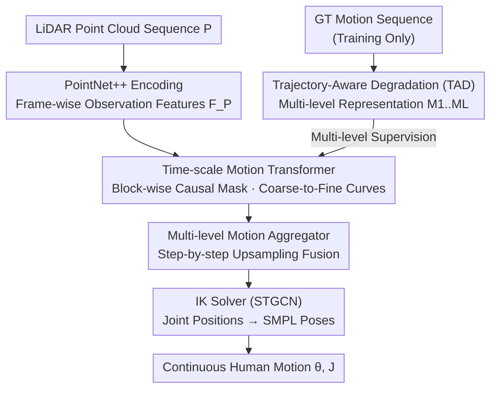

# Bezier Degradation Modeling for LiDAR-based Human Motion Capture

**Conference**: CVPR 2026  
**Paper**: [CVF Open Access](https://openaccess.thecvf.com/content/CVPR2026/html/An_Bezier_Degradation_Modeling_for_LiDAR-based_Human_Motion_Capture_CVPR_2026_paper.html)  
**Code**: None  
**Area**: 3D Human Understanding / LiDAR Motion Capture  
**Keywords**: LiDAR Motion Capture, Bezier Curve, Motion Representation, Coarse-to-Fine Reconstruction, Anti-occlusion

## TL;DR
To address the issues of prediction jitter or failure in motion capture due to sparse LiDAR point clouds and severe occlusions, this paper proposes BMLiCap. It first represents human motion as a multi-level structure of "coarse trend + detail control points" using compressible Bezier curves, and then employs a Time-scale Motion Transformer to reconstruct motion curves across different time scales in a coarse-to-fine manner within a single forward pass, setting new state-of-the-art benchmarks for both accuracy (MPJPE) and temporal continuity (acceleration error) across four LiDAR motion capture datasets.

## Background & Motivation
**Background**: 3D human motion capture aims to recover time-varying human poses from sensor data. Traditional solutions rely on markers or wearable IMU devices, which offer high accuracy but require expensive equipment. Later, RGB/RGB-D schemes emerged as cheaper alternatives, but they are limited by lighting and lack absolute depth, restricting them mostly to indoor usage. The demand for large-scale, open-scene human understanding in autonomous driving and robotics has made LiDAR-based motion capture a promising direction, as it is robust to lighting and provides reliable global depth.

**Limitations of Prior Work**: Single-view LiDAR can only capture sparse depth, making it extremely sensitive to occlusion and noise. The representative method, LiveHPS, treats SMPL vertex features as teacher signals to process partial point cloud observations. LiveHPS++ adds velocity prediction to suppress noise. However, they still struggle when key joints are occluded for extended periods, resulting in jittery and biased predictions.

**Key Challenge**: These methods essentially learn motion priors directly from "incomplete point cloud features"—they rely on the motion patterns embedded within specific point cloud structures. Once input frames are missing or occluded, the features themselves are corrupted, rendering them unrecoverable no matter how well the model learns. In other words, they couple "motion" too tightly with "observation".

**Goal**: To reconstruct continuous and accurate human motion even when LiDAR observations are unstable (sparse, occluded, or noisy), the key is to have a motion representation that remains robust even when observations are interrupted.

**Key Insight**: The authors adopt a kinematics-driven approach—instead of directly learning point cloud features, they model human motion itself using Bezier curves. This parameterization explicitly exposes position, velocity, and acceleration, allowing for smooth and stable interpolation even during long occlusions. The authors back this intuition with experimental observations (Fig. 2): even when control points are aggressively pruned (retaining only 12% to 25%), the global trend of the motion is preserved, and the JPE error remains very small. This perfectly aligns with the natural hierarchy of human motion—a sequence of actions like "raising the leg, stepping, landing, and pushing off" can be roughly summarized as "walking from A to B".

**Core Idea**: Replace "directly learning point cloud features" with a "hierarchically degradable" representation based on Bezier curves. The coarse level captures motion intent, while additional control points refine the details. A coarse-to-fine reconstruction process (which is exactly the reverse of "pruning control points") is designed to let the coarse trend fill in "observational gaps" caused by occlusions.

## Method

### Overall Architecture
BMLiCap is a coarse-to-fine framework consisting of two main modules: during training, the **(a) Hierarchical Bezier Motion Degradation Module** processes ground-truth motion sequences into multi-scale motion representations (this part runs only during training); the **(b) Progressive Motion Reconstruction Module**, shared during both training and inference, uses LiDAR point cloud features as conditions to reconstruct motion curves at each scale from coarse to fine and aggregates them into the final fine-grained motion.

The input is a sequence of $T$ frames of LiDAR point clouds $P=\{P_t\in\mathbb{R}^{N\times3}\}$, and the output is the corresponding 3D human motion $M=\{\theta_t, J_t\}$ (where $\theta_t$ represents the standard SMPL pose parameters and $J_t$ represents joint positions). The pipeline is as follows: point clouds are encoded by PointNet++ to obtain frame-wise observation features $F_P$; concurrently, the ground-truth motion is processed via Bezier degradation to obtain a coarse-to-fine multi-level representation $\{M_1,\dots,M_L\}$, which serves as the supervision target; the Time-scale Motion Transformer (TMT) takes $F_P$ along with the motion tokens of each level and predicts the motion curves of each scale in a single forward pass; the Multi-level Motion Aggregator (MMA) merges these multi-scale curves top-down level by level, taking the position component of the finest level as the joint predictions; finally, a Spatio-Temporal Graph Convolutional Network (STGCN)-based Inverse Kinematics (IK) solver converts joint positions into SMPL pose parameters.

### Key Designs

**1. Bezier Curve Motion Representation + Trajectory-Aware Degradation (TAD): Compressing Motion into a Learnable, Supervised Coarse-to-Fine Hierarchy**

Methods that directly learn point cloud features fail under occlusion because they lack a motion prior capable of "holding up" even when frames are lost. The proposed method first fits the original trajectory $J^{(k)}\in\mathbb{R}^{T\times3}$ of each joint $k$ using cubic Bezier curves. By treating the positions at each frame as anchor points, it constructs $T-1$ cubic curve segments and enforces $C^1$ continuity at the control points:

$$\mathcal{B}_t^{(k)}(u)=(1-u)^3 J_t^{(k)}+3(1-u)^2 u\,C_{t,2}^{(k)}+3(1-u)u^2 C_{t+1,1}^{(k)}+u^3 J_{t+1}^{(k)}$$

By setting the initial acceleration to 0, the control points can be solved using the Thomas algorithm, yielding the finest-grained Bezier chain.

The key innovation lies in **Trajectory-Aware Degradation (TAD)**: given a downsampling stride $s$, the trajectory length is reduced to $M_s=\lceil T/s\rceil$. New anchor points $\tilde J_i^{(k)}=J_{t_i}^{(k)}$ are uniformly sampled, and unit tangent vectors $\hat d_i^{(k)}$ are extracted at these anchors from the finest curve. The new control points are defined along the tangent as $\tilde C_{i,1}^{(k)}=\tilde J_i^{(k)}-\ell_{i,1}\hat d_i^{(k)}$ and $\tilde C_{i,2}^{(k)}=\tilde J_i^{(k)}+\ell_{i,2}\hat d_i^{(k)}$. The core essence here is: instead of merely resampling control point positions, the optimal arm lengths $\ell_i$ are solved via least squares (which has a closed-form solution) to make the degraded curve segments approximate the sampled points $Y_{i,m}^{(k)}$ on the original fine curve as closely as possible:

$$\min_{\{\ell_{i,2},\ell_{i+1,1}\}}\sum_m\|\tilde{\mathcal{B}}_i^{(k)}(u_{i,m})-Y_{i,m}^{(k)}\|_2^2$$

Using a set of strides $S=\{s_1,\dots,s_L\}$ (where $s_L=1$ preserves the finest details) yields a pyramid of coarse-to-fine motion representations $\{M_l\in\mathbb{R}^{M_{s_l}\times K\times9}\}$. Compared to linear interpolation (only $G^0$ continuous, discontinuous velocity), B-Spline/VAE (over-smoothing), and DCT frequency decomposition (which introduces phase lag and ringing under aggressive degradation), the $C^1$ continuous Bezier parameterization naturally suppresses velocity inflection points and acceleration spikes—explaining the dramatic reduction in acceleration errors.

**2. Time-scale Motion Transformer (TMT): Single Forward Pass + Block-wise Causal Mask for Coarse-to-Fine Information Flow**

Previous methods that iteratively regress motion step-by-step to refine accuracy and smoothness suffer from slow inference speed. TMT addresses this with an encoder-only, single-stage architecture. By treating the motion representation at each scale as an independent token sequence, and given the multi-level motion embeddings $\{E_l\}$ and LiDAR features $F_P$, a single forward pass jointly models their interactions to output reconstructed curves at all scales: $\{\hat M_l\}=\mathrm{MLP}(\mathrm{TMT}(F_P,\{E_l\}))$.

To ensure a "coarse-to-fine" flow rather than an unorganized mixture, a **block-wise causal mask** is applied to the self-attention layer. This constrains each motion token to only attend to tokens from coarser levels and point cloud feature tokens. Consequently, the coarse-level motion trends effectively guide the fine-level refinement, while all levels can query LiDAR visual cues. The authors' attention visualization (Fig. 9) supports this mechanism: in normal sequences, cross-level attention tends to diagonalize (looking only at concurrent or adjacent positions); in heavily occluded sequences, attention becomes scattered, and certain motion tokens are activated across multiple scales and time steps. This indicates they serve as "key frames" to assist in completion—i.e., occlusion triggers cross-level, bidirectional restoration.

**3. Multi-level Motion Aggregator (MMA): Step-by-step Upsampling Fusion to Aggregate Multi-Scale Cues into Fine Motion**

Once TMT predicts the multi-scale curves, they must be fused into the final fine-grained sequence. MMA uses a top-down reduction mechanism to integrate them level by level:

$$\hat M_{l+1}'=\mathrm{MLP}(\mathrm{Resample}(\hat M_l'),\,\hat M_{l+1}),\quad l=2,\dots,L-1$$

Here, $\mathrm{Resample}(\cdot)$ upsamples the coarser motion representation to match the length of the finer level using the predicted Bezier curve parameters, followed by an MLP to fuse the two. Notably, upsampling is not simple interpolation; it reconstructs continuous curves via Bezier parameterization before sampling. This ensures that the coarse trends remain smooth when integrated into finer levels. Finally, the position component of the finest fused result $\hat M_L'$ is taken as the joint position predictions $\{\hat J_t\}$. This step is where "filling in occlusion gaps with coarse trends" is physically realized: when some fine-level frames lack reliable observations, the coarser trends provide a reasonable motion prior via Resample.

### Loss & Training
Supervision comprises three parts. First, the motion reconstruction uses multi-level Frobenius norm supervision on the predicted curves: $\mathcal{L}_M=\sum_{l=1}^L \frac{1}{M_{s_l}}\|\hat M_l-M_l\|_F^2$. On the IK solver side, pose parameter loss $\mathcal{L}_\theta=\frac{1}{KT}\sum_t\|\theta_t-\hat\theta_t\|_F^2$ and forward kinematics loss $\mathcal{L}_{FK}=\frac{1}{KT}\sum_t\|J_t-\hat J_{t;FK}\|_F^2$ (where $\hat J_{t;FK}=\mathrm{SMPL}(\hat\theta_t,\beta)$) are adopted. The total loss is $\mathcal{L}=\lambda_M\mathcal{L}_M+\lambda_\theta\mathcal{L}_\theta+\lambda_{FK}\mathcal{L}_{FK}$, with weights set as $\lambda_M=0.5$, $\lambda_\theta=\lambda_{FK}=1.0$. TMT is implemented as a standard 12-layer, 512-dimension, 16-head Transformer encoder; PointNet++ is pre-trained on synthetic human instances; optimized via AdamW with a learning rate of $2.5\times10^{-4}$ for 50 epochs on 4×RTX 4090s.

## Key Experimental Results

### Main Results
Evaluations are conducted on four mainstream LiDAR motion capture benchmarks (LiDARHuman26M, FreeMotion, NoiseMotion, SLOPER4D) using three metrics: MPJPE/JPE (Joint Position Error, mm), MPVPE/VPE (Vertex Position Error, mm), and Accel Err/AE (Acceleration Error, cm/s², measuring temporal continuity). `†` denotes the 32-frame variant.

| Dataset | Metric | Ours (Default) | Ours† | Prev. SOTA |
|--------|------|-----------|-------|----------------------|
| LiDARHuman26M | JPE↓ | 70.1 | **66.8** | 71.9 (LiveHPS) |
| FreeMotion | JPE↓ | 49.6 | **47.2** | 61.9 |
| FreeMotion | AE↓ | 27.1 | **22.5** | 54.2 |
| NoiseMotion | JPE↓ | **34.0** | 36.9 | 34.0 |
| SLOPER4D | JPE↓ | 39.7 | **36.5** | 42.7 |
| SLOPER4D | AE↓ | 22.3 | **13.6** | 43.4 |

On the most challenging FreeMotion dataset, BMLiCap† achieves improvements of 14.7 mm MPJPE, 16.3 mm MPVPE, and 31.7 cm/s² Accel Err over LiveHPS++. On NoiseMotion, the shorter window variant performs better; the authors attribute this to the frequent viewpoint jumps in this dataset, where a longer time window aggregates more corrupted/slightly misaligned position annotations to which JPE/VPE metrics are highly sensitive.

Motion representation comparison (LiDARHuman26M, validating the standalone value of the representation):

| Representation Method | MPJPE | MPVPE | Accel Err |
|----------|-------|-------|-----------|
| Frequency-DCT | 76.4 | 97.8 | 35.4 |
| VAE-smooth | 78.2 | 100.1 | 36.8 |
| Linear | 75.7 | 96.3 | 35.5 |
| B-Spline | 70.5 | 90.4 | 30.0 |
| **Bézier+TAD (Ours)** | **66.8** | **85.4** | **28.8** |

### Ablation Study

| Configuration | MPJPE | Accel Err | Explanation |
|------|-------|-----------|------|
| L=1 {32} | 68.0 | 28.9 | Single-level |
| L=3 {32,16,8} | 67.9 | 28.9 | Three-level without TAD |
| L=3 {32,16,8} +TAD | **66.8** | 28.8 | Optimal configuration |
| L=4 {32,16,8,4} +TAD | 67.3 | 28.8 | Too many levels degrades performance |

Component ablation (baseline = [34] replacing GRU with Transformer to exclude architectural advantages):

| Configuration | MPJPE | Accel Err |
|------|-------|-----------|
| Base ([34] w/ transformer) | 79.0 | 42.6 |
| + Bézier & TAD (Repr.) | 72.3 | 30.7 |
| + Tokens & Mask (Arch.) | 72.2 | 30.7 |
| + m.s. + m.l. + b.m. | 68.9 | 29.4 |
| Full (+ MMA) | **66.8** | **28.8** |

### Key Findings
- **Bezier representation itself contributes the most**: Adding only the Bézier+TAD representation reduces MPJPE from 79.0 to 72.3 and Accel Err from 42.6 to 30.7 (the most significant drop is in acceleration error), proving that "changing the representation" is more critical than "changing the architecture".
- **More levels is not always better**: The L=3 schedule of {32,16,8} is optimal; L=4 degrades performance, showing that the temporal resolution at each stage must be balanced. TAD consistently brings gains across all level choices (+1.1 MPJPE improvement when L=3).
- **Robust to frame loss**: Randomly dropping up to 50% of point cloud frames during inference (where dropped frames are filled with 90% meaningless placeholders) maintains stable performance, validating that the coarse trends effectively restore gaps in observation.
- **Block-wise mask triggers cross-level restoration**: Attention maps reveal that cross-level bidirectional interactions are activated under heavy occlusion, treating reliable frames as "key frames" to aid in completion.

## Highlights & Insights
- **"Degradation" is the neatest idea in this paper**: It unifies "training target construction" and "inference-time reconstruction" into a pair of mutually inverse processes—degradation removes control points, and reconstruction adds them from coarse to fine. The multi-level supervision signal is not an auxiliary hand-crafted loss but is naturally derived from the same Bezier curve, making it clean and self-consistent.
- **TAD adjusts arm lengths instead of just moving anchors**: Many downsampling methods lose dynamic information. TAD solves for the optimal tangent arm length via closed-form least squares to mimic the original curve, effectively "retaining" velocity profiles at low resolutions. This is the direct reason why it outperforms linear/B-Spline methods.
- **Replacing iterative refinement with a single forward pass**: By moving the "progressive refinement" concept into the block-wise causal mask of a Transformer, it retains the hierarchical guidance of the coarse-to-fine scheme while avoiding slow sequential iterative inference. This idea of encoding a process into an attention structure is highly transferable to other tasks requiring coarse-to-fine generation/reconstruction.
- **Kinematics-driven rather than data-driven**: The core assumption is that "motion itself contains a low-dimensional smooth structure." Consequently, when occlusions occur, the model relies on the motion prior instead of the observation, explaining why it does not crash even when 50% of frames are lost.

## Limitations & Future Work
- Bezier curves may **over-smooth abrupt and non-smooth movements** (such as collisions, sudden changes, or high-frequency real-world movements). The paper focuses on resisting occlusion/noise and does not fully address whether "justified high-frequency jitters" are flattened.
- TAD solving for the optimal arm length relies on a closed-form least-squares solution, which assumes the degraded curve segment can approximate the original segment well. When the original motion exhibits sharp direction changes within a segment, the representation capacity of a single cubic curve is insufficient, leading to increased approximation error (the authors put the detailed derivation in the appendix but lack error analysis for this scenario in the main text).
- The level schedule $S$ is a hand-tuned hyperparameter (the optimal {32,16,8} comes from grid search). It may need retuning for different datasets/framerates, lacking an adaptive level selection mechanism.
- The performance drop on long windows in NoiseMotion reveals sensitivity to annotation alignment and viewpoint jumps, indicating that the selection of time window length is currently empirical.
- Future work can extend this to richer skeletal topologies, multi-modal sensor fusion, and broader application scenarios.

## Related Work & Insights
- **vs LiveHPS / LiveHPS++**: These methods rely on point-cloud spatio-temporal consistency priors + velocity prediction to counter noise, which essentially still learns motion from point-cloud features. In contrast, this paper models a Bezier hierarchical prior directly on the motion itself, relying on the prior rather than observations during occlusions. This makes it much more stable under long-term key joint occlusions (reducing FreeMotion AE from 54.2 to 22.5).
- **vs Frequency Decomposition / Residual Multi-Stage Representations (DCT, VQ-VAE like)**: In these methods, the signals at each stage are orthogonal, making errors in early stages hard to correct subsequently. Bezier quadratic/cubic curves are easy to adjust and correct (inspired by motion inbetweening works), and their $C^1$ continuity prevents the phase lag and ringing artifacts seen in DCT.
- **vs Iterative Progressive Regression [40,45]**: While they share the coarse-to-fine spirit, they require iterative inference, which is slow. This paper uses block-wise causal masks to implement equivalent hierarchical guidance in a single forward pass.
- **vs LiDARCap [34]**: The first LiDAR motion capture baseline used an STGCN-based inverse kinetics solver, but was constrained to ideal capture environments. This work inherits its IK solver setup but replaces the front-end with Bezier multi-scale reconstruction, expanding applicability to complex outdoor occlusion scenarios.

## Rating
- Novelty: ⭐⭐⭐⭐⭐ Unifying motion representation and coarse-to-fine reconstruction as mutually inverse processes via "degradable Bezier curves" is both novel and highly coherent.
- Experimental Thoroughness: ⭐⭐⭐⭐ Solid evaluation across four benchmarks, representation comparisons, component/level ablations, frame-drop robustness, and attention visualizations; however, few custom metrics and no reproducible code is released yet.
- Writing Quality: ⭐⭐⭐⭐ Clear chain of logic from motivation to observations to methods, with rich diagrams; some degradation derivations are relegated to the appendix.
- Value: ⭐⭐⭐⭐ Provides a highly portable "representation-as-prior" paradigm for robust motion capture under occlusions and noise.

<!-- RELATED:START -->

## Related Papers

- [\[CVPR 2026\] FlashCap: Millisecond-Accurate Human Motion Capture via Flashing LEDs and Event-Based Vision](flashcap_millisecond-accurate_human_motion_capture_via_flashing_leds_and_event-b.md)
- [\[CVPR 2026\] Neuro-Cognitive Reward Modeling for Human-Centered Autonomous Vehicle Control](neuro-cognitive_reward_modeling_for_human-centered_autonomous_vehicle_control.md)
- [\[CVPR 2026\] U4D: Uncertainty-Aware 4D World Modeling from LiDAR Sequences](u4d_uncertainty-aware_4d_world_modeling_from_lidar_sequences.md)
- [\[ECCV 2024\] LiveHPS++: Robust and Coherent Motion Capture in Dynamic Free Environment](../../ECCV2024/autonomous_driving/livehps_robust_and_coherent_motion_capture_in_dynamic_free_environment.md)
- [\[CVPR 2026\] EMDUL: Expanding mmWave Datasets for Human Pose Estimation with Unlabeled Data and LiDAR Datasets](expanding_mmwave_datasets_for_human_pose_estimation_with_unlabeled_data_and_lida.md)

<!-- RELATED:END -->
