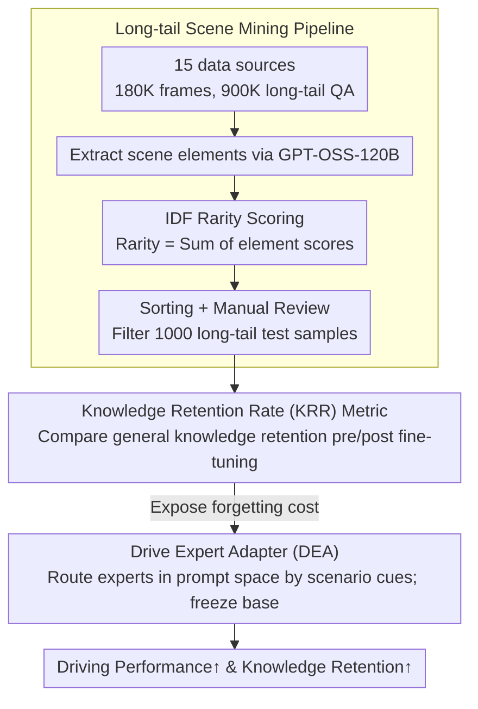

# The Blind Spot of Adaptation: Quantifying and Mitigating Forgetting in Fine-tuned Driving Models

**Conference**: CVPR 2026  
**arXiv**: [2604.04857](https://arxiv.org/abs/2604.04857)  
**Code**: [FidelityDrivingBench](https://github.com/FidelityDrivingBench)  
**Area**: LLM Security  
**Keywords**: catastrophic forgetting, VLM, autonomous driving, benchmark, expert adapter

## TL;DR

This paper systematically investigates the catastrophic forgetting issue when fine-tuning VLMs for autonomous driving. It constructs FidelityDrivingBench, a large-scale benchmark with $180\text{K}$ scenarios, and proposes the Drive Expert Adapter (DEA), which enhances driving task performance via prompt-space routing without corrupting base parameters.

## Background & Motivation

The application of VLMs in autonomous driving is increasing, but a fundamental paradox exists: the fine-tuning process used to adapt to driving data erodes pre-trained world knowledge, which is the core motivation for using VLMs. Catastrophic forgetting caused by fine-tuning leads models to ignore obstacles in long-tail scenarios (e.g., curbs, rocks), resulting in unsafe trajectories.

Existing benchmarks fail to detect such degradation because the training and test sets maintain similar distributions, masking true knowledge loss. This paper is the first to systematically investigate catastrophic forgetting in VLM-based autonomous driving and proposes a specialized benchmark to quantify the extent of forgetting.

## Method

### Overall Architecture

The paper first develops a metric to reveal "forgetting" and then introduces an adaptation method that does not damage base parameters. Specifically, it constructs FidelityDrivingBench ($180\text{K}$ scenarios, $900\text{K}$ long-tail QA pairs, $15$ data sources) to quantify catastrophic forgetting. The data pipeline utilizes GPT-OSS-120B to extract scene elements from linguistic annotations and automatically mines long-tail scenarios based on IDF rarity. Building on this, DEA is proposed to shift knowledge adaptation from weight space to prompt space, dynamically routing experts by scene cues while keeping base parameters frozen.

### Key Designs

**1. Long-tail Scene Mining Pipeline: Automatically mining scenarios that expose forgetting using IDF rarity**

Common benchmarks have similar distributions for training and test sets, which masks forgetting. The authors extract key scene elements (road conditions, traffic participants, etc.) from linguistic annotations and calculate an IDF (Inverse Document Frequency) rarity score for each element. The total rarity of a scene is the sum of its elements' scores. Based on this, $1000$ representative long-tail images are selected from $180\text{K}$ candidates as the forgetting test set. Rare scenarios (long-tail obstacles like curbs or rocks) are the most likely to be "forgotten" after fine-tuning; specifically targeting them reveals model degradation.

**2. Knowledge Retention Rate (KRR) Metric: Providing a standardized index for "how much is forgotten"**

Difficult scenarios alone are insufficient; a quantifiable metric is required. KRR quantifies the retention of non-driving general knowledge after fine-tuning. It compares the performance before and after fine-tuning on general capabilities, such as identifying long-tail obstacles (curbs, rocks), providing a standardized evaluation of the "forgetting cost" across different adaptation strategies.

**3. Drive Expert Adapter (DEA): Routing experts in prompt space to avoid weight corruption**

Full fine-tuning improves driving performance but causes severe forgetting because it modifies weights and overwrites pre-trained world knowledge. DEA shifts adaptation from weight space to prompt space: it dynamically routes to different driving experts based on scene-specific cues (visibility, traffic density) and prompt semantics, while keeping base parameters unchanged. This decouples driving adaptation from knowledge retention—achieving driving performance gains without corrupting base knowledge.

### Loss & Training

DEA only trains lightweight routing and prompt parameters. The authors compared full fine-tuning, frozen layers, and LoRA, finding that full fine-tuning results in the heaviest forgetting, while LoRA mitigates forgetting but yields insufficient driving performance and remains susceptible to task-induced attention bias—which justifies the DEA design of not modifying base weights.

## Key Experimental Results

### Main Results

| Method | Driving Performance | KRR | Note |
|------|-----------|-----|------|
| Full Fine-tuning | High | Low | Severe forgetting |
| LoRA | Medium | High | Insufficient performance |
| DEA (Ours) | High | High | Balanced performance |

FidelityDrivingBench covers $3$ core driving tasks (scene understanding, motion analysis, trajectory planning) across $15$ data sources (nuScenes, WOD-E2E, etc.), totaling $180\text{K}$ frames and $900\text{K}$ long-tail QA pairs. The long-tail test set consists of 1,000 representative images mined via IDF scores and manual review. KRR evaluates the retention of non-driving general knowledge (e.g., identifying curbs and rocks).

### Key Findings

- Training on multi-source data results in less forgetting and higher KRR compared to single-dataset training.
- Existing benchmarks focus excessively on QA volume while neglecting scene diversity.
- LoRA is insufficient to fully bridge the domain gap and is vulnerable to task-induced attention bias.
- DEA effectively decouples driving adaptation and knowledge retention by routing different knowledge experts at the prompt level.

## Highlights & Insights

- This study is the first to systematically reveal the forgetting issue in VLM fine-tuning for autonomous driving, which has significant safety implications.
- The IDF-based long-tail mining pipeline enables automated discovery of rare scenarios at scale.
- The prompt-space routing in DEA elegantly avoids forgetting induced by weight modification.

## Limitations & Future Work

- The DEA routing strategy relies on scene classification capabilities, which may be limited by classification accuracy.
- The forgetting test set contains only $1000$ images, covering a limited scope of scenario types.
- Visual analysis on RecogDrive + InternVL3-8B indicates that forgetting leads to overlooking long-tail obstacles such as curbs and rocks.
- The dynamic balancing mechanism between different expert routers has not yet been explored.
- Sensitivity analysis shows that single-source training causes more severe forgetting than multi-source training, even with equivalent data volume.

## Rating

- Novelty: ⭐⭐⭐⭐⭐ — First systematic study of forgetting in driving VLMs.
- Technical Depth: ⭐⭐⭐⭐ — Integrated benchmark, analysis, and methodology.
- Experimental Thoroughness: ⭐⭐⭐⭐⭐ — Large-scale verification with 180K scenarios.
- Value: ⭐⭐⭐⭐⭐ — Directly addresses autonomous driving safety.

<!-- RELATED:START -->

## Related Papers

- [\[CVPR 2026\] PanDA: Unsupervised Domain Adaptation for Multimodal 3D Panoptic Segmentation in Autonomous Driving](panda_unsupervised_domain_adaptation_for_multimodal_3d_panoptic_segmentation_in_.md)
- [\[CVPR 2026\] VGGDrive: Empowering Vision-Language Models with Cross-View Geometric Grounding for Autonomous Driving](vggdrive_empowering_vision-language_models_with_cross-view_geometric_grounding_f.md)
- [\[CVPR 2026\] Learning Vision-Language-Action World Models for Autonomous Driving](vla_world_learning_vision_language_action_world_models_for_autonomous_driving.md)
- [\[CVPR 2026\] WAM-Flow: Parallel Coarse-to-Fine Motion Planning via Discrete Flow Matching for Autonomous Driving](wam-flow_parallel_coarse-to-fine_motion_planning_via_discrete_flow_matching_for_.md)
- [\[CVPR 2026\] MAD: Motion Appearance Decoupling for Efficient Driving World Models](mad_motion_appearance_decoupling_for_efficient_driving_world_models.md)

<!-- RELATED:END -->
