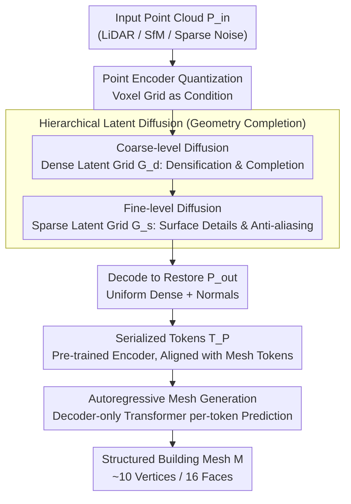

# BuildAnyPoint: 3D Building Structured Abstraction from Diverse Point Clouds

**Conference**: CVPR 2026  
**arXiv**: [2602.23645](https://arxiv.org/abs/2602.23645)  
**Code**: [Project Page](https://ai4city-hkust.github.io/BuildAnyPoint/)  
**Area**: Autonomous Driving / 3D Vision / Urban Reconstruction  
**Keywords**: Building Abstraction Reconstruction, Point Cloud Completion, Latent Diffusion, Autoregressive Mesh Generation, Cascaded Generation Framework  

## TL;DR

BuildAnyPoint is proposed to achieve unified reconstruction from diverse point cloud distributions (airborne LiDAR, SfM, sparse noisy points) to structured 3D building meshes using a **Loosely-coupled Cascaded Diffusion Transformer (Loca-DiT)**. The framework first restores the underlying point cloud distribution through hierarchical latent diffusion and subsequently generates compact polygonal meshes via an autoregressive Transformer.

## Background & Motivation

**Background**: Recovering lightweight 3D building models from urban point clouds is a critical requirement for applications such as digital twins, navigation, and disaster simulation. Existing methods include optimization-based (plane detection + assembly) and learning-based solutions, but they typically **only handle specific point cloud distributions**.

**Limitations of Prior Work**:
   - Point2Building: Pioneered direct autoregressive mesh generation from point clouds, but single-step autoregression often produces **geometric ambiguities** and mesh-to-point cloud misalignments.
   - ArcPro: Introduced building grammar as an intermediate representation to reduce ambiguity, but is limited by **predefined primitives** (e.g., column extrusion), cannot handle complex structures like slanted roofs, and assumes relatively complete local point clouds for each module.

**Key Challenge**: How to maintain **generalization** to arbitrary point cloud distributions while ensuring the **structural consistency and geometric accuracy** of the generated mesh? Directly inputting heterogeneous point clouds into autoregressive mesh generators yields poor results because these generators require high-quality, clean, and complete point clouds.

**Goal**: Construct the first **universal framework** to recover structured building abstraction meshes from point clouds of any distribution (LiDAR, SfM, extremely sparse/noisy).

**Key Insight**: Utilize **explicit 3D generative priors** to constrain the solution space. Instead of generating a mesh directly from heterogeneous point clouds, the framework first restores the underlying uniform dense point cloud distribution, then passes it to a high-quality mesh generator.

**Core Idea**: Loosely-coupled cascade = Hierarchical Latent Diffusion (Distribution Restoration) + Autoregressive Transformer (Mesh Generation). It progressively bridges the modality gap from unstructured point clouds to structured meshes through a series of latent space transformations.

## Method

### Overall Architecture

Loca-DiT (Figure 3) learns the conditional distribution $p_\text{BAP}(\mathcal{M} | \mathcal{P}_{in})$, decomposed into two stages:

1. **Geometry Completion Stage** (Latent Diffusion): $p(\mathcal{P}_{out} | \mathcal{P}_{in})$ — Restores uniform dense complete point clouds from sparse/noisy inputs.
2. **Structured Mesh Generation Stage** (Autoregressive Transformer): $p(\mathcal{M} | \mathcal{P}_{out})$ — Generates mesh token sequences autoregressively from the restored point clouds.

The pipeline bridges the point-cloud-to-mesh modality gap along "three levels of latent space": heterogeneous inputs are first restored to uniform dense point clouds via hierarchical latent diffusion, then serialized into tokens for the autoregressive Transformer to output structured meshes.

(The three latent representations $\mathcal{G}_d / \mathcal{G}_s / \mathcal{T}_P$ represent the "three-level latent space transformation," with hierarchical diffusion and autoregressive generation corresponding to the two stages respectively.)

### Key Designs

**1. Three-level Latent Space Transformation: Tailoring Representations for Point Cloud and Mesh Stages**

The failure of feeding heterogeneous point clouds directly into autoregressive mesh generators stems from representation mismatch. Geometric details of point clouds are naturally suited for continuous, dense latent spaces, while mesh topology requires discrete, serialized tokens for step-by-step generation. This paper utilizes three layers of latent space. The first layer is the **dense latent grid $\mathcal{G}_d$**: it applies a sparse VAE to low-resolution voxelized ground truth points. Crucially, it **densifies** the sparse grid at the bottleneck layer, allowing the decoder to perceive "unoccupied areas" and infer spatial context like a sculptor. The second layer is the **sparse latent grid $\mathcal{G}_s$**: it uses high-resolution voxelization and a sparse VAE specifically for geometric details. The third layer is the **serialized token $\mathcal{T}_P$**: a pre-trained point cloud encoder compresses the restored points into fixed-length tokens, deliberately aligned with the target mesh tokens $\mathcal{T}_M$. This allows the autoregressive stage to process "point cloud conditions" and "target mesh" within the same sequence.

**2. Hierarchical Latent Diffusion: Shape Restoration followed by Surface Refinement**

Given sparse and noisy input point clouds, denoising into clean geometry in one step is prone to divergence. The restoration is split into coarse and fine levels. Coarse-level diffusion $p_{\theta_d}(\mathcal{G}_d \mid \mathcal{P}_{in})$ denoises on the dense grid to establish the basic building shape. Fine-level diffusion $p_{\theta_s}(\mathcal{G}_s \mid \mathcal{G}_d)$ uses the coarse result as a condition to denoise on the high-resolution sparse grid for surface details. Both use standard denoising objectives:

$$\min_\theta \ \mathbb{E}\big[\|\epsilon - \epsilon_\theta(\mathbf{z}_t, t)\|_2^2\big]$$

The conditioning is achieved by quantizing $\mathcal{P}_{in}$ into voxel grids via a point encoder and concatenating them with latent features. This coarse-to-fine approach is more stable because once the structure is fixed, the fine-level search space is significantly constrained. Ablations show that removing $\mathcal{G}_d$ leads to chaotic points, while removing $\mathcal{G}_s$ causes "double-surface" effects that mislead mesh generation.

**3. Autoregressive Mesh Generation: Simulating "Artist-grade" Clean Inputs with Restored Points**

Existing autoregressive mesh generators (like MeshAnything) produce compact meshes but require "artist-grade" clean, dense, and complete input point clouds. Heterogeneous urban point clouds fall short of this. The previous stages synthesize this high-quality input using uniform dense points and normals. This stage employs a decoder-only Transformer based on MeshAnything V2, concatenating point tokens and generated mesh tokens into a sequence $\mathcal{T} = [\mathcal{T}_P; \mathcal{T}_M^{<t}]$ to predict the next mesh token by maximizing the conditional log-likelihood:

$$\max_\phi \ \sum_{t=1}^N \log P\big(t_m^t \mid \mathcal{T}_P, \mathcal{T}_M^{<t}; \phi\big)$$

By decoupling "distribution restoration" and "mesh generation," the mesh generator functions on clean conditions, ensuring structural consistency and geometric accuracy.

### A Complete Example

For a sparse point cloud $\mathcal{P}_{in}$ of a single building scanned by airborne LiDAR:

1. **Coarse Diffusion**: $\mathcal{P}_{in}$ is quantized into a voxel grid as a condition. Denoising on $\mathcal{G}_d$ performs densification at the bottleneck, inferring missing walls and roofs to output the basic building block.
2. **Fine Diffusion**: Conditioned on $\mathcal{G}_d$, the fine-level diffusion denoises on $\mathcal{G}_s$ to refine surface details like slanted roofs and corners, preventing "double-surfaces."
3. **Serialization**: The restored points $\mathcal{P}_{out}$ (with normals) are decoded and compressed into a token sequence $\mathcal{T}_P$.
4. **Autoregressive Generation**: The Transformer generates the mesh token-by-token conditioned on $\mathcal{T}_P$. The final structured mesh $\mathcal{M}$ represents the building with an average of only ~10 vertices and ~16 faces, with a 0% failure rate.

Crucially, the generator in step 4 never sees the original noisy sparse points $\mathcal{P}_{in}$; it only processes the synthesized "artist-grade" point clouds.

### Loss Function

- Sparse VAE: BCE (Generated vs. Target Occupancy) + KL Divergence + Normal Learning.
- Diffusion Model: Denoising MSE Loss.
- Transformer: Cross-entropy next-token prediction loss.

## Key Experimental Results

### Main Results: Building Structural Abstraction

| Method | #V↓ | #F↓ | #P↓ | FR↓ | CD↓ |
|------|-----|-----|-----|-----|-----|
| City3D (Optimization) | 173 | 72 | 14 | 6% | 0.167 |
| Point2Building (Learning) | 20 | 34 | 18 | 1% | 0.043 |
| **Ours** | **10** | **16** | **8** | **0%** | **0.036** |

- **Only 10 vertices** (vs. 20 for P2B) and 16 faces (vs. 34), resulting in more compact low-poly meshes.
- 0% failure rate and lowest Chamfer Distance (CD).

### Point Cloud Completion Benchmark

| Method | F-score↑ | CD↓ | Uniformity↓ | EMD↓ |
|------|----------|-----|-------------|------|
| PoinTr | 0.85 | 0.41 | 0.25 | 0.12 |
| AnchorFormer | 0.82 | 0.39 | 1.27 | 0.13 |
| **Ours** | **0.91** | **0.35** | **0.04** | **0.10** |

- Uniformity score of 0.04, **nearly an order of magnitude lower** than competing methods.

### Ablation Study

| Setting | #V↓ | #F↓ | CD↓ |
|------|-----|-----|-----|
| W/o 3D Generative Prior (Direct Gen from $\mathcal{P}_{in}$) | 78 | 127 | 0.107 |
| **Full Model** (Gen from $\mathcal{P}_{out}$) | **38** | **70** | **0.034** |

- **Key Finding**: Removing the generative prior worsens CD from 0.034 to 0.107 and face count jumps from 70 to 127.
- Removing coarse $\mathcal{G}_d$: Restored point cloud becomes chaotic.
- Removing fine $\mathcal{G}_s$: "Double-surface" effects mislead mesh generation.

## Highlights & Insights

1. **Effective Decoupling**: Instead of attempting single-step mesh generation from heterogeneous points, the task is split into "distribution restoration" and "mesh generation," utilizing the most suitable paradigm (Diffusion vs. Autoregressive) for each—a philosophy applicable to other cross-modality tasks.
2. **Clever Densification Bottleneck**: Densifying the sparse grid at the VAE bottleneck allows the decoder to perform shape reasoning by perceiving both "occupied" and "empty" regions.
3. **Intermediate SOTA**: The restored point cloud, though intended as an intermediate representation, achieves SOTA performance on building point cloud completion benchmarks.

## Limitations & Future Work

1. **Geometric Diversity**: Public building datasets favor simple geometry; complex structures (e.g., Gothic, irregular shapes) remain challenging.
2. **Missing Physical Priors**: Lack of utilization of height, gravity, symmetry, or geographic information (GIS).
3. **Inference Speed**: The cascaded sampling of diffusion and autoregressive decoding may be slow; no runtime reports provided.
4. **Generalization**: Tested primarily on The Hague/Rotterdam datasets; geographic generalization is unverified.

## Related Work & Insights

- **MeshAnything Series**: Paradigms for autoregressive mesh generation are evolving rapidly; this work proves the decisive impact of **input quality** on mesh quality.
- **XCube**: A 3D generation framework using hierarchical sparse VAE + Diffusion; this work builds upon it with conditioning and densification.
- **Loosely-coupled Cascade**: Breaking generation into independent sub-stages allows each stage to specialize, a strategy worth promoting in broader 3D generation tasks.

## Rating

⭐⭐⭐⭐ — Elegant framework design. The universality across three point cloud distributions is impressive, and the intermediate results are SOTA, though the application scenario is relatively vertical.

<!-- RELATED:START -->

## Related Papers

- [\[CVPR 2025\] WeatherGen: A Unified Diverse Weather Generator for LiDAR Point Clouds via Spider Mamba Diffusion](../../CVPR2025/autonomous_driving/weathergen_a_unified_diverse_weather_generator_for_lidar_point_clouds_via_spider.md)
- [\[CVPR 2026\] Points-to-3D: Structure-Aware 3D Generation with Point Cloud Priors](points-to-3d_structure-aware_3d_generation_with_point_cloud_priors.md)
- [\[AAAI 2026\] Understanding Dynamic Scenes in Egocentric 4D Point Clouds](../../AAAI2026/autonomous_driving/understanding_dynamic_scenes_in_ego_centric_4d_point_clouds.md)
- [\[CVPR 2025\] RENO: Real-Time Neural Compression for 3D LiDAR Point Clouds](../../CVPR2025/autonomous_driving/reno_real-time_neural_compression_for_3d_lidar_point_clouds.md)
- [\[ICCV 2025\] Robust 3D Object Detection using Probabilistic Point Clouds from Single-Photon LiDARs](../../ICCV2025/autonomous_driving/robust_3d_object_detection_using_probabilistic_point_clouds_from_single-photon_l.md)

<!-- RELATED:END -->
