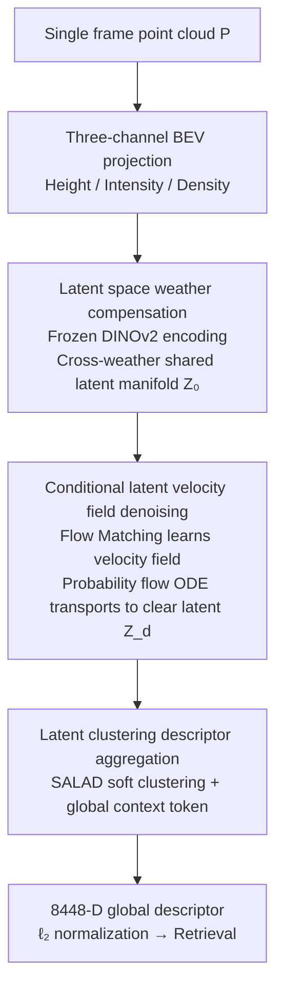

# C-LaV: Conditional Latent Velocity Field Denoising for Weather-Robust LiDAR Place Recognition

**Conference**: CVPR 2026  
**Paper**: [CVF Open Access](https://openaccess.thecvf.com/content/CVPR2026/html/Cao_C-LaV_Conditional_Latent_Velocity_Field_Denoising_for_Weather-Robust_LiDAR_Place_CVPR_2026_paper.html)  
**Code**: Not public (No link provided in the paper)  
**Area**: Autonomous Driving / LiDAR Place Recognition  
**Keywords**: LiDAR Place Recognition, Weather-Robust, Flow Matching, Latent Space Denoising, BEV Retrieval  

## TL;DR
C-LaV compensates for LiDAR degradation caused by rain, snow, and fog within the BEV latent space of a frozen DINOv2. By learning a velocity field via conditional Flow Matching and solving a probability flow ODE, it deterministically transports "weather-noisy latent representations" back to "clear-day latent representations." Using a SALAD clustering head for global descriptor retrieval, it achieves Recall@1 improvements of 17.5% on NCLT Snowy and 21.5% on real-world Boreas datasets.

## Background & Motivation

**Background**: LiDAR-based place recognition is a core component of city-level localization for autonomous driving. It involves encoding a single-frame scan into a compact global descriptor and retrieving the nearest location from a georeferenced map. Mainstream approaches have evolved from handcrafted geometric descriptors (post-PointNetVLAD) to end-to-end learned global representations, including routes like sparse convolutional voxels (MinkLoc3Dv2), BEV projection (BEVPlace++), and 2D conditional descriptors (ImLPR).

**Limitations of Prior Work**: In reality, rain, snow, and fog are common occurrences rather than anomalies. They simultaneously damage LiDAR geometry and intensity through distance-decay, volume scattering, and false returns. Consequently, the structural cues relied upon for place recognition become unreliable, making cross-weather generalization a long-standing challenge.

**Key Challenge**: The authors point out that existing methods almost exclusively "learn descriptors directly in feature spaces already contaminated by weather." Once weather alters the measurement distribution, the embedding space shifts accordingly. Furthermore, most remedial strategies remain at the **signal level** (filtering, enhancement, point cloud/voxel reconstruction), failing to intervene in the **latent space** where retrieval representations are actually formed. In raw point clouds and BEV maps, geometry, reflection, sparsity, and weather artifacts are entangled. Signal-level restoration may improve visual appearance but can still perturb structures critical for retrieval.

**Goal**: To shift the intervention layer for weather compensation—performing denoising directly within the more compact and retrieval-oriented BEV latent space following semantic encoding. The study aims to conduct a fair comparison between "no denoising / signal-level BEV denoising / latent space denoising" under the same encoder, descriptor head, and protocol.

**Key Insight**: Utilize a **conditional latent velocity field** to deterministically "transport" weather-noisy latent representations back to clear-day ones. By using the cross-weather shared manifold provided by a frozen DINOv2 as an anchor, Flow Matching is used to learn a velocity field, and a probability flow ODE is solved for denoising. This process avoids reconstructing BEV maps or point clouds, focusing solely on moving retrieval-relevant structures back to the clean manifold.

## Method

### Overall Architecture
C-LaV addresses the problem of generating retrieval descriptors for adverse weather LiDAR frames that are consistent with clear-day frames without reconstructing geometry. It decomposes "point cloud → descriptor" into a composition of four modules $D = \Omega(P),\ \Omega = h \circ \psi \circ E \circ \phi$, corresponding to three sequential stages: First, projecting the point cloud into a three-channel BEV map (height/intensity/density) and encoding it into a cross-weather shared semantic latent grid via a **frozen** DINOv2 (Stage 1). Next, performing denoising on this latent manifold using a Flow-Matching trained conditional DiT to transport noisy latents back to clear ones (Stage 2). Finally, aggregating the denoised latent tokens into an 8448-D global descriptor using a SALAD clustering head (Stage 3), followed by $\ell_2$ normalization for retrieval.

Crucially, denoising occurs only in the latent space and does not change spatial resolution (latent grid fixed at $768\times32\times32$, i.e., 1024 tokens). Both training and inference are performed on the "ODE-denoised latent representation," ensuring the same representation is used for learning descriptors and retrieval.

### Key Designs

**1. Latent Space Weather Compensation: Moving denoising from the signal layer to a frozen semantic manifold**

This design directly addresses the root cause: "learning descriptors in contaminated feature spaces." C-LaV uses a BEV projection operator $\phi$ to discretize the point set into a $448\times448\times3$ grid $I=\phi(P)$, where channels represent normalized max height, mean intensity, and normalized point count per cell. A **frozen** DINOv2-Base (ViT/14) encoder $E$ patches the BEV into $14\times14$ patches, projects them to 768-D, and processes them through 12 ViT layers. Removing the class token and reshaping yields the latent grid $Z_0 = E(I) \in \mathbb{R}^{768\times32\times32}$.

Why "frozen" and "post-encoding"? Using frozen parameters ensures $Z_0$ resides on a **fixed, semantically meaningful manifold shared across all weather conditions**. Clear and adverse weather frames are mapped to the same coordinate system; weather degradation then manifests as a modelable offset on this manifold rather than a shifting embedding space. Compared to signal-level repair in raw BEV/point clouds where geometry and artifacts are entangled, the latent space is more compact and retrieval-focused, allowing denoising to concentrate on "retrieval-relevant structures."

**2. Conditional Latent Velocity Field Denoising: Transporting noisy latents to clear ones via Flow Matching + Probability Flow ODE**

The core mechanism for deterministically eliminating weather degradation in latent space. Given a noisy BEV and its clear-day pair, the frozen encoder produces $Z_{noisy}=E(X_{noisy})$ and $Z_{clean}=E(X_{clean})$. The goal is to obtain $Z_d \approx Z_{clean}$ conditioned on $Z_{noisy}$. Following conditional Flow Matching, auxiliary pairs $z_0 \sim \mathcal{N}(0,I)$ and $z_1=Z_{clean}$ are introduced, defining a linear interpolation path:

$$z_t = (1-(1-\sigma_{min})t)\,z_0 + t\,z_1,\quad t\in[0,1]$$

The time derivative is the ground-truth velocity $v_t(z_t|z_1) = z_1 - (1-\sigma_{min})z_0$ (constant over $t$ for fixed $(z_0,z_1)$). A DiT backbone parameterizes the conditional velocity field $\hat{v}_t = F_\theta(z_t, t, Z_{noisy})$, using the noisy latent as a condition. The training objective is the mean squared error between predicted and ground-truth velocities:

$$\mathcal{L}_{CFM} = \mathbb{E}_{z_0,z_1,t}\big[\,\|F_\theta(z_t,t,Z_{noisy}) - v_t(z_t|z_1)\|_2^2\,\big]$$

Once trained, denoising is formulated as solving a deterministic ODE $\frac{dz_t}{dt} = F_\theta(z_t,t,Z_{noisy})$. Starting from $z_0\sim\mathcal{N}(0,I)$ and integrating from $t{=}0$ to $t{=}1$ under fixed condition $Z_{noisy}$, Gaussian samples are transported to the denoised latent $Z_d = z_1 \approx Z_{clean}$. Explicit solvers like Euler or Heun are used for a few iterations $z_{t_{k+1}} = z_{t_k} + \Delta t\, F_\theta(z_{t_k}, t_k, Z_{noisy})$, with the paper using $T\approx 50$ steps to balance accuracy and efficiency.

The advantage is that the denoising is **deterministic and condition-guided** (probability flow ODE rather than stochastic sampling) and **does not reconstruct BEV maps or point clouds**, decoupling robustness from explicit geometric reconstruction. Ablations compare this to replacing the denoiser with DDPM, showing that learning a conditional velocity field is superior for retrieval.

**3. Latent Clustering Descriptor Aggregation: SALAD soft clustering for retrieval-ready descriptors**

After denoising yields the clean latent grid $Z_d$, it must be aggregated into a fixed-length global descriptor. This is performed by the SALAD (Sinkhorn Aggregation of Local Descriptors) soft clustering head. $Z_d$ is flattened into $N_\ell=32\times32$ spatial tokens $\{f_i\}$, each linearly projected to $d_c=128$. For $K=64$ learnable cluster prototypes $\{w_k\}$, a soft assignment is computed: $a_{ik} = \frac{\exp(f_i^\top w_k/\tau_a)}{\sum_{k'}\exp(f_i^\top w_{k'}/\tau_a)}$. Cluster descriptors are weighted averages of token features $u_k = \sum_i a_{ik} f_i$. Simultaneously, a global context token $g$ attends to all spatial tokens to yield $g_{att}=\text{Attn}(g,\{f_i\})$. The final descriptor concatenates the context and all cluster descriptors:

$$D = [g_{att};\, u_1;\, \dots;\, u_K] \in \mathbb{R}^{256 + K\cdot 128} = \mathbb{R}^{8448}$$

Followed by $\ell_2$ normalization for retrieval. This approach encodes both **scene-level context** (global token) and **local structure** (cluster descriptors), maintaining discriminative power under strong appearance shift when combined with truncated Smooth-AP loss.

### Loss & Training
Training jointly optimizes the "latent space denoising loss" and the "retrieval-oriented ranking loss." Denoising employs a sparsity-aware Flow Matching loss $\mathcal{L}_{denoise} = \mathbb{E}_{x,t,p(z_0),q(z_1)}\, w(x)\,\|\hat{v}_t - v_t\|_2^2$, where $w(x)$ up-weights foreground cells (occupied/high return) and down-weights background to mitigate LiDAR sparsity. Retrieval uses truncated Smooth-AP $\mathcal{L}_{TSAP} = 1 - \frac{1}{B}\sum_i AP_i$, utilizing a logistic function to rank cosine similarities $S_{ij}=d_i^\top d_j$, keeping only the top-$K_{pos}$ positive samples per query to stabilize gradients (positives < 10m, negatives > 50m under GPS supervision). The total loss is:

$$\mathcal{L} = \mathcal{L}_{denoise} + \lambda_{desc}\mathcal{L}_{TSAP} + \lambda_{lat}\,\|Z_{noisy} - Z_{clean}\|_2^2$$

The latent consistency constraint is optional (default $\lambda_{lat}=0$). Refer to the original paper and supplements for exact values of $\sigma_{min}$, $\lambda_{desc}$, $\tau_a$, etc.

## Key Experimental Results

Benchmarks were constructed from KITTI, NCLT, and Boreas. Datasets were resampled at 3m intervals to reduce near-duplicate views. Positives are within 10m, negatives beyond 50m. Frames were projected to $448\times448$ three-channel BEV. KITTI and NCLT used physics-based models for synthetic rain/snow/fog; Boreas provides real adverse weather, where proxy pairs were created using GPS-aligned cross-run frames.

### Main Results
Recall@1 / Recall@5 (%) across three datasets (Boreas has no fog data):

| Method | KITTI Rain | KITTI Fog | KITTI Snow | NCLT Snow | Boreas Rain | Boreas Snow | Avg R@1/R@5 |
|------|----------|----------|----------|---------|-----------|-----------|--------------|
| MinkLoc3D v2 | 46.16/65.15 | **67.07**/87.78 | 69.28/88.37 | 30.81/51.62 | 65.52/86.32 | 32.47/57.68 | 48.99/71.95 |
| BEVPlace++ | 41.31/61.72 | 56.46/78.18 | 68.81/83.60 | 42.60/63.00 | 56.38/84.21 | 52.37/81.21 | 54.37/82.71 |
| ImLPR | 43.36/65.65 | 59.62/89.13 | 72.28/90.31 | 44.14/66.28 | 58.26/86.29 | 47.63/81.98 | 52.94/84.14 |
| ResLPR | 23.52/32.50 | 27.22/39.68 | 56.32/75.63 | 31.26/53.68 | 39.65/74.26 | 35.13/60.02 | 37.39/67.14 |
| **Ours (C-LaV)** | **46.97/67.88** | 62.73/85.45 | **77.60/95.23** | **46.41/69.11** | **79.66/98.31** | **71.98/94.83** | **75.82/96.57** |

Snowy conditions saw the most significant gains (KITTI Snow R@1 77.60%, +5.3 over ImLPR). On real Boreas, it raised the R@1 of the best baseline to 75.82% and R@5 to 96.57%, leading by 15-20 points in rain/snow. Performance in fog was less dominant (lower than MinkLoc3D v2), likely because fog distorts depth and collapses distant structures in BEV, whereas voxel methods better preserve height-aware cues.

### Ablation Study
Stepwise replacement of BEV Encoder / Latent Denoiser / Descriptor Head (Averaged across KITTI / NCLT weathers):

| Configuration | BEV Encoder | Latent Denoise | Descriptor Head | KITTI R@1/R@5 | NCLT R@1/R@5 |
|------|-----------|--------|----------|---------------|--------------|
| C-LaV-1 | DINOv2-S | DDPM | NetVLAD | 11.17/25.75 | 5.40/17.61 |
| C-LaV-2 | DINOv2-B | DDPM | NetVLAD | 30.45/51.20 | 16.80/38.55 |
| C-LaV-3 | DINOv2-B | Vel. Field+ODE | NetVLAD | 50.15/71.90 | 27.35/53.80 |
| **Ours (Full)** | DINOv2-B | Vel. Field+ODE | Latent Cluster | **62.83/82.75** | **34.52/60.16** |

### Key Findings
- **All three components contribute significantly and are indispensable**: Switching metadata from S to B encoder nearly tripled KITTI R@1 (11.17% to 30.45%), indicating strong BEV semantics are a prerequisite for cross-weather retrieval. Replacing DDPM with Velocity Field + ODE raised KITTI R@1 to 50.15%. Finally, the Latent Clustering head boosted KITTI R@1 to 62.83% and NCLT to 34.52%.
- **The comparison of intervention layers** is highly convincing: Using the same frozen DINOv2 and SALAD head, no denoising yielded 29.32% R@1 on KITTI. Signal-level BEV U-Net denoising reached 37.00%, while latent space Flow Matching reached 62.84%—quantifying that "Latent Space Denoising ≫ Signal Space Denoising."
- **Scene Variance**: Higher recall was observed on real Boreas data (Snow R@1 71.98%) because real-world weather was milder and scans denser, leaving enough clean signal to guide ODE denoising. Fog remains a relative weakness.

## Highlights & Insights
- **The shift in the intervention layer** is the true "aha moment": By moving weather compensation from the signal layer to a frozen semantic latent manifold and using a controlled comparison (29.32% → 37.00% → 62.84%), the value of this design choice is proven more convincingly than mere leaderboard climbing.
- **Deterministic denoising via Flow Matching + Probability Flow ODE** avoids stochastic sampling and geometric reconstruction, decoupling robustness from explicit reconstruction. This "denoise-then-retrieve in latent space" paradigm is modality-agnostic and could be extended to camera inputs.
- **Train-Inference Consistency**: Learning descriptors and conducting retrieval consistently on ODE-denoised latent representations avoids the "train-on-clean, test-on-noisy" representation mismatch.

## Limitations & Future Work
- The benchmark only covers rain, fog, and snow; extreme phenomena, long-term environmental changes, and heterogeneous sensor configurations are unexplored.
- The latent Flow-Matching DiT with ODE denoising ($T\approx50$ steps) has higher computational and inference costs compared to feedforward baselines.
- Reliance on proxy noisy/clean BEV pairs (e.g., GPS-aligned runs in Boreas) limits supervision fidelity if pairs are not perfectly aligned in structure or perspective.
- Self-observation: The weakness in fog suggests limited compensation for "depth-collapse" degradation; the reliance on clear-day pairs also raises concerns regarding scalability to unpaired real scenarios.

## Related Work & Insights
- **vs MinkLoc3D v2 / BEVPlace++ / ImLPR**: These methods learn descriptors in contaminated feature spaces; C-LaV transports noisy representations back to clear ones in a frozen semantic space before retrieval. It significantly leads in rain/snow, trailing only voxel methods in fog.
- **vs Signal-Level Denoising**: Methods focused on point/voxel/image level noise suppression often fail to preserve retrieval semantics. C-LaV's latent space approach (62.84% R@1) outperforms signal space compensation (37.00% R@1).
- **vs DDPM-based Latent Denoising**: Ablations show that deterministic velocity field learning + ODE sampling is better suited for retrieval than reconstruction-oriented DDPM denoising.

## Rating
- Novelty: ⭐⭐⭐⭐⭐ First application of conditional Flow Matching + ODE denoising for LiDAR latent space weather compensation.
- Experimental Thoroughness: ⭐⭐⭐⭐ Extensive datasets, three axes of ablation, and intervention layer comparisons, though lacking code and hyperparameter sensitivity studies.
- Writing Quality: ⭐⭐⭐⭐⭐ Clear motivation and methodological formulation with excellent figure-text alignment.
- Value: ⭐⭐⭐⭐ Significant boost for real adverse weather retrieval with a modality-agnostic paradigm, though ODE inference cost is a hurdle for deployment.

<!-- RELATED:START -->

## Related Papers

- [\[CVPR 2026\] Hybrid Robust Collaborative Perception with LiDAR-4D Radar Fusion under Adverse Weather Conditions](hybrid_robust_collaborative_perception_with_lidar-4d_radar_fusion_under_adverse_.md)
- [\[CVPR 2026\] Structure-to-Intensity Diffusion for Adverse-Weather LiDAR Generation](structure-to-intensity_diffusion_for_adverse-weather_lidar_generation.md)
- [\[CVPR 2026\] Learning Geometric and Photometric Features from Panoramic LiDAR Scans for Outdoor Place Categorization](learning_geometric_and_photometric_features_from_p.md)
- [\[CVPR 2026\] RaUF: Learning the Spatial Uncertainty Field of Radar](rauf_learning_the_spatial_uncertainty_field_of_radar.md)
- [\[CVPR 2025\] ForestLPR: LiDAR Place Recognition in Forests Attentioning Multiple BEV Density Images](../../CVPR2025/autonomous_driving/forestlpr_lidar_place_recognition_in_forests_attentioning_multiple_bev_density_i.md)

<!-- RELATED:END -->
