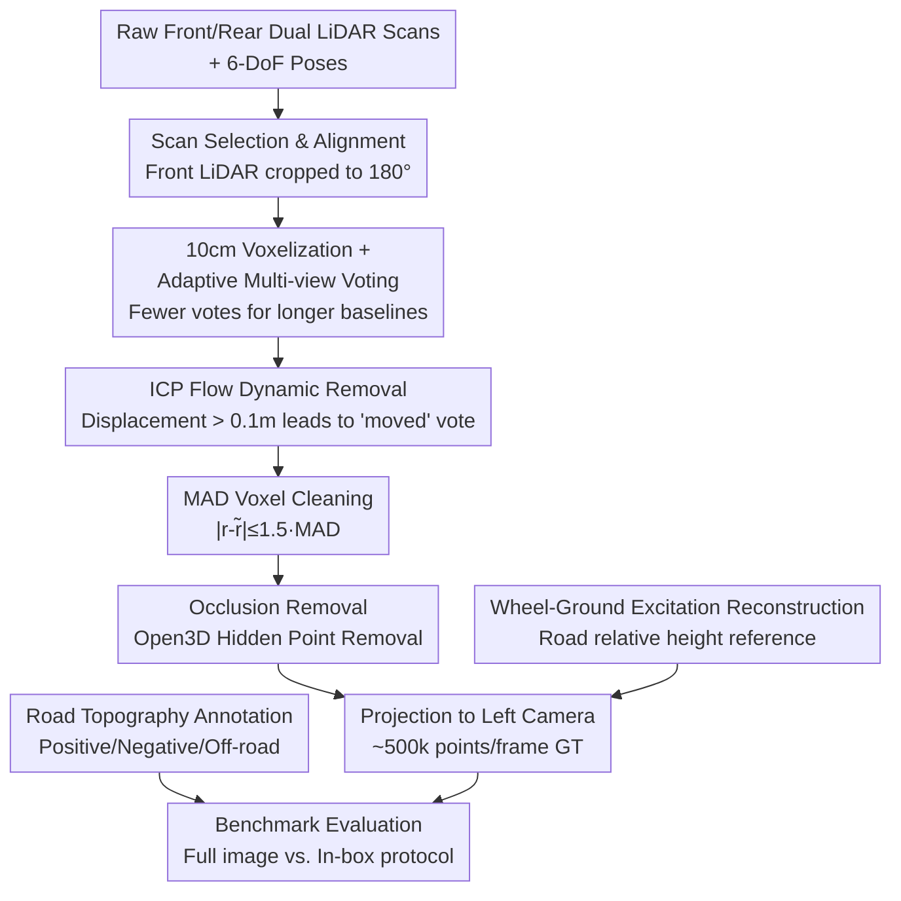

# CARD: A Multi-Modal Automotive Dataset for Dense 3D Reconstruction in Challenging Road Topography

**Conference**: CVPR 2026  
**arXiv**: [2605.05014](https://arxiv.org/abs/2605.05014)  
**Code**: Dataset homepage https://card.content.cariad.digital, data hosted at https://huggingface.co/CARD-Data  
**Area**: Autonomous Driving / 3D Reconstruction / Depth Estimation Datasets  
**Keywords**: Autonomous driving dataset, quasi-dense depth ground truth, multi-LiDAR fusion, road surface irregular topography, depth completion benchmark

## TL;DR
CARD is a multi-modal autonomous driving dataset targeting "non-flat road surfaces" (speed bumps, potholes, irregularities, and off-road sections). Through a novel multi-LiDAR fusion ground truth generation pipeline, it providing approximately 500,000 measured LiDAR depth points per frame (about 6.5 times that of KITTI Depth Completion). It is equipped with 2D bounding boxes for road topography, wheel-ground contact excitation trajectories, and standardized evaluation protocols, specifically designed to evaluate depth estimation/completion capabilities for fine-grained road geometry.

## Background & Motivation
**Background**: Progress in autonomous driving over the past decade has been largely driven by large-scale multi-sensor datasets (KITTI, Waymo, nuScenes, Argoverse, ONCE, PandaSet, A2D2, ZOD, etc.). However, these datasets are almost entirely collected from well-paved, flat urban/highway surfaces, focusing on traffic participants, semantics, and long-range perception.

**Limitations of Prior Work**: The authors point out two specific gaps. First, the vast majority of driving datasets only provide **single-frame sparse LiDAR** as depth ground truth—this sparse point cloud is insufficient for evaluating "fine-grained geometry," such as how deep a pothole is or the profile shape of a speed bump. Second, datasets specifically targeting road topography either have unusual perspectives (RSRD uses downward-facing cameras that only capture the road and lack forward-facing scenes, with only about 16,000 stereo pairs) or single scenarios (TartanDrive collected data only at an off-road site using an all-terrain vehicle).

**Key Challenge**: Autonomous vehicles must drive safely on diverse road surfaces, yet potholes and speed bumps are precisely the points where accidents occur and primary triggers for drivers to take over from autonomous mode. Existing data either lack "dense and accurate road geometry" or are "dense but lack a realistic forward-driving perspective." The inability to satisfy both conditions leads to a long-term lack of serious training/evaluation supervision signals for safety-critical scenarios like non-flat road surfaces.

**Goal**: Construct a dataset that combines **forward-facing camera perspective + quasi-dense 3D geometry ground truth + explicit road topography annotation**, filling the missing regime of "dense real road geometry."

**Key Insight**: Instead of using stereo consensus for densification—which filters out small road geometries at low parallax or long distances—it is better to use **multi-LiDAR multi-view voting** aggregation to ensure the ground truth is "entirely measured by LiDAR" while preserving centimeter-level detail.

**Core Idea**: Utilize a production-level vehicle equipped with dual front and rear LiDARs to record continuous sequences across ~110 km in 12+9 cities in Germany and Italy. Through a ground truth pipeline involving multi-LiDAR fusion, dynamic removal, and occlusion removal, sparse scans are aggregated into quasi-dense depth ground truth of approximately 500,000 points per frame. On this basis, a benchmark specifically for evaluating road irregularities is built.

## Method

### Overall Architecture
As a dataset paper, the "Method" mainly reflects **how to reliably aggregate multiple sparse LiDAR scans into quasi-dense ground truth with approximately 500,000 points per frame (strictly LiDAR-measured)**, as well as the sensor calibration, wheel-ground excitation reconstruction, and topography annotation/evaluation protocols built around it.

The collection platform is a 2024 Porsche E-Macan (equipped with adaptive air suspension to stabilize chassis height and prevent load changes from compromising "sensor-to-road" extrinsic parameters). The sensor suite includes: 2× Hesai XT32 rotating LiDARs (front/rear), 2× IDS global shutter stereo cameras, 6-DoF poses derived from LiDAR-inertial odometry, individual wheel motion trajectories, and complete calibration. Data scale: 118 sequences, approximately 175,000 stereo pairs, spanning ~110 km and 4.7 hours; stratified sampling by road topography and geographic location into ~33,000 training / ~11,000 validation / 16,000 test pairs, with an additional 5 full sequences reserved for zero-shot temporal evaluation.

Ground truth generation is the core of the pipeline, proceeding from top to bottom: scan selection and alignment → voxelization and adaptive multi-view voting → ICP flow dynamic removal → MAD voxel cleaning → occlusion removal, and finally projecting to the left camera to obtain per-image dense GT. The ground truth construction process is shown below:

### Key Designs

**1. Multi-LiDAR Fusion Quasi-Dense Ground Truth Pipeline: Preserving Centimeter-Level Road Geometry via Multi-view Voting instead of Stereo Consensus**

The pain point is: single-frame sparse LiDAR cannot measure fine-grained geometry, while stereo consensus densification filters out small road undulations due to low parallax/long distances. The authors' approach is to aggregate all scans from the entire sequence into a voxel grid after motion compensation, and then step-by-step filter for static environments. The key lies in **adaptive multi-view voting**: space is discretized into 10 cm cubic voxels, and independent observations from front/rear LiDARs are accumulated for each voxel; a view only casts a vote if its sensor origin is at least 3 cm away from already accepted origins, thus each vote corresponds to a different motion baseline $b$ (distance between accepted front origins). Under short baselines, more confirmation votes are needed; under long baselines, a small number of votes are acceptable—in practice, the required votes for the front LiDAR decrease from 4 to 1 as $b$ increases from 0.20 m to 0.90 m, and from 2 to 1 for the rear LiDAR; a voxel is retained as static only if it simultaneously satisfies the threshold conditions of both the front and rear paths. This not only aggregates dense point clouds (approx. 500,000 points/frame, covering about 18% of scene-related structures in the image) but also preserves details that stereo methods would erase because everything is "measured by LiDAR + confirmed by geometric voting."

**2. Dynamic Removal + Robust Voxel Cleaning: Completely Stripping Pedestrians/Vehicles from Static Road Geometry**

The side effect of aggregating multi-frame scans is that moving objects are incorrectly "frozen" into static road voxels. The authors use two serial filters to strip these: first, **ICP flow**—voxels are registered using voxelized GICP for scan pairs with origins $\ge 0.5$ m apart, calculating 3D residual displacement per voxel. Residuals $> 0.10$ m count as a "moved" vote, and voxels with accumulated $\ge 2$ votes are judged as dynamic and removed (especially effective for slow movers like pedestrians); then, **MAD voxel cleaning**—for each surviving voxel, the median $\tilde r$ of radii $r_i$ from points to the voxel center is taken, defining $\mathrm{MAD}=\mathrm{median}(|r_i-\tilde r|)$, retaining only points satisfying $|r_i-\tilde r|\le 1.5\,\mathrm{MAD}$ and discarding the entire voxel if remaining points are $< 2$. This step specifically cleans outlier returns from residual movers (e.g., tire points from passing cars mixed into static road). For sequences where dynamic residues remain after manual review, an MDE consistency filter is added: using DepthAnything to predict depth and fitting to sparse forward LiDAR, removing points with absolute relative error $> 15\%$ (slightly higher than typical DepthAnything error).

**3. Wheel-Ground Excitation Reconstruction: Providing Time-Varying "Sensor-to-Road" Extrinsics and Relative Height Reference**

Road topography (potholes/bumps) causes only minor geometric deviations relative to the global environment; evaluating it requires an accurate "current road" reference frame. The authors define **wheel excitation** as the trajectory of each tire's contact point: based on rigid extrinsics between the IMU and each wheel contact point when stationary during calibration, applying this to the vehicle pose yields an approximate ground path under a no-suspension assumption; LiDAR returns in a narrow corridor near this path (limited by tire footprint and suspension travel) are then collected, collapsing each point's path distance and relative height along the suspension axis into 1D samples; a smooth cubic spline is fitted to the "distance-height" samples using Ceres + Tukey robust loss, reading out the vertical offset at each moment to add back to the approximate path, resulting in wheel excitation trajectories. This provides sensor-to-road extrinsics at any time, allowing depth/point clouds to be expressed as "height relative to current road"—the foundation upon which height-type metrics (Abs. Diff, $\delta_{10}$ cm) can be calculated.

**4. Road Topography Annotation + Dual-Protocol Benchmark: Focusing Evaluation on Areas that Truly Test Fine-Grained Geometry**

If depth metrics are calculated only on the full image, local undulations like road potholes/bumps will be overwhelmed by massive background pixels. For this reason, the authors provide topography-oriented 2D box annotations: defining **positive topography** (protrusions, such as speed bumps) and **negative topography** (depressions, such as potholes), produced via a semi-automatic pipeline—first manually labeling a 40% subset to train a YOLOv8, then auxiliary labeling the remaining 60%; for off-road segments where the entire drivable surface is irregular, sequence-wise labels are used instead of local boxes. The clear goal of these boxes is to "evaluate the 3D reconstruction accuracy in these critical regions" rather than standard 2D detection. The benchmark accordingly provides two evaluation protocols: **Full Image (F)** and **Box-Only (B)**, the latter restricting metrics to irregular regions, thereby directly exposing the model's true performance on road surface details.

### Loss & Training
Fine-tuning experiments on the benchmark provide a valuable training insight: fine-tuning directly with standard $L_1$ loss yields negligible gains—the model prioritizes fitting global scale and structure while ignoring local road topography; however, combining MoGe2L's affine-invariant loss with a **height-space $L_1$ loss** leads to a significant performance boost (i.e., MoGe2L† in Table 3). On the depth completion side, a modification is proposed: retaining the distillation pipeline of DMD3C but replacing the monocular teacher with the stereo FoundationStereo and replacing the scale-invariant loss with a direct $L_1$ on metric depth (as the stereo teacher naturally provides metric depth).

## Key Experimental Results

### Dataset Scale Comparison (Table 1, relative to existing driving datasets)

| Dataset | Cities/Sites | Avg. GT Points/Camera | Off-road | Bumps/Pits | Irregular Road |
|---------|--------------|-----------------------|----------|------------|----------------|
| KITTI-DC | 1 City (DE) | 75K | × | Low | Low |
| Waymo | 3+ Cities (US) | 24K | × | Low | Low |
| DrivingStereo | (CH) | 75K | × | Low | Low |
| nuScenes | 2 Cities | 7.6K | × | Low | Low |
| RSRD-Dense | 1 City (CH) | 90K | × | ✓ | ✓ |
| TartanDrive 2.0 | 1 Site (US) | 34K | ✓ | Low | ✓ |
| **CARD (Ours)** | **12 City (DE)/9 City (IT)** | **500K** | **✓** | **✓** | **✓** |

Key figures: CARD has approximately 500,000 valid depth pixels per frame, about 6.5× that of KITTI-DC and 10× the average of other public driving datasets; covering ~110 km and 4.7 hours, it is the only dataset that simultaneously features "off-road + bumps/pits + irregular roads + urban scenes + forward-facing camera + ultra-high ground truth density."

### Depth Estimation Benchmark (Table 3, median scaling; F=Full, B=Box)

| Method | Type | AbsRel(F) | AbsRel(B) | Height Abs.Diff(F) | Height $\delta_{10}$(F) |
|--------|------|-----------|-----------|-------------------|----------------------|
| DAV2 | Mono Zero-shot | 0.096 | 0.055 | 0.181 | 0.578 |
| Metric3D2 | Mono Zero-shot | 0.060 | 0.039 | 0.117 | 0.675 |
| UniDepth2L | Mono Zero-shot | 0.046 | 0.029 | 0.117 | 0.802 |
| MoGe2L | Mono Zero-shot | 0.045 | 0.027 | 0.119 | 0.801 |
| **MoGe2L†** | Mono Fine-tuned | **0.029** | **0.018** | **0.051** | 0.893 |
| FS (FoundationStereo) | Stereo Zero-shot | 0.040 | **0.014** | 0.177 | **0.892** |

### Depth Completion Benchmark (Table 4, F=Full, B=Box)

| Method | RMSE(F)↓ | RMSE(B)↓ | AbsRel(F)↓ | $\delta_1$(F)↑ |
|--------|----------|----------|------------|----------------|
| BP-NET | 0.7975 | 0.1939 | 0.0211 | 0.9853 |
| DMD3C | 0.7742 | 0.1950 | 0.0225 | 0.9804 |
| **DMD3C (+FS)** | **0.7510** | **0.1918** | 0.0219 | 0.9805 |

### Key Findings
- **Zero-shot monocular depth is "global-good, local-bad"**: Monocular models perform strongly on full-image depth metrics but are markedly poor in irregular road areas (Box-only B protocol, especially height metrics)—precisely the issue CARD's Box-only protocol was designed to expose.
- **Stereo geometry is more stable on centimeter-level details**: FoundationStereo, by virtue of parallax-to-depth geometric conversion, leads monocular zero-shot models in AbsRel(B)=0.014 and Height $\delta_{10}$(F)=0.892, indicating that explicit geometry is friendlier to fine-grained road surfaces.
- **Fine-tuning must be applied to "height space"**: Pure $L_1$ fine-tuning offers almost no gain (the model only learns global scale), whereas adding height-space $L_1$ leads to a comprehensive jump for MoGe2L† (AbsRel F 0.045→0.029, Height Abs.Diff 0.119→0.051), confirming that road topography requires specialized supervision signals.
- **Depth completion may "over-smooth" road surfaces**: DMD3C(+FS) using a stereo teacher + metric $L_1$ consistently improves on full-image RMSE (0.7742→0.7510), but box-only metrics still fall short of pure stereo FoundationStereo—suggesting a risk that LiDAR-image completion might smooth out valid road topography.

## Highlights & Insights
- **Ground truth philosophy of "dense without distortion"**: Adhering to the principle that ground truth must be entirely LiDAR-measured, using multi-view geometric voting instead of stereo consensus for aggregation. This achieves a density of ~500k points/frame while preserving centimeter-level road details that stereo methods would erase—the core selling point of the dataset quality.
- **Clever adaptive baseline voting**: Tying "how many votes are needed to trust a voxel" to the motion baseline $b$ (longer baseline, more reliable geometry, fewer votes needed) is a robustness trick transferable to any multi-view point cloud aggregation.
- **Wheel excitation trajectories are a hidden treasure**: Reconstructing each tire's contact point as a time-varying "sensor-to-road" extrinsic not only supports height-type evaluations but also provides road excitation profiles (usable for suspension/chassis control, comfort modeling), offering value beyond the depth task itself.
- **Box-only/Full dual protocol hits the mark**: Using a simple "evaluate only within irregular boxes" protocol quantitatively exposes the "global-good, local-bad" problem of monocular models, providing a clean and powerful methodology.

## Limitations & Future Work
- **Anonymization over-correction**: YOLOv8-based privacy anonymization can mistakenly blur benign content (false positives). The authors provide dedicated channels for reporting and rapid removal.
- **Residual dynamic artifacts**: Despite manual review, slow-moving objects may occasionally remain in the static ground truth; this acts as potential noise for training/evaluating fine-grained geometry.
- **Reconstruction-oriented rather than detection-oriented annotation**: Road irregularity boxes are designed for evaluating 3D reconstruction accuracy and are not suitable for use as standard object detection benchmarks; furthermore, local depression boundaries are visually ambiguous, leading to potential omissions.
- **Potential improvements**: Current ground truth depends on a "static environment assumption + post-processing dynamic removal," and depth for dynamic targets still relies on stereo distillation completion. Future work could explore coupling wheel excitation trajectories with depth estimation or providing independent dense ground truth channels for dynamic objects.

## Related Work & Insights
- **vs KITTI / DrivingStereo (Densified Datasets)**: All three perform LiDAR multi-frame aggregation densification, but KITTI/DrivingStereo use stereo consensus and concentrate on single-city/flat road surfaces; CARD uses multi-LiDAR geometric voting and intentionally covers non-flat and off-road surfaces, with a ground truth density approx. 6.5× that of KITTI-DC.
- **vs RSRD (Specialized Road Datasets)**: RSRD first specialized in road reconstruction but used downward-facing cameras capturing only the road, lacking forward scenes, with only ~16,000 pairs; CARD uses production vehicle forward cameras + complete urban scenes + much larger scale, favoring the training/evaluation of realistic forward perception.
- **vs TartanDrive (Off-road Datasets)**: TartanDrive used an all-terrain vehicle for repetitive collection at a single off-road site, limiting scene diversity; CARD spans 21 cities in Germany/Italy, mixing urban/suburban/rural/off-road, offering stronger generalization.
- **vs nuScenes / Waymo / Argoverse (Large-scale Urban Datasets)**: These datasets prioritize traffic participants and semantics, with sparse depth ground truth (7.6K–24K points/frame); CARD focuses on the neglected "dense real road geometry" regime, serving as a complement rather than a replacement.

## Rating
- **Novelty**: ⭐⭐⭐⭐ The first specialized benchmark for road topography in realistic forward-facing driving. The multi-LiDAR voting ground truth pipeline is solid and distinctive, though individual techniques are clever combinations of existing ideas.
- **Experimental Thoroughness**: ⭐⭐⭐⭐ Covers monocular/stereo depth estimation and depth completion, including full-image/box-only protocols and height metrics. Benchmark baselines are strong. Quantitative ablation of the pipeline is included in the supplementary materials.
- **Writing Quality**: ⭐⭐⭐⭐ Motivations and gaps are clearly argued, and the ground truth pipeline steps are explicitly explained. Table 1 provides an clear comparison.
- **Value**: ⭐⭐⭐⭐⭐ Directly fills the gap in safety-critical non-flat road geometry data. Dual-licensing (Germany CC BY 4.0 / Italy CC BY-NC 4.0) + high-density ground truth makes it a highly reusable asset for the depth estimation/completion community.

<!-- RELATED:START -->

## Related Papers

- [\[CVPR 2026\] WOD-E2E: Waymo Open Dataset for End-to-End Driving in Challenging Long-tail Scenarios](wod-e2e_waymo_open_dataset_for_end-to-end_driving_in_challenging_long-tail_scena.md)
- [\[CVPR 2026\] MeanFuser: Fast One-Step Multi-Modal Trajectory Generation and Adaptive Reconstruction via MeanFlow for End-to-End Autonomous Driving](meanfuser_fast_one-step_multi-modal_trajectory_generation_and_adaptive_reconstru.md)
- [\[CVPR 2026\] RPGFusion: 4D Radar Prior-Guided Multi-Modal Fusion for 3D Detection](rpgfusion_4d_radar_prior-guided_multi-modal_fusion_for_3d_detection.md)
- [\[CVPR 2026\] CCF: Complementary Collaborative Fusion for Domain Generalized Multi-Modal 3D Object Detection](ccf_complementary_collaborative_fusion_for_domain_generalized_multi-modal_3d_obj.md)
- [\[ICCV 2025\] UAVScenes: A Multi-Modal Dataset for UAVs](../../ICCV2025/autonomous_driving/uavscenes_a_multi-modal_dataset_for_uavs.md)

<!-- RELATED:END -->
