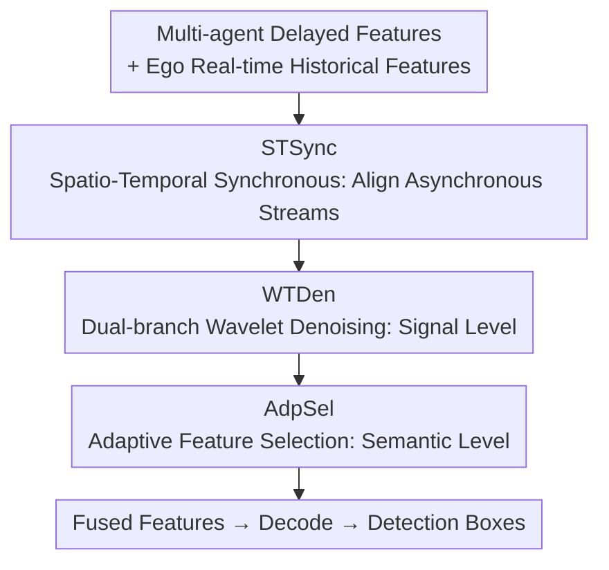

# CATNet: Collaborative Alignment and Transformation Network for Cooperative Perception

**Conference**: CVPR 2026  
**Paper**: [CVF Open Access](https://openaccess.thecvf.com/content/CVPR2026/html/Chen_CATNet_Collaborative_Alignment_and_Transformation_Network_for_Cooperative_Perception_CVPR_2026_paper.html)  
**Code**: None  
**Area**: Autonomous Driving  
**Keywords**: Cooperative Perception, V2X, Communication Delay Alignment, Multi-source Noise Suppression, Intermediate Feature Fusion  

## TL;DR
CATNet targets the two major realistic challenges in V2X cooperative perception: "communication delay + multi-source noise." By cascading Spatio-Temporal Synchronous (STSync), Dual-branch Wavelet Denoising (WTDen), and Adaptive Feature Selection (AdpSel) modules, it achieves SOTA AP on OPV2V/V2XSet/DAIR-V2X datasets under noisy and delayed scenarios with only 9.95M parameters.

## Background & Motivation
**Background**: Single-vehicle perception is limited by field-of-view and occlusion. Multi-agent cooperative perception, which fuses observations from multiple vehicles and road-side units via V2X communication, has become mainstream. Fusion granularity is divided into three tiers: early fusion (sharing raw point clouds, bandwidth intensive), late fusion (sharing detection boxes, high loss for occluded and distant targets), and intermediate fusion (sharing intermediate feature maps). **Intermediate fusion is recognized as the optimal paradigm**, and most recent works focus on improving its accuracy.

**Limitations of Prior Work**: Most existing methods rely on the "ideal communication" assumption, failing in real-world road conditions. Specifically, two independent yet mutually amplifying issues exist: first, **time-varying communication delay**—features from collaborative vehicles are outdated when they reach the ego vehicle, causing spatial misalignment across different timestamps, leading to "ghosting" and feature fragmentation (paper tests show delay can drop performance by 46%); second, **multi-source noise**—channel interference, transmission distortion, and model bias contaminate features, destroying point cloud geometric structures and distorting target shapes (noise alone can drop performance by 17%). More critically, these two are coupled: recursive processing under asynchronous conditions further amplifies high-frequency noise.

**Key Challenge**: Current delay solutions (e.g., P-LSTM in SyncNet, feature prediction in MRCNet) only perform **local temporal alignment** on individual agents, lacking global spatio-temporal consistency modeling across agents, leading to cumulative errors. Existing denoising solutions (knowledge distillation like DiscoNet relying on clean teachers, or graph optimization like CoAlign failing to resolve dynamic delays) only purify at the **signal level**, ignoring residual **semantic-level** inconsistencies and contextual artifacts. In essence, alignment and denoising are addressed separately and incompletely.

**Goal**: To use a unified framework to simultaneously compensate for delay misalignment, suppress signal noise, and clean semantic artifacts, while remaining lightweight.

**Core Idea**: Perform global spatio-temporal alignment (instead of local) followed by **dual-stage purification** involving "signal-level denoising + semantic-level refinement." This splits purification into two stages—fixing signals first, then refining semantics—to counter high/low-frequency distortion in the wavelet domain and higher-order semantic noise, respectively.

## Method

### Overall Architecture
CATNet is embedded in a standard "Encoder → Transmission → CATNet → Decoder" pipeline. Each agent $i$ first encodes sensor data $X_i^t$ into features $F_i^t$. After a transmission delay $\tau$, the features reach the ego vehicle and are aligned to the ego coordinate system via coordinate transformation $\xi_{i\to ego}^{t-\tau}$, resulting in $\hat{F}_{i\to ego}^{t-\tau}$. CATNet receives this batch of **delayed collaborative features** and the ego vehicle's own **real-time historical features**, passing them through three modules sequentially to produce fused features $\tilde{F}_{fused}^t$, which are finally decoded into detection results:

$$\tilde{F}_{fused}^t = \text{CATNet}\left(\{\hat{F}_{i\to ego}^{t'}\}_{t'\le t-\tau},\ \{F_{ego}^{t'}\}_{t'\le t}\right)$$

The three modules follow a serial "alignment first, then purification" flow: STSync resolves asynchronous misalignment by predicting outdated features to the current timestamp; WTDen suppresses global/local distortion at the signal level; AdpSel selects key regions at the semantic level to eliminate artifacts. The ego vehicle maintains a feature bank to cache historical fused features for temporal prediction in STSync.

### Key Designs

**1. STSync: Compensating Outdated Collaborative Features via Recursive Prediction**

The essence of delay is that collaborative features held by the ego vehicle are outdated ($t-\tau$). Direct fusion treats past object positions as current. STSync replaces simple per-agent local alignment with a global temporal context to recursively predict features to the current frame. First, an Integration module performs multi-scale multi-agent pre-fusion: global max pooling $\text{Mp}$ and average pooling $\text{Ap}$ are applied to the delayed features $F_{agents}^{t-\tau}$ of $N$ agents, concatenated and passed through a 3D convolution $C_3$ to obtain a unified representation $F_{fused}^{t-\tau} = C_3(\text{Concat}(\text{Mp}(F_{agents}^{t-\tau}),\ \text{Ap}(F_{agents}^{t-\tau})))$.

The core is the **TARU (Time-Augmented Recurrent Unit)**: the ego vehicle caches the last $K$ frames of fused history features $B=(B_1,\dots,B_K)$. The hidden state is initialized from the earliest frame $H_1=B_1$, then recursed frame-by-frame from $i=2$ to $K$. Each step performs three actions: ① **Motion Prediction**—calculating motion offset $\Delta B_i = \text{Conv}(\text{Concat}(B_{i-2}, B_{i-1}))$ from the previous two frames; ② **Feature Warp**—warping the previous frame into motion-aligned features $\hat{B}_i = \text{DeformConv}(B_{i-1}, \Delta B_i)$ using Deformable Convolution per the offset; ③ **State Fusion**—calculating adaptive gating coefficients $\alpha_i$ via an ST-Gate (parallel spatial/channel attention) to weighted-mix historical context and current motion information $S_i = (1-\alpha_i)\cdot H_{i-1} + \alpha_i \cdot \hat{B}_i$. Recursing to $H_K$ yields predicted features. Finally, Deformable Cross-Attention (DCA) is used with real-time ego features $F_{ego}^t$ as a spatial prior to anchor the "temporally predicted features" back to the "spatially accurate reality" of the ego vehicle.

**2. WTDen: Dual-branch Signal Denoising via "Global Mamba + Local Conv" in Wavelet Domain**

Residual artifacts remain after STSync alignment, and iterative processing amplifies high-frequency noise while inherent inter-agent inconsistencies destroy local structures—all signal-level distortions. WTDen treats this as the first purification stage, decomposing fused features into four sub-bands $F_{LL},F_{LH},F_{HL},F_{HH}$ using 2D Haar Wavelet Transform (WT) ($F_{LL}$ for low-frequency structure, others for high-frequency details) to separate and suppress noise.

The two branches have distinct roles: The **Wavelet Mamba** branch captures long-range spatial relationships and corrects global inter-agent misalignment via dual-path progressive fusion—one path processes sub-bands sequentially from high to low frequency ($F_{HH}\to F_{LL}$) to prioritize fine-detail loss, while the other processes all four sub-bands at each spatial location via interleaved scanning to catch cross-band correlations. Bi-directional scanning ensures omnidirectional aggregation, and the four paths are aggregated via SSM before Inverse Wavelet Transform (IWT) restores global aligned features $F_{mam}$. The **Wavelet Convolution** branch fixes local issues: concatenating sub-bands into a $4C$ channel tensor followed by hierarchical filtering $F_{conv}=\text{IWT}(\text{IWT}(\text{Conv}(\text{WT}(F_{wt})))\oplus \text{Conv}(F_{wt}))$, specifically targeting fine-grained local degradation and intra-vehicle noise. The outputs are summed $F_{denoise}=F_{mam}+F_{conv}$. Performing denoising in the wavelet domain allows natural separation of high/low frequencies, making it less likely to damage discriminative features than fixed-threshold denoising.

**3. AdpSel: Semantic Purification via Selective Enhancement using "Saliency" as a Proxy**

Signal-level filters cannot remove higher-order semantic artifacts; AdpSel targets this as the second stage. It redefines saliency as a proxy for semantic coherence, performing context-aware synthesis on coherent regions to filter semantic noise, iterating across preset window scales $\{S_1,\dots,S_n\}$. Each scale involves: ① **Coherence-aware Patch Selection**—dividing the feature map into non-overlapping patches where a lightweight linear selector $\phi(\cdot)$ scores each patch in a score map $\Phi_{S_i}$. The top-$k\%$ patches are selected as features, with binary mask $M_{S_i}^{topk}=\text{TopK}(\Phi_{S_i})$, yielding $F^{selected}=M^{topk}\odot F$ and $F^{unselected}=(1-M^{topk})\odot F$; ② **Hierarchical Mask Refinement** (a key innovation)—low-saliency regions discarded at fine scale $S_i$ are upsampled and merged into the initial mask of the next coarser scale $S_{i+1}$: $\text{mask}_{S_{i+1}}=\text{mask}_{initial}-\text{UpSample}(1-M_{S_i}^{topk})$, allowing the model to focus progressively on global salient areas and avoid redundant computation; ③ **Dual-path Feature Enhancement**—highly coherent selected patches pass through an MLLA module to capture complex context $F^{enhanced}=\text{MLLA}(F^{selected})$, while unselected patches pass through a lightweight Inverted Bottleneck layer to recover information at low cost $F^{recovered}=\text{IB}(F^{unselected})$. Each scale uses an Aggregator to fuse both paths, and cross-scale results are finally merged into $F_{out}$ via SplitAttention.

### Loss & Training
PointPillar is used as the backbone across three datasets, reporting AP at IoU=0.5/0.7 per official protocols. The token retention ratio $k\%$ in AdpSel is a key hyper-parameter, with $0.3$ found as optimal.

## Key Experimental Results

### Main Results
Comparison with SOTA in scenarios with noise and delay across three datasets (AP@0.5 / AP@0.7), CATNet has only 9.95M parameters:

| Method | Type | Params | OPV2V AP@0.5/0.7 | V2XSet AP@0.5/0.7 | DAIR-V2X AP@0.5/0.7 |
|------|------|--------|------|------|------|
| No Fusion | – | – | 0.738 / 0.509 | 0.698 / 0.516 | 0.625 / 0.446 |
| V2X-ViT | Noise-Robust | 13.50M | 0.817 / 0.633 | 0.797 / 0.593 | 0.696 / 0.517 |
| DSRC | Noise-Robust | 40.64M | 0.789 / 0.653 | 0.801 / 0.596 | 0.702 / 0.559 |
| MRCNet | Delay-Aware | 19.71M | 0.814 / 0.617 | 0.817 / 0.618 | 0.665 / 0.539 |
| ERMVP | Delay-Aware | 12.42M | 0.820 / 0.679 | 0.744 / 0.499 | 0.674 / 0.554 |
| **CATNet** | – | **9.95M** | **0.843 / 0.686** | **0.858 / 0.643** | **0.723 / 0.565** |

Compared to the second-best method, the improvement is most significant on V2XSet (AP@0.5/0.7 +4.1% / +1.9%), +2.1% / +0.6% on DAIR-V2X, and +1.2% / +0.7% on OPV2V. The paper also claims a gain of up to 16.0% / 12.7% over the single-vehicle baseline in noisy/delayed scenarios.

Delay Robustness (OPV2V, pose noise σ=0.2, max delay increasing from 200ms to 500ms):

| Method | 0ms | 0-200ms | 0-300ms | 0-400ms | 0-500ms |
|------|------|------|------|------|------|
| ERMVP | 0.831/0.686 | 0.824/0.643 | 0.783/0.630 | 0.767/0.613 | 0.745/0.600 |
| MRCNet | 0.848/0.715 | 0.836/0.647 | 0.774/0.638 | 0.759/0.625 | 0.738/0.615 |
| **CATNet** | **0.896/0.763** | **0.856/0.673** | **0.806/0.657** | **0.774/0.638** | **0.756/0.624** |

CATNet leads across all delay levels, validating the robustness of the temporal synchronization mechanism against unpredictable delays.

### Ablation Study
Step-by-step module addition (AP@0.5 / AP@0.7):

| Configuration | OPV2V | DAIR-V2X | Description |
|------|------|------|------|
| Baseline | 0.595 / 0.384 | 0.659 / 0.461 | Standard Intermediate Fusion |
| + STSync | 0.818 / 0.678 | 0.683 / 0.496 | Largest single module contribution |
| + WTDen | 0.645 / 0.461 | 0.671 / 0.482 | Signal Denoising |
| + AdpSel | 0.624 / 0.425 | 0.666 / 0.477 | Semantic Refinement |
| + STSync + WTDen | 0.834 / 0.680 | 0.717 / 0.549 | Alignment + Signal |
| + STSync + AdpSel | 0.822 / 0.682 | 0.708 / 0.553 | Alignment + Semantic |
| **CATNet (Full)** | **0.843 / 0.686** | **0.723 / 0.565** | Modular Collaboration |

### Key Findings
- **STSync Contribution is Overwhelming**: Adding STSync alone increases AP@0.5 from 0.595 to 0.818 (+22.3%) on OPV2V, with the full model yielding +24.8% (OPV2V) / +6.4% (DAIR-V2X) over baseline. This indicates that delay alignment is the "first-order" problem in delayed scenarios; without it, denoising and selection are futile.
- **Superior Noise Robustness**: After injecting heading disturbance and positioning offset, the baseline's AP@0.7 drops by up to 7.98% / 10.02%, while CATNet only drops by 0.6%.
- **Optimal AdpSel Retention at 0.3**: Scanning token retention ratios from 0.1 to 0.6 shows 0.3 is generally best (e.g., OPV2V 0.855/0.691). Retaining too much introduces noise.
- **Masking High-Saliency Areas is Fatal**: Masking high-attention regions with noise causes AP@0.5 to crash from 0.897 to 0.364, confirming that selected areas contain critical semantics. Fusing Primary+Secondary paths yields best results.
- **Robust under Historical Data Loss**: Simulating random packet loss from communication interruptions, performance remains above 78% on OPV2V. V2XSet maintains 65% AP@0.5 under 600ms delay.

## Highlights & Insights
- **Splitting purification into signal and semantic stages** is the core insight: signal filters cannot remove high-level semantic artifacts, so using WTDen in the wavelet domain for signal distortion followed by AdpSel for semantic incoherence is more thorough than single-layer denoising. This "signal first, semantic second" approach is transferable to any fusion task requiring multi-level feature refinement.
- **TARU treats delay alignment as recursive prediction** rather than local alignment: by using motion offsets + Deformable Conv warp + ST-Gate, and then anchoring with ego real-time features via DCA, it effectively performs "temporal extrapolation followed by spatial re-anchoring," avoiding the drift inherent in pure prediction.
- **Hierarchical mask propagation in AdpSel** is clever: regions discarded at fine scales guide the initial mask of coarser scales, focusing on global salient regions while eliminating redundant calculations—a form of "negative feedback" attention pruning.
- **Lightweight**: With 9.95M parameters, it outperforms 40.64M DSRC and 35.80M How2comm, offering high efficiency.

## Limitations & Future Work
- The series sequence of **STSync recursion + WTDen dual-branch wavelet + AdpSel multi-scale iteration** may result in high inference latency. The paper does not report real-time FPS, which remains a question mark for vehicle deployment ⚠️.
- Ablations show **performance relies almost entirely on STSync** (lifting AP from 0.595 to 0.818 alone). WTDen/AdpSel contribute marginal gains individually, raising questions about whether their structural complexity is justified by their marginal utility.
- Details of parallel spatial/channel attention in ST-Gate and scanning strategies in WTDen are relegated to the appendix; the main text is brief, requiring appendix reference for reproduction.
- Experiments are mostly on simulation-based datasets (OPV2V/V2XSet) with some real data (DAIR-V2X); whether simulated noise covers the complex noise distribution of real V2X channels remains unverified.

## Related Work & Insights
- **vs V2X-ViT / V2VNet**: These concatenate asynchronous features and use deep networks for implicit spatio-temporal learning, failing to capture dynamic evolution. CATNet uses TARU for explicit motion-offset-based recursive prediction, making temporal modeling more controllable.
- **vs SyncNet / MRCNet**: These use P-LSTM or feature prediction for **local** time compensation, lacking global inter-agent spatio-temporal consistency and leading to error accumulation. CATNet establishes global temporal context + ego anchoring.
- **vs DiscoNet / DI-V2X (Distillation Denoising)**: These depend on clean teacher models and struggle with complex interference. CATNet requires no teacher and performs end-to-end denoising.
- **vs CoAlign (Graph-based Denoising)**: Only performs spatial alignment correction at the signal level, suffering from temporal inconsistency in dynamic environments. CATNet adds semantic purification and temporal alignment.

## Rating
- Novelty: ⭐⭐⭐⭐ The combination of "signal + semantic" dual-stage purification and recursive delay prediction is novel, though individual components (Mamba, Wavelet, Deformable Conv, TopK pruning) are mostly existing techniques.
- Experimental Thoroughness: ⭐⭐⭐⭐⭐ Three datasets + multi-dimensional robustness (delay/noise/loss) + full module ablation, well-covered.
- Writing Quality: ⭐⭐⭐⭐ Clear motivation and well-organized formulas, though many details are pushed to the appendix.
- Value: ⭐⭐⭐⭐ Directly addresses the latency and noise pain points for V2X perception deployment. Lightweight and SOTA, high practical value.

<!-- RELATED:START -->

## Related Papers

- [\[CVPR 2026\] CoLC: Communication-Efficient Collaborative Perception with LiDAR Completion](colc_communication-efficient_collaborative_perception_with_lidar_completion.md)
- [\[CVPR 2026\] Hybrid Robust Collaborative Perception with LiDAR-4D Radar Fusion under Adverse Weather Conditions](hybrid_robust_collaborative_perception_with_lidar-4d_radar_fusion_under_adverse_.md)
- [\[CVPR 2026\] MTA: Multimodal Task Alignment for BEV Perception and Captioning](mta_multimodal_task_alignment_for_bev_perception_and_captioning.md)
- [\[CVPR 2026\] Unsupervised Multi-agent and Single-agent Perception from Cooperative Views](unsupervised_multi-agent_and_single-agent_perception_from_cooperative_views.md)
- [\[CVPR 2026\] Learning Mutual View Information Graph for Adaptive Adversarial Collaborative Perception](learning_mutual_view_information_graph_for_adaptive_adversarial_collaborative_pe.md)

<!-- RELATED:END -->
