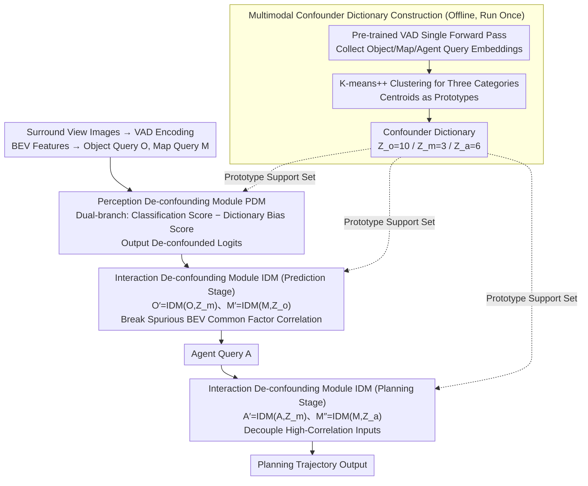

<!-- Generated by src/gen_stubs.py -->
# CausalVAD: De-confounding End-to-End Autonomous Driving via Causal Intervention

**Conference**: CVPR2026  
**arXiv**: [2603.18561](https://arxiv.org/abs/2603.18561)  
**Code**: To be released  
**Area**: Autonomous Driving  
**Keywords**: Causal Inference, Backdoor Adjustment, De-confounding, End-to-End Autonomous Driving, Sparse Vectorized Representation, VAD

## TL;DR

This paper proposes CausalVAD, which parameterizes Pearl’s backdoor adjustment theory into a plug-and-play module (SCIS). By performing multi-level causal interventions across the perception, prediction, and planning stages of the VAD architecture, it eliminates spurious correlations and achieves safer and more robust end-to-end autonomous driving.

## Background & Motivation

**End-to-end models learn correlation rather than causality**: Current planning-oriented end-to-end driving models (UniAD, VAD, etc.) essentially fit $P(Y|S)$ through standard supervised learning. They capture statistical correlations instead of true causal relationships, making them susceptible to "shortcut learning" caused by dataset biases.

**Causal confusion leads to safety hazards**: Models may treat the ego-vehicle's historical state (velocity, acceleration) as a shortcut for predicting future decisions (spurious self-correlation). While performing well in open-loop evaluations, they suffer catastrophic failures in closed-loop deployment once they deviate from expert trajectories.

**VLM-based solutions exhibit hallucinations and pseudo-faithfulness**: Using large vision-language models to provide natural language explanations may seem reasonable, but their reasoning processes can be completely decoupled from actual decision-making (pseudo-faithfulness), introducing new risks in safety-critical domains.

**Severe imbalance in the nuScenes dataset**: Approximately 75% of the data consists of straight-driving scenarios. Models easily learn the spurious correlation that "going straight is the default behavior," leading to significant performance degradation in minority scenarios such as turning.

**Confounders are systemic cascading issues**: Analysis via Structural Causal Models (SCM) reveals that co-occurrence bias in perception, BEV common factors in prediction, and input correlations in planning are confounding problems at different information nodes, requiring targeted multi-stage interventions.

**Limitations of prior work**: Heuristic methods (state dropout, data augmentation) lack theoretical guarantees. Causal discovery/counterfactual methods are mostly used for offline analysis or simplified scenarios, making them difficult to embed efficiently into the online training of large-scale end-to-end models.

## Method

### Overall Architecture

CausalVAD aims to rectify the issue where end-to-end driving "learns correlations but not causality." It integrates a Sparse Causal Intervention Scheme (SCIS) into the VAD architecture. First, it formalizes the modular pipeline of VAD using a Structural Causal Model (SCM) to identify three types of backdoor paths. It then cuts these spurious paths using backdoor adjustment $P(Y|\text{do}(S)) = \sum_z P(Y|S=s, Z=z) P(Z=z)$, where the latent confounder $Z$ is approximated by a learnable prototype dictionary, and the do-operator is parameterized within the neural network. Structurally, a confounder dictionary is constructed offline, followed by the insertion of de-confounding modules at three stages: the Perception De-confounding Module (PDM) for perception, and the Interaction De-confounding Module (IDM) for both prediction and planning, reusing prototypes from the dictionary as the summation support set for the do-operator.

### Key Designs

**1. Multimodal Confounder Dictionary Construction: Approximating Hidden Confounders $Z$ with Prototypes**

Backdoor adjustment requires summation over the confounder $Z$, but $Z$ is a latent variable in driving scenarios and is inaccessible. The authors approximate it using an offline two-step process (run only once): first, a single forward pass of the pre-trained VAD is performed over the entire training set to collect sparse embeddings of Object/Map/Agent queries; second, K-means++ clustering is applied to these three types of embeddings. The centroids serve as prototypes to form the dictionary $\{\mathcal{Z}\} = \{\{\mathcal{Z}_o\}, \{\mathcal{Z}_m\}, \{\mathcal{Z}_a\}\}$, with sizes $(k_o, k_m, k_a) = (10, 3, 6)$. This set of prototypes serves as the discrete support set for the "summation over $Z$" in the do-operator.

**2. Perception De-confounding Module (PDM): Canceling Co-occurrence Bias via Dual Branches**

The classification paths $\mathcal{O} \to \mathcal{Y}_o$ and $\mathcal{M} \to \mathcal{Y}_m$ in the perception stage are often biased by co-occurrence (certain objects/map elements always appear together, leading the model to take shortcuts). PDM employs a dual-branch structure: one branch provides the direct classification score, while the other calculates a bias score based on the confounder dictionary. The final de-confounded logits are the difference between the two, applied symmetrically to object and map element classification.

**3. Interaction De-confounding Module (IDM): Estimating and Subtracting Spurious Components to Break Pseudo-correlations**

The challenge in the prediction and planning stages is the high correlation between queries—BEV common factors and input correlations create spurious associations. IDM is a unified module that can be instantiated multiple times: it uses cross-attention to estimate the "predictable by context" spurious components within the queries, which are then scaled by a gating unit and subtracted from the original queries. In the prediction stage, $\mathcal{O}' = \text{IDM}(\mathcal{O}, \{\mathcal{Z}_m\})$ and $\mathcal{M}' = \text{IDM}(\mathcal{M}, \{\mathcal{Z}_o\})$ break spurious correlations caused by BEV common factors; in the planning stage, $\mathcal{A}' = \text{IDM}(\mathcal{A}, \{\mathcal{Z}_m\})$ and $\mathcal{M}'' = \text{IDM}(\mathcal{M}, \{\mathcal{Z}_a\})$ decouple highly correlated inputs. By subtracting the "contextually predictable" parts, only the causal signals that do not rely on shortcuts remain.

### Loss & Training

After inserting PDM and IDM, the model is trained end-to-end from scratch (rather than being fine-tuned) to ensure the learning of de-confounded causal relationships from the beginning. The loss functions are exactly the same as the original VAD, requiring no additional loss design. Optimization uses AdamW with an initial learning rate of $2 \times 10^{-4}$, weight decay of 0.01, and a CosineAnnealing scheduler over 60 epochs on 8×RTX 3090.

## Key Experimental Results

### Main Results

**nuScenes Open-loop Planning (Table 1)**:

| Method | L2 Avg (m) ↓ | CR Avg (%) ↓ | FPS |
|------|-------------|-------------|-----|
| UniAD | 0.73 | 0.61 | 1.8 |
| VAD-tiny | 0.74 | 0.44 | 5.6 |
| VAD | 0.62 | 0.38 | 3.1 |
| BridgeAD | 0.58 | 0.08 | 3.9 |
| SparseDrive | 0.61 | 0.10 | 6.1 |
| **CausalVAD** | **0.54** | **0.11** | 5.4 |

- Compared to the VAD-tiny baseline, L2 error decreased by 27% and collision rate (CR) decreased by 75%, with almost no additional computational overhead.
- Achieved the lowest average L2 error among all compared methods.

**NAVSIM & Bench2Drive (Table 4)**:

| Method | NAVSIM PDMS ↑ | B2D DS ↑ | B2D SR (%) ↑ |
|------|-------------|---------|-------------|
| VAD-tiny | 80.5 | 42.73 | 14.18 |
| UniAD | 83.4 | 45.81 | 16.36 |
| **CausalVAD** | **87.2** | **49.83** | **19.42** |

### Key Findings

**Robustness to Scenario Distribution Bias (Table 2)**: VAD-tiny’s performance severely degrades in turning scenarios, with L2 increasing from 0.75m to 1.07m. CausalVAD achieves an L2 of only 0.69m for turns, which is even better than VAD-tiny’s straight-line performance.

**Ego-state Shortcut Dependency (Table 3)**: When the ego-vehicle speed is set to zero, VAD-tiny’s L2 spikes from 0.74m to 6.94m. CausalVAD changes from 0.54m to 4.80m, and its collision rate increases from 0.11% to 1.20% (vs. VAD-tiny’s 0.44% to 4.02%), demonstrating significantly stronger robustness to speed perturbations.

### Ablation Study

**Module Contribution (Table 5)**:

| Config | PDM | IDM | L2 Avg ↓ | CR Avg ↓ |
|------|-----|-----|---------|---------|
| Baseline | × | × | 0.74 | 0.44 |
| +PDM | ✓ | × | 0.63 | 0.26 |
| +IDM | × | ✓ | 0.57 | 0.19 |
| **Full** | **✓** | **✓** | **0.54** | **0.11** |

- PDM mainly reduces collision rates, while IDM primarily improves planning precision; the two are complementary.
- Dictionary sizes of $(10,3,6)$ are optimal; values too small fail to capture diverse contexts, while values too large introduce redundancy.
- Choice of clustering algorithm (K-means/K-medoids/K-means++) does not significantly affect performance, showing the method's robustness.

### Insights

1. T-SNE visualizations show that CausalVAD successfully disentangles different navigation intentions (straight/left/right) into separable clusters.
2. In qualitative analysis of cut-in scenarios, VAD-tiny’s attention over-focuses on the ego-vehicle's historical trajectory, resulting in collisions. CausalVAD correctly focuses on the cut-in vehicle and decelerates safely.
3. VLA models (e.g., Senna) may provide safe actions but give hallucinated explanations (e.g., attributing deceleration to a non-existent height limit), highlighting the faithfulness of CausalVAD's internal logic.

## Highlights & Insights

- **Theoretical Rigor**: Systematically introduces Pearl’s backdoor adjustment theory into end-to-end driving in a strictly formalized manner, rather than relying on heuristics.
- **Plug-and-play**: PDM and IDM modules are lightweight and general. FPS drops negligibly from 5.6 to 5.4, making them suitable as plugins for other architectures.
- **Comprehensive Robustness Validation**: Systematically proves the effectiveness of causal interventions across scenario distribution bias, ego-state perturbations, and cross-dataset generalization.
- **Synergy between Sparse Vectorized Representation and Causal Intervention**: Sparse queries in VAD are naturally suited as operands for causal intervention.

## Limitations & Future Work

- Validated only on VAD's sequential architecture; not yet extended to parallel or iterative interaction architectures (e.g., parallel decoding in SparseDrive).
- The confounder dictionary is constructed via offline clustering, which might fail to capture novel driving contexts outside the training set.
- A significant performance gap still exists in closed-loop evaluation (Bench2Drive) compared to specialized optimized methods (e.g., DriveMoE DS=74.22).
- The number of prototypes $(k_o, k_m, k_a)$ requires grid search, lacking an adaptive selection mechanism.

## Related Work & Insights

- **End-to-End Driving Architectures**: UniAD (rasterized BEV), VAD/SparseDrive (sparse vectorized), BridgeAD—this method is orthogonal to architectural exploration.
- **Mitigating Causal Confusion**: State dropout [6], data augmentation [21] (heuristics); counterfactual reasoning [30], causal discovery [26] (offline analysis)—this work fills the gap in online backdoor adjustment.
- **VLM Driving Models**: Senna, OmniDrive, ORION—these suffer from hallucinations and pseudo-faithfulness; this work focuses on internal causal consistency.

## Rating

- Novelty: ⭐⭐⭐⭐ — First to systematically parameterize backdoor adjustment as plug-and-play modules for end-to-end driving.
- Experimental Thoroughness: ⭐⭐⭐⭐ — Three datasets + multidimensional robustness analysis + detailed ablations.
- Writing Quality: ⭐⭐⭐⭐ — Clear causal analysis logic chain and high-quality illustrations.
- Value: ⭐⭐⭐⭐ — Provides a practical paradigm for implementing causal inference in autonomous driving with useful plug-in designs.

<!-- RELATED:START -->

## Related Papers

- [\[CVPR 2026\] ResAD: Normalized Residual Trajectory Modeling for End-to-End Autonomous Driving](resad_normalized_residual_trajectory_modeling_for_end-to-end_autonomous_driving.md)
- [\[CVPR 2026\] Scaling-Aware Data Selection for End-to-End Autonomous Driving Systems](scaling-aware_data_selection_for_end-to-end_autonomous_driving_systems.md)
- [\[CVPR 2026\] ActiveAD: Planning-Oriented Active Learning for End-to-End Autonomous Driving](activead_planning-oriented_active_learning_for_end-to-end_autonomous_driving.md)
- [\[CVPR 2026\] DriveMoE: Mixture-of-Experts for Vision-Language-Action Model in End-to-End Autonomous Driving](drivemoe_mixture-of-experts_for_vision-language-action_model_in_end-to-end_auton.md)
- [\[ICLR 2026\] ResWorld: Temporal Residual World Model for End-to-End Autonomous Driving](../../ICLR2026/autonomous_driving/resworld_temporal_residual_world_model_for_end-to-end_autonomous_driving.md)

<!-- RELATED:END -->
