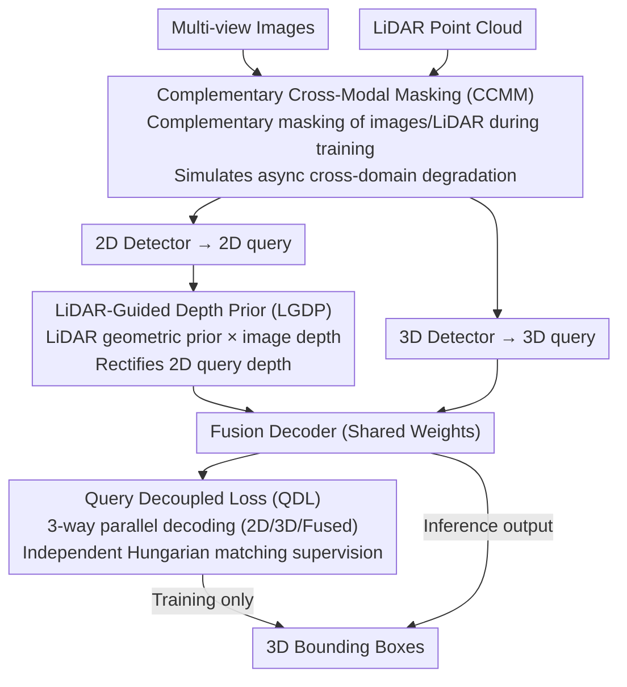

# CCF: Complementary Collaborative Fusion for Domain Generalized Multi-Modal 3D Object Detection

**Conference**: CVPR 2026  
**arXiv**: [2603.23276](https://arxiv.org/abs/2603.23276)  
**Code**: [GitHub](https://github.com/IMPL-Lab/CCF.git)  
**Area**: Autonomous Driving  
**Keywords**: Multi-modal 3D detection, Domain Generalization, Modal Imbalance, LiDAR-Camera Fusion, Cross-domain Robustness

## TL;DR

To address the modal imbalance issue in dual-branch multi-modal 3D detectors under domain shift, the CCF framework is proposed. It systematically improves camera query utilization and cross-domain robustness through three components: decoupled loss, LiDAR-guided depth priors, and complementary cross-modal masking.

## Background & Motivation

**Background**: Multi-modal 3D detection (LiDAR + Camera) has achieved excellent performance on standard benchmarks. However, performance degrades significantly in domain shift scenarios such as adverse weather and varying illumination.

**Limitations of Prior Work**: (a) Different modalities undergo heterogeneous degradation under conditions like rain or night—LiDAR point clouds become sparse in rain, while camera image quality deteriorates at night; (b) In dual-branch detectors, the LiDAR branch dominates the detection process, and the semantic information from the camera branch is systematically undervalued.

**Key Challenge**: Pilot analysis reveals that during training, the matching ratio of 3D queries to 2D queries reaches 37.5:1, meaning 2D queries receive almost no supervisory signals. Even when 2D detector proposal quality remains high in cross-domain scenarios (2D AP outperforms 3D projection), the 3D mAP of 2D queries is only 18.44% (vs. 67.75% for 3D queries).

**Goal**: Rebalance modal utilization in dual-branch detectors, enabling the camera branch to play a more significant role when LiDAR degrades.

**Key Insight**: Address the problem through three dimensions: supervision imbalance, inaccurate depth initialization, and over-reliance on LiDAR during the fusion stage.

**Core Idea**: Systematically enhance the competitiveness of 2D queries via decoupled supervision, geometric prior enhancement, and complementary masking strategies.

## Method

### Overall Architecture

CCF aims to resolve a specific imbalance: in dual-branch multi-modal detectors, the camera branch should ideally compensate when LiDAR degrades, but it is systematically suppressed by the LiDAR branch. Instead of redesigning the network, the authors integrate three complementary components into the existing MV2DFusion framework to decouple dependencies on LiDAR during training supervision, depth initialization, and fusion. After multi-view images and point clouds are input, independent 2D and 3D queries are generated. The Query Decoupled Loss ensures both paths receive independent supervision, the LiDAR-Guided Depth Prior provides reliable depth for 2D queries, and the Complementary Cross-Modal Masking deliberately corrupts single modalities during training to force the decoder to select queries based on reliability. All three components are active only during training; inference uses the original fusion branch with zero additional overhead. The following diagram illustrates the deployment of these components:

### Key Designs

**1. Query Decoupled Loss (QDL): Providing 2D queries with their own gradients instead of 3D query monopoly**

The pain point is straightforward: in standard training, 3D queries are more accurately localized, and Hungarian matching is almost entirely occupied by them. The authors measured a matching ratio of 3D to 2D at 37.5:1, meaning 2D queries receive negligible gradients. QDL forces the same decoder (with shared weights) to run three times in parallel—feeding only 2D queries, only 3D queries, and then fused queries. Each path performs independent Hungarian matching and loss calculation:

$$\mathcal{L}_{total} = \mathcal{L}_{2d} + \mathcal{L}_{3d} + \mathcal{L}_{fused}$$

The key is "three-way parallel" rather than "decoding once and splitting the loss": if different queries interact in the same self-attention layer, 2D queries will "free-ride" on localization info via interactions with 3D queries (shortcut learning). Isolation forces 2D queries to learn effectively.

**2. LiDAR-Guided Depth Prior (LGDP): Using LiDAR geometry to rectify unreliable 2D query depth priors**

2D queries suffer from inaccurate depth estimation—pure image depth MAE is 1.78m in the source domain and worsens to 3.01m in rain. LGDP provides two depth distributions for each 2D proposal: the learned distribution from the image branch $\mathbf{d}_i^{2d} \in \mathbb{R}^D$, and a geometric prior $\mathbf{d}_i^{3d} \in \mathbb{R}^D$ statistically derived from LiDAR points in the viewing frustum. A confidence network predicts a fusion weight $\lambda_i \in [0,1]$ to weight them in log space:

$$\mathbf{d}_i^{fused} = \sigma\big(\lambda_i \cdot \log(\mathbf{d}_i^{2d}) + (1-\lambda_i) \cdot \log(\mathbf{d}_i^{3d})\big)$$

Summation in log space is equivalent to a Product-of-Experts, encouraging the intersection of two "expert" distributions. Adaptive weighting $\lambda_i$ is necessary to handle sparse LiDAR points at a distance or noisy LiDAR in rain.

**3. Complementary Cross-Modal Masking (CCMM): Creating "asynchronous modal degradation" to force query selection by reliability**

Even with proper supervision and depth, the decoder might still "blindly trust LiDAR" during fusion. CCMM applies GridMask to images while applying a **complementary** mask to LiDAR—where images are masked, LiDAR points are kept, and vice versa. This simulates real-world asynchronous degradation (e.g., LiDAR degradation in rain while the camera remains usable). The decoder learns to adapt to modal reliability rather than always betting on LiDAR. Unlike CMT's modal dropout, complementary masking ensures both modalities are utilized without wasting information. Masking follows curriculum learning, with probability linearly increasing from 0 to $p=0.7$.

### Loss & Training

- Classification: Focal Loss; Regression: L1 Loss.
- Two-stage training: Stage 1 independently pre-trains 2D/3D detectors; Stage 2 freezes the 3D detector to train the fusion decoder.
- AdamW optimizer, initial LR 4e-4, cosine annealing, 24 epochs.

## Key Experimental Results

### Main Results

| Method | Source mAP | Rain mAP | Night mAP | Boston mAP | Avg mAP |
|------|-----------|----------|-----------|------------|---------|
| FSDv2 (LiDAR-only) | 59.6 | 23.4 | 36.6 | 28.2 | 29.4 |
| ISFusion | 66.3 | 39.8 | 41.8 | 45.4 | 42.3 |
| Baseline | 68.4 | 41.9 | 42.9 | 47.4 | 44.1 |
| **Ours (CCF)** | **68.2** | **44.7** | **44.2** | **50.6** | **46.5** |
| CCF (Oracle) | 73.6 | 72.9 | 46.9 | 73.6 | 64.5 |

### Ablation Study

| DL | DP | CM | Rain mAP | Night mAP | Boston mAP |
|----|----|----|----------|-----------|------------|
| ✗ | ✗ | ✗ | 41.9 | 42.9 | 47.4 |
| ✓ | ✗ | ✗ | 42.8 | 42.1 | 48.1 |
| ✗ | ✗ | ✓ | 44.5 | 43.4 | 49.6 |
| ✓ | ✓ | ✗ | 44.7 | 42.2 | 50.0 |
| ✓ | ✓ | ✓ | 44.7 | 44.2 | 50.6 |

### Key Findings

1. CCF consistently improves across three target domains: Rain +2.8, Night +1.3, Boston +3.2 mAP, while maintaining source performance (68.2 vs 68.4).
2. Complementary Masking (CM) is the most effective single component, improving Rain/Night/Boston by 2.6/0.5/2.2 respectively.
3. Complementary GridMask significantly outperforms consistent GridMask (Rain 44.3 vs 42.8).
4. Curriculum learning improves stability: NDS in Boston is 56.9 with curriculum vs 55.1 without.

## Highlights & Insights

- The Pilot Study is thorough, justifying the existence of modal imbalance via 2D AP, matching ratios, and depth errors.
- The "three-way parallel decoding" in QDL cleverly avoids shortcut learning with zero inference overhead.
- The Complementary Masking design is inspired by real-world asynchronous modal degradation patterns and possesses strong physical intuition.

## Limitations & Future Work

- Experiments were only conducted on nuScenes; evaluation on larger datasets like Waymo is needed.
- The GridMask pattern in CCMM is fixed; learned adaptive masking patterns could be considered.
- The 2D proposal generator (Faster R-CNN) is relatively old; switching to a stronger 2D detector might further release potential.
- Temporal information is not considered; multi-frame fusion could further enhance cross-domain robustness.

## Related Work & Insights

- Unlike missing-modality methods like MetaBEV or UniBEV, CCF focuses on scenarios where "modalities are available but have varying reliability."
- The complementary masking idea could generalize to other multi-modal tasks (e.g., text-image enhancement in VLMs).
- Product-of-Experts for depth fusion is an elegant paradigm for cross-modal information fusion.

## Rating

- Novelty: ⭐⭐⭐⭐ Clear problem definition and systematic solution.
- Experimental Thoroughness: ⭐⭐⭐⭐⭐ Comprehensive pilot study, main results, multi-dimensional ablation, and Oracle upper bound.
- Writing Quality: ⭐⭐⭐⭐⭐ Logical flow from problem discovery to solution.
- Value: ⭐⭐⭐⭐ Significant practical implications for domain generalization in autonomous driving multi-modal detection.

<!-- RELATED:START -->

## Related Papers

- [\[CVPR 2026\] RPGFusion: 4D Radar Prior-Guided Multi-Modal Fusion for 3D Detection](rpgfusion_4d_radar_prior-guided_multi-modal_fusion_for_3d_detection.md)
- [\[ICCV 2025\] EVT: Efficient View Transformation for Multi-Modal 3D Object Detection](../../ICCV2025/autonomous_driving/evt_efficient_view_transformation_for_multi-modal_3d_object_detection.md)
- [\[CVPR 2026\] R4Det: 4D Radar-Camera Fusion for High-Performance 3D Object Detection](r4det_4d_radar-camera_fusion_for_high-performance_3d_object_detection.md)
- [\[CVPR 2026\] Look Before You Fuse: 2D-Guided Cross-Modal Alignment for Robust 3D Detection](look_before_you_fuse_2d-guided_cross-modal_alignment_for_robust_3d_detection.md)
- [\[CVPR 2026\] OccAny: Generalized Unconstrained Urban 3D Occupancy](occany_generalized_unconstrained_urban_3d_occupancy.md)

<!-- RELATED:END -->
