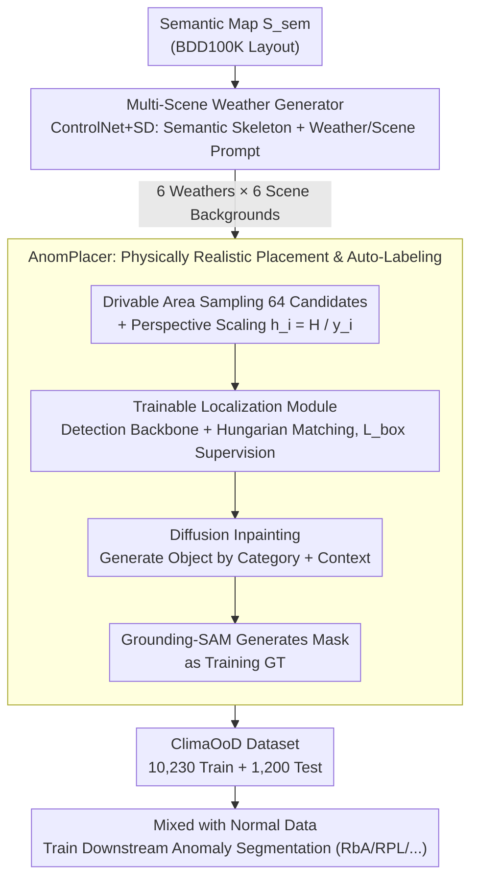

# ClimaOoD: Improving Anomaly Segmentation via Physically Realistic Synthetic Data

**Conference**: CVPR 2026  
**arXiv**: [2512.02686](https://arxiv.org/abs/2512.02686)  
**Code**: None yet  
**Area**: Autonomous Driving  
**Keywords**: Anomaly Segmentation, OoD Detection, Synthetic Data, Weather Augmentation, Diffusion Models, ControlNet

## TL;DR

The authors propose the ClimaDrive data generation framework and the ClimaOoD benchmark dataset. By combining semantic-guided multi-weather scene generation with perspective-aware anomaly object placement, they construct a 10K+ training set covering 6 weather conditions and 93 anomaly categories. After training, four SOTA methods achieved an average AP improvement of 3.25%.

## Background & Motivation

Anomaly (OoD) segmentation in autonomous driving aims to detect unknown objects outside the training distribution (e.g., dropped cargo, animals, roadblocks), which is a safety-critical capability. The current core bottleneck is **data scarcity**:

- **Existing datasets are small and lack diversity**:
    - LostAndFound: Only 1 terrain (urban), 9 anomaly categories.
    - Fishyscapes: 1 terrain, 7 anomaly categories.
    - SMIYC (SegmentMeIfYouCan): 4 terrains, 26 anomaly categories.
- **Weather coverage is near zero**: Most datasets only contain sunny scenes, whereas OoD detection in adverse weather is the true safety blind spot.
- **High real-world collection costs**: Anomaly events are rare, and traversing all combinations of weather $\times$ scene $\times$ anomaly type in the real world is impractical.

Synthetic data is a key path to breaking the data bottleneck. However, simple copy-paste synthesis lacks physical realism and fails to generate realistic weather effects. ClimaDrive utilizes the generative capabilities of diffusion models to systematically address the dual challenges of diversity and realism.

## Method

### Overall Architecture

ClimaOoD addresses the "data absence" dilemma in anomaly segmentation: combinations of adverse weather $\times$ rare anomaly objects are nearly impossible to collect in the real world. The ClimaDrive approach decomposes data generation into two steps—first using a Multi-Scene Weather Generator to "paint" driving scenes under 6 weather conditions from a clean semantic map, and then using AnomPlacer to physically and logically insert anomaly objects into these scenes with automatic labeling. These modules yield the ClimaOoD dataset (training set + manually filtered test set) covering 6 weather conditions $\times$ 93 anomaly categories.

### Key Designs

**1. Multi-Scene Weather Generator: Using Semantic Maps as Skeletons for Six Weathers**

Existing datasets consist almost entirely of sunny days, yet adverse weather is the safety blind spot for OoD detection. This module performs semantic-guided image-to-image generation based on ControlNet: it uses a semantic segmentation map as a spatial structure constraint (ensuring layouts of roads and buildings remain intact) and text prompts to specify weather and scene types. It supports 6 weather conditions: sunny, rainy, foggy, snowy, cloudy, and nighttime. The prompts combine weather descriptions with scene types (urban/suburban/highway) to batch-generate diverse backgrounds on the same semantic skeleton. This makes weather diversity controllable and enumerable rather than dependent on real-world collection.

**2. AnomPlacer: Making Anomaly Objects "Realistic" Rather Than Pasted**

Simple copy-pasted objects leave boundary artifacts that segmentation models learn as shortcuts. This module addresses "how to place anomaly objects realistically." It follows four steps: ① Uniformly sample 64 candidate boxes in the Drivable Region of the semantic map and adjust the bbox size according to a perspective prior—scaling the height $h_i = \frac{H}{y_i}$ (with width $w_i \propto h_i$) based on the vertical position $y_i$ of the object in the image. This avoids placing giant objects far away or tiny objects nearby; ② This step uses a **trainable localization module**—a detection backbone $F_\theta$ predicts refined bboxes $\hat{B}$, supervised by perspective-adjusted pseudo-boxes $B$ via Hungarian Matching. The localization loss $\mathcal{L}_{box}$ constrains both L1 distance and IoU to learn natural, non-overlapping positions; ③ Use a diffusion model for inpainting within the predicted boxes, conditioned on the anomaly category $t_j$ and global scene context $S_{scene}$ (e.g., "tunnel, rainy, daytime"), ensuring lighting and style consistency; ④ Use Grounding-SAM to generate segmentation masks for the inpainted area (followed by noise-denoise smoothing), which serve as training GT. This pipeline automates "sampling-perspective-localization-generation-labeling," ensuring physical realism without manual annotation.

### Loss & Training

The AnomPlacer in ClimaDrive is a **trainable** module with the objective function $\mathcal{L}_{total} = \mathcal{L}_{box} + \mathcal{L}_{inpaint}$. It adopts a two-stage optimization: the first stage pre-trains the localization module ($\mathcal{L}_{box}$ via L1 + IoU under Hungarian matching), and the second stage jointly optimizes the refinement results with the inpainting model. On the Weather Generator side, ControlNet is fine-tuned to use the semantic map as a structural constraint.

Downstream segmentation models are decoupled from ClimaDrive and follow their original training losses:

- **RbA (Residual-based Anomaly)**: Residual-based anomaly scoring.
- **RPL (Robust Pixel-Level)**: Pixel-level robust training.
- **Mask2Former**: Mask-based segmentation with an anomaly branch.
- **DenseHybrid**: Mixed density estimation and classification.

Training strategy: The ClimaOoD training set is mixed with original normal driving data for training, with anomaly masks provided by Grounding-SAM.

## Key Experimental Results

### Main Results

Improvements of four SOTA methods after training on ClimaOoD:

| Method | AP (Original → +ClimaOoD) | AUROC (Original → +ClimaOoD) | Gain |
|------|---------------------|------------------------|---------|
| RbA | Baseline → +ClimaOoD | Baseline → +ClimaOoD | AP↑, AUROC↑ |
| RPL | Baseline → +ClimaOoD | Baseline → +ClimaOoD | AP↑, AUROC↑ |
| Mask2Former | Baseline → +ClimaOoD | Baseline → +ClimaOoD | AP↑, AUROC↑ |
| DenseHybrid | Baseline → +ClimaOoD | Baseline → +ClimaOoD | AP↑, AUROC↑ |
| **Average Gain** | — | — | **AP +3.25%, AUROC +0.66%** |

### Ablation Study

| Condition | AP Change | Description |
|---------|--------|------|
| Sunny data only (No weather aug) | Decrease | Weather diversity is critical for generalization |
| No perspective prior (Fixed bbox size) | Decrease | Unrealistic object sizes cause models to learn wrong patterns |
| No Hungarian matching (Random placement) | Slight decrease | Object overlap reduces data quality |
| Copy-paste only (No inpainting) | Significant decrease | Boundary artifacts are exploited as shortcuts by the model |
| Reduced anomaly categories (93→20) | Decrease | Anomaly diversity is key |

### Key Findings

1. **ClimaOoD Dataset Scale**: 10K+ training images covering 6 weathers $\times$ 6 scene types $\times$ 93 anomaly categories, far exceeding existing datasets.
2. **Test Set Quality**: 1,200 high-quality test images selected manually.
3. **Adverse Weather Challenges Remain**: FPR95 increases from 7.8% in sunny conditions to 11.0% in adverse weather, indicating significant room for improvement in OoD detection under such conditions.
4. **Universality**: ClimaOoD is effective for four different architectures, suggesting that the benefits of data diversity are architecture-agnostic.

## Highlights & Insights

- **Systematic Solution to Data Bottleneck**: Rather than proposing a new model, the authors build a high-quality dataset—which holds more enduring value in the current "data-centric" paradigm.
- **Simplicity and Efficacy of Perspective Prior**: The simple formula $h_i = H / y_i$ significantly improves the physical realism of placement, reflecting "simple but effective" engineering wisdom.
- **93 Anomaly Categories**: Coverage ranges from common items (cones, tires) to rare ones (sofas, shopping carts), greatly enhancing the generalization of OoD detection.
- **Method-Agnostic Gains**: Improvements across four different paradigms validate the "Data > Model" insight.

## Limitations & Future Work

1. **Inpainting Quality via Diffusion**: Generation quality for certain anomalies (e.g., highly reflective objects) may be unstable, introducing noisy labels.
2. **Grounding-SAM Mask Precision**: Automatically generated masks are less precise than manual annotations, potentially leading to errors in boundary regions.
3. **High FPR95 in Adverse Weather (11.0%)**: Data augmentation mitigates but does not solve the weather robustness problem; model-level improvements are still needed.
4. **Lack of 3D Information**: Pure 2D synthesis cannot model 3D consistency like occlusions and shadows; generated objects may lack depth cues.
5. **Test Set Bias**: 1,200 manually selected images may introduce selection bias and might not fully represent the true long-tail distribution.
6. **ControlNet Semantic Input**: Dependence on existing semantic segmentation GT limits the degree of automation in data generation.

## Related Work & Insights

- **LostAndFound / Fishyscapes / SMIYC**: Existing OoD segmentation benchmarks → ClimaOoD surpasses them in scale and diversity.
- **ControlNet**: Conditional diffusion generation → Using semantic maps to control scene structure is an elegant design choice.
- **Grounding-SAM**: Open-vocabulary segmentation → Cleverly used for automatic anomaly mask label generation.
- **Insight**: This "generation engine + auto-labeling" data factory paradigm can be generalized to other data-scarce safety-critical tasks, such as medical anomaly detection.

## Rating

| Dimension | Score (1-5) | Description |
|------|-----------|------|
| Novelty | 3.5 | Technical modules are not entirely new, but the systematic combination and benchmark construction are valuable. |
| Utility | 4.5 | Dataset is directly usable; benefits four SOTA methods. |
| Experimental Thoroughness | 4.0 | Four methods + detailed ablation studies, though lacks validation on real-world adverse weather data. |
| Writing Quality | 3.5 | Structure is clear, but descriptions of generation details could be more exhaustive. |
| **Overall** | **3.9** | A strong utility-oriented work; the dataset itself is a more lasting contribution than the method. |

<!-- RELATED:START -->

## Related Papers

- [\[ECCV 2024\] Reliability in Semantic Segmentation: Can We Use Synthetic Data?](../../ECCV2024/autonomous_driving/reliability_in_semantic_segmentation_can_we_use_synthetic_data.md)
- [\[CVPR 2026\] Learning to Identify Out-of-Distribution Objects for 3D LiDAR Anomaly Segmentation](learning_to_identify_out-of-distribution_objects_for_3d_lidar_anomaly_segmentati.md)
- [\[ICLR 2026\] Rethinking Driving World Model as Synthetic Data Generator for Perception Tasks](../../ICLR2026/autonomous_driving/rethinking_driving_world_model_as_synthetic_data_generator_for_perception_tasks.md)
- [\[ICCV 2025\] Unraveling the Effects of Synthetic Data on End-to-End Autonomous Driving](../../ICCV2025/autonomous_driving/unraveling_the_effects_of_synthetic_data_on_end-to-end_autonomous_driving.md)
- [\[ECCV 2024\] Random Walk on Pixel Manifolds for Anomaly Segmentation of Complex Driving Scenes](../../ECCV2024/autonomous_driving/random_walk_on_pixel_manifolds_for_anomaly_segmentation_of_complex_driving_scene.md)

<!-- RELATED:END -->
