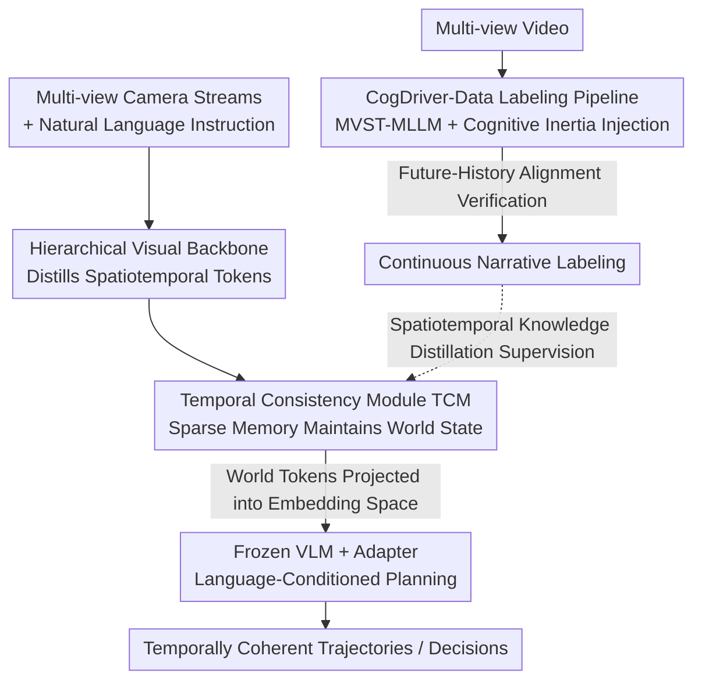

# CogDriver: Integrating Cognitive Inertia for Temporally Coherent Planning in Autonomous Driving

**Conference**: CVPR 2026  
**Paper**: [CVF Open Access](https://openaccess.thecvf.com/content/CVPR2026/html/Liu_CogDriver_Integrating_Cognitive_Inertia_for_Temporally_Coherent_Planning_in_Autonomous_CVPR_2026_paper.html)  
**Code**: None (The paper provides a Project link "CogDriver", but the specific repository URL is not public; ⚠️ refer to the original text)  
**Area**: Autonomous Driving / Multi-modal VLM  
**Keywords**: End-to-end Planning, Cognitive Inertia, Temporal Coherence, Vision-Language-Action, Knowledge Distillation

## TL;DR
CogDriver explicitly injects "cognitive inertia"—the natural persistence of human intent—into end-to-end driving systems. It utilizes a multi-view spatiotemporal MLLM to automatically label VLA datasets with continuous narratives while integrating a Sparse Temporal Consistency Module (TCM) within the agent to maintain stable internal states. This prevents decision jitter; it achieves a 22% increase in Driving Score on Bench2Drive and a 21% reduction in L2 error on nuScenes, sets a new SOTA.

## Background & Motivation
**Background**: Current end-to-end driving systems extensively leverage Vision-Language Models (VLMs) to achieve "reasoning-capable and interpretable" planning. The mainstream approach feeds current frames and instructions into a VLM to output trajectories or actions.

**Limitations of Prior Work**: These VLMs are essentially "stateless"—treating every frame as an isolated problem evaluated from scratch, resembling a driver who loses memory and re-recognizes the world every fraction of a second. This results in **decision jitter**: when facing a slow vehicle, the agent might decide to overtake from the left, cancel immediately upon seeing a car behind on the left, return to the lane, and then switch to overtaking from the right. This "left-cancel-right" oscillation is dangerous and unpredictable. Furthermore, it fails to execute complex maneuvers requiring multi-step persistence.

**Key Challenge**: The root cause is the model's lack of **cognitive inertia**—the natural continuity of intention—which stems from a deeper failure: the **inability to maintain temporal coherence**. Without this "cognitive anchor," the agent's internal representations are fragmented and instantaneous. Notably, existing "language-augmented" driving datasets (BDD-X, DriveLM, CoVLA, etc.) replicate this flaw: they provide either frame-by-frame snapshot reasons or continuous trajectories without "continuous whys," lacking the evolutionary causal narrative that links decisions over time.

**Goal**: To enable VLA agents to form coherent internal representations, allowing them to act with stability and foresight like humans. This is broken down into two sub-problems: (1) Data side: how to obtain supervision signals with "persistent intent + evolutionary causality"; (2) Model side: what mechanism can solidify this temporal coherence into the agent.

**Key Insight**: The authors argue that while world-model-style "predicting future pixels/latents" is important, the more fundamental prerequisite is **maintaining a consistent internal representation across time**. Rather than building reactive predictors, it is better to "engineer" a cognitively coherent agent.

**Core Idea**: Explicitly inject cognitive inertia using "narrative labeling + sparse temporal memory." The former provides supervision for learning temporal dynamics and persistent intent, while the latter maintains a stable internal state during inference, replacing "reactive frame-by-frame mapping" with a "continuously evolving policy."

## Method
CogDriver consists of two components: **CogDriver-Data** (addressing supervision signals) and **CogDriver-Agent** (addressing mechanism solidification). The former uses a novel multi-view spatiotemporal MLLM to automatically generate VLA labels with continuous narratives; the latter compresses multi-view inputs into spatiotemporal tokens, maintains memory via a temporal consistency module, and projects them into a frozen VLM for language-conditioned planning.

### Overall Architecture
Data flow during inference: Multi-view camera streams → Hierarchical visual backbone distilling compact spatiotemporal tokens → Temporal Consistency Module (TCM) maintaining world state via sparse memory → "World tokens" projected into the frozen VLM's embedding space, fused with historical states and natural language instructions → Lightweight trainable adapter guiding the VLM to output temporally coherent trajectories. Training data comes from an offline labeling pipeline: Multi-view video → MVST-MLLM labeler + cognitive inertia injection → Future-History Alignment verification → Continuous narrative labeling (CogDriver-Data).

### Key Designs

**1. CogDriver-Data and Cognitive Inertia Labeling Pipeline: Supervision with "Continuous Whys"**

Addressing the lack of evolutionary causal narratives in existing datasets, the authors constructed two large-scale VLA datasets (CogDriver-nuScenes, CogDriver-Bench2Drive). The key lies in the labeling method: a pipeline generating "story-like" continuous labels capturing persistent intent, causal reasoning, and corresponding actions. The pipeline has two technical cores. First, the **Multi-View Spatiotemporal MLLM (MVST-MLLM)** acts as the labeler—its visual encoder is claimed to be the first designed to **concurrently process multi-view video streams**, using a hierarchical structure of Conv3D and window attention to extract and fuse features across both spatial (all camera views) and temporal dimensions. This enables reasoning about dynamic events like "a car merging from the right while a pedestrian appears on the left." Second, **cognitive inertia injection**: the model is conditioned on a structured prompt containing high-level Rules and Tasks, forcing it to use these static principles to generate **a continuous narrative throughout the time sequence**, rather than disjointed frame-by-frame descriptions. Finally, **Future-History Alignment** verifies the generated narrative against ground-truth vehicle trajectories to ensure physical plausibility.

**2. Temporal Consistency Module (TCM): Sparse Temporal Memory for Stable Internal States**

This is the "cornerstone" for the agent to maintain cognitive inertia, solving the challenge of tracking object states under ego-motion and occlusion. TCM operates in three stages. **Geometric Propagation**: Explicitly compensates for ego-motion by geometrically warping historical 3D object queries $Q^{hist}_p$ into the current frame coordinate system using $Q^{aligned}_p = E_{ego}\cdot Q^{hist}_p$, providing an initial state prior grounded in physical reality. **Motion-Conditioned State Refinement**: Pure geometric alignment is insufficient for complex dynamics. Instead of static normalization, affine coefficients $\alpha, \beta$ are parameterized as functions of the full motion context $\alpha, \beta = \text{MotionEncoder}(E_{ego}, v, \Delta t)$. Motion-conditioned modulation is then applied to positional encodings and context features:

$$Q_{pe} = \alpha\cdot\text{LN}(\psi(Q^{aligned}_p)) + \beta, \qquad Q_m = \alpha\cdot\text{LN}(Q^{hist}_c) + \beta$$

This allows the network to learn feature-level compensation—e.g., amplifying features of fast-moving objects and deweighting potentially occluded ones. **State Reconciliation and Fusion**: Memory queries $Q_m$ with strong temporal priors are concatenated with new perception queries $Q^{init}_c$ as $Q_{hybrid} = \text{Concat}(Q_m, Q^{init}_c)$. Self-attention performs "state reconciliation" (weighting historical beliefs against new observations), and the reconciled queries are grounded back to current visual evidence via cross-attention, injecting modulated positional encodings $Q_{pe}$ into image feature keys for precise spatial guidance. This design ensures robust object permanence and temporally consistent perception.

**3. Language-Conditioned Planning via Frozen VLM + Spatiotemporal Knowledge Distillation**

To preserve pre-trained VLM reasoning without degradation, the VLM core is frozen, and only lightweight adapters are trained. World tokens from the TCM are projected into the VLM embedding space, fused with history and instructions, and the adapter guides the VLM to generate trajectories. This is learned through **spatiotemporal knowledge distillation**, explicitly "teaching" the model to maintain decision consistency using the narrative structure of CogDriver-Data. Training uses a composite loss: the QFormer end jointly handles 3D detection and structured scene understanding using Focal Loss for classification and L1 for regression:

$$L_{pc} = \lambda_c L_{cls} + \lambda_r L_{reg} + \lambda_{mc} L_{mcls} + \lambda_{mr} L_{mreg}$$

The LLM end uses autoregressive cross-entropy $L_{ce}$, with the total objective $L_{total} = L_{pc} + L_{ce}$.

### Loss & Training
The visual encoder uses EVA-02-L (MIM pre-trained with CLIP distillation), and the base model is LLaVA v1.5. Fine-tuning uses AdamW with a batch size of 16 and differential learning rates: $4\times10^{-4}$ for the projector and $2\times10^{-5}$ for the visual encoder and LLM to preserve pre-trained knowledge; cosine annealing is used for stable convergence.

## Key Experimental Results

### Main Results: Bench2Drive Closed-loop Planning
Comparison of open-loop L2 and closed-loop Driving Score / Success Rate (Selected; ↑ is better, ↓ is better):

| Method | Avg. L2 ↓ | Driving Score ↑ | Success Rate(%) ↑ | Efficiency ↑ |
|------|-----------|-----------------|-------------------|--------------|
| UniAD-Base | 0.73 | 45.81 | 16.36 | 129.21 |
| VAD | 0.91 | 42.35 | 15.00 | 157.94 |
| DriveAdapter | 1.01 | 64.22 | 33.08 | 70.22 |
| DriveTransformer | **0.62** | 63.46 | 35.01 | 100.64 |
| **Ours (CogDriver-Agent)** | 0.63 | **78.21 (22%↑)** | **56.93 (63%↑)** | 169.52 |

The 22% improvement in closed-loop Driving Score and 63% increase in Success Rate represent major leaps in long-range planning quality. Open-loop L2 and efficiency remain competitive, showing gains do not come at the expense of imitation accuracy.

### VQA Task (Selected CogDriver-nuScenes)

| Model | CIDEr ↑ | BLEU-1 ↑ | BLEU-4 ↑ | ROUGE-L ↑ |
|------|---------|----------|----------|-----------|
| Qwen2.5VL 72B | 67.14 | 18.78 | 3.25 | 21.91 |
| InternVL3 14B | 70.01 | 8.82 | 1.09 | 19.18 |
| **Ours (CogDriver-Agent)** | **92.39** | **51.54** | **14.45** | **32.75** |

Significant advantages in narrative generation quality over the strongest open-source MLLMs.

### Ablation Study

| Config | BLEU-1 ↑ | L2 ↓ | CR ↓ | IR ↓ | Description |
|------|----------|------|------|------|------|
| Full Model | 51.54 | 0.34 | 0.40 | 3.18 | Complete CogDriver-Agent |
| w/o TCM | 52.24 | 0.38 | 0.44 | 3.65 | Remove Sparse Temporal Memory |
| w/ TCM | 51.54 | 0.34 | 0.40 | 3.18 | Comprehensive improvement in L2/CR/IR |

### Key Findings
- **TCM drives planning safety**: Its inclusion drops L2 from 0.38 to 0.34 and reduces collision/infraction rates; the model becomes more "stable" rather than just memorizing answers.
- **Each components role**: Environmental context improves language generation (BLEU-1 +7.6%), while dynamic/static object descriptions primarily enhance safety; trajectory prediction L2 remains stable at 0.34 across configurations.
- **Real-time constraints met**: Throughput on a single A800 (3410 tokens/s input, 391 tokens/s output) is significantly higher than the Qwen2.5VL 32B baseline.
- **Qualitatively shows "evolutionary causal narrative"**: High-level plans (e.g., "Left Turn") stay consistent across frames, while low-level reasons mature from "car ahead" to "intersection ahead," contrasting with stateless models focusing only on immediate visual cues.

## Highlights & Insights
- **Engineering psychological intuition**: It goes beyond the concept of "cognitive inertia" by implementing it via "narrative labeling + sparse temporal memory" and validates it through reduced decision jitter.
- **Motion-conditioned affine modulation**: Parameterizing normalization coefficients as functions of motion allows the network to adaptively modulate features based on speed and occlusion, a trick applicable to any ego-motion-compensated temporal module.
- **Frozen VLM + Adapter + Narrative Distillation**: Aligning pre-trained reasoning to temporally coherent trajectories with minimal trainable parameters is a practical paradigm for VLA deployment.

## Limitations & Future Work
- The evidence focuses heavily on narrative quality and closed-loop scores, but lacks a direct, independent quantitative metric for "cognitive inertia" itself (e.g., jitter statistics). ⚠️ Reduction in decision jitter is mostly shown qualitatively.
- Open-loop nuScenes collision rates (0.40%) are not the lowest (Senna 0.12%, DriveVLM 0.27%), indicating a remaining safety gap; Comfortness (20.50) is notably lower than UniAD, suggesting comfort might be sacrificed.
- The labeling pipeline relies heavily on the quality of the MVST-MLLM teacher and alignment; the propagation of labeling noise to the downstream agent is not fully analyzed.
- Future directions: Introducing explicit jitter/intent persistence metrics, extending memory to longer-range (minutes) planning, and assessing narrative causality in long-tail interaction scenarios.

## Related Work & Insights
- **vs. Language-Augmented Datasets (BDD-X / DriveLM / CoVLA)**: These provide snapshots; CogDriver-Data models continuous actions and multi-view perception with evolving thought processes.
- **vs. World Models**: Unlike methods that explicitly predict future pixels, CogDriver prioritizes maintaining a consistent internal representation through "memory-reconciliation."
- **vs. MLLM-grounded Planning**: Most prior works are stimulus-response mappings; this work reasons on spatiotemporal causal dependencies to unlock zero-shot E2E planning.

## Rating
- Novelty: ⭐⭐⭐⭐ Connects cognitive inertia to data and architecture; motion-conditioned modulation is novel.
- Experimental Thoroughness: ⭐⭐⭐⭐ Significant gains across all tracks, though lacks direct quantification of jitter.
- Writing Quality: ⭐⭐⭐⭐ Vivid motivation and clear hierarchy.
- Value: ⭐⭐⭐⭐ Provides a complete solution (dataset + architecture) with strong reference value for E2E VLA driving.

<!-- RELATED:START -->

## Related Papers

- [\[CVPR 2026\] ColaVLA: Leveraging Cognitive Latent Reasoning for Hierarchical Parallel Trajectory Planning in Autonomous Driving](colavla_leveraging_cognitive_latent_reasoning_for_hierarchical_parallel_trajecto.md)
- [\[CVPR 2026\] Perceiving the Near, Reasoning the Distant: Coherent Long-Horizon Trajectory Prediction for Autonomous Driving](perceiving_the_near_reasoning_the_distant_coherent_long-horizon_trajectory_predi.md)
- [\[CVPR 2026\] Neuro-Cognitive Reward Modeling for Human-Centered Autonomous Vehicle Control](neuro-cognitive_reward_modeling_for_human-centered_autonomous_vehicle_control.md)
- [\[CVPR 2026\] ActiveAD: Planning-Oriented Active Learning for End-to-End Autonomous Driving](activead_planning-oriented_active_learning_for_end-to-end_autonomous_driving.md)
- [\[CVPR 2026\] GuideFlow: Constraint-Guided Flow Matching for Planning in End-to-End Autonomous Driving](guideflow_constraint-guided_flow_matching_for_planning_in_end-to-end_autonomous_.md)

<!-- RELATED:END -->
