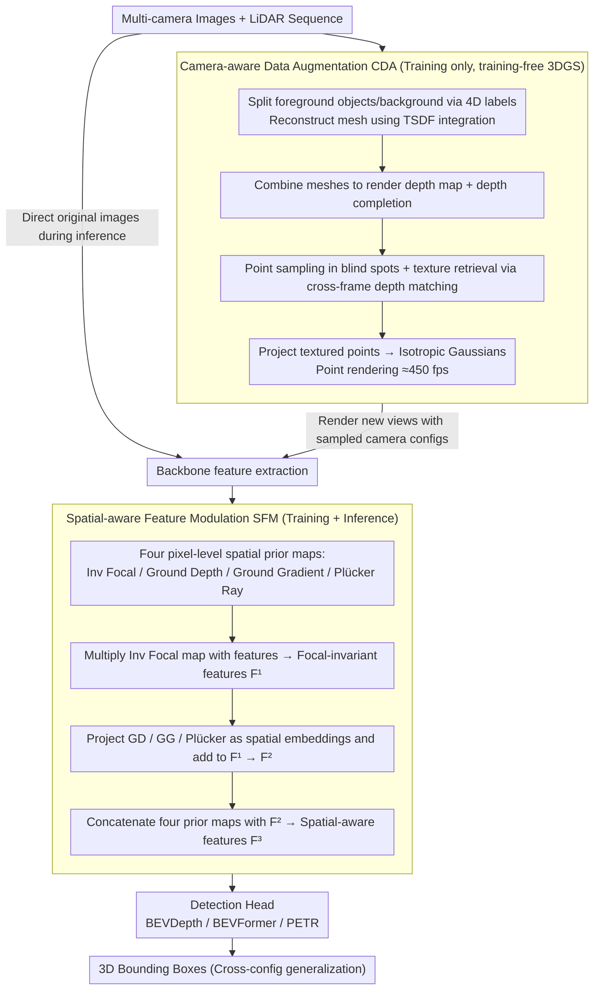

# CoIn3D: Revisiting Configuration-Invariant Multi-Camera 3D Object Detection

**Conference**: CVPR2026  
**arXiv**: [2603.05042](https://arxiv.org/abs/2603.05042)  
**Code**: [GitHub](https://github.com/) (Author claimed open-sourced, link to be confirmed)  
**Area**: Autonomous Driving  
**Keywords**: Multi-camera 3D object detection, cross-configuration generalization, spatial prior modulation, 3D Gaussian data augmentation, BEV perception

## TL;DR

The CoIn3D framework is proposed, which explicitly models the spatial prior differences in camera intrinsics, extrinsics, and array layouts through two modules: Spatial-aware Feature Modulation (SFM) and Camera-aware Data Augmentation (CDA). It achieves strong generalization of multi-camera 3D detection models from source configurations to unseen target configurations and is applicable to the three major paradigms: BEVDepth, BEVFormer, and PETR.

## Background & Motivation

1.  **Wide Deployment of Multi-Camera 3D Detection (MC3D)**: Autonomous vehicles and robotic platforms increasingly use multi-camera surround-view solutions for 3D object detection, creating an urgent demand for cross-platform model deployment capabilities.
2.  **Difficulty in Cross-Configuration Generalization**: Current MC3D models perform excellently on training configurations but suffer significant performance drops when migrated to new platforms (different intrinsics, extrinsics, camera counts, and layouts). For instance, direct transfer of BEVDepth from NuScenes to Waymo yields an mAP of only 0.040.
3.  **Incomplete Existing Solutions**: Previous methods either align to a meta-camera via image warping (causing resolution loss and 3D scene structure distortion) or only handle focal length differences (virtual focal length + depth rescaling), failing to comprehensively consider extrinsics and array layouts.
4.  **Focal Length Ambiguity**: Since objects of the same size occupy different pixel areas under different focal lengths, ambiguity arises in depth estimation and feature aggregation, preventing the model from consistently understanding object distances.
5.  **Ground Geometry Priors Varying with Extrinsics**: Cameras with different mounting heights and orientations produce different ground depth distributions and depth growth rates; models tend to overfit to specific perspective effects during training.
6.  **Array Layout Differences Affecting Multi-Camera Fusion**: Different platforms have different camera counts and overlap regions, directly affecting the patterns of multi-camera feature correlation and fusion. Existing methods lack modeling for this.

## Method

### Overall Architecture

CoIn3D consists of two core modules: **Spatial-aware Feature Modulation (SFM)** and **Camera-aware Data Augmentation (CDA)**. During training, CDA first renders new-view images with random configurations via 3DGS, then SFM embeds spatial priors into features. At inference, only SFM is required to generalize to new configurations. The framework can be plugged into bottom-up BEV (BEVDepth), top-down BEV (BEVFormer), and sparse query (PETR) paradigms.

### Key Designs

**1. Spatial-aware Feature Modulation (SFM): Explicitly Embedding Camera Configurations**

Cross-configuration transfer fails because models implicitly learn camera-specific parameters like focal length and mounting poses. SFM explicitly encodes these differences using four pixel-level spatial prior maps and injects them into features, forcing the network to learn the "scene" rather than "this specific camera":

*   **Inverse Focal Map**: A focal length difference of $k$ times leads to a $k^2$ difference in object pixel area. Thus, the image features are normalized by multiplying with $M_{IF} = \mathbf{1} \cdot \frac{1}{f^2}$ to eliminate focal ambiguity (the largest contributor in ablations).
*   **Ground Depth Map**: Assuming a flat ground, a plane $Ax+By+Cz+D=0$ is fitted using at least 3 non-collinear ground points to derive pixel-wise ground depth $z(u,v) = -\frac{D}{AX+BY+C}$, providing an explicit spatial prior.
*   **Ground Gradient Map**: Row-wise differentiation is performed on the ground depth map with a log-inverse transform $M_{GG} = \log(\frac{1}{\Delta z} + 1)$ to encode depth growth rates under different mounting heights, preventing overfitting to specific perspectives.
*   **Plücker Raymap**: Each pixel's ray direction $\mathbf{d} = \mathbf{R}\mathbf{K}^{-1}\mathbf{p}$ and moment $\mathbf{m} = \mathbf{t} \times \mathbf{d}$ from the optical center are calculated, yielding 6-channel Plücker coordinates. This uniformly represents FoV, rotation, translation, and continuous spatial positions across cameras.

Fusion is progressive: first, $F^1$ is obtained via inverse focal normalization; then, GD/GG/PR are concatenated and encoded as spatial embeddings by a shallow projector and added to $F^1$ to get $F^2$; finally, the four raw prior maps are concatenated with $F^2$ to produce the final spatial-aware feature $F^3$.

**2. Camera-aware Data Augmentation (CDA): On-the-fly Configuration Synthesis via Training-free 3DGS**

SFM alone is insufficient as training data only covers source configurations. CDA proposes a **training-free ego-centric 3DGS pipeline** to dynamically generate diverse configurations: first, LiDAR sequences are split into foreground and background using 4D labels, followed by mesh reconstruction via TSDF integration (foreground objects are completed into closed surfaces); then, depth maps are rendered and completed. Textures are retrieved via cross-frame depth matching for object meshes and camera blind spots. Finally, RGB-D is projected into textured point clouds and treated as isotropic Gaussians (fixed radius, no rotation, opacity of 1) to achieve high-speed rendering at ≈450 fps. During training, new viewpoints are rendered by sampling camera configurations, while original images undergo random focal scaling.

### Loss & Training

The original detection losses of the base models (BEVDepth / BEVFormer / PETR) are retained. As plug-and-play modules, SFM and CDA do not introduce additional training losses.

## Key Experimental Results

### Main Results: Cross-Dataset Generalization based on BEVDepth

| Setting | Method | mAP↑ | mATE↓ | mAOE↓ | NDS*↑ |
|------|------|------|-------|-------|-------|
| NuScenes→Waymo | Direct Transfer | 0.040 | 1.303 | 0.790 | 0.178 |
| NuScenes→Waymo | UDGA-BEV (Prev. SOTA) | 0.349 | 0.754 | 0.250 | 0.459 |
| NuScenes→Waymo | **CoIn3D (Ours)** | **0.381** | **0.687** | **0.155** | **0.513** |
| NuScenes→Lyft | Direct Transfer | 0.112 | 0.997 | 0.389 | 0.296 |
| NuScenes→Lyft | UDGA-BEV | 0.324 | 0.709 | 0.180 | 0.487 |
| NuScenes→Lyft | **CoIn3D (Ours)** | **0.375** | **0.660** | **0.101** | **0.534** |
| Waymo→NuScenes | **CoIn3D (Ours)** | **0.349** | 0.727 | 0.179 | **0.481** |
| Lyft→NuScenes | **CoIn3D (Ours)** | **0.303** | **0.647** | 0.377 | **0.452** |

SOTA is achieved in all settings, with NDS* gains of +0.054 / +0.047 / +0.004 / +0.031 compared to UDGA-BEV.

### Cross-Paradigm Generalization: BEVFormer and PETR

| Setting | Method | mAP↑ | NDS*↑ |
|------|------|------|-------|
| N→L (BEVFormer) | Direct Transfer | 0.149 | 0.115 |
| N→L (BEVFormer) | **CoIn3D** | **0.237** | **0.377** |
| N→L (PETR) | Direct Transfer | 0.013 | 0.046 |
| N→L (PETR) | **CoIn3D** | **0.332** | **0.456** |

CoIn3D is the first cross-configuration generalization framework uniformly applicable to the three major MC3D paradigms.

### Ablation Study

**Module Ablation (NuScenes→Waymo)**:

| CDA | SFM | NDS*↑ |
|-----|-----|-------|
| ✗ | ✗ | 0.178 |
| ✗ | ✓ | 0.358 |
| ✓ | ✗ | 0.224 |
| ✓ | ✓ | **0.513** |

- SFM is effective on its own (+0.180), while CDA provides limited gains alone (+0.046); the combining of both yields strong synergy.
- The original Camera-Aware SE module in BEVDepth conflicts with SFM; removing it yielded better results (0.513 vs 0.504).

**SFM Spatial Prior Ablation**: The Inverse Focal Map contributes the most (+0.238), with Ground Depth/Gradient/Plücker cumulatively adding +0.036 / +0.008 / +0.007.

**CDA Augmentation Ablation**: Focal augmentation adds +0.060, and New View Synthesis (NVS) adds an additional +0.095, indicating that NVS provides far better diversity for configurations than simple focal scaling.

## Highlights

- **Comprehensive Analysis of Configuration Differences**: Systematically decomposes the cross-configuration generalization problem into intrinsics (focal/FoV), extrinsics (mounting pose), and array layout, proposing four targeted spatial prior representations.
- **Simple and Effective Inverse Focal Normalization**: A simple $1/f^2$ multiplication improves NDS* from 0.224 to 0.462, standing out as the largest contributor in ablations.
- **Training-free 3DGS Augmentation**: Avoids the high training costs of traditional 3DGS by directly constructing Gaussian representations using predefined parameters, rendering at ≈450 fps for online dynamic augmentation.
- **Paradigm-Agnostic Unified Framework**: The same SFM+CDA set can be plugged into BEVDepth, BEVFormer, and PETR regardless of specific depth prediction designs.
- **Significantly Narrowing the Gap with Oracle**: NDS* for NuScenes→Waymo increased from 0.178 to 0.513 (Oracle is 0.649), bridging approximately 71% of the performance gap.

## Limitations & Future Work

- **Unresolved Semantic Distribution Gap**: Only configuration differences are handled; differences in class/scene distributions across datasets still affect generalization, which authors list as future work.
- **LiDAR Dependency for 3DGS**: The CDA module requires LiDAR data for mesh and depth reconstruction, limiting application on vision-only datasets.
- **Ground Plane Assumption**: Assumes a flat ground for depth and gradient map derivation, which may fail in non-flat scenarios (ramps, undulating roads).
- **Single-Class Evaluation Focus**: Main experiments predominantly validate on the "car" class; generalization in multi-class scenarios requires further exploration.
- **CDA Storage Overhead**: Requires constructing and storing ego-centric Gaussian point clouds per frame, posing costs for storage and preprocessing of large-scale datasets.

## Related Work & Insights

| Method | Focal Handling | Extrinsic Handling | Array Layout | Paradigm | NDS* (N→W) |
|------|---------|---------|---------|---------|------------|
| DG-BEV | Virtual Focal | ✗ | ✗ | Bottom-up BEV | 0.415 |
| PD-BEV | Virtual Focal + Rescaling | ✗ | ✗ | Bottom-up BEV | — |
| UDGA-BEV | Virtual Focal + Consistency | ✗ | ✗ | Bottom-up BEV | 0.459 |
| UniPAD [47] | Spherical Warping | Spherical Alignment | ✗ | Bottom-up BEV | — |
| **CoIn3D (Ours)** | **Inv Focal Map** | **GD/GG + Plücker** | **Plücker Encoding** | **All paradigms** | **0.513** |

This work is the first to comprehensively and explicitly model three configuration priors and is the only solution simultaneously applicable to the three major MC3D paradigms.

## Rating

- Novelty: ⭐⭐⭐⭐ — The combination of four spatial priors and training-free 3DGS augmentation is innovative; inverse focal normalization is simple and elegant.
- Experimental Thoroughness: ⭐⭐⭐⭐⭐ — Three datasets × three paradigms × four settings, with exhaustive ablations and comprehensive comparisons.
- Writing Quality: ⭐⭐⭐⭐ — Systematic and clear problem analysis, intuitive illustrations, and complete derivations.
- Value: ⭐⭐⭐⭐ — Addresses practical pain points in cross-platform MC3D deployment with high industrial potential.

<!-- RELATED:START -->

## Related Papers

- [\[AAAI 2026\] Exploring Surround-View Fisheye Camera 3D Object Detection](../../AAAI2026/autonomous_driving/exploring_surround-view_fisheye_camera_3d_object_detection.md)
- [\[CVPR 2026\] SToRe3D: Sparse Token Relevance in ViTs for Efficient Multi-View 3D Object Detection](store3d_sparse_token_relevance_in_vits_for_efficient_multi-view_3d_object_detect.md)
- [\[CVPR 2026\] R4Det: 4D Radar-Camera Fusion for High-Performance 3D Object Detection](r4det_4d_radar-camera_fusion_for_high-performance_3d_object_detection.md)
- [\[CVPR 2025\] RaCFormer: Towards High-Quality 3D Object Detection via Query-based Radar-Camera Fusion](../../CVPR2025/autonomous_driving/racformer_towards_high-quality_3d_object_detection_via_query-based_radar-camera_.md)
- [\[CVPR 2026\] CCF: Complementary Collaborative Fusion for Domain Generalized Multi-Modal 3D Object Detection](ccf_complementary_collaborative_fusion_for_domain_generalized_multi-modal_3d_obj.md)

<!-- RELATED:END -->
