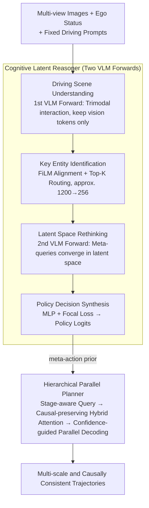

# ColaVLA: Leveraging Cognitive Latent Reasoning for Hierarchical Parallel Trajectory Planning in Autonomous Driving

**Conference**: CVPR 2026  
**arXiv**: [2512.22939](https://arxiv.org/abs/2512.22939)  
**Code**: [Yes](https://github.com/pqh22/ColaVLA)  
**Area**: Autonomous Driving  
**Keywords**: End-to-end Autonomous Driving, VLM Reasoning, Latent Space Reasoning, Multi-scale Trajectory Planning, Vision-Language-Action

## TL;DR

ColaVLA proposes a unified Vision-Language-Action (VLA) framework that shifts VLM reasoning from textual Chain-of-Thought (CoT) to the latent space. Through a Cognitive Latent Reasoner and a Hierarchical Parallel Planner, it efficiently completes scene understanding and trajectory decoding in just two VLM forward passes, achieving SOTA performance on both nuScenes open-loop and closed-loop benchmarks.

## Background & Motivation

End-to-end autonomous driving methods are evolving from modular pipelines toward unified learning. While the introduction of VLMs brings cross-modal priors and common-sense reasoning, current VLM-based planners face three core problems:

**Modal Mismatch**: There is a natural gap between discrete text tokens and continuous trajectory coordinates, which can result in formatting violations or physically inconsistent waypoints.

**High Chain-of-Thought Latency**: Auto-regressive token-by-token decoding leads to ever-growing sequences, with inference latency reaching over 3700 ms (e.g., OmniDrive, SOLVE-VLM).

**Non-causal Planner Deployment Constraints**: Existing planners cannot achieve parallel decoding while maintaining a causal structure.

The core idea of ColaVLA is to perform reasoning entirely within a unified latent space, avoiding lengthy text generation while preserving the knowledge priors and generalization capabilities of the VLM.

## Method

### Overall Architecture

ColaVLA aims to enable VLMs to provide common-sense reasoning for planning without being hindered by the latency of text generation or modal gaps. The approach migrates the entire reasoning chain into the latent space and concludes with a planner capable of parallel trajectory output. The process consists of two stages: the first is the **Cognitive Latent Reasoner**, which mimics the four cognitive stages of human driving ("understand the scene → lock onto key targets → rethink → determine strategy") entirely in the latent space, utilizing two VLM forward passes to define meta-action priors. The second is the **Hierarchical Parallel Planner**, which uses these priors to decode multi-scale trajectories simultaneously in a single forward pass while maintaining causal structure. Two VLM forward passes plus one planner decoding step represent the total inference cost, reducing latency from the 3700ms range to approximately 700ms.

### Key Designs

**1. Driving Scene Understanding: Using the first VLM forward pass to "read" multi-view frames into globally interacted vision tokens.**

The first hurdle for VLM-based planners is heterogeneous input—multi-view images, ego status, and prompt text. This step concatenates the fixed driving prompt embedding $\mathbf{T}$, multi-view visual embedding $\mathbf{V}$, and ego status token $\mathbf{E}$ into a sequence, passing it through the shared VLM Transformer for full interaction:

$$\mathbf{Q}_V = \mathcal{D}_{\text{vlm}}([\mathbf{T}; \mathbf{V}; \mathbf{E}]) \in \mathbb{R}^{L_v \times D}$$

After interaction, only the visual slice $\mathbf{Q}_V$ is retained, discarding the text and ego embeddings. This ensures the prompt remains immutable and avoids redundancy, while the vision tokens absorb ego status and task semantics as the sole carriers for subsequent reasoning.

**2. Key Entity Identification: Compressing thousands of vision tokens into hundreds of "safety-critical" bottlenecks using ego-adaptive routing.**

A single multi-view frame can involve thousands of vision tokens, but driving decisions are often determined by a few objects (lead vehicle, crossing pedestrians, red lights). Directly feeding all tokens to the second reasoning stage is slow and dilutes the signal. Here, FiLM conditioning aligns vision tokens with the ego status:

$$\tilde{\mathbf{Q}}_V = (1 + \gamma(\mathbf{E})) \odot \mathbf{Q}_V + \beta(\mathbf{E})$$

Where $\gamma(\mathbf{E})$ and $\beta(\mathbf{E})$ are scaling and shifting factors derived from ego status, effectively re-weighting tokens from the ego-vehicle's perspective. A router then scores the aligned tokens, selecting the Top-K safety-critical tokens $\mathbf{Q}^*$, compressing approximately 1200 tokens down to $K=256$. This acts as an information bottleneck that removes background noise and shortens the sequence for the second VLM forward pass.

**3. Latent Space Rethinking: Implementing "rethinking" as a second VLM forward pass, allowing learnable meta-queries to converge to driving policies.**

Drivers often "double-check" before making a critical decision; this step is that verification within the latent space. Fixed prompts $\mathbf{T}$, screened key vision tokens $\mathbf{Q}^*$, the ego token $\mathbf{E}$, and $C$ learnable meta-queries $\mathbf{M}$ are concatenated for a second VLM forward pass:

$$\mathbf{Q}_M = \mathcal{D}_{\text{vlm}}([\mathbf{T}; \mathbf{Q}^*; \mathbf{E}; \mathbf{M}]) \in \mathbb{R}^{C \times D}$$

Each meta-query corresponds to a typical driving meta-action (straight cruise, unprotected left turn, emergency braking, etc.) obtained via clustering of training trajectories. Instead of generic feature calculation, each candidate meta-action updates under the "observation" of key targets, outputting $\mathbf{Q}_M$ with explicit semantics. This replaces textual CoT with a parallel latent forward pass.

**4. Policy Decision Synthesis: Mapping rethinked meta-queries to policy logits, using focal loss to focus on difficult and safety-critical samples.**

After rethinking, a choice must be made. Meta-query embeddings undergo FiLM modulation and cross-attention before being mapped to driving policy logits by an MLP. Training utilizes Focal Loss instead of standard Cross-Entropy because safety-critical scenarios (braking, swerving) are rare but high-stakes. Focal Loss automatically assigns higher weights to these difficult, low-frequency samples to prevent the model from being biased by "normal driving" data.

**5. Hierarchical Parallel Planner: Using meta-action priors to decode multi-scale, causally consistent trajectories in one forward pass.**

The final step converts abstract meta-action priors into concrete waypoints. The challenge is achieving parallelism (speed) while maintaining causality (preventing future information leakage). The planner divides the prediction horizon $T$ into $S$ nested scales $\mathcal{I}_1 \subset \cdots \subset \mathcal{I}_S = \mathcal{T}$, filling waypoints from coarse endpoints to fine steps. This hierarchical interpolation is supported by three mechanisms: **Stage-aware trajectory queries** expand the meta-action embedding into queries for each scale; **Causal-preserving hybrid attention** uses a mask $\mathcal{M}$ to ensure scale $s$ tokens only attend to scale $s-1$ and context tokens; **Confidence-guided parallel decoding** allows multiple candidate policies to run simultaneously, using MLP heads to regress trajectories and estimate confidence, supervising only the hypothesis closest to the Ground Truth.

### A Complete Example

Example of an unprotected left turn at an intersection:

1.  **Scene Understanding**: Six camera views + ego status + fixed prompts are processed by the 1st VLM pass to produce $L_v \approx 1200$ vision tokens.
2.  **Key Entity Identification**: FiLM re-weights tokens based on "low speed, left turn intent." The router selects the Top-256 tokens, retaining oncoming traffic and pedestrians while filtering out neutral background buildings.
3.  **Latent Space Rethinking**: 256 key tokens + ego + $C$ meta-queries undergo the 2nd VLM pass. The "unprotected left turn" query is weighted down by oncoming traffic, while "wait/yield" query weight increases.
4.  **Policy Decision**: MLP + Focal Loss maps meta-queries to logits, outputting a meta-action prior favoring "decelerate and yield before turning."
5.  **Hierarchical Parallel Decoding**: The planner sets the 6s endpoint (coarse scale) and fills in the 0.5s waypoints (fine scale). Hybrid attention ensures waypoints are causally consistent, producing the full trajectory in one pass.

## Loss & Training

*   **Multi-stage Training**: Stage 1 pre-trains the VLM on OmniDrive-nuScenes QA pairs (updating only LoRA parameters); Stage 2 performs joint fine-tuning with the motion planner.
*   Based on LLaVA v1.5 (LLaMA-7B), using EVA-02-L as the image encoder and SQ-Former for visual reasoning.
*   AdamW optimizer + Cosine Annealing, learning rate $1 \times 10^{-4}$.

## Key Experimental Results

### Main Results

**Table 1: nuScenes Open-loop Planning Results**

| Method | Type | Avg L2 (m) ↓ | Avg Col. (%) ↓ |
| :--- | :--- | :---: | :---: |
| UniAD | Action+Ego | 0.46 | 0.37 |
| VAD-Base | Action+Ego | 0.37 | 0.33 |
| SOLVE-E2E | Action+Ego | 0.31 | 0.30 |
| SOLVE-VLM | Text | 0.28 | 0.20 |
| **ColaVLA** | **Action+Ego** | **0.30** | **0.23** |

**Table 2: NeuroNCAP Closed-loop Simulation Results**

| Method | NeuroNCAP Score ↑ | Avg Col. (%) ↓ |
| :--- | :---: | :---: |
| UniAD | 0.73 | 88.6 |
| VAD | 0.66 | 92.5 |
| ImpromptuVLA† | 2.06 | 65.1 |
| BridgeAD-B‡ | 3.06 | 44.3 |
| **ColaVLA** | **3.48** | **36.8** |

### Ablation Study

| Reasoning Module | Rethink Stage | Avg L2 (cm) ↓ |
| :---: | :---: | :---: |
| ✗ | ✗ | 32.2 |
| ✓ | ✗ | 31.3 |
| ✓ | ✓ | **30.4** |

| Planner Type | NeuroNCAP Score ↑ |
| :--- | :---: |
| MLP-based | 1.05 |
| Diffusion-based | 1.02 |
| **Ours** | **1.50** |

Inference latency comparison: ColaVLA 727ms vs. OmniDrive 3727ms vs. SOLVE-VLM 3719ms (on a single H20 GPU), achieving **5× speedup**.

### Key Findings

1.  Latent space reasoning reduces latency by over 5× compared to textual CoT while maintaining or improving planning quality.
2.  In closed-loop evaluation, the collision rate drops from 65.1% (ImpromptuVLA) to 36.8%, with static collisions reduced by 73%.
3.  Hierarchical interpolation strategies (predicting endpoints first then intermediate points) outperform sequential, reverse, or single-scale strategies.
4.  Top-K=256 safety-critical tokens achieve the optimal balance between accuracy and efficiency.

## Highlights & Insights

1.  **Paradigm Innovation**: This is the first framework to systematically migrate VLM reasoning from text space to a unified latent space, avoiding modal mismatch and auto-regressive latency.
2.  **Cognitively Inspired Design**: The four-stage reasoning process (Understand → Identify → Rethink → Decide) mimics human driving cognition with clear information processing goals at each stage.
3.  **Causally Consistent Parallel Decoding**: Decoding multi-scale trajectories in a single forward pass via a hybrid attention mask balances efficiency and causality.
4.  **Closed-loop SOTA**: Substantially outperforms previous methods in safety-critical NeuroNCAP evaluations, validating the effectiveness of latent reasoning in deployment scenarios.

## Limitations & Future Work

1.  Validation was limited to the nuScenes dataset; generalization across larger or different domains remains to be tested.
2.  Meta-action categories are hard-coded via clustering, potentially failing to cover all long-tail driving scenarios.
3.  Still relies on LiDAR and pre-trained perception modules; performance in pure-vision settings is unverified.
4.  Closed-loop evaluation was conducted only in the NeuroNCAP simulator, lacking real-world road validation.

## Related Work & Insights

*   **UniAD/VAD**: Pioneers of end-to-end driving pipelines, but rely on sparse trajectory supervision and lack high-level semantic reasoning.
*   **DriveVLM/OmniDrive/EMMA**: VLM-based planners using text reasoning, which suffer from high inference latency.
*   **ImpromptuVLA/SOLVE-VLM**: Dual-system designs combining VLMs and planners, yet still limited by text-level reasoning.
*   Latent space reasoning concepts can be generalized to tasks requiring rapid decision-making, such as robotic manipulation or visual navigation.

## Rating

| Dimension | Score (1-5) |
| :--- | :---: |
| Novelty | 5 |
| Technical Depth | 5 |
| Experimental Thoroughness | 4 |
| Writing Quality | 4 |
| Value | 4 |
| Total | 4.5 |

<!-- RELATED:START -->

## Related Papers

- [\[CVPR 2026\] CogDriver: Integrating Cognitive Inertia for Temporally Coherent Planning in Autonomous Driving](cogdriver_integrating_cognitive_inertia_for_temporally_coherent_planning_in_auto.md)
- [\[CVPR 2026\] WAM-Flow: Parallel Coarse-to-Fine Motion Planning via Discrete Flow Matching for Autonomous Driving](wam-flow_parallel_coarse-to-fine_motion_planning_via_discrete_flow_matching_for_.md)
- [\[CVPR 2026\] Perceiving the Near, Reasoning the Distant: Coherent Long-Horizon Trajectory Prediction for Autonomous Driving](perceiving_the_near_reasoning_the_distant_coherent_long-horizon_trajectory_predi.md)
- [\[CVPR 2026\] ActiveAD: Planning-Oriented Active Learning for End-to-End Autonomous Driving](activead_planning-oriented_active_learning_for_end-to-end_autonomous_driving.md)
- [\[CVPR 2026\] TopoHR: Hierarchical Centerline Representation for Cyclic Topology Reasoning in Driving Scenes with Point-to-Instance Relations](topohr_hierarchical_centerline_representation_for_cyclic_topology_reasoning_in_d.md)

<!-- RELATED:END -->
