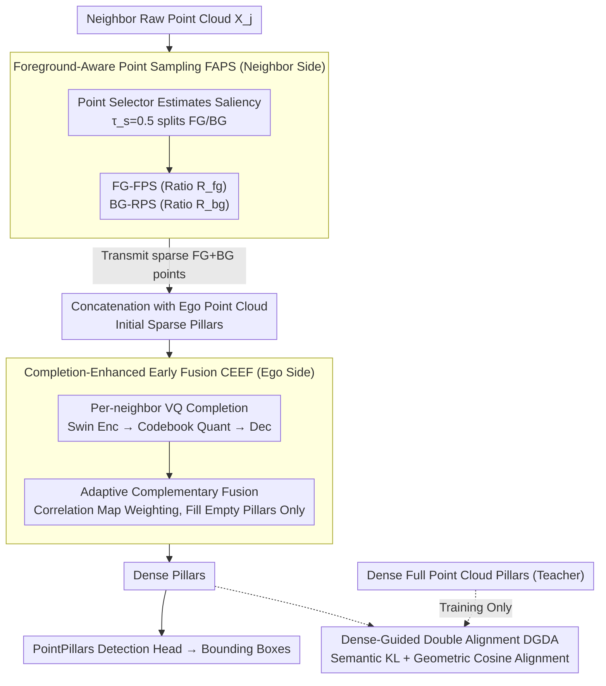

# CoLC: Communication-Efficient Collaborative Perception with LiDAR Completion

**Conference**: CVPR 2026  
**arXiv**: [2603.00682](https://arxiv.org/abs/2603.00682)  
**Code**: None  
**Area**: Autonomous Driving  
**Keywords**: Collaborative Perception, Communication Efficiency, LiDAR Completion, Early Fusion, Vector Quantization

## TL;DR

CoLC proposes a communication-efficient early collaborative perception framework. It reduces transmission volume through Foreground-Aware Point Sampling (FAPS), restores dense pillar representations on the ego side using VQ-based LiDAR Completion (CEEF), and ensures semantic and geometric consistency via Dense-Guided Double Alignment (DGDA). This maintains or even exceeds early fusion detection performance while significantly lowering communication bandwidth.

## Background & Motivation

Collaborative perception allows multi-agent information sharing to overcome perception blind spots and occlusion issues of single agents. Existing fusion strategies are categorized into three types:

- **Early Fusion**: Direct transmission of raw point clouds. It offers the highest information fidelity and is naturally robust to heterogeneous models, but incurs massive communication overhead.
- **Intermediate Fusion**: Transmission of BEV features. It has moderate overhead but relies on model consistency.
- **Late Fusion**: Transmission of detection results. It minimizes communication but suffers the most information loss.

A key phenomenon was identified: in early fusion, transmitting only foreground points leads to a significant performance drop, even performing worse than transmitting only background points. This is because foreground points complete object shapes, while background points provide contextual anchors for spatial alignment. Both are indispensable, inspiring the design of CoLC—sampling both foreground and background points and then restoring missing information via completion at the ego side.

## Method

### Overall Architecture

CoLC aims to achieve the information fidelity of early fusion alongside the low bandwidth of intermediate fusion. The core mechanism involves decomposing "transmitting complete point clouds" into "transmitting few key points + reconstruction at the receiver." The pipeline is distributed across two sides: neighbor agents use FAPS to filter raw point clouds into a small set of foreground and background points; the ego side receives these sparse points and uses the LiDAR completion module within CEEF to reconstruct sparse pillars into dense ones for detection. DGDA participates only during training, using dense full point clouds as a teacher to force the completed pillars to align with the ground truth semantically and geometrically. During inference, complete point clouds are not required, saving bandwidth while recovering detection accuracy through completion and alignment.

### Key Designs

**1. Foreground-Aware Point Sampling (FAPS): Reducing transmission without losing alignment anchors**

Against intuition, transmitting only foreground points in early fusion results in worse performance than transmitting only background points. Foreground points complete object shapes, while background points provide context for spatial alignment. FAPS performs differentiated sampling on neighbor point clouds $\mathcal{X}_j \in \mathbb{R}^{M \times 4}$: a lightweight pre-trained MLP point selector estimates a saliency map $\mathcal{S}_j \in [0,1]^M$, split by $\tau_s = 0.5$ into a foreground set $\mathcal{X}_j^{fg}$ and a background set $\mathcal{X}_j^{bg}$. Foreground points are few but structurally vital; Farthest Point Sampling (FG-FPS) with ratio $R^{fg}$ preserves object contours. Background points are massive; Random Point Sampling (BG-RPS) with ratio $R^{bg}$ efficiently extracts sparse anchors. Empirically, ~20% foreground points with sufficient background context are effective.

**2. Completion-Enhanced Early Fusion (CEEF): Reconstructing dense point clouds at the ego side**

CEEF uses a VQ-based pillar-level LiDAR completion module to recover lost information. It follows three steps: Encoding, Quantization, and Decoding. A sparse encoder uses a Swin Transformer (depth $L=6$, embedding $D=128$) to encode sparse pillars $\mathcal{P}^s$ into BEV representations with global context, projected into quantization space $\mathbf{z}^s \in \mathbb{R}^{P \times D_c}$. Vector Quantization utilizes a learnable codebook $E = \{\mathbf{e}_k\}_{k=0}^{K-1}$ ($K=128$, $D_c=128$), replacing continuous latent vectors with the nearest codebook entry:

$$\mathbf{z}_i^q = \mathbf{e}_k, \quad k = \arg\min_j \|\mathbf{z}_i^s - \mathbf{e}_j\|_2$$

A dense decoder maps quantized embeddings back to pillar space, outputting reconstructed dense pillars $\hat{\mathcal{P}}^d$ and occupancy masks $\hat{\mathcal{O}}^d$. Discrete codebooks are preferred over continuous reconstruction as they provide more discriminative priors for downstream detection.

CEEF employs a three-stage progressive fusion:
1. Concatenate ego point clouds and sparse neighbor point clouds into initial sparse fusion $\mathcal{P}_i^{se}$.
2. Perform independent parallel completion on each neighbor's sparse pillars, keeping pillars with occupancy probability $> \tau_o$ and overwriting them with original sparse pillar values to maintain fidelity.
3. Adaptive complementary fusion calculates spatial correlation maps $\mathcal{W}_{j \to i}$ to weight neighbor completion pillars, filling only the empty pillars of the initial fusion:

$$\hat{\mathcal{P}}_i^{de} = \mathcal{M}_i^{se} \odot \mathcal{P}_i^{se} + (1 - \mathcal{M}_i^{se}) \odot \hat{\mathcal{P}}_i^f$$

The mask $\mathcal{M}_i^{se}$ ensures real points are not contaminated by completion results, increasing density while preserving fidelity.

**3. Dense-Guided Double Alignment (DGDA): Aligning completed pillars with ground truth during training**

DGDA uses dense full point cloud pillars $\mathcal{P}_i^{de}$ as supervision to align the enhanced early fusion pillars $\hat{\mathcal{P}}_i^{de}$. Semantic distribution alignment uses KL divergence:

$$\mathcal{L}_{sda} = D_{KL}(\sigma(\hat{\mathcal{P}}_i^{de}) \| \sigma(\mathcal{P}_i^{de}))$$

Geometric alignment uses cosine similarity loss to constrain feature direction consistency:

$$\mathcal{L}_{gda} = \mathbb{E}_i\left[1 - \frac{\hat{\mathcal{P}}_i^{de} \cdot \mathcal{P}_i^{de}}{\|\hat{\mathcal{P}}_i^{de}\| \|\mathcal{P}_i^{de}\|}\right]$$

These alignments act as regularizers during training only, suppressing errors introduced by completion without adding inference overhead.

### Loss & Training

**Two-stage Training**:
1. Pre-train the LiDAR completion module until convergence (AdamW, lr=8e-4), Loss:

$$\mathcal{L}_\Psi = \lambda \cdot \mathcal{L}_{rec} + \mathcal{L}_{vq}$$

Where $\mathcal{L}_{rec}$ includes occupancy BCE and MSE, and $\mathcal{L}_{vq}$ includes codebook and commitment losses.

2. Freeze the completion module and train the full pipeline end-to-end (Adam, lr=2e-3), Total Loss:

$$\mathcal{L}_\Phi = \mathcal{L}_{det} + \gamma_1 \cdot \mathcal{L}_{sda} + \gamma_2 \cdot \mathcal{L}_{gda}$$

Hyperparameters: $\beta=0.25$, $\lambda=10$, $\gamma_1=1000$, $\gamma_2=10$.

## Key Experimental Results

### Main Results

**Table 1: Collaborative 3D Object Detection Performance (AP@0.5/0.7)**

| Method | V2XSim | OPV2V | V2XSet | DAIR-V2X |
|------|:---:|:---:|:---:|:---:|
| No Fusion | 73.72/61.65 | 74.42/54.52 | 74.18/57.43 | 64.32/53.27 |
| Early Fusion | 94.68/83.61 | 96.13/90.69 | 94.59/88.00 | 76.51/63.83 |
| Where2comm | 88.45/80.54 | 95.10/88.48 | 90.68/80.48 | 76.70/61.96 |
| ERMVP | 94.35/84.76 | 95.99/89.14 | 93.08/81.91 | 74.73/60.75 |
| **CoLC (100%)** | **95.14/87.89** | **96.88/92.93** | **95.97/89.81** | 76.71/62.17 |
| **CoLC* (50%)** | 93.47/85.28 | 96.46/91.95 | 95.05/87.72 | 76.03/62.09 |

CoLC achieves optimal AP@0.7 when transmitting full point clouds, slightly exceeding the early fusion baseline due to regularization from completion and alignment. CoLC* at 50% communication volume still approaches or exceeds early fusion performance.

**Inference Latency**: CoLC 75.86ms, comparable to Where2comm (69.7ms) and CoBEVT (84.5ms), significantly faster than ERMVP (100.5ms) and V2X-ViT (197.7ms).

### Ablation Study

**Component Ablation (V2XSim, $R^{fg}$=0.2)**

| FAPS | CEEF | DGDA | AP@0.7 Change |
|:---:|:---:|:---:|------|
| ✓ | ✗ | ✗ | Significant drop (info loss) |
| ✓ | ✓ | ✗ | Significant recovery (completion) |
| ✓ | ✓ | ✓ | Further improvement (alignment) |

**VQ vs MAE Completion**

| Method | IoU ↑ | MSE ↓ | AP@0.5/0.7 ↑ |
|------|:---:|:---:|:---:|
| MAE-based | 0.633 | 0.057 | 88.17/77.55 |
| VQ-based | 0.626 | **0.043** | **88.89/79.28** |

VQ-based completion has lower MSE and higher reconstruction fidelity, leading to superior detection accuracy.

### Key Findings

1. Transmitting only foreground points is less effective than transmitting only background points; background context is vital for early fusion.
2. CoLC is naturally robust to heterogeneous model scenarios, unlike intermediate fusion which may degrade below "No Fusion" levels.
3. Detection performance saturates once completion quality reaches a threshold (IoU $\ge$ 0.585, MSE $\le$ 0.052), suggesting "sufficient" completion is enough.

## Highlights & Insights

1. **Precise Problem Definition**: Identifies early fusion's information advantage and communication bottleneck, decoupling them via sampling and completion.
2. **Foreground/Background Role Analysis**: Clear intuition that foreground needs completion while background provides essential context.
3. **Reasonable VQ-based Choice**: Better suited for detection tasks than MAE-based methods due to discrete priors providing discriminative pillar features.
4. **Heterogeneous Robustness**: Early fusion schemes are naturally compatible when vehicles use different perception models, a key advantage for real-world deployment.

## Limitations & Future Work

1. FAPS foreground selector requires additional pre-training; unsupervised or self-supervised alternatives could be explored.
2. The completion module is frozen during the second stage; joint optimization might improve the performance ceiling.
3. Only LiDAR 3D detection was evaluated; effects on semantic segmentation or tracking are not yet verified.
4. ICP alignment introduces additional computational costs, potentially becoming a bottleneck in large-scale multi-agent scenarios.

## Related Work & Insights

- **Where2comm/CoBEVT**: Representative intermediate fusion methods focusing on feature compression, but limited by model heterogeneity.
- **STAR**: Uses MAE in intermediate fusion for masked feature reconstruction, but not applicable to early fusion.
- **PointPillars**: Serves as the backbone; pillar representations naturally suit VQ completion.

## Rating

| Dimension | Score (1-5) |
|------|:---:|
| Novelty | 4 |
| Technical Depth | 4 |
| Experimental Thoroughness | 5 |
| Writing Quality | 4 |
| Value | 5 |
| Overall | 4.3 |

<!-- RELATED:START -->

## Related Papers

- [\[ICLR 2026\] Rate-Distortion Optimized Pragmatic Communication for Collaborative Perception](../../ICLR2026/autonomous_driving/rate-distortion_optimized_pragmatic_communication_for_collaborative_perception.md)
- [\[CVPR 2026\] Hybrid Robust Collaborative Perception with LiDAR-4D Radar Fusion under Adverse Weather Conditions](hybrid_robust_collaborative_perception_with_lidar-4d_radar_fusion_under_adverse_.md)
- [\[CVPR 2026\] CATNet: Collaborative Alignment and Transformation Network for Cooperative Perception](catnet_collaborative_alignment_and_transformation_network_for_cooperative_percep.md)
- [\[CVPR 2026\] Learning Mutual View Information Graph for Adaptive Adversarial Collaborative Perception](learning_mutual_view_information_graph_for_adaptive_adversarial_collaborative_pe.md)
- [\[CVPR 2026\] Probabilistic Discrepancy Learning for Roadside LiDAR Scene Completion](probabilistic_discrepancy_learning_for_roadside_lidar_scene_completion.md)

<!-- RELATED:END -->
