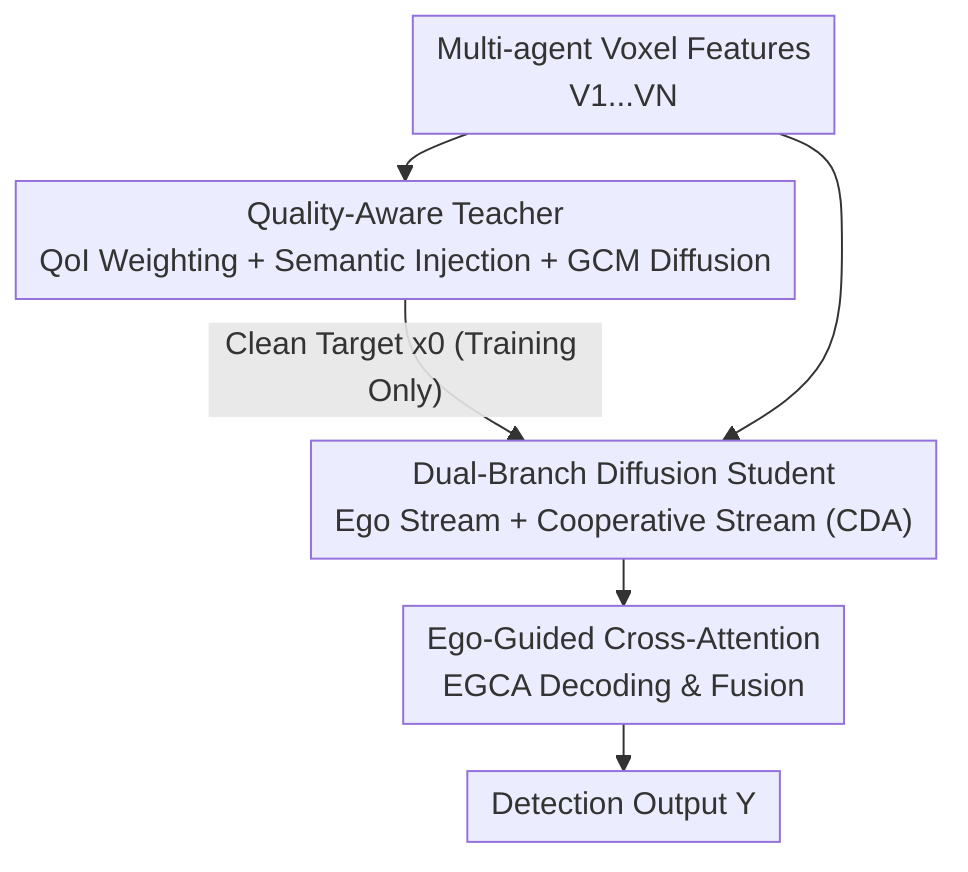

# CoopDiff: A Diffusion-Guided Approach for Cooperation under Corruptions

**Conference**: CVPR 2026  
**Paper**: [CVF Open Access](https://openaccess.thecvf.com/content/CVPR2026/html/Chen_CoopDiff_A_Diffusion-Guided_Approach_for_Cooperation_under_Corruptions_CVPR_2026_paper.html)  
**Code**: TBD  
**Area**: Autonomous Driving / Cooperative Perception  
**Keywords**: Cooperative Perception, V2X, Diffusion Denoising, Robust Fusion, Teacher-Student Distillation  

## TL;DR
CoopDiff reformulates the "corruption robustness" problem in multi-agent cooperative perception as a **feature-space diffusion denoising** task. A quality-aware teacher generates clean supervisory features, which a dual-branch diffusion student reconstructs from noisy inputs. This approach consistently outperforms existing SOTA across six types of corruption, including fog, motion blur, and EMI.

## Background & Motivation
**Background**: Cooperative perception allows multiple vehicles or roadside units to share LiDAR features, expanding perception range and eliminating blind spots—a critical technology for safety. The mainstream approach is **intermediate fusion**, where agents encode features locally before exchanging and fusing them (e.g., V2X-ViT, Where2comm, CoAlign), balancing accuracy and communication bandwidth.

**Limitations of Prior Work**: Most existing methods assume "clean input features" and treat fusion as a purely structural problem. However, real-world deployments face various corruptions: ① Environmental data degradation (fog, echo reflections reducing SNR); ② Communication or sensor failures (sensor faults, Electromagnetic Interference (EMI) causing data loss). When these "dirty" features are shared, noise **accumulates or amplifies** during multi-agent fusion, polluting the final results.

**Key Challenge**: Previous robust methods (ERMVP, MDD, V2X-DGW, etc.) are often designed for **specific corruptions**—MDD relies on 4D mmWave radar for rain/snow, while V2X-DGW simulates weather degradation during training. While strong against targeted perturbations, they **fail on unseen corruptions** (Paper Fig. 1: MDD performs well under standing water but drops sharply under EMI). Real-world interference is diverse and unpredictable; the "one model per corruption" paradigm is not scalable.

**Goal**: To develop a **corruption-agnostic** unified framework capable of handling both environmental noise and sensor loss simultaneously, rather than patching individual corruptions.

**Key Insight**: Diffusion models possess strong denoising priors, having learned to "recover clean distributions from noise." By transferring this denoising objective directly to the **feature space** of cooperative perception, various corruptions (whether environmental or sensor-based) can be modeled as "feature noise" and handled together through a generative denoising process.

**Core Idea**: Replace "structural fusion" with "teacher-student diffusion denoising." The teacher produces noise-free target features under clean supervision, and the student **reconstructs** these clean targets from noisy cooperative features, ensuring robustness against unseen corruptions.

## Method

### Overall Architecture
CoopDiff is a **teacher-student diffusion framework** where the two components are deeply coupled during training, while only the student is used during inference. Given raw inputs $X=\{X_j\}_{j=1}^N$ from $N$ agents, the goal is to output a unified perception result $Y$. The pipeline consists of three steps:

1.  **Quality-Aware Teacher** $D^{tea}_\Psi$: Performs voxel-level early fusion, suppresses noisy regions using QoI weights, injects semantic priors, and employs a diffusion network to produce a **clean target feature map** $x_0$—serving as the supervisory signal for the student.
2.  **Dual-Branch Diffusion Student** $D^{stu}_\theta$: Decouples "ego stream" and "cooperative stream" into two branches. Both reconstruct $x_0$ starting from a noisy latent $x_t$ via diffusion. The cooperative branch uses CDA to adaptively sample useful features from other agents.
3.  **Ego-Guided Cross-Attention (EGCA)**: A decoder that fuses the outputs of the two branches, balancing "ego feature integrity" with "complementary cooperative information" under degraded conditions before sending the result to the detection head for $Y$.

The teacher's $x_0$ supervises the student via diffusion and distillation losses. During inference, the teacher is discarded, and only the student runs.

### Key Designs

**1. Quality-Aware Early Fusion Teacher: Filtering "dirty data" before generating clean supervision**

Naive early fusion (stacking all point clouds) accumulates noise from every agent, resulting in a low-SNR feature map that misleads the student. The teacher addresses this in two ways. First, **QoI (Quality of Interest) Weighted Aggregation**: A shared convolutional module $W_{qoi}$ estimates per-voxel quality scores $S_j=W_{qoi}(V_j)$ for each agent's voxel features $V_j\in\mathbb{R}^{H\times W\times C_{in}}$. The weighted sum $V_{w\text{-}agg}=\sum_{j=1}^N S_j\odot V_j$ (where $\odot$ is element-wise multiplication) suppresses heavily corrupted regions while preserving stable geometric structures. Second, **Semantic Prior Injection**: Classification labels $L_{cls}$ are encoded into a semantic map $V_{sem}$ and concatenated with geometric features: $V_{fused}=\text{Conv}(F_{w\text{-}agg}\,\|\,V_{sem})$, lifting the representation from pure geometry to the semantic level.

Following $V_{fused}$, the teacher applies **DDPM Diffusion Denoising**: Backbone $B$ extracts conditional features $F^c=B(V_{fused})$. After sampling a timestep $t\sim U(1,T)$, noise is added to the target: $x_t=\sqrt{\bar\alpha_t}\,F^c+\sqrt{1-\bar\alpha_t}\,\epsilon,\ \epsilon\sim\mathcal{N}(0,I)$. Denoising is driven by **GCM (Gated Conditional Modulation)** blocks—a FiLM-style operation where a small conv-net predicts shift, scale, and gate parameters to modulate backbone features, allowing the condition to precisely control the denoising trajectory at each layer:

$$x^{(l+1)},\,F^c_{(l+1)}=\text{GCM}\big(F^c_{(l)},\,x^{(l)}\big)+x^{(l)}$$

The final output $x_0$ is the "clean feature map." This works because the teacher sees clean data during training; the QoI, semantic, and diffusion combination ensures the supervisory signal is much cleaner than naive fusion, providing the student with a reliable "ground truth" for alignment.

**2. Dual-Branch Diffusion Student + CDA: Decoupling streams to prevent cross-contamination**

Under degradation, fusion must **preserve reliable ego features** while **extracting complementary info** from collaborators. Naive encoders merge noisy inputs directly, allowing noise to pollute ego information. The student reformulates mid-fusion as **generative denoising** using two branches. The **Local (Ego) Branch** takes noisy latent $x_t$ as input, merging ego features $F_i$ and time embeddings $\gamma(t)$ into a time-aware condition $c^{loc}_{(0)}=\phi_{local}(F_i)\oplus\gamma(t)$. Stacked GCM blocks then refine the local perception layer-by-layer: $x^{loc}_{(l+1)},c^{loc}_{(l+1)}=\text{GCM}_{(l)}(x^{loc}_{(l)},c^{loc}_{(l)})$.

The **Cooperative Branch** utilizes **CDA (Cooperative Deformable Attention)**. It decouples ego features $F_i$ into high-confidence $F_{conf}$ and low-confidence $F_{unc}$ regions. $F_{unc}$ (regions the ego vehicle is uncertain about) is concatenated with collaborator features to form a cooperative context: $F_{ctx}=\text{Agg}\big(\{\phi_{coop}(F_j)\}_{j\ne i}\big)\odot F_{unc}$. Essentially, it "borrows from others only where itself is blind." Offsets $\Delta p$ are predicted from $F_{conf}$ and $F_{ctx}$ for precise sampling via Deformable Attention: $F_{coop}=\text{DeformAttn}(Q,V,\Delta p)$, where $Q=C_Q(F_{conf}\|F_{ctx})$ and $V=L_V(F_{ctx})$. Finally, a selection head keeps only the most informative tokens (top 30%), producing sparse cooperative features $\tilde F_{coop}$ for GCM modulation. This decoupling ensures high-confidence ego features aren't dragged down by cooperative noise.

**3. Ego-Guided Cross-Attention (EGCA) Decoding: Using ego features as "anchors" for balanced fusion**

After the branches reconstruct $x^{loc}$ and $x^{coop}$, they must merge. Symmetric fusion would still allow noise from the degraded branch to interfere. EGCA uses ego features to **dominate the query**: Query $Q$ is projected only from $x^{loc}$, while key-values come from both branches—$(K_{loc},V_{loc})$ from $x^{loc}$ and $(K_{coop},V_{coop})$ from $x^{coop}$. Combined with positional embeddings $P$, standard cross-attention is performed: $F_{att}=\text{CrossAttn}(Q,K,V)$ where $K=[K_{loc}\|K_{coop}]$ and $V=[V_{loc}\|V_{coop}]$. Since the Query is bound to the ego vehicle, fusion naturally favors ego integrity while adaptively absorbing cooperative info, maintaining stability under degradation.

### Loss & Training
The student learns both to reconstruct $x_0$ and to complete downstream detection. The total loss is:

$$L_{total}=\alpha L_{task}+\beta L_{diff}+\gamma L_{distill}+\delta L_{coop}$$

- **$L_{task}$**: Standard detection loss (classification + regression).
- **$L_{diff}$ (Diffusion Loss)**: Predicts noise $\hat y_t$ to approximate true noise $y_t=\epsilon$. It uses **Heteroscedastic NLL** to predict log-variance $s_t=\log\sigma_t^2$, quantifying uncertainty: $L_{diff}=\mathbb{E}_{t,\epsilon}\big[\tfrac12 e^{-s_t}|y_t-\hat y_t|_2^2+\tfrac12 s_t\big]$. This downweights inherently blurry pixels and improves stability.
- **$L_{distill}$ (Knowledge Distillation)**: Uses KL divergence at the logit level to align student and teacher outputs $L_{distill}=D_{KL}(\sigma(z^{tea}/\tau)\|\sigma(z^{stu}/\tau))$ (temperature $\tau=1$).
- **$L_{coop}$ (Cooperative Supervision)**: BCE loss on the selection head's map $M_{coop}$ to force activation on foreground regions where cooperation is helpful.

## Key Experimental Results

### Main Results
Evaluated on **OPV2Vn** and **DAIR-V2Xn** (benchmarks with six types of corruption: beam missing, motion blur, fog, EMI, water, echo). Representative results on OPV2Vn (AP@0.5 / AP@0.7):

| Condition (OPV2Vn) | CoAlign | DSRC | **CoopDiff (Ours)** |
|---|---|---|---|
| Clean | 0.8878 / 0.7931 | 0.8941 / 0.8035 | **0.9053 / 0.8357** |
| Motion Blur | 0.7785 / 0.5025 | 0.8062 / 0.5633 | **0.8142 / 0.6184** |
| Fog | 0.6778 / 0.6016 | 0.6763 / 0.6119 | **0.6871 / 0.6297** |
| EMI | 0.7741 / 0.6374 | 0.7714 / 0.6394 | **0.7891 / 0.6897** |

Performance gains: Under clean conditions, the model surpasses the runner-up by +1.12% / +3.22% (OPV2Vn) and +2.96% / +3.60% (DAIR-V2Xn). For the six corruptions, the **average** gain over baseline means is **8.40% / 13.16% (OPV2Vn)** and **10.24% / 10.13% (DAIR-V2Xn)**.

Robustness is measured by **mRCE (mean Relative Corruption Error)** (lower is better):

| Method | OPV2V mRCE (% ↓) | DAIR-V2X mRCE (% ↓) |
|---|---|---|
| CoAlign | 17.66 | 28.90 |
| DSRC | 15.77 | 30.54 |
| **CoopDiff** | **12.94** | **26.79** |

### Ablation Study
Incremental component analysis (OPV2V / DAIR-V2X, AP@0.5 / AP@0.7):

| Configuration | OPV2V | DAIR-V2X | Description |
|---|---|---|---|
| Baseline | 0.8548 / 0.7431 | 0.7330 / 0.5530 | Standard Mid-fusion |
| + GCM Diffusion | 0.8681 / 0.7765 | 0.7565 / 0.6092 | Added diffusion denoising |
| + Coop Branch | 0.8862 / 0.8192 | 0.8027 / 0.6591 | DAIR AP@0.5 +5.3% |
| + Teacher | 0.8984 / 0.8294 | 0.8042 / 0.6610 | Suppressed noise accumulation |
| Full (+ EGCA) | **0.9053 / 0.8357** | **0.8069 / 0.6644** | Complete model |

### Key Findings
- **Diffusion steps as a performance-efficiency knob**: Even at 2 steps, the model exceeds previous SOTA at 9.45 FPS. 10 steps provide peak accuracy; >10 steps yield <0.1% gain.
- **Robust selection ratio**: Performance remains stable even as the selection ratio drops from 50% to 5%, suggesting the model effectively focuses on critical cooperative cues.
- **Low sensitivity**: While baselines like CoAlign collapse under heavy motion blur (AP@0.5 dropping from 0.8878 to 0.1529), CoopDiff maintains significantly higher stability.

## Highlights & Insights
- **Unifying "Anti-corruption" as "Feature-space Denoising"**: This is the core paradigm shift. Instead of individual patches for every corruption, it uses diffusion's innate denoising prior to handle all noise sources uniformly.
- **QoI weighting + selection head as "as-needed" gates**: The former suppresses dirty data during aggregation, while the latter borrows features only where ego is uncertain. This logic is transferable to any multi-source fusion task with varying quality.
- **Zero inference cost for the teacher**: Distillation allows the student to internalize the benefits of clean supervision without increasing runtime overhead.
- **Heteroscedastic NLL**: Using predicted log-variance to downweight ambiguous pixels is a robust regression trick worth reusing.

## Limitations & Future Work
- **Hallucinations**: There is a risk that diffusion models generate geometry/objects not perfectly aligned with reality, which is a concern in safety-critical autonomous driving.
- **Modality Bias**: Performance was only verified on LiDAR (PointPillars). The advantage may partially stem from the single-modality setting compared to methods like MDD.
- **Scaling**: Experiments used a fixed number of agents (2). Stability in larger fleets with complex topologies remains to be evaluated.

## Related Work & Insights
- **vs. Mid-fusion (V2X-ViT / CoAlign)**: These treat fusion as a structural problem on clean data, whereas CoopDiff explicitly models denoising.
- **vs. Targeted Robustness (MDD / V2X-DGW)**: Former methods focus on specific sensors or weather; CoopDiff provides a corruption-agnostic unified framework.
- **vs. Diffusion for Fusion (DifFUSER)**: While others use diffusion for BEV or multi-modal generation, this work injects it into the feature space for multi-agent reconstruction.

## Rating
- Novelty: ⭐⭐⭐⭐⭐ (Reformulating anti-corruption as feature-space diffusion denoising is a fresh, unified paradigm)
- Experimental Thoroughness: ⭐⭐⭐⭐⭐ (Evaluated across six corruptions, mRCE, cross-domain, and extensive ablations)
- Writing Quality: ⭐⭐⭐⭐ (Clear structure and complete formulas)
- Value: ⭐⭐⭐⭐ (Practical for V2X due to corruption agnosticism and zero teacher inference cost)

<!-- RELATED:START -->

## Related Papers

- [\[CVPR 2026\] A Self-Conditioned Representation Guided Diffusion Model for Realistic Text-to-LiDAR Scene Generation](a_self-conditioned_representation_guided_diffusion_model_for_realistic_text-to-l.md)
- [\[CVPR 2026\] Hybrid Robust Collaborative Perception with LiDAR-4D Radar Fusion under Adverse Weather Conditions](hybrid_robust_collaborative_perception_with_lidar-4d_radar_fusion_under_adverse_.md)
- [\[CVPR 2026\] ProOOD: Prototype-Guided Out-of-Distribution 3D Occupancy Prediction](proood_prototype-guided_out-of-distribution_3d_occupancy_prediction.md)
- [\[CVPR 2026\] Query2Uncertainty: Robust Uncertainty Quantification and Calibration for 3D Object Detection under Distribution Shift](query2uncertainty_robust_uncertainty_quantification_and_calibration_for_3d_objec.md)
- [\[CVPR 2026\] Test-Time Training for LiDAR Semantic Segmentation under Corruption via Geometric Inlier Discrimination](test-time_training_for_lidar_semantic_segmentation_under_corruption_via_geometri.md)

<!-- RELATED:END -->
